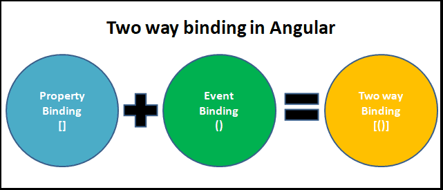

# Two way binding

- [Two way binding](#two-way-binding)
  - [Reference](#reference)
  - [ngModel](#ngmodel)


  

## Reference 
[[Angular 大師之路] Day 07 - 一個簡易實踐 two way binding 的方法](https://ithelp.ithome.com.tw/articles/10204241)   
[ngModel & Two way Data binding in Angular](https://www.tektutorialshub.com/angular/ngmodel-two-way-data-binding-in-angular/)   

Two-way binding combines property binding with event binding :
```html
<app-sizer [(size)]="fontSizePx"></app-sizer>
<!-- same as -->
<app-sizer [size] = "fontSizePx" (sizeChange) ="fontSizePx = $event">
<!--                                '------------emit to -------^
-->
```
- `[(...)]` : `<app-sizer> ... </app-sizer>` has `@input() size` and `@output() sizeChange()`    
The `$event` variable contains the data of the `SizerComponent.sizeChange` event.     
Angular assigns the `$event` value to the `AppComponent.fontSizePx` when the user clicks the buttons.    


Child `sizer.component.ts`
```typescript
export class SizerComponent {

  @Input()  size!: number | string;
  @Output() sizeChange = new EventEmitter<number>();

  dec() { this.resize(-1); }
  inc() { this.resize(+1); }

  resize(delta: number) {
    this.size = Math.min(40, Math.max(8, +this.size + delta));
    this.sizeChange.emit(this.size);
  }
}
```

`sizer.component.html`
```html
<div>
  <button type="button" (click)="dec()" title="smaller">-</button>
  <button type="button" (click)="inc()" title="bigger">+</button>
  <span [style.font-size.px]="size">FontSize: {{size}}px</span>
</div>
```


In the (Parent)`AppComponent.ts`'s template `app.component.html`, `fontSizePx` is two-way bound to the (child)`SizerComponent.ts`.
```html
<app-sizer [(size)]="fontSizePx"></app-sizer>
<div [style.font-size.px]="fontSizePx">Resizable Text</div>
```
`app.component.ts`
```typescript
fontSizePx = 16;
```

## ngModel

The Angular uses the ngModel directive to achieve the two-way binding on **HTML Form elements**. 

It binds to a form element like `input`, `select`. etc...

Internally It uses the `ngModel` in property, binding to bind to the value property and `ngModelChange` which binds to the input event.
```typescript
// InfoComponent
@component({
  selector: 'app-info',
  template: `
    Name <input type="text" 
          [(ngModel)]="name">
  `
})
export class InfoComponent {
  @Input() name;
}


// AppComponent
@Component({
  selector: 'app-root',
  template: `
    <app-info [name]="name"></app-info>
    Result: {{ name }}
  `
})
export class AppComponent  {
  name = 'Mike'
}
```


Because `name` in `InfoComponent.ts` and `name` in `AppComponent.ts` has it own address.    
We can then use even binding to listen the binding value, for example :
```html
<!-- 
  if ngModel is modified 
  then call doSomething()
-->
<input type="text" 
       [(ngModel)]="name" 
       (ngModelChange)="doSomething()">
```


```typescript
// Sub Component
@Component({
  selector: 'app-info',
  template: `
    Name <input type="text" 
          [(ngModel)]="name" 
          (input)="nameChange.emit(name)">
  `
})
export class InfoComponent {
  @Input() name;  
  @Output() nameChange = new EventEmitter();;
}


// Base Component
@Component({
  selector: 'my-app',
  template: `
    <app-info 
    [name]="name"
    (nameChange)="name = $event"> 
    </app-info>
    
    Result: {{ name }}
  `
})
export class AppComponent  {
  name = 'Mike'
}
```