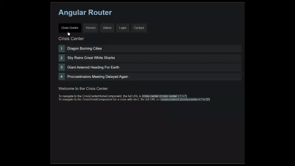

# Router

[Router tutorial: tour of heroes](https://angular.io/guide/router-tutorial-toh#router-tutorial-tour-of-heroes)

- [Router](#router)
  - [Role of Router](#role-of-router)
  - [Router Configuration](#router-configuration)
  - [`''` initial relative URL & `patchMatch` property](#-initial-relative-url--patchmatch-property)
  - [Wildcard route `**`](#wildcard-route-)
  - [Child Router](#child-router)
  - [Pass queryParams & Prams via Route](#pass-queryparams--prams-via-route)
    - [Query String  (`?`)](#query-string--)
    - [matrix URL (`;`)](#matrix-url-)
  - [NavigationExtras](#navigationextras)
    - [queryParams, fragment](#queryparams-fragment)
    - [queryParamsHandling & preserveFragment](#queryparamshandling--preservefragment)
  - [Relative navigation](#relative-navigation)
  - [Secondary routes (named Outlet)](#secondary-routes-named-outlet)
    - [Clearing secondary routes](#clearing-secondary-routes)
  - [Router Guard](#router-guard)
    - [Guard Interface](#guard-interface)
    - [cnaActivate](#cnaactivate)
    - [CanActivateChild](#canactivatechild)
    - [CanDeactivate](#candeactivate)
      - [Warning Dialog](#warning-dialog)
      - [Reusable CanActivate](#reusable-canactivate)
      - [`CanDeactivate` for specific component](#candeactivate-for-specific-component)
      - [Add canDeactivate in Route Module](#add-candeactivate-in-route-module)
  - [Resolve: pre-fetching component data](#resolve-pre-fetching-component-data)
  - [換頁效果](#換頁效果)

## Role of Router
- **負責View中應該顯示哪些Components**
- 負責儲存頁面中Component的路由狀態
  - **路由狀態定義了在某個路由的時候應該顯示哪些Component**
  - **路由狀態最重要的就是記錄路徑與Component之間的關係**

## Router Configuration 

Create Root Routing module (`app-routing.module.ts`) of AppModule
```typescript
import { NgModule } from '@angular/core';
import { Routes, RouterModule } from '@angular/router';

const routes: Routes = [];

@NgModule({
  imports: [RouterModule.forRoot(routes)],
  exports: [RouterModule]
})
export class AppRoutingModule { }
```

Import App-Routing-Module in AppModule
```typescript
import { BrowserModule } from '@angular/platform-browser';
import { NgModule } from '@angular/core';

import { AppRoutingModule } from './app-routing.module';
import { AppComponent } from './app.component';

@NgModule({
  // ...
  imports: [
    BrowserModule,
    ...
    AppRoutingModule  
  ],
  
  // ...
})
export class AppModule { }
```

Route navigates to different component via `<router-outlet>` in view
```html
<!-- 
Plug different component's templates via outlet
-->
<router-outlet></router-outlet> 
```

## `''` initial relative URL & `patchMatch` property

Add a redirect route that translates the initial relative URL ('') to the default path 

A redirect route requires a `pathMatch` property to tell the router how to match a URL to the path of a route. 
- `pathMatch = 'full'` results in a route hit when the remaining, unmatched segments of the URL match `''`. 

In this example, the redirect is in a top level route so the remaining URL and the entire URL are the same thing.
```typescript
const appRoutes: Routes = [
  //...
  { path: 'heroes',        component: HeroListComponent },
  { path: '',   redirectTo: '/heroes', pathMatch: 'full' },
  { path: '**', component: PageNotFoundComponent }
];
```
The other possible `pathMatch` value is `'prefix'` which tells the router to match the redirect route when the remaining URL begins with the redirect route's prefix path. 

This doesn't apply to this sample application because if the `pathMatch` value were `'prefix'`, every URL would match `''`.

##  Wildcard route `**`

Add a wildcard route to intercept invalid URLs
```typescript
const routers: Routers:[
    {
      // ... other routes
    }, 
    {
        path: '**', 
        redirectTo: 'home', 
        pathMatch: 'full'
    }
];
```
- The router selects the route with a first match wins strategy.   
Because a wildcard route is the least specific route, place it last in the route configuration.

## Child Router

- [[功能介紹-15] Router進階介紹](https://ithelp.ithome.com.tw/articles/10195347?sc=iThelpR)

Router預設的狀況下，若瀏覽器重新導航到相同的元件時，會重新使用該元件既有的實體，而不會重新創建。因此在物件被重用的狀況下，該元件的`ngOnInit`只會被呼叫一次，即使是要顯示不同的內容資料。

造成瀏覽某一位Hero Detail(`HeroDetailComponent`)之後，一定要先回到選單List(`HeroListComponent`)，才能再進入另一位Hero Detail頁面，造成回到`HeroListComponent`時會把`HeroDetailComponent`實體銷毀，當再選擇另一個英雄查看細節時，又會再創立一個新的`HeroDetailComponent`實體因此每次選擇不同的英雄時，`HeroDetailComponent` 實體都會重新創建

在子路由的情況下，**若瀏覽器重新導航到相同的元件時，會重新使用該元件既有的實體，而不會重新創建**  
```typescript
const crisisCenterRoutes: Routes = [
  {
    path: 'crisis-center',  // <-- its view must have 
                            // <router-outlet> to 
                            // display the following component
    component: CrisisCenterComponent,
    children: [
      {
        path: '', 
        component: CrisisListComponent,
        children: [
          {
            path: ':id',
            component: CrisisDetailComponent
          },
          {
            path: '',
            component: CrisisCenterHomeComponent
          }
        ]
      }
    ]
  }
];
```
- `CrisisDetailComponent`與`CrisisCenterHomeComponent`都是`CrisisListComponent`的Child Component，因此在不同的Child Component內的實體狀態得以被保存，直到頁面切換離開`CrisisCenterComponent`時才會將元件實體刪除，這可以讓我們在瀏覽不同CrisisDetail時，得以使用到Router預設的重用設定


設定子路由的優點
- **可讀性高的url** ，e.g. `/articles/10207918`
- **延遲載入**
- **減少撰寫重複的程式碼**
- **預處理層**


## Pass queryParams & Prams via Route

Two Types 
1. query string  `?`
2. matrix URL notation `;`
### Query String  (`?`)

Ex: `http://localhost:4200/products?id=101`

In Component
```typescript
constructor(private route: ActivatedRoute) { }

this.router.navigate(
    ['products'], 
    {
      queryParams: {id: 101}
    }
);
```

In view
```html
<a [routerLink]="['products']" [queryParams]="{ id: 101 }">Link For Product</a>
```

1. using `ActivatedRoute#queryParams.subscribe((queryParams) => {queryParams['key']})`
2. using `ActivatedRoute#snapshot.queryParams['key']`
```typescript
export class ProductsComponent implements OnInit {

  constructor(private route: ActivatedRoute) { }

  ngOnInit() {
  
      // recommend 
      this.route.queryParams.subscribe(
        (queryParams) => {
          console.log(queryParams['id']);
        }
      );
      
      // snapshot.queryParams
      console.log(this.route.snapshot.queryParams['id']);
  
  }

}
```

### matrix URL (`;`)

```typescript
this.router.navigate(['path_name'], {queryParam_1 : xxx , queryParam_2 : yyy , ...});
```

`http://localhost:4200/products;id=101`
```typescript
this.router.navigate(['products', { id: 101 }]);
```
or 
```html
<a [routerLink]="['products', { id: 101 }]">Products</a>
```

`this.route.params['keyName']`
```typescript
export class ProductsComponent implements OnInit {

  constructor(private route: ActivatedRoute) { }

  ngOnInit() {
  
      // first one 
      console.log(this.route.params['id']);
      
      // second one
      console.log(this.route.snapshot.params['id']);
  }

}
```

## NavigationExtras

###  queryParams, fragment

You can use query parameters to get **optional parameters available to ALL routes**.  
**Fragments refer to certain elements on the page identified with an id attribute.**
```typescript
const navigationExtras: NavigationExtras = {
  queryParams: { A : a ,  },
  fragment: 'frag',
}
this.router.navigate(['path'], navigationExtras);
```
```typescript
/path?A=a#frag
```

```typescript
@Injectable({
  providedIn: 'root',
})
export class AuthGuard implements CanActivate, CanActivateChild, CanLoad {
  constructor(private authService: AuthService, private router: Router) {}

  //....

  checkLogin(url: string): boolean {
    if (this.authService.isLoggedIn) {
      return true;
    }

    // Store the attempted URL for redirecting
    this.authService.redirectUrl = url;

    // Create a dummy session id
    const sessionId = 123456789;

    // Set our navigation extras object
    // that contains our global query params and fragment
    const navigationExtras: NavigationExtras = {
      queryParams: { session_id: sessionId },
      fragment: 'anchor',
    };

    // Navigate to the login page with extras
    this.router.navigate(['/login'], navigationExtras);
    return false;
  }
}
```

- Add an `anchor` element so you can jump to a certain point on the page.
- Add the `NavigationExtras` object to the `router.navigate()` method that navigates you to the `/login` route
```typescript
/login?session_id=123456789#anchor
```

### queryParamsHandling & preserveFragment 
You can also preserve query parameters and fragments across navigation **without having to provide them again when navigating.**

In the LoginComponent, you'll add an object as the second argument in the `router.navigate()` function and provide the `queryParamsHandling` and `preserveFragment` to pass along the current query parameters and fragment to the next route.

```typescript
// src/app/auth/login/login.component.ts (preserve)

// Set our navigation extras object
// that passes on our global query params and fragment
const navigationExtras: NavigationExtras = {
  queryParamsHandling: 'preserve',
  preserveFragment: true
};

// Redirect the user
this.router.navigate([redirectUrl], navigationExtras);
```
- The `queryParamsHandling` feature also provides a `merge` option, which preserves and combines the current query parameters with any provided query parameters when navigating.

## Relative navigation

`./`  : (**no leading slash**)	Relative to the current level.   
`../` :	Up one level in the route path.   

To navigate a relative path with the `Router.navigate` method, you must supply the `ActivatedRoute` to give the router knowledge of where you are in the current route tree.   

After the link parameters array, add an object with a `relativeTo` property set to the `ActivatedRoute`.   
The router then calculates the target URL based on the active route's location.

e.g. this router.navigate `/crisis-center;id=2;foo=foo` relative To this `/crisis-center;id=2;foo=foo/2`
```typescript
this.router.navigate(['../', { id: crisisId, foo: 'foo' }], { relativeTo: this.route });
```

**Always specify the complete absolute path when calling router's `navigateByUrl()` method.**

## Secondary routes (named Outlet)


Displaying multiple routes in named outlets   
Named outlets are the targets of secondary routes.  
- Secondary routes look like primary routes and you configure them the same way. 
```html
<router-outlet></router-outlet>
...
...
<router-outlet name="outletPropertyName"></router-outlet>
```
```typescript
const appRoutes: Routes = [
  {
    path: 'xxx',
    component: xxxComponent,
    // This route now targets the popup outlet 
    // and the ComposeMessageComponent will display there.
    outlet: 'outletPropertyName',
  },
```
They differ in a few key respects.
1. They are independent of each other
2. They work in combination with other routes
3. They are displayed in named outlets


For example : when a user clicks a `Contact` button, you want to display a message in a popup view.  
The popup should stay open, even when switching between pages in the application, until the user closes it by sending the message or canceling.

```html
<div [@routeAnimation]="getAnimationData()">
  <router-outlet></router-outlet>
</div>
<!-- 
  Display view that 
  Route's property has outlet : 'popup'
-->
<router-outlet name="popup"></router-outlet>
```

Add named outlet with outlet property
```typescript
const appRoutes: Routes = [
  {
    path: 'compose',
    component: ComposeMessageComponent,
    // This route now targets the popup outlet 
    // and the ComposeMessageComponent will display there.
    outlet: 'popup',
  },
  // ...
  { path: '**', component: PageNotFoundComponent },
];
```

URL
```html
         outlet-name:route-path
/crisis-center(popup:compose)
```
- The `crisis-center` is the primary navigation
- Parentheses surround the secondary route  
**The secondary route consists of an outlet name (popup), a colon separator, and the secondary route path (compose)**

**A template can also have any number of named outlets.**  
Each named outlet has its own set of routes with their own components.  
Multiple outlets can display different content, determined by different routes, all at the same time.  

### Clearing secondary routes

```typescript
this.router.navigate([{ outlets: { outletNameProperty : null }}]);
```


```typescript
/*
  ../compose-message/compose-message.component.ts
*/
closePopup() {
  //                          named-outlet:null 
  this.router.navigate([{ outlets: { popup: null }}]);
}
```
- Providing a `null` value to the named outlet clears the contents of the named outlet

## Router Guard

Guard controls access to different parts of your application for various reasons
### Guard Interface

- `CanActivate` : To mediate navigation to a route
- `CanActivateChild` :	To mediate navigation to a child route
- `CanDeactivate` : To mediate navigation away from the current route
- `Resolve`	: To perform route data retrieval before route activation
- `CanLoad`	: To mediate navigation to a feature module loaded asynchronously
- `CanMatch` : To control whether a Route should be used at all, even if the path matches the URL segment.

Return value of Guard
- `true` : The navigation process continues
- `false`:The navigation process stops and the user stays put
- `UrlTree` : The current navigation cancels and a new navigation is initiated to the `UrlTree` returned (`Router#parseUrl('/login')`)

### cnaActivate

To redirect anonymous users to the login page when they try to enter restrict area (e.g admin page).
```typescript
export class AuthGuard implements CanActivate, CanMatch {
  constructor(
    private authService: AuthService, 
    private router: Router) {}

  // return true, false, ul
  canActivate(
    route: ActivatedRouteSnapshot,
    state: RouterStateSnapshot): true|UrlTree {
    const url: string = state.url;

    return this.checkLogin(url);
  }

  /* . . . */

  checkLogin(url: string): true|UrlTree {
    if (this.authService.isLoggedIn) {
      return true;
    }

    // Store the attempted URL for redirecting
    this.authService.redirectUrl = url;

    // Redirect to the login page
    return this.router.parseUrl('/login');
  }
}
```

Add Guard in `canActivate` Property
```typescript
const adminRoutes: Routes = [{
  path: 'admin',
  component: AdminComponent,
  canActivate: [AuthGuard], // <---- path admin has guard
  children: [{
    path: '',
    children: [
      // ....
    ],
  }]
}];
```

### CanActivateChild

CanActivateChild : canActivate for Child routes

The `canActivateChild()` method can return an `Observable<boolean|UrlTree>` or `Promise<boolean|UrlTree>` for async checks and a `boolean` or `UrlTree` for sync checks. 

```typescript
@Injectable({
  providedIn: 'root',
})
export class AuthGuard implements CanActivate, CanActivateChild {
  constructor(
    private authService: AuthService, 
    private router: Router) {}

  canActivate(
    route: ActivatedRouteSnapshot,
    state: RouterStateSnapshot): true|UrlTree {
    const url: string = state.url;

    return this.checkLogin(url);
  }

  canActivateChild(
    route: ActivatedRouteSnapshot,
    state: RouterStateSnapshot): true|UrlTree {
    return this.canActivate(route, state);
  }

/* . . . */
}
```
```typescript
const adminRoutes: Routes = [
  {
    path: 'admin',
    component: AdminComponent,
    canActivate: [AuthGuard],
    children: [
      {
        path: '',
        canActivateChild: [AuthGuard], // <--- add canActivateChild
        children: [
          { path: 'crises', component: ManageCrisesComponent },
          { path: 'heroes', component: ManageHeroesComponent },
          { path: '', component: AdminDashboardComponent }
        ]
      }
    ]
  }
];
```


### CanDeactivate


- When the user navigates away, you can let the user decide what to do with unsaved changes. 
  - If the user cancels, you'll stay put and allow more changes. 
  - If the user approves, the application can save.


#### Warning Dialog 

```typescript
// src/app/dialog.service.ts
export class DialogService {
  /**
   * Ask user to confirm an action. `message` explains the action and choices.
   * Returns observable resolving to `true`=confirm or `false`=cancel
   */
  confirm(message?: string): Observable<boolean> {

    const confirmation = window.confirm(message || 'Is it OK?');
    return of(confirmation);
  }
}
```
#### Reusable CanActivate
```typescript
export interface CanComponentDeactivate {
 canDeactivate: () => Observable<boolean> | Promise<boolean> | boolean;
}
@Injectable({
  providedIn: 'root',
})
export class CanDeactivateGuard implements CanDeactivate<CanComponentDeactivate> {
  canDeactivate(component: CanComponentDeactivate) {
    return component.canDeactivate ? component.canDeactivate() : true;
  }
}
```
While the guard doesn't have to know which component has a deactivate method, it can detect that the `CrisisDetailComponent` component has the `canDeactivate()` method and call it.  

The guard not knowing the details of any component's deactivation method makes the guard reusable.
```typescript
export class CrisisDetailComponent implements OnInit {
  //   <input type="text" id="crisis-name" [(ngModel)]="editName" placeholder="name"/>
  crisis!: Crisis;
  editName = '';

  constructor(
    private route: ActivatedRoute,
    private router: Router,
    public dialogService: DialogService
  ) {}

  // ... get crisis & editName data ...

  // class CanDeactivateGuard implements CanDeactivate<CanComponentDeactivate>
  // can detect this 
  canDeactivate(): Observable<boolean> | boolean {
    // Allow synchronous navigation (`true`) if no crisis or the crisis is unchanged
    if (!this.crisis || this.crisis.name === this.editName) {
      return true;
    }
    // Otherwise ask the user with the dialog service and return its
    // observable which resolves to true or false when the user decides
    return this.dialogService.confirm('Discard changes?');
  }
}
```


####  `CanDeactivate` for specific component

Alternatively, you could make a component-specific `CanDeactivate` guard for the `CrisisDetailComponent`.  

The `canDeactivate()` method provides you with the current instance of the component, the current `ActivatedRoute`, and `RouterStateSnapshot` in case you needed to access some external information.

This would be useful if you only wanted to use this guard for this component and needed to get the component's properties or confirm whether the router should allow navigation away from it.

```typescript 
export class CanDeactivateGuard implements CanDeactivate<CrisisDetailComponent> {

  canDeactivate(
    component: CrisisDetailComponent, // <-- specify the component to guard
    route: ActivatedRouteSnapshot,
    state: RouterStateSnapshot
  ): Observable<boolean> | boolean {
    // Get the Crisis Center ID
    console.log(route.paramMap.get('id'));

    // Get the current URL
    console.log(state.url);

    // Allow synchronous navigation (`true`) 
    // if no crisis or the crisis is unchanged
    if (!component.crisis || component.crisis.name === component.editName) {
      return true;
    }
    // Otherwise ask the user with the dialog service and return its
    // observable which resolves to true or false when the user decides
    return component.dialogService.confirm('Discard changes?');
  }
}
```
Notice that the `canDeactivate()` method can return synchronously; it returns `true` immediately if there is no crisis or there are no pending changes.   

But **it can also return a `Promise` or an `Observable` and the router will wait for that to resolve to truthy (navigate) or falsy (stay on the current route).**

#### Add canDeactivate in Route Module
```typescript
const crisisCenterRoutes: Routes = [
  {
    path: 'crisis-center',
    component: CrisisCenterComponent,
    children: [
      {
        path: '',
        component: CrisisListComponent,
        children: [
          {
            path: ':id',
            component: CrisisDetailComponent,
            canDeactivate: [CanDeactivateGuard] // <---can deactivate
          },
          {
            path: '',
            component: CrisisCenterHomeComponent
          }
        ]
      }
    ]
  }
];
```

## Resolve: pre-fetching component data

```typescript
export class xxxDetailResolverService implements Resolve<xxx> 
```
If you were using a real world API, there might be some delay before the data to display is returned from the server. 

Pre-fetch data from the server using a `resolver` to avoid a blank component while waiting for the data so it's ready the moment the route is activated. 

This also lets you handle errors before routing to the component. 

(pre-)Fetch data(`xxxService implementsResolve<xxxx>`) before navigating(before the route is activated.).

For example the `CrisisDetailComponent` retrieves the selected `crisis`. 
If the crisis is not found, the router navigates back to the crisis list view.
```typescript
export class CrisisDetailResolverService implements Resolve<Crisis> {
  constructor(private crisisService: CrisisService, private router: Router) {}

  // Event to be subscribed
  resolve(route: ActivatedRouteSnapshot, 
          state: RouterStateSnapshot):
          Observable<Crisis> | Observable<never> 
  {
    const id = route.paramMap.get('id')!;

    return this.crisisService.getCrisis(id).pipe(
      mergeMap(crisis => {
        if (crisis) {
          return of(crisis);
        } else { // id not found
          this.router.navigate(['/crisis-center']);
          return EMPTY;
        }
      })
    );
  }
}
```

add Resolve to its route
```typescript
const crisisCenterRoutes: Routes = [
  {
    path: 'crisis-center',
    component: CrisisCenterComponent,
    children: [
      {
        path: '',
        component: CrisisListComponent,
        children: [
          {
            path: ':id',
            component: CrisisDetailComponent,
            canDeactivate: [CanDeactivateGuard],
            resolve: { // <----- subscribe resolve<data>
              crisis: CrisisDetailResolverService
            }
          },
          {
            path: '',
            component: CrisisCenterHomeComponent
          }
        ]
      }
    ]
  }
];
```


In `crisis-detail.component.ts` (to subscribe)
```typescript
ngOnInit() {
  this.route.data
    .subscribe(data => {
      const crisis: Crisis = data['crisis'];
      this.editName = crisis.name;
      this.crisis = crisis;
    });
}
```

## 換頁效果

- [添加換頁效果](https://ithelp.ithome.com.tw/articles/10195347)

需要`BrowserAnimationsModule`這個動態效果模組   
```typescript
import { animate, AnimationEntryMetadata, state, style, transition, trigger } from '@angular/core';

// Component transition animations
export const slideInDownAnimation: AnimationEntryMetadata =
  trigger('routeAnimation', [
    state('*',
      style({
        opacity: 1,
        transform: 'translateX(0)'
      })
    ),
    transition(':enter', [
      style({
        opacity: 0,
        transform: 'translateX(-100%)'
      }),
      animate('0.2s ease-in')
    ]),
    transition(':leave', [
      animate('0.5s ease-out', style({
        opacity: 0,
        transform: 'translateY(100%)'
      }))
    ])
  ]);
```

`src/app/heroes/hero-detail.component.ts`
```typescript
@HostBinding('@routeAnimation') routeAnimation = true;
@HostBinding('style.display') display = 'block';
@HostBinding('style.position') position = 'absolute';
```

