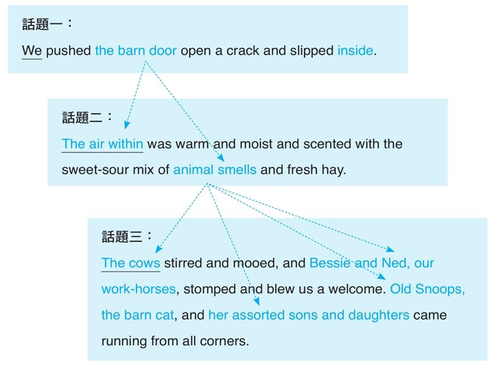

# Writing 

- [Writing](#writing)
  - [What to writing about](#what-to-writing-about)
    - [Coherence](#coherence)
    - [Mandarin vs English](#mandarin-vs-english)

## What to writing about

Follow Generic(重點) -> Specific(細節) -> General(結論) that is 

  

1. Key Point  
   - My Mom is beautiful.
2. Supporting Details 
   - She has big eyes, soft skin and long hair
3. Memorable Conclusion
   - She looks like the hollywood celebrity will smith

A block consists of S-G-S.  
A Paragraph consists of blocks.  
A Composition consists of paragraphs.  

主詞必相關(coherence)
`my mother` bla bla. `She` bla bla. And `she` bla bla bla ...

話題必聚焦(controlling ideal)
Tom is <u>gifted</u> musician.  :arrow_left: `controlling ideal` 
he writes the most beautiful melodies.   :arrow_left: `details`

主旨承上承下

### Coherence

Incoherence   
:one: <u>My mom</u> is beautiful. :two: <u>Her dresses</u> are expensive and tailor-made. :three: <u>My father</u> loves to take her to travel.   

Get the hang of Coherence following two tricks
1. subject & topic of sentence
  

2. put a mentioned element in new block 將新的話題融入到前一個Block中話題
   

**前一個句子後敘成分可成為下一個句子的話題**，透過舊訊息帶出新訊息
  

所謂的 coherence 並不是**重複**同一個主詞，例如
    
穀倉 -> 穀倉內的空氣 -> 動物氣味 -> 描述動物氣味
    

英文的主詞即為話題
  

### Mandarin vs English 

中文以主題 Discourse Topic。
- 中文基本句型以語言為一單位，同一主題以下細分多個小主詞，例如
  

英語是以語句導向。
- 每個句子的主題都獨立代表一個話題(topic of the sentence)
  

中文先決定主題(discourse topic)。
反之，英文藉由幾個相關的主詞共同導向同一個話題(topic of the block)。