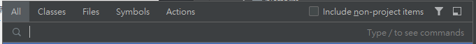

# IntelliJ 

- [IntelliJ](#intellij)
  - [Shortcuts](#shortcuts)
    - [Alt](#alt)
    - [Ctrl](#ctrl)

Reference

## Shortcuts

Double Shift
  

Double Ctrl (Any)  
Useful for test files 

### Alt

Alt + Enter : Provide warning, error and suggestion for your code section.   
Alt + 1 : Side Project Files Bar

### Ctrl

`Ctrl + B` : 
Select Class : Go To Class Filed
Select Field : Go To Filed In This Field  

`Ctrl + /` : Add `//` for select section   
`Ctrl + Alt + l` Reformat 排版 in file   
`Ctrl + Alt + A` Search Action like Open Tool Window, Shortcuts, Settings  
`Ctrl + Alt + Shift + T`  Rename the name of field   
`Shift + Enter` Select Specific File In Project Side bar and create Split Window