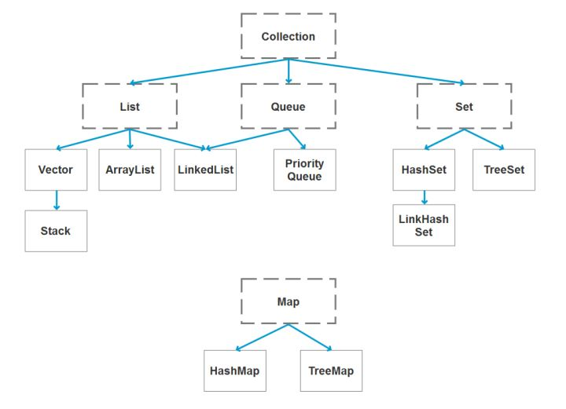
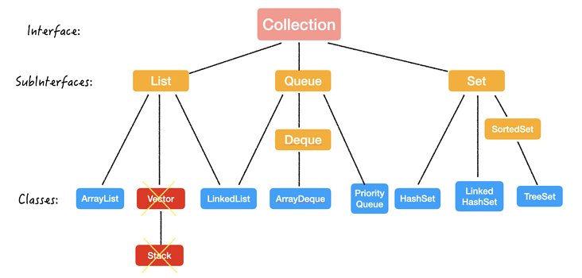

## Basics
- [JavaBasic](javanotes/Basic.md)
- [Static](javanotes/static.md)
- [Generic](javanotes/Generic.md)
- [Exception](javanotes/exception.md)
- [HashCode and Equals](javanotes/hashCodeAndEquals.md)  
- [Garbage Collection and Object Copies](javanotes/GCandCopy.md)  
- [Iterator](javanotes/Iterator.md) 
- [Java 8](javanotes/java8.md)
## Network
- [Serialization](javanotes/Serialization.md)  
- [Session](javanotes/Session.md)  
- [Cookie](javanotes/cookie.md)  
- [Base64](javanotes/Base64.md)  
- [HTTP and Java Servlet](javanotes/HttpServlet.md)    
- [Concept IO](javanotes/IO.md)   
- [Thread](javanotes/Thread.md)   
    - [Java Dead Lock](javanotes/Deadlock.md) 
    - [Thread Safe Class](javanotes/ThreadSafe.md)  
    - [Reentrant vs Thread-safe](javanotes/Compares.md)   
    - [Concurrency and Parallel](javanotes/concurrency&parallel.md)  

## Reactor Java
- [Reactive Programming && Reactor](javanotes/ReactiveProgramming.md)
- [Sink](javanotes/sink.md)
- [Subscribe](javanotes/subscribe.md)
- [ReactorLog](javanotes/ReactorLog.md)
- [Callback Hell](javanotes/CallBackHell.md)
- [rxjava vs reactor](https://nurkiewicz.com/2019/02/rxjava-vs-reactor.html)
    - [rxJava](javanotes/rxJava.md)

## UTIL
 
  

```java
boolean	add(E e)
boolean	addAll(Collection<? extends E> c)
void clear()
boolean	contains(Object o)
boolean	containsAll(Collection<?> c)
boolean	equals(Object o)
int	hashCode()
boolean	isEmpty()
int	size()
Object[] toArray()
<T> T[]	toArray(T[] a)
default Stream<E> stream()
boolean	remove(Object o)
boolean	removeAll(Collection<?> c)

default Spliterator<E> spliterator()
Iterator<E>	iterator()
default Stream<E> parallelStream()
default boolean	removeIf(Predicate<? super E> filter)
boolean	retainAll(Collection<?> c)
```

- [List](javanotes/util.md)  
- [Stack(ArrayDeque&LinkedList)](javanotes/stack.md)
- [Queue](javanotes/queue.md)
- [MAP 設計概念](javanotes/mapConcept.md)
  - [Methods of Map](javanotes/mapUsage.md)
- [SET](javanotes/Set.md)
- [String](javanotes/String.md)
- [Stream](javanotes/Stream.md)
- [Record](javanotes/record.md)
- [Collectors](javanotes/collectors.md)
- [Optional](javanotes/Optional.md)
- [Stream & Optional](javanotes/streamOptional.md)
## java library 
- [lombok](lomBok.md)   
- [`MapStruct`](mapStruct.md)

---

- [MVN Command ON Linux](mvn.md)
- [rim](javanotes/rim.md)
- [time](javanotes/.md)