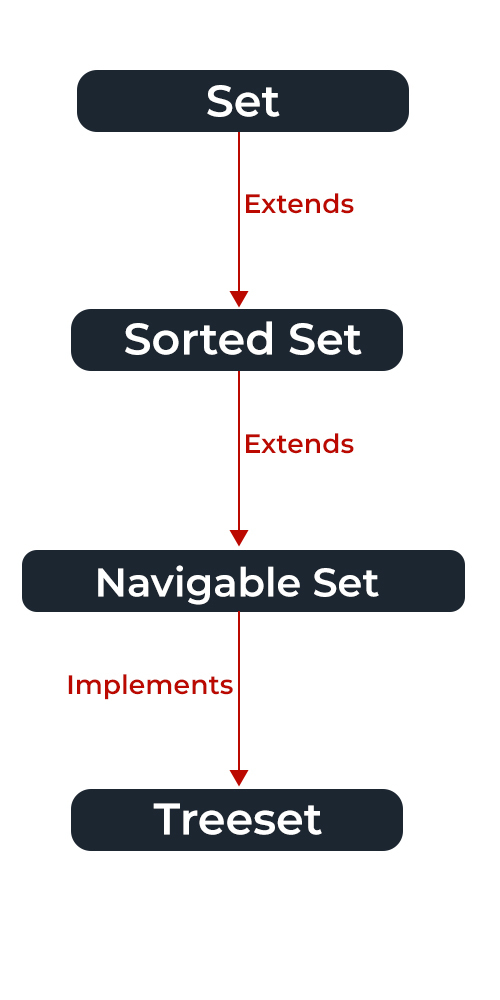

# Set Interface 

- [Set Interface](#set-interface)
  - [Reference](#reference)
  - [TreeSet](#treeset)
    - [`TreeSet#add`](#treesetadd)
    - [`treeSet#descendingIterator` & `treeSet#iterator`](#treesetdescendingiterator--treesetiterator)
    - [`treeSet#first` & `treeSet#last`](#treesetfirst--treesetlast)
    - [null value](#null-value)
    - [TreeSet's Comparator](#treesets-comparator)
  - [LinkedHashSet](#linkedhashset)
    - [null value](#null-value-1)
  - [LinkedList vs LinkedHashSet](#linkedlist-vs-linkedhashset)
    - [How work internally](#how-work-internally)
    - [Insertion](#insertion)
    - [Constructor](#constructor)
    - [Time Complexity](#time-complexity)
    - [Compare the elements](#compare-the-elements)
    - [Null Elements](#null-elements)
  - [HashSet (HashMap with Dummy key)](#hashset-hashmap-with-dummy-key)
    - [Method](#method)
    - [Null value in HashSet](#null-value-in-hashset)
    - [HashSet vs HashMap](#hashset-vs-hashmap)
      - [Duplicates](#duplicates)
      - [Insertion Method](#insertion-method)
    - [Storing/Adding mechanism](#storingadding-mechanism)
    - [Dummy Value](#dummy-value)
  - [EnumSet](#enumset)
    - [Create EnumSet](#create-enumset)

- **A set is an unordered collection of objects** in which **duplicate values cannot be stored**.
- `Set` interface is implemented by various classes like `HashSet`, `TreeSet`, `LinkedHashSet`

- Both the `HashSet` and `LinkedHashSet` class offers `O(1)` time performance for the basic operations such as add, remove, contains and size, etc.

- **`HashSet` requires less memory than `TreeSet` and `LinkedHashSet` since it uses a hash table to store its elements.** LinkedHashSet has the extra overhead of a doubly linked list, and since TreeSet is implemented as a Red-black tree, which takes a considerable amount of memory.

- Both `HashSet` and `LinkedHashSet` permit a `null` value, whereas TreeSet doesn't permit `null`.

- Use `HashSet` when performance is critical, and the ordering of elements doesn’t matter.   
Use `TreeSet` when elements need to be ordered using their natural ordering or by a **Comparator**.  
Use `LinkedHashSet` if the insertion **order of the elements** should be preserved.

## Reference
- [GeekforGeeks](https://www.geeksforgeeks.org/hashset-in-java/)
- [dummy value](https://stackoverflow.com/questions/30037694/why-the-internal-implementation-of-hashset-creates-dummy-objects-to-insert-as-va)
- [Guide to EnumSet](https://www.baeldung.com/java-enumset)
- [A Guide to TreeSet in Java](https://www.baeldung.com/java-tree-set)
- [difference btw hashset,treeset and linkedhashset](https://www.techiedelight.com/difference-between-hashset-treeset-linkedhashset-java/)  
- [LinkedList vs LinkedHashSet](https://www.geeksforgeeks.org/difference-between-linkedlist-and-linkedhashset-in-java/)
- [Can we add null elements to a Set in Java?](https://www.tutorialspoint.com/can-we-add-null-elements-to-a-set-in-java)
## TreeSet 

  

- Time Complexity : `O(logN)`
- **Based on Black-Red-Tree**, Objects in a TreeSet are **stored in a sorted and ascending order**.
- The TreeSet object doesn’t allows null values but, If you try to add them, a runtime exception will be generated at.
- not thread-safe (but it can be synchronized)

```java
Set<String> treeSet = new TreeSet<>(Comparator.comparing(String::length));
Set<String> treeSet = new TreeSet<>();

// synchronized TreeSet 
Set<String> syncTreeSet = Collections.synchronizedSet(treeSet);
```

```java
boolean add(E e)
boolean addAll(Collection<? extends E> c)

E last()
E first()

void clear()
boolean contains(Object o)

boolean isEmpty()
boolean remove(Object o)
int size()
```

### `TreeSet#add`

```java
public boolean add(E e) {
    return m.put(e, PRESENT) == null;
}

// The variable m refers 
// to an internal backing TreeMap 
// (note that TreeMap implements NavigableMap):
private transient NavigableMap<E, Object> m;
```

### `treeSet#descendingIterator` & `treeSet#iterator`

`descendingIterator` is slower than iterator

```java
@Test
public void whenIteratingTreeSet_shouldIterateTreeSetInAscendingOrder() {
    Set<String> treeSet = new TreeSet<>();
    treeSet.add("First");
    treeSet.add("Second");
    treeSet.add("Third");

    Iterator<String> itrDSC = treeSet.descendingIterator();
    Iterator<String> itrASC = treeSet.iterator();
    while (itrASC.hasNext()) {
        System.out.println(itrASC.next());
    }
}
```

### `treeSet#first` & `treeSet#last`

```java
@Test
public void whenCheckingFirstElement_shouldReturnFirstElement() {
    TreeSet<String> treeSet = new TreeSet<>();
    treeSet.add("First");
   
    assertEquals("First", treeSet.first());
}

@Test
public void whenCheckingLastElement_shouldReturnLastElement() {
    TreeSet<String> treeSet = new TreeSet<>();
    treeSet.add("First");
    treeSet.add("Last");
    
    assertEquals("Last", treeSet.last());
}
```

### null value

Exception is thrown.
```java
@Test(expected = NullPointerException.class)
public void whenAddingNullToNonEmptyTreeSet_shouldThrowException() {
    Set<String> treeSet = new TreeSet<>();
    treeSet.add("First");
    treeSet.add(null);
}
```

### TreeSet's Comparator

Elements inserted into the TreeSet must either implement the Comparable interface or at least be accepted by the specified comparator.

```java
@Data
class Element {

    private Integer id;

    // Other methods...
}


Comparator<Element> comparator = (ele1, ele2) -> {
    return ele1.getId().compareTo(ele2.getId());
};

@Test
public void apiElementTreeSet () {
    Set<Element> treeSet = new TreeSet<>(comparator);

    // create element
    Element ele1 = new Element();
    ele1.setId(100);
    Element ele2 = new Element();
    ele2.setId(200);
    
    treeSet.add(ele1);
    treeSet.add(ele2);
}
```

## LinkedHashSet
- same Time Complexity as `HashSet`
- **Store The data via Doubly Linked List** 
- **Retains the insertion ordering of the elements**

```java 
//This constructor is used to create a default HashSet
LinkedHashSet()
LinkedHashSet<E> hs = new LinkedHashSet<E>();
LinkedHashSet<E> hs = new LinkedHashSet<E>(Collection c);
LinkedHashSet<E> hs = new LinkedHashSet<E>(int size);
LinkedHashSet<E> hs = new LinkedHashSet<E>(int capacity, int fillRatio);
```

### null value

```java
public class LinkedHashSetExample {
   public static void main(String args[]) {
      Set<Integer> linkedHashSet = new LinkedHashSet<Integer>();
      //Populating the HashSet
      linkedHashSet.add(1124);
      linkedHashSet.add(3654);
      linkedHashSet.add(7854);
      linkedHashSet.add(9945);
      System.out.println(linkedHashSet); // [1124, 3654, 9945, 7854]
      
      //Adding null elements
      linkedHashSet.add(null);
      linkedHashSet.add(null);
      linkedHashSet.add(null);
      System.out.println(linkedHashSet); // [null, 1124, 3654, 9945, 7854]
   }
}
```

## LinkedList vs LinkedHashSet

### How work internally

- LinkedList class uses doubly linked list to store the elements and can contain duplicate elements.   
- LinkedHashSet uses LinkedHashMap internally to store it's elements.  uniqueness and only stores unique elements only like HashSet.

### Insertion

LinkedList in case of doubly linked list, we can add or remove elements from both side while **LinkedHashSet inserts at the end.**

### Constructor
LinkedList have two constructor `LinkedList()` and `LinkedList(Collection o)`    

LinkedHashSet have four constructor `HashSet()`, `HashSet(Collection c)`, `LinkedHashSet(int capacity)` and `LinkedHashSet(int capacity, float fillRatio)`   

### Time Complexity

LinkedList Insertion, Removal And Retrieval Operations performance of order `O(n)`.   
LinkedHashSet also gives performance of order `O(1)` for insertion, removal and retrieval operations.

### Compare the elements

LinkedList uses `equals()` method.   

LinkedHashSet also uses `equals()` and `hashCode()` methods to compare the elements.

### Null Elements
LinkedList allow any number of `null` values while **LinkedHashSet also allows maximum one `null` element.**

## HashSet (HashMap with Dummy key)

HashSet uses the **unique key concept of the HashMap** and **inserts the values of the HashSet** in the underlying HashMap as keys and just put **some dummy object** corresponding to each key. This makes it a `O(1)` insertion data structure and keeps the values UNIQUE in a HashSet.

- **It permits the `null` element**. 
- **Not Thread Safe**
- **The objects that we insert into the `HashSet` do not guarantee to be inserted in the same order. Objects are inserted on the basis of their hashcode.**
- **`HashSet` is the best approach for SEARCH operations**.   
- Not only stores unique Objects but also a unique Collection of Objects 
- HashSet is slower than HashMap.	

```java
                  Number of stored elements in the table
Load Factor = -----------------------------------------
                        Size of the hash table 

HashSet<E> hs = new HashSet<E>();

HashSet<E> hs = new HashSet<E>(int initialCapacity);

HashSet<E> hs = new HashSet<E>(int initialCapacity, float loadFactor);

HashSet<E> hs = new HashSet<E>(Collection C);
```

### Method

```java
boolean add(E e)
void clear()
Object clone()
boolean contains(Object o)
boolean isEmpty()
Iterator<E> iterator()
boolean remove(Object o)
int size()


int hashCode()
boolean equals()

Boolean removeAll(Collection<?> c)
boolean addAll(Collection<? extends E> c)
boolean containsAll(Collection<?> c)
boolean retainAll(Collection<?> c)

Object[] toArray()
T[] toArray(T[] a)
```

### Null value in HashSet 

Null values in HashSet − The HashSet object allows null values but, you can add only one null element to it. Though you add more null values if you try to print its contents, it displays only one `null`

```java
public static void main(String args[]) {
   Set<Integer> hashSet = new HashSet<Integer>();
   //Populating the HashSet
   hashSet.add(1124);
   hashSet.add(3654);
   hashSet.add(7854);
   hashSet.add(9945);
   System.out.println(hashSet);
   
   //Adding null elements
   hashSet.add(null);
   hashSet.add(null);
   hashSet.add(null);
   System.out.println(hashSet);
}

[1124, 3654, 9945, 7854]
[null, 1124, 3654, 9945, 7854]
```

### HashSet vs HashMap
#### Duplicates	
HashSet does not allow duplicate values.  

HashMap store key, value pairs and it does not allow duplicate keys. 
- If key is duplicate then the old key is replaced with the new value.  
#### Insertion Method  
HashSet : `add(Object o)`.	  
HashMap : `put(K key, V Value)`.   

### Storing/Adding mechanism	
HashSet internally uses the HashMap object to store or add the objects.	   
HashMap internally uses hashing to store or add objects.   

### Dummy Value 

**HashMap does not have any concept of dummy value.**

HashSet internally uses `HashMap#put` to add elements.     
The argument passed in `HashSet#add(E e)` serves as key `e` in HasMap.   

A HashSet doesn't add a new value each time a new key is put into the map.     
It does use an Object, but it uses the same Object each time named `PRESENT`
```java 
public boolean add(E e) {
    return map.put(e, PRESENT)==null;
}

public boolean remove(Object o) {
    return map.remove(o)==PRESENT;
}
```
- The `add` method calls `put(KEY, PRESENT)` on the internal HashMap. 
- The `remove` method calls `remove(key)` on the internal HashMap, but it must return a boolean indicating whether the key was present

If `null` were stored as the value, then the HashSet would need to call `containsKey` first, then `remove(key)`, to determine if the key was present 

## EnumSet
As a rule of thumb (Faustregel/經驗法則), `EnumSet` should always be preferred over any other Set implementation when we are storing enum values.

- `EnumSet` is a public abstract class that contains multiple static factory methods that allow us to create instances.
- all the methods in an `EnumSet` are implemented using arithmetic bitwise operations. 


### Create EnumSet

```java
public enum Color {
    RED, YELLOW, GREEN, BLUE, BLACK, WHITE
}
// Create EnumSet
EnumSet.allOf(Color.class);
EnumSet.noneOf(Color.class);
EnumSet.range(Color.YELLOW, Color.BLUE);

// create an EnumSet with all the Color elements except black and white:
EnumSet.complementOf(EnumSet.of(Color.BLACK, Color.WHITE));
// [RED, YELLOW, GREEN, BLUE]

// create an EnumSet by copying all the elements from another EnumSet:
EnumSet.copyOf(EnumSet.of(Color.BLACK, Color.WHITE));
```

```java
// copy all the elements 
// from any Collection that contains enum elements
List<Color> colorsList = new ArrayList<>();
colorsList.add(Color.RED);

EnumSet<Color> listCopy = EnumSet.copyOf(colorsList);

// Create Enum
EnumSet<Color> set = EnumSet.noneOf(Color.class);
set.add(Color.RED);
set.add(Color.YELLOW)

set.contains(Color.RED);
set.forEach(System.out::println);
set.remove(Color.RED);
```
