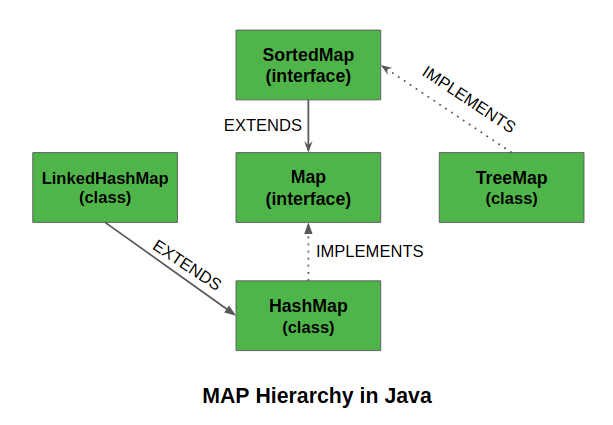

# Map

- [Map](#map)
  - [Reference](#reference)
  - [Usage](#usage)
  - [Methods](#methods)
    - [From Collection](#from-collection)
    - [get and put](#get-and-put)
    - [replace/All](#replaceall)
    - [entrySet and keySet](#entryset-and-keyset)
    - [ComputeIfAbsent and putIfAbsent](#computeifabsent-and-putifabsent)
    - [compute and computeIf](#compute-and-computeif)
    - [Merge](#merge)
  - [TreeMap (SORTED key-value pairs)](#treemap-sorted-key-value-pairs)
    - [Methods in SortedMap](#methods-in-sortedmap)
      - [Get FirstKey or LastKey](#get-firstkey-or-lastkey)
      - [tailMap(K equalOrLarge) and headMap(K small)](#tailmapk-equalorlarge-and-headmapk-small)
      - [subMap(lowBound, upBound)](#submaplowbound-upbound)
    - [Methods in NavigableMap](#methods-in-navigablemap)
      - [Higher/Lower-Key & Higher/Lower-Entry , ceiling/floor-Key & ceiling/floor-Entry](#higherlower-key--higherlower-entry--ceilingfloor-key--ceilingfloor-entry)
      - [PollLastEntry & PollFirstEntry](#polllastentry--pollfirstentry)
  - [LinkedHashMap](#linkedhashmap)

  

## Reference

[TreeMap](https://www.geeksforgeeks.org/treemap-in-java/)  
[LinkedHashMap](https://www.geeksforgeeks.org/linkedhashmap-class-in-java/)  
[SortedMap](https://jenkov.com/tutorials/java-collections/sortedmap.html)  
[NavigableMap](https://jenkov.com/tutorials/java-collections/navigablemap.html)
[Java-TreeMap](https://www.cainiaojc.com/java/java-treemap.html)

## Usage

HashMap
- HashMap offers 0(1) lookup and insertion. It is implemented by an array of linked lists. 
- It contains only unique elements.
- It may have one null key and multiple null values.
- It maintains no order.

LinkedHashMap
- It is same as HashMap instead maintains **insertion order**.

TreeMap
- TreeMap offers `O(log N)` lookup and insertion. Keys are ordered, this means that keys must implement the Comparable interface.  
TreeMap is implemented by a Red-Black Tree.   
- It cannot have null key but can have multiple null values.
- It is same as HashMap instead maintains ascending order(Sorted using the natural order of its key).


## Methods 

### From Collection

```java
void clear()
Object clone()
int	size()
boolean	isEmpty()
void forEach(BiConsumer<? super K,? super V> action)
V remove(Object key)
boolean	remove(Object key, Object value)
Collection<V>	values()

boolean	containsKey(Object key)
boolean	containsValue(Object value)
```

### get and put
- `get(object obj)`
- `getOrDefault(Object key, V defaultValue)`
- `put(K key, V value)`
- `putAll(Map<? extends K,? extends V> m)` copies m to this map

### replace/All

`V replace(K key, V value)`  
- Replaces the entry for the specified key only if it is currently mapped to some value.

`boolean replace(K key, V oldValue, V newValue)`  
- Replaces the entry for the specified key only if currently mapped to the specified value.   

`void replaceAll(BiFunction<? super K,? super V,? extends V> function)`
```java
maps.replaceAll((key, value) -> value.toUpperCase());
```
### entrySet and keySet

```java
Set<Map.Entry<K,V>> entrySet()
Set<K> keySet()
```
### ComputeIfAbsent and putIfAbsent

[example](https://www.runoob.com/java/java-hashmap-computeifabsent.html)
- `V putIfAbsent(K key,V value)`  
- `V computeIfAbsent(K key, (key)-> value)`

### compute and computeIf

`V compute(K key, BiFunction<? super K,? super V,? extends V> remappingFunction)`
Attempts to compute a mapping for the specified key and its current mapped value (or null if there is no current mapping).
```java
int newPrice = prices.compute("Shoes", (key, value) -> value - value * 10/100);
```

`V computeIfAbsent(K key, Function<? super K,? extends V> mappingFunction)`
If the specified key is not already associated with a value (or is mapped to null), attempts to compute its value using the given mapping function and enters it into this map unless null.
`V computeIfPresent(K key, BiFunction<? super K,? super V,? extends V> remappingFunction)`
If the value for the specified key is present and non-null, attempts to compute a new mapping given the key and its current mapped value.


### Merge

```java
// 10 entries restriction
Map<String, String> countries = Map.of(
    "Washington", "America",
    "Canberra", "Australia",
    "Madrid", "Spain"
);
//                                           key     newValue
String returnedValue = countries.merge("Washington", "USA", (oldValue, newValue) -> oldValue + "/" + newValue);
```

## TreeMap (SORTED key-value pairs)

The class implements Map interfaces including `NavigableMap`, `SortedMap`, and extends `AbstractMap` class.

The map is sorted according to the **natural ordering** of its keys, or by a **Comparator** provided at map creation time, depending on which constructor is used. 
- This proves to be an efficient way of sorting and storing the key-value pairs. 

The treemap implementation is **not synchronized** in the sense that if a map is accessed by multiple threads, concurrently and at least one of the threads modifies the map structurally, it must be synchronized externally. 
```java
SortedMap m = Collections.synchronizedSortedMap(new TreeMap(...)); 
```

A TreeMap is based upon a red-black tree data structure. 
```java
3 Variables (K key=Key, V value=Value, boolean color=Color)
3 References (Entry left = Left, Entry right = Right, Entry parent = Parent)
```

```java
TreeMap()
TreeMap(Comparator comp)

TreeMap(Map M)
Map<Integer, String> hash_map = new HashMap<Integer, String>();

TreeMap<Integer, String> tree_map = new TreeMap<Integer, String>(hash_map);

TreeMap(SortedMap sm)
SortedMap<Integer, String> sorted_map = new ConcurrentSkipListMap<Integer, String>();

TreeMap<Integer, String> tree_map = new TreeMap<Integer, String>(sorted_map);
```

### Methods in SortedMap

```java
SortedMap sortedMap = new TreeMap();
sortedMap.put("a", "1");
sortedMap.put("c", "3");
sortedMap.put("e", "5");
sortedMap.put("d", "4");
sortedMap.put("b", "2");
```
#### Get FirstKey or LastKey 

```java
String firstKey = (String) sortedMap.firstKey();
String lastKey = (String) sortedMap.lastKey();
```

#### tailMap(K equalOrLarge) and headMap(K small)

Return new instance of map that `>=` c in sortedMap
```java
SortedMap tailMap = sortedMap.tailMap("c");
// {c=3, d=4, e=5}
```

Return new instance of map that `<` C in the sortedMap
```java
SortedMap headMap = sortedMap.headMap("c");
// {a=1, b=2}
```

#### subMap(lowBound, upBound)

```java
// subMap >= b and < e
SortedMap subMap = sortedMap.subMap("b", "e");

// {b=2, c=3, d=4}
System.out.println(subMap);
```

### Methods in NavigableMap

```java
TreeMap<String,String> sortedMap = new TreeMap<>()
sortedMap.put("a", "1");
sortedMap.put("c", "3");
sortedMap.put("e", "5");
sortedMap.put("d", "4");
sortedMap.put("b", "2")

System.out.println(sortedMap);

NavigableMap descending = sortedMap.descendingMap()
System.out.println(descending);

// output
{a=1, b=2, c=3, d=4, e=5}
{e=5, d=4, c=3, b=2, a=1}
```

#### Higher/Lower-Key & Higher/Lower-Entry , ceiling/floor-Key & ceiling/floor-Entry

```java
class Main {
    public static void main(String[] args) {
        TreeMap<String, Integer> numbers = new TreeMap<>();
        numbers.put("First", 1);
        numbers.put("Second", 5);
        numbers.put("Third", 4);
        numbers.put("Fourth", 6);
        System.out.println("TreeMap: " + numbers);

        // 使用 higher()
        System.out.println("higherKey(): Returns the least key strictly greater than the given key, or null if there is no such key." + numbers.higherKey("Fourth"));

        System.out.println("higherEntry(): Returns a key-value mapping associated with the least key strictly greater than the given key, or null if there is no such key." + numbers.higherEntry("Fourth"));

        System.out.println("lowerKey(): Returns the greatest key strictly less than the given key, or null if there is no such key." + numbers.lowerKey("Fourth"));
        System.out.println("lowerEntry(): Returns a key-value mapping associated with the greatest key strictly less than the given key, or null if there is no such key. " + numbers.lowerEntry("Fourth"));

        System.out.println("ceilingKey(): Returns the greatest key less than or equal to the given key, or null if there is no such key." + numbers.ceilingKey("Fourth"));
        System.out.println("ceilingEntry(): Returns a key-value mapping associated with the greatest key less than or equal to the given key, or null if there is no such key." + numbers.ceilingEntry("Fourth"));

        System.out.println("floorKey(): Returns the greatest key less than or equal to the given key, or null if there is no such key.
         " + numbers.floorKey("Fourth"));

        System.out.println("floorEntry(): Returns a key-value mapping associated with the greatest key less than or equal to the given key, or null if there is no such key." + numbers.floorEntry("Fourth"));
    }
}


TreeMap: {First=1, Fourth=6, Second=5, Third=4}

higherKey(): Returns the least key strictly greater than the given key, or null if there is no such key. Second
higherEntry(): Returns a key-value mapping associated with the least key strictly greater than the given key, or null if there is no such key. Second=5
lowerKey(): Returns the greatest key strictly less than the given key, or null if there is no such key. First
lowerEntry(): Returns a key-value mapping associated with the greatest key strictly less than the given key, or null if there is no such key. First=1

ceilingKey(): Returns the greatest key less than or equal to the given key, or null if there is no such key. Fourth
ceilingEntry(): Returns a key-value mapping associated with the greatest key less than or equal to the given key, or null if there is no such key.Fourth=6
floorKey(): Returns the greatest key less than or equal to the given key, or null if there is no such key. Fourth
floorEntry(): Returns a key-value mapping associated with the greatest key less than or equal to the given key, or null if there is no such key. Fourth=6
```

#### PollLastEntry & PollFirstEntry

Poll Last/First Entry and Delete that entry

```java
sortedMap.pollFirstEntry(); // a=1
sortedMap.pollLastEntry(); // e=1
```


## LinkedHashMap
  

Synchronized LinkedHashMap
```java
Map m = Collections.synchronizedMap(new LinkedHashMap(...));
```

```java
LinkedHashMap<K, V> lhm = new LinkedHashMap<K, V>();

LinkedHashMap<K, V> lhm = new LinkedHashMap<K, V>(int capacity);

LinkedHashMap<K, V> lhm = new LinkedHashMap<K, V>(Map<? extends K,​? extends V> map);

LinkedHashMap<K, V> lhm = new LinkedHashMap<K, V>(int capacity, float fillRatio);
```

This constructor is also used to initialize both the capacity and fill ratio for a LinkedHashMap along with whether to follow the insertion order or not.
```java
LinkedHashMap<K, V> lhm = new LinkedHashMap<K, V>(int capacity, float fillRatio, boolean Order);
```


