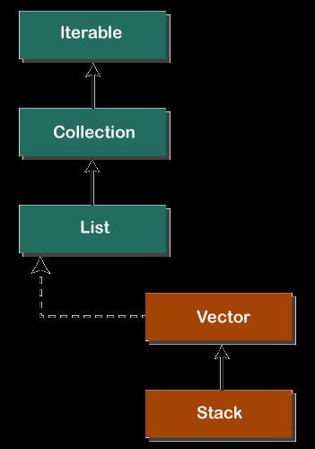
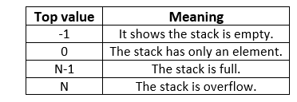

# Stack From Vector

- [Stack From Vector](#stack-from-vector)
  - [Reference](#reference)
  - [Methods](#methods)
  - [ArrayDeque](#arraydeque)
    - [ArrayDeque vs LinkedList](#arraydeque-vs-linkedlist)
    - [Methods](#methods-1)
    - [Iteration](#iteration)
    - [xxxLast and xxxFirst](#xxxlast-and-xxxfirst)
  - [LinkedList](#linkedlist)

Stack class in Java is a legacy class and inherits from Vector in Java.   
It is a thread-safe class and hence involves overhead.     
Use `deque` when we do not need thread safety instead   
     
 

## Reference

[geekForGeeks](https://www.geeksforgeeks.org/stack-class-in-java/)
[deque](https://ithelp.ithome.com.tw/articles/10229634)   
[Java ArrayDeque](https://www.cainiaojc.com/java/java-arraydeque.html)

```java
Stack stk = new Stack();  
//Or
Stack<T> stk = new Stack<T>();  
```

## Methods

```java 
// STACK usage
boolean	empty()
E	peek()
E	pop()
E	push(E item)
int	search(Object o)
// It determines whether an object exists in the stack. 
// If the element is found, 
// It returns the position of the element 
// from the top of the stack. Else, it returns `-1`.

// Vector
boolean	add(E e)
void	add(int index, E element)
boolean	addAll(Collection<? extends E> c)
boolean	addAll(int index, Collection<? extends E> c)
void	addElement(E obj)
void	copyInto(Object[] anArray)
void	insertElementAt(E obj, int index)
void	setElementAt(E obj, int index)
E	elementAt(int index)
Enumeration<E>	elements()
E	firstElement()
E	lastElement()
boolean	removeElement(Object obj)
void	removeElementAt(int index)
void	removeAllElements()
void	setSize(int newSize)
int	capacity()


E	get(int index)
boolean	retainAll(Collection<?> c)
void	trimToSize()
void	clear()
Object	clone()
boolean	contains(Object o)
boolean	containsAll(Collection<?> c)
boolean	equals(Object o)
int	hashCode()
boolean	isEmpty()
Iterator<E>	iterator()
E	remove(int index)
boolean	remove(Object o)
boolean	removeAll(Collection<?> c)
int	size()
Object[] toArray()
<T> T[]	toArray(T[] a)
String toString()

void	ensureCapacity(int minCapacity)
int	indexOf(Object o)
int	indexOf(Object o, int index)
int	lastIndexOf(Object o)
int	lastIndexOf(Object o, int index)
ListIterator<E>	listIterator()
ListIterator<E>	listIterator(int index)
protected void	removeRange(int fromIndex, int toIndex)

// ArrayList
List<E>	subList(int fromIndex, int toIndex)
```


## ArrayDeque

It is recommended to use `ArrayDeque` for stack implementation as it is more efficient in a single-threaded environment.

### ArrayDeque vs LinkedList

LinkedList supoorts `null` value. ArrayDeque Does not
LinkedList needs more capacity to store the data so ArrayDeque might faster than it

### Methods

```java
boolean add(element)
boolean offer(element)
void push(element)
E pop(element)

// returns top or null
E poll() 
E peek() 
```

### Iteration

```java
Iterator<E> iterator()  

Iterator<E> descendingIterator()
// Returns an iterator over the elements 
// in this deque in reverse sequential order. 
// The elements will be returned in order 
// from last (tail) to first (head).
```


### xxxLast and xxxFirst

```java
void addFirst(object o)  
void addLast(object o)

boolean offerFirst(element)   
boolean offerLast(element)   

remove()
remove(e element)
removeFirst()
removeLast() 

getLast()  // if null NoSuchElementException
getFirst() // if null NoSuchElementException

E pollFirst()   
E pollLast()

E peekFirst()    
E peekLast()  
```

## LinkedList

```java
boolean	add(E e)
void	add(int index, E element)
boolean	addAll(Collection<? extends E> c)
boolean	addAll(int index, Collection<? extends E> c)

void	addFirst(E e)
void	addLast(E e)
void	clear()
Object	clone()
boolean	contains(Object o)
Iterator<E>	descendingIterator()
E	element()
E	get(int index)
E	getFirst()
E	getLast()

int	indexOf(Object o)
int	lastIndexOf(Object o)
ListIterator<E>	listIterator(int index)
boolean	offer(E e)
boolean	offerFirst(E e)
boolean	offerLast(E e)

E	peek()
E	peekFirst()
E	peekLast()

E	poll()
E	pollFirst()
E	pollLast()

E	pop()
void	push(E e)
E	remove()
E	remove(int index)
boolean	remove(Object o)
E	removeFirst()
E	removeLast()

boolean	removeFirstOccurrence(Object o)
boolean	removeLastOccurrence(Object o)

E	set(int index, E element)
int	size()
Object[]	toArray()
<T> T[]	toArray(T[] a)
```