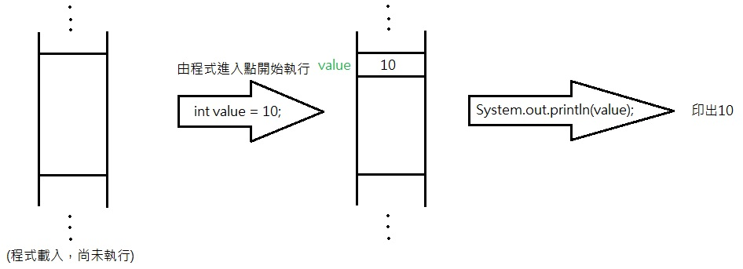
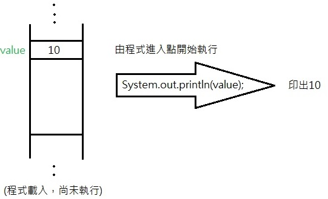

# `static` keyword

- [`static` keyword](#static-keyword)
  - [Reference](#reference)
  - [Thread with Static Member](#thread-with-static-member)
  - [Static Method](#static-method)
    - [Static Block `static {..}` (CONSTRUCTOR OF STATIC VALUES)](#static-block-static--constructor-of-static-values)
    - [Static Class (Typescript doesn't have static class)](#static-class-typescript-doesnt-have-static-class)
  - [Import Static Packages](#import-static-packages)
  - [Order of Static](#order-of-static)
  - [Top Level Class](#top-level-class)

A `static` Field is **shared by everyone in this class or it's subclass**   
`Static` method or member are bind directly with Class   
```java
class A{
    
    // member is shared by the class and 
    // its subClass 
    static int staticMember;

    // staticMember can be modified
    // by staticMethod
    static staticMethod(){
        //....
    }
}

A.member;
A.method();
```

With `static` no need to `new` a memory space
non static member :
  
static member :
  


Static variable help us to reduce `new`ing same object, for example :
```java
// you create an new companyName 
// each time the instance of Employee 
// is created
public class Employee{
    int age;
    int sex;
    String companyName = "X inc";
}

// companyName is only created one time 
public class Employee{
    int age;
    int sex;
    static String companyName = "X inc";
}
```


## Reference 

- [[Java] static 關鍵字](https://ithelp.ithome.com.tw/articles/10230484?sc=pt)
- [Static Classes In Jav](https://stackoverflow.com/questions/7486012/static-classes-in-java)
 
## Thread with Static Member 

Each thread create its **own local cache** to share `static` variable which means **each `static` member in EACH THREAD is ONLY SHARED BY that THREAD**    

## Static Method

Static method in Java is a method which belongs to the Class and not to the object

1. Static method can call only other static methods and not a non-static method. 
2. Static method can modify static fields
3. Static method can be accessed directly by the Class.
4. Static method cannot refer to `this` or `super` keywords in anyway.
5. **Static Method能從外面拿的變數只有`static` Methods跟Properties**
    ```java
    public class A {

        private static int x;
        private int y;

        public static void func1(){
            int a = x;
            // int b = y;   Non-static field y cannot be referenced from a static context
            // int b = this.y;   this cannot be referenced from a static context
        }
    }
    ```

6. **Static Method Shall Not Combine with `abstract`**
    ```java
    public abstract class A {
        public static void func1(){
        }
        /**
        public abstract static void func2();  
        Illegal combination of modifiers: 'abstract' and 'static'
        **/
    }
    ```

### Static Block `static {..}` (CONSTRUCTOR OF STATIC VALUES)

The static block is a block of statement inside a Java class that will be executed when a class is **first loaded into the JVM**.

- **A static block helps to initialize the static data members, just like constructors help to initialize instance members.**

```java
public class A {

    static {
        System.out.println("123");
    }

    public static void main(String[] args) {
        A a1 = new A();
        A a2 = new A();
    }
}
//123


public class Demo {
 static int a;
 static int b;
 
 static {
    a = 10;
    b = 20;
 }
 public static void main(String args[]) {

  System.out.println("Value of a = " + a);
  System.out.println("Value of b = " + b);

 	}
}
// Value of a = 10
// Value of b = 20
```

### Static Class (Typescript doesn't have static class)

Static nested class may be instantiated without instantiating its outer class.
- **The static class can access only the static members of the OuterClass**.
- Inner classes can access Both static and non-static members of the outer class. 
```java
public class A{
    // ...

    public class nonStaticClass{
        //..
    }

    public static class staticClass{
        //..
    }
}
```
To initialize these inner classes 
```java
A.staticClass staticClassObj = new A.staticClass();   
A.nonStaticClass nonStaticCLassObj = new A.new nonStaticObj();   
```

For example :
```java
class OuterClass {
    private static String msg = "Static Field";
  
    // Static nested class
    public static class NestedStaticClass {
  
        // static class is accessible 
        // for static members of OuterClass only
        public void printMessage()
        {
            // If there were a non-static variable, 
            // there will be compiler error
            System.out.println(
                "Message from nested static class: "
                + msg);
        }
    }
  
    // Non-static nested class
    public class InnerClass {
  
        /**
         * Both static and non-static members
         * of Outer Class are accessible in
         * this Inner class
         */
        public void display(){
            System.out.println(
                "Message from non-static nested class: "
                + msg);
        }
    }
}

class Main {
    public static void main(String args[])
    {
        // Create instance of nested Static Class
        OuterClass.NestedStaticClass printer
            = new OuterClass.NestedStaticClass();
        // Call non static method of nested static class
        printer.printMessage();
  
        // Create instance of nested Non-Static Class
        OuterClass outerObject = new OuterClass();
        OuterClass.InnerClass innerObject1 = outerObject.new InnerClass();
        // Calling non-static method of Inner class
        innerObject1.display();

        // We can also combine above steps in one
        // step to create instance of Inner class
        OuterClass.InnerClass innerObject2
            = new OuterClass().new InnerClass();
        // Similarly we can now call Inner class method
        innerObject2.display();
    }
}
```

Output:
```java
Message from nested static class: Static Field
Message from non-static nested class: Static Field
Message from non-static nested class: Static Field
```

## Import Static Packages

```java
import static com.xxx.ClassName.*
```

## Order of Static 

Any with `static` keyword -> base Class (field, block -> function) -> derived class (field,block -> function)


## Top Level Class

Java has no way of making a top-level class static but you can simulate a static class like this:

- Declare your class `final`  
**Prevents extension of the class since extending a static class makes no sense**
- Make the constructor `private`  
**Prevents instantiation by client code as it makes no sense to instantiate a static class**
- Make all the members and functions of the class `static`  
**Since the class cannot be instantiated no instance methods can be called or instance fields accessed**
- The compiler will not prevent you from declaring an instance (non-static) member.
```java
public class TestMyStaticClass {
    public static void main(String []args){
        MyStaticClass.setMyStaticMember(5);
        System.out.println("Static value: " + MyStaticClass.getMyStaticMember());
        System.out.println("Value squared: " + MyStaticClass.squareMyStaticMember());
        
        // results in compile time error
        // constructor is private visibility
        MyStaticClass x = new MyStaticClass(); 
    }
}

// A top-level Java class mimicking static class behavior
public final class MyStaticClass {
    private MyStaticClass () { // private constructor
        myStaticMember = 1;
    }
    private static int myStaticMember;
    public static void setMyStaticMember(int val) {
        myStaticMember = val;
    }
    public static int getMyStaticMember() {
        return myStaticMember;
    }
    public static int squareMyStaticMember() {
        return myStaticMember * myStaticMember;
    }
}
```
