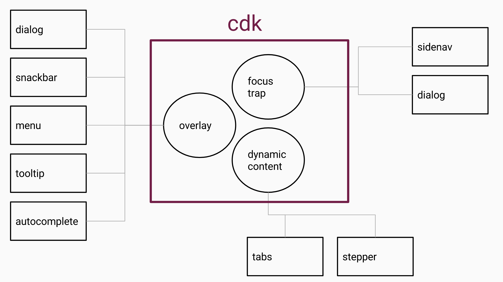

# CDK


CDK : mutual parts of each material

- [CDK](#cdk)
  - [Reference](#reference)
  - [BreakpointsObserver(LayoutModule)](#breakpointsobserverlayoutmodule)
    - [isMatched](#ismatched)
    - [observe](#observe)
  - [Observables (ObserversModule)](#observables-observersmodule)
    - [CdkObserveContent](#cdkobservecontent)
  - [Scrolling (ScrollDispatchModule)](#scrolling-scrolldispatchmodule)
    - [directive `cdkScrollable`](#directive-cdkscrollable)
  - [Overlay](#overlay)
  - [Portal (PortalModule)](#portal-portalmodule)
    - [TemplatePortal](#templateportal)

  


## Reference 
- [[Angular Material完全攻略] Day 26 - Angular CDK(2) - Accessibility](https://ithelp.ithome.com.tw/articles/10197159)
- [BreakpointObserver](https://material.angular.io/cdk/layout/overview)
- [Overlay](https://material.angular.io/cdk/overlay/api)
- [[Angular Material完全攻略] Day 29 - Angular CDK(5) - Portal](https://ithelp.ithome.com.tw/articles/10197393)
- [[Angular Material完全攻略]Angular CDK(隱藏版) - Coercion、Platform](https://ithelp.ithome.com.tw/articles/10197609)


## BreakpointsObserver(LayoutModule)
### isMatched

```typescript
export class DashboardComponent implements OnInit {
  constructor(private breakpointObserver: BreakpointObserver) {}
  ngOnInit() {
    // check if current screen size is matched 
    // > 599px : false
    // < 599ps : true 
    const isSmallScreen = breakpointObserver.isMatched('(max-width: 599px)');
  }
}
```

### observe

Dynamically Media Query Observation
```typescript
const Breakpoints: { 
  XSmall: string; 
  Small: string; 
  Medium: string; 
  Large: string; 
  XLarge: string; 
  /** Handset **/
  Handset: string; 
  Tablet: string; 
  Web: string; 
  /** Portrait **/
  HandsetPortrait: string; 
  TabletPortrait: string; 
  WebPortrait: string; 
  /** landscape **/
  HandsetLandscape: string; 
  TabletLandscape: string; 
  WebLandscape: string; };`
```

```typescript
this.breakpointObserver.observe('(orientation: portrait)').subscribe(result => {
  console.log(`{portrait: ${result.matches}`);
});

this.breakpointObserver.observe('(orientation: landscape)').subscribe(result => {
  console.log(`{landscape: ${result.matches}`);
});

this.breakpointObserver.observe([Breakpoints.HandsetLandscape, Breakpoints.HandsetPortrait])
  .subscribe(result => {
    console.log(`Handset: ${result.matches}`);
  });
```

```typescript
export class SurveyComponent implements OnInit, AfterViewInit {
  isHandset$: Observable<boolean>;
  
  constructor(private breakpointObserver: BreakpointObserver) {}
  
  ngOnInit() {
    this.isHandset$ = this.breakpointObserver.observe(Breakpoints.Handset).map(match => match.matches);
  }
}

<mat-form-field>
  <input type="text" name="birthday" matInput [matDatepicker]="demoDatepicker">
  <mat-datepicker [touchUi]="isHandset$ | async"></mat-datepicker>
</mat-form-field>
```

## Observables (ObserversModule)

### CdkObserveContent

`CdkObserveContent` : Observe `<ng-content></ng-content>`

MutationRecord : DOM

Properties 
- `@input debounce :number` : Debounce interval for emitting the changes.
- `@Output $event : MutationRecord[]` : Event emitted for each change in the element's content.

```html
<div class="content-wrapper" (cdkObserveContent)="projectContentChanged($event) debounce="1000">
  <ng-content></ng-content>
</div>
```

```typescript
@Component({ ... })
export class CdkObserveContentDemoComponent {
    count = 0;
    
    projectContentChanged($event: MutationRecord[]) {
        ++this.count;
        console.log("ng-content state is changed");
        console.log($event, this.count);
    }
}
```


## Scrolling (ScrollDispatchModule)

Listen scroll event
### directive `cdkScrollable`

directive `cdkScrollable` corresponds to observable `ScrollDispatcher` 

```html
<mat-sidenav-content cdkScrollable>
  ...
</mat-sidenav-content>
```
```typescript
@Component({ ... })
export class DashboardComponent implements OnInit {
  constructor(private scrollDispatcher: ScrollDispatcher) {}
           
  ngOnInit() { 
    //                             ' auditTimeInMs : interval from stateless to 
    this.scrollDispatcher.scrolled(100).subscribe((scrollable: CdkScrollable) => {
      console.log('scroll event');
      console.log(scrollable.getElementRef().nativeElement);
    });
  }
}
```


## Overlay

```typescript
import { OverlayModule } from '@angular/cdk/overlay';

@NgModule({
  exports: [
    OverlayModule
  ]
})
export class SharedMaterialModule {}
```

## Portal (PortalModule)

A Portal is a piece of UI that can be dynamically rendered to an open slot on the page.
- Portal：content，two types TemplatePortal(of template reference)；ComponentPortal(of component).
- PortalOutlet：slot(outlet) where rendered variable Portal.

```html
<!-- directive within ng-template -->
<ng-template cdkPortal>
  <p>The content of this template is captured by the portal.</p>
</ng-template>

<!-- OR -->

<!-- structural directive within host-element -->
<p *cdkPortal>
  The content of this template is captured by the portal.
</p>
```
```typescript
@Component({ ... })
export class MainComponent implements OnInit {
    
    @ViewChildren(CdkPortal) templatePortals: QueryList<CdkPortal>;

    currentPortal: Portal<any>;
    
    changePortal1() {
        this.currentPortal = this.templatePortals.first;
    }
    
    changePortal2() {
        this.currentPortal = this.templatePortals.last;
    }
}
```

### TemplatePortal

```html
<div class="portal-demo">
  <div class="tabs">
    <button mat-button (click)="changePortal1()">portal1</button>
    <button mat-button (click)="changePortal2()">portal2</button>
    <button mat-button (click)="changePortal3()">portal3</button>
    <button mat-button (click)="changePortal4()">portal4</button>
  </div>
  <div class="tab-content">
    <div [cdkPortalOutlet]="currentPortal"></div>
  </div>
</div>

<!-- ng-template with directive-->
<ng-template cdkPortal let-nameInTemplate="nameInObject">
  <p>
    directive cdkPortal
  </p>
</ng-template>

<!-- structural directive -->
<p *cdkPortal>
    structural *cdkPortal
</p>

<!-- #template  -->
<ng-template #template let-nameInTemplate="nameInObject">
    @ViewChild('template') template3: TemplateRef<any>;
</ng-template>
```

```typescript
export class MainComponent implements OnInit {
    @ViewChildren(CdkPortal) templatePortals: QueryList<CdkPortal>;

    @ViewChild('template') template3: TemplateRef<any>;
    currentPortal: Portal<any>;

    constructor(
      private viewContainerRef: ViewContainerRef,
      private injector: Injector,
      @Inject(DOCUMENT) private document: any,
      private componentFactoryResolver: ComponentFactoryResolver,
      private appRef: ApplicationRef
    ) {}
    
    // ... 

    // <ng-template cdkPortal>
    changePortal1() {
        this.templatePortals.first.context = { nameInObject: this.name };
        this.currentPortal = this.templatePortals.first;
    }

    changePortal2() {
        this.currentPortal = this.templatePortals.last;
    }


    // insert TemplatePortal
    changePortal3() {
        this.currentPortal = new TemplatePortal(this.template3, this.viewContainerRef, { nameInObject: this.name });
    }

    // insert componentPortal
    changePortal4() {
        this.currentPortal = new ComponentPortal(Portal4Component, undefined, this._createInjector());
    }

    private _createInjector(): PortalInjector {
        const injectionTokens = new WeakMap();
        
        injectionTokens.set(PORTAL4_INJECT_DATA, { nameInObject: this.name });
        
        return new PortalInjector(this.injector, injectionTokens);
    }
}
```
