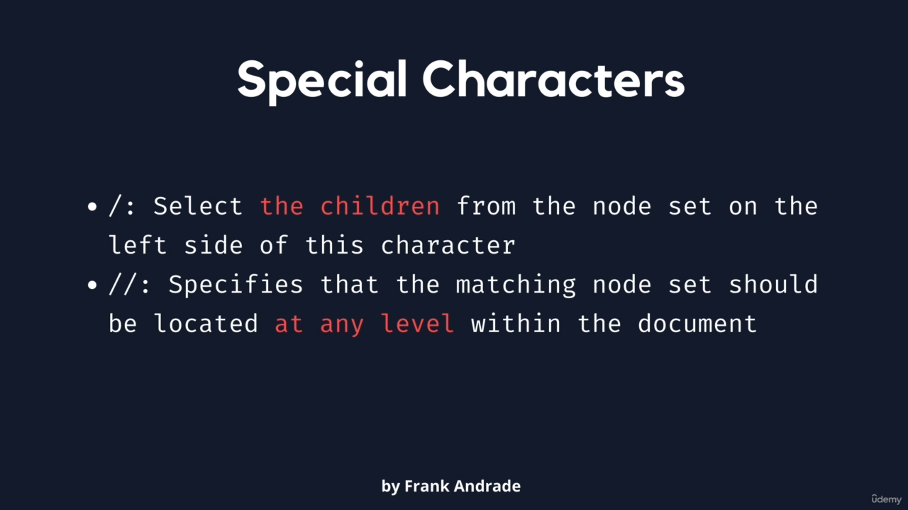
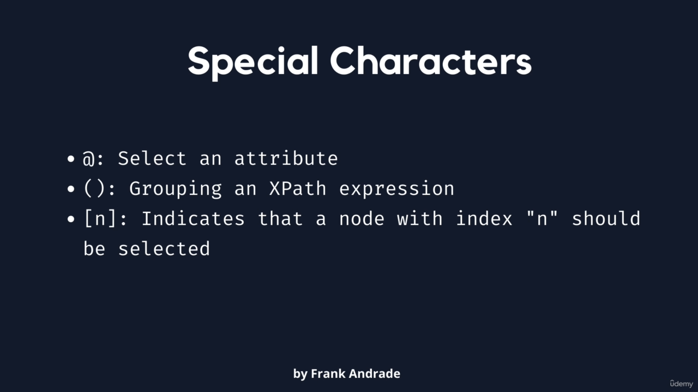
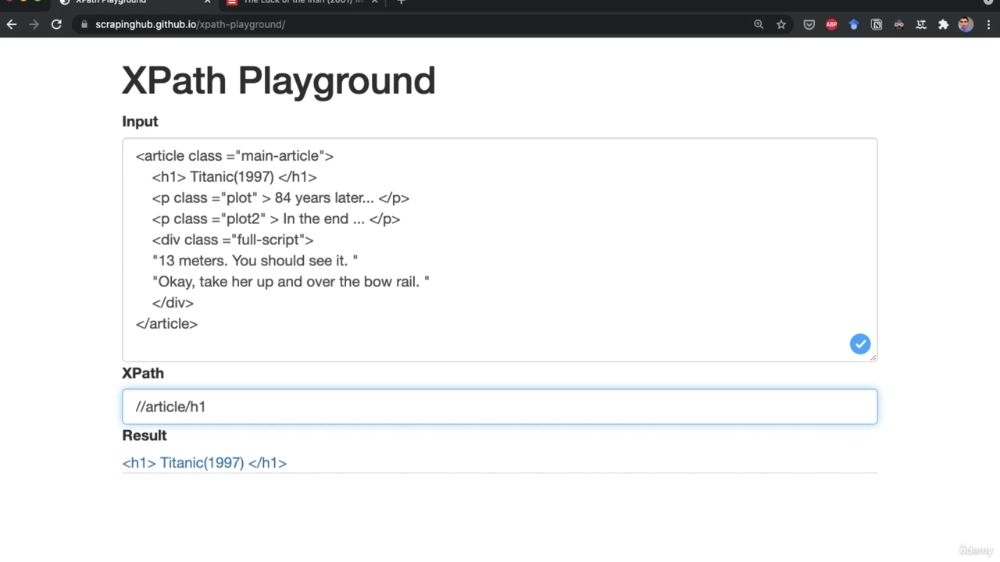
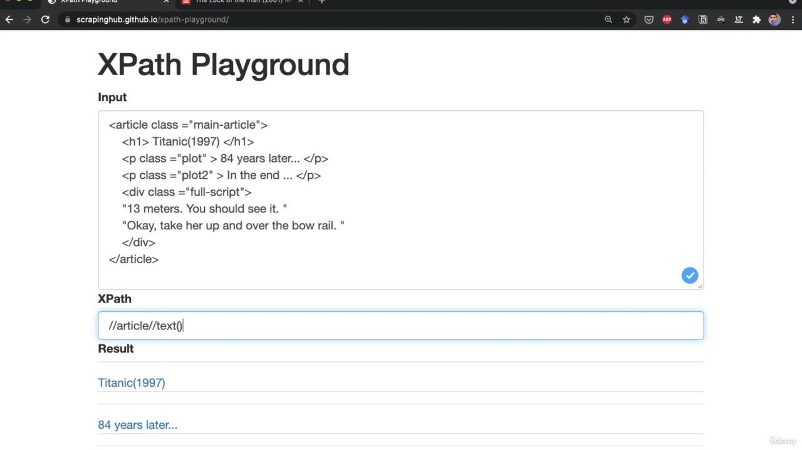
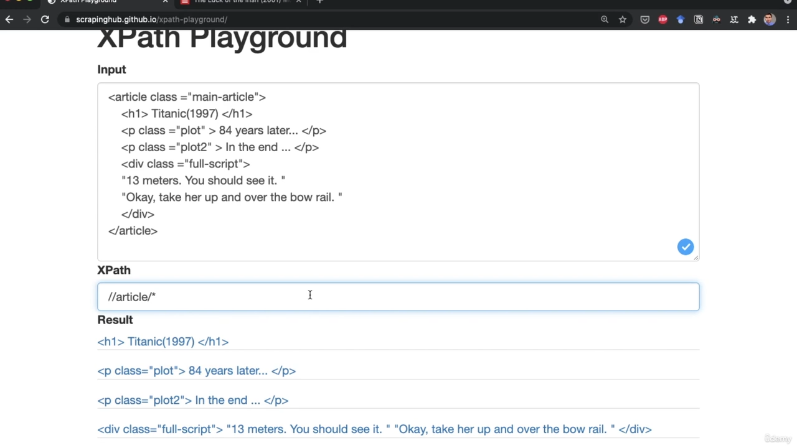

# XPath 


## Syntax

```html
<!-- 
    pick first writing 
-->
//tagName[1]


//tagName[@AttributeName="value"]
```

## Special Character

https://scrapinghub.github.io/xpath-playground/





:star:


Examples









