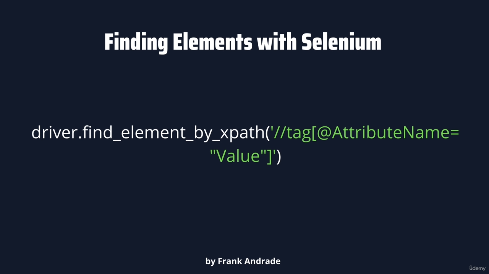

# Selenium

## Driver & Xpath

Scrape the website that run Javascript with Selenium

```python 
driver.find_element_by_id('id')
driver.find_element_by_class_name('class_name')
```


Locate Multiple Elements with the same tag.   
e.g rows inside the table. 
  

  
  




Build XPath

```python  
//label[@analytics-event="All matches"]
```
:arrow_down:


Click


In website


Scrape Data from Table (`td`, `tr`) in website


