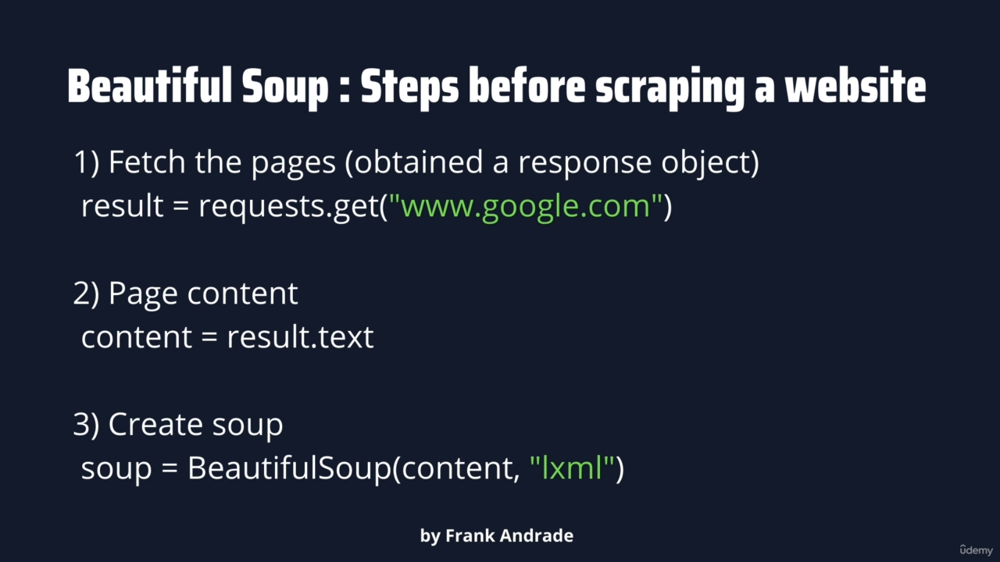

Unique Identity


Imports
```python
pip install bs4

pip install lxml

# send request to google
pip install request
```



```python 
print(soup.prettify())
```

Scrape the HTML Elements


```
https://subslikescript.com/movie/Titanic-120338
```


```python
# find the elements 
box = soup.find(id="id_tag_name")

box_2 = soup.find('article', class_="main_article")

box_3 = soup.find('article', class_="main_article")

box_4 = soup.find('h1')

# all the h2 element
# return list type
box_5 = soup.find_all("h2")
```

