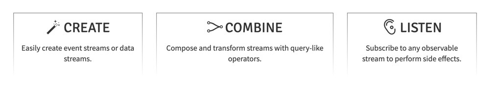
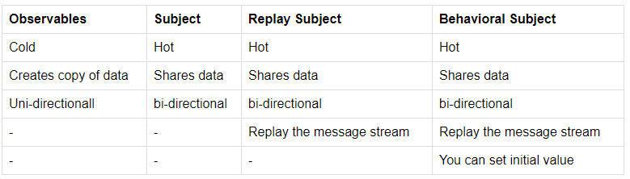

# Inhaltsverzeichnis

- [AJAX](https://wcc723.github.io/development/2020/10/01/about-ajax-2/)   

- [Inhaltsverzeichnis](#inhaltsverzeichnis)
  - [Git & Linux](#git--linux)
  - [Java&Spring & DesignPattern](#javaspring--designpattern)
  - [Mysql](#mysql)
  - [LeetCode](#leetcode)
  - [Typescript](#typescript)
    - [Methods](#methods)
    - [Basics](#basics)
  - [Kotlin](#kotlin)
  - [Angular](#angular)
    - [Basics](#basics-1)
    - [Bind data with Template, HTML and Component & CSS](#bind-data-with-template-html-and-component--css)
    - [Directive](#directive)
    - [Angular Reactive Forms](#angular-reactive-forms)
    - [Router](#router)
    - [Material](#material)
  - [RXJS](#rxjs)
    - [Create](#create)
    - [Combine](#combine)
  - [CSS && SASS](#css--sass)
    - [Cheat Sheet](#cheat-sheet)

## Java&Spring & DesignPattern

- [Java Methods mkyong](https://mkyong.com/)
- [Java](Java/README.md)
- [Spring](SpringNote/README.md)
- [Design Pattern Java](DesignPattern/README.md)

## Mysql

- [Database](database/README.md)

## LeetCode 
- [LeetCode Exercises](LeetCode/README.md)
## Typescript

[深入理解 TypeScript](https://jkchao.github.io/typescript-book-chinese/)

[What is `new() :T`](https://reurl.cc/O4Anb9)  
[Exercises](https://exercism.org/tracks/typescript/exercises)   
[Cheat Sheet](https://rmolinamir.github.io/typescript-cheatsheet/)   
[TypeScript: Static or Dynamic?](https://itnext.io/typescript-static-or-dynamic-64bceb50b93e)  
[Do ✅ and Don't ❌ ](https://www.typescriptlang.org/docs/handbook/declaration-files/do-s-and-don-ts.html)  
[DOM Manipulation](https://www.typescriptlang.org/docs/handbook/dom-manipulation.html)  

### Methods
[Utility Types](https://www.typescriptlang.org/docs/handbook/utility-types.html#thisparametertypetype)  
[Template Literal Types](https://www.typescriptlang.org/docs/handbook/2/template-literal-types.html)
[Typing objects](https://exploringjs.com/tackling-ts/ch_typing-objects.html)     

### Basics

Type inference : types can be determined from the context, making type annotations optional.  
Function Type expression : `functionName : ( parameters ) => returnType`

[Typescript Exercises](Typescript/exercises.md)

- [Typescript Instruction](Typescript/TypescriptIntroduction.md)
- [Iterators and Generators](Typescript/iter.md)
- [Enums](Typescript/enums.md)
- [typeof & keyof](Typescript/typeof.md)
- [What is the difference between type and class in Typescript?](Typescript/classVStype.md)
- [Dictionary](Typescript/dictionary.md)
- [Generics](Typescript/Generic.md) 
- [Types](Typescript/Types.md)
  - [Object Types/Interface](Typescript/Object%20Types.md)
  - [Tuple](Typescript/tuple.md)
  - [Special Types](Typescript/specialType.md) 
  - [Indexed Access Types](Typescript/indexedAccessTypes.md)
  - [Conditional Types](Typescript/conditionalType.md)
  - [Mapped Types](Typescript/mappedTypes.md)
  - [Template Literal Type](Typescript/templateLiteralType.md)
- [Function](Typescript/Function.md)
- [Class](Typescript/Class.md)
  - [Static](Typescript/static.md) 
  - **[this](Typescript/this.md)**
- [Module](Typescript/module.md)
- [NameSpace](Typescript/namespace.md)
## Kotlin
[](kotlin.md)
[Kotlin Cheat Sheet (IMAGE)](https://blog.kotlin-academy.com/kotlin-cheat-sheet-1137588c75a)
- [fun & return-type & when & varage & spread* & unit & block](kotlin/new.md)
- [Class](kotlin/class.md)
- [Kotlin & Java](Kotlin/kotlinAndJava.md)
## Angular

[Tutorial](https://www.tektutorialshub.com/angular-tutorial/#pipes)
### Basics

- [Install and Uninstall Angular](Angular/Install&UninstallAngular.md)  
- [Angular CLI](AngularCLI.md)  
  - [CLI command](https://blog.poychang.net/note-angular-cli/)    
  ```bash
  ng g component componentName --flat --module moduleName
  ng g directive directiveName
  ng g pipe pipeName
  ng g service serviceName
  ng g class className
  ng g interface interfaceName
  ng g enum enumName
  ng g module moduleName
  ng g guard guardName
  ng g app-shell [ --universal-app <universal-app-name>] [ --route <route>
  ```
- [Root Module and Root Component](ApplicationActs.md)  
- [Component](Angular/Component.md)  
- [Module](Angular/ngModule.md)  
- [Providers Array(DI)](Angular/DependencyInjection.md)
- [Life hooks](Angular/lifeHooks.md)
### Bind data with Template, HTML and Component & CSS 
- [DOM properties and HTML attributes](Angular/domPropHTMLattr.md) 
- [Template Reference Variable(`#`)](Angular/templateVariable.md)
- [Template expression operators](Angular/templateOperator.md)
- [Bind](Angular/Binding.md)
- [Two Way Binding (`[(ngMOdel)]`, `@input` and `@Output`)](Angular/TwoWayBinding.md)
  ```typescript
  <X [input] = "value" (EventFromX) = getEvent($Event)></X>
  ```
### Directive
- [Angular Directive](Angular/directive.md)
- [Custom Directive](Angular/customDirective.md)
- [ElementRef & TemplateRef & ViewRef & ViewContainerRef](Angular/ElementRef.md)
- [Renderer2(Proxy of ElementRef)](Angular/Renderer2.md)
- [HostBinding and HostListener](Angular/Host.md)       
- [ViewChild & contentChild & ng-content](Angular/viewChildAndcontentChild.md)
- [Structural Directives (`*`)](Angular/Structural%20Directives.md)
  - [`ng-content`](Angular/ngContent.md)
  - [`ng-template` with TemplateRef & ViewContainerRef & `ng-templateOutlet](Angular/ng-template.md)
  - [`ng-container`](Angular/ng-container.md)
### Angular Reactive Forms

- [Login Example](https://jasonwatmore.com/post/2020/07/18/angular-10-user-registration-and-login-example-tutorial)    
- [JWT](Angular/JWT.md)    
- **[ReactiveFormsModule](Angular/ReactiveFormsModule.md)** 
- **[Custom Form Validator](Angular/Validator.md)**
### Router

- **[Router](AngularRouter/Router.md)**   
- **[lazyAndPreload](AngularRouter/lazyAndPreload.md)**
- **[Route Guard](AngularRouter/Route_Guard.md)**  
- **[Router For Content](AngularRouter/RouterForContentLoading.md)** 

### Material 

- [button](Material/button.md)
- [scss material theme](materialTheme.md)
- [mat-progress](Material/matprogress.md)
- [mat-tab-group](Material/matTabGroup.md)
- [CDK](Material/cdk.md)
- [sidenav]
- [mat-list]
- [grid-list]
- [mat-card]
- [chip]
- [mat-expansion-panel]

## RXJS

`Reactive Programming = (Observer Pattern + Iterator pattern) + Functional Programming`   

- [Functional Programming](functionalProgram.md)    
- [Observable = Observer Pattern + Iterator pattern](https://ithelp.ithome.com.tw/articles/10186832)   

  

### Create 



- **[Observable & Observer](RXJS/Observable&Observer.md)**  

### Combine

- **[RXJS Operators](RXJS/RXJS_Operators.md)**
- [time](RXJS/delay.md)
- [filter](RXJS/filter.md)
- [Subject](RXJS/subject.md)
- [Error](RXJS/Error.md)
- **[AsyncPipe](RXJS/AsyncPipe.md)**
- **[behaviorSubject](RXJS/behaviorSubject.md)**
- [HttpClient.md](Angular/HttpClient.md)   
  ```typescript
  this.httpClient.get(BackendURL).pipe(
    tap( ... ),
    retry(...),
    catchError(...),
    finalize(... )
  )
  ```
- **[Interceptor](Angular/Interceptor.md)**  


## CSS && SASS
- [CSS PADDING AND MARGIN](SCSS/boxModel.md)
- [CSS BOARD/BOX SIZE](SCSS/board.md)
- [CSS Grid](SCSS/grid.md)
- [CSS FLEX vs Angular Flex-Layout](SCSS/flex.md)
- [SELECTORS](SCSS/selector.md)
- [Display](https://reurl.cc/V1Y8EY)
- [Z-index](https://kumo.tw/article.php?id=44)
- [重新認識 JavaScript: Day 15 隱藏在 "事件" 之中的秘密](https://ithelp.ithome.com.tw/articles/10192015)
- [收藏！40 个 CSS 布局技巧](https://zhuanlan.zhihu.com/p/192537705)
- [SCSS exercises](https://gist.github.com/fredsiika/2958726da1f94a9bd447f4f7bd03a852#use-if-and-else-to-add-logic-to-your-styles)
- [Sass / SCSS 預處理器 - @mixin 建立混入與 @include 載入混入](https://awdr74100.github.io/2020-05-30-scss-mixin-include/)
### Cheat Sheet
- [SCSS Notes](SCSS/scssUsage.md)
- [tailwind](https://nerdcave.com/tailwind-cheat-sheet)
- [CSS quickReview](https://reurl.cc/MN3RNL)  
- [SCSS Cheat Sheet](https://dev.to/finallynero/scss-cheatsheet-7g6)
