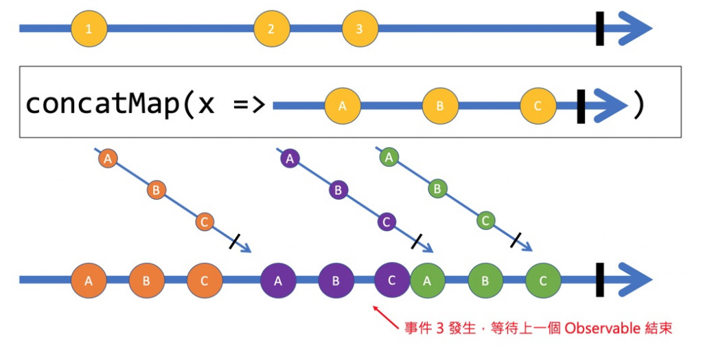
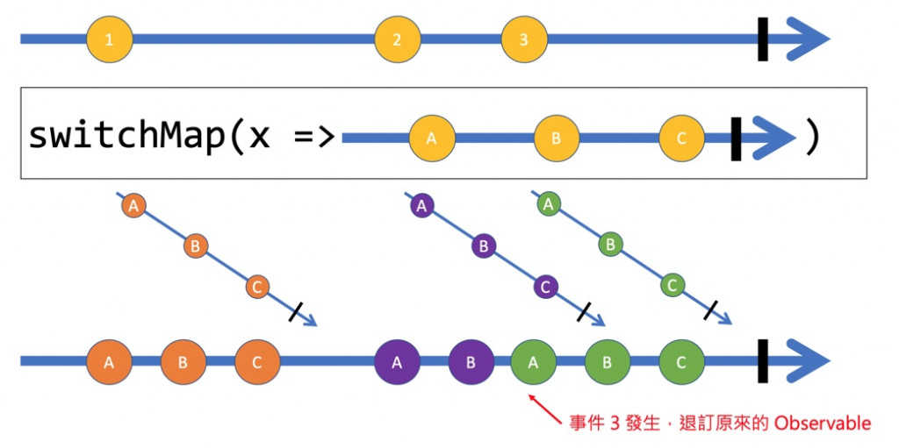
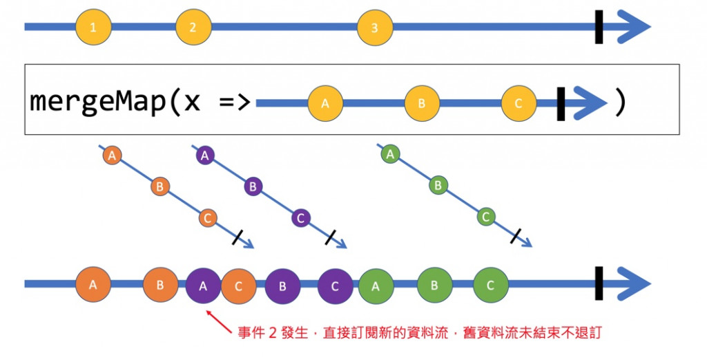
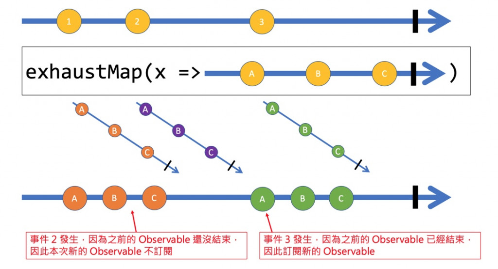
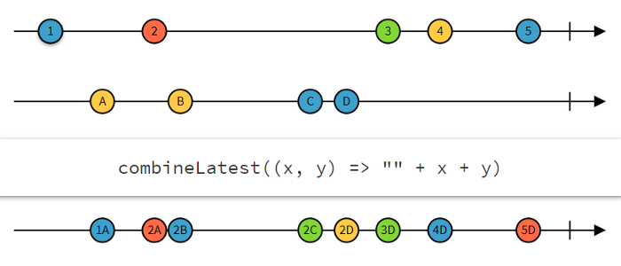

# RXJS operation


- [RXJS operation](#rxjs-operation)


References
- [RXJS examples](https://stackblitz.com/edit/angular-jk5usw-qb828e?file=src/app/chips-autocomplete-example.ts)   
- [angular university rxjs error handling](https://blog.angular-university.io/rxjs-error-handling/)   
- [RxJS 轉換類型 Operators (1) - map / scan / pairwise](https://ithelp.ithome.com.tw/articles/10248366)
- [希望是最淺顯易懂的 RxJS 教學](https://blog.techbridge.cc/2017/12/08/rxjs/)  
- **[learnrxjs.io](https://www.learnrxjs.io/)**       
- **[rxjs.dev](https://rxjs.dev/api/operators/)**  
- [[Angular 大師之路] Day 30 - 在 Angular 中應用 RxJS 的 operators (2) - 進階應用](https://ithelp.ithome.com.tw/articles/10209906)     
- [ReplaySubject](https://blog.angulartraining.com/how-to-cache-the-result-of-an-http-request-with-angular-f9aebd33ab3)  
- [Most Frequently Used RxJS Operators (with Use Cases)](https://javascript.plainenglish.io/most-frequently-used-rxjs-operators-with-use-cases-7645639317fc)  

## pipe 
**Use the `pipe()` function to make new operators**    
```typescript
// Without pipe()
// when operations convolved together and it becomes unreadable
op4()(op3()(op2()(op1()(obs))))

// pipe() makes operations easier to read
obs..pipe(
  op1(data =>{ ... }),
  op2(data =>{.... }),
  op3(data =>{.... }),
).subscribe( obs => {
  //...
}
```
## tap 

主要用來處理 side effect ，在使用各種 operators 時，我們應該盡量讓程式內不要發生 side effect，但真的有需要處理 side effect 時，可以使用 tap 把side effect和非 side effect隔離
- side effect : 影響最終結果

## first()

```typescript
// signUp.component.html
<form [formGroup]="signupForm" (ngSubmit)="onSubmit()">
  <button class="button" type="submit">Validate</button>
</form>

// signUp.component.ts
onSubmit() {
  this.userService // userService of type UserService
    .createUser(user)
    .pipe(
      // just filter the first
      // http response and show the toast once
      first()
    ).subscribe(
      () => this.toastr.success('Sign up', 'Congratulations, you are now a member!');
    );
}

// user.service.ts
@Injectable()
export class UserService {
  public createUser(user: UserModel) {
    return this.httpClient.post('your_create_user_url', user);
  }
}
```

## take(firstCountValues)

- [code](https://stackblitz.com/edit/xdidqm?devtoolsheight=50&file=index.ts)
- [skip / skipLast / skipUntil / skipWhile](https://ithelp.ithome.com.tw/articles/10250914)

Emits only the first count values emitted by the source Observable.

```typescript
|~1~|~1~|~1~|~1~|~1~|~1~|~1~|~1~| (time)
|---1---2---3---4---5---7---8---| (observable)
|-----------take(2)-------------| (Operator)
|---1---2---| 

const intervalCount = interval(1000);
const takeFive = intervalCount.pipe(first());  // same as pipe(take(1));
takeFive.subscribe((x) => console.log(x));
```
- Related :: `skip(firstCountValues)` skips the first count items emitted by the source Observable.

### takeLast(lastNValues)

```typescript
|--1--2--3--4--5--6--7--|
|--------takeLast(2)----|
|-----------------------6
|-----------------------7
```

### takeWhile((val) => condition)

```typescript 
const clicks = fromEvent<PointerEvent>(document, 'click');
const result = clicks.pipe(takeWhile(ev => ev.clientX > 200));
result.subscribe(x => console.log(x));
```

### takeUntil($event)

- [guide](https://rxjs.dev/api/index/function/takeUntil)

```typescript 
// Stop fetching the observable data when click event happens
const source = interval(1000);
const clicks = fromEvent(document, 'click'); // EVENT
const result = source.pipe(takeUntil(clicks));
result.subscribe(x => console.log(x));
```

UseCase : managing un-subscriptions in Angular components
```typescript
export class ExampleComponent implements OnInit, OnDestroy {
  
  destroy$: Subject<boolean> = new Subject<boolean>();
  
  ngOnInit(): void {
    observable1
      .pipe(takeUntil(this.destroy$))
      .subscribe(...);
    observable2
      .pipe(takeUntil(this.destroy$))
      .subscribe(...);
  }
  ngOnDestroy() {
    this.destroy$.next(true);
    this.destroy$.unsubscribe();
  }
}
```

## Creator Operator

Create Observable
- `from` ：使用array、Promise、Observable 等來源建立新的 Observable。
- `fromEvent` ：封裝 DOM 的 `addEventListener` 事件處理來建立 Observable。
- `fromEvenPattern` ：可依照自行定義的事件來建立 Observable。
- `of` ：Create a Observable.
- `EMPTY` ：Create a EMPTY subject/observable.
- `range` ：用一定範圍內的數值資料作為事件的資料。

Create Error
- `throwError` ：拋出錯誤。

Create Observable With Interval
- `interval` ：每隔指定的時間發出一次事件值。
- `timer` ：與 interval 相同，但可以設定起始的等待時間。
- `defer` ：用來延遲執行內部的 Observable。

- `iif`：依照第一個參數的條件，決定要使用不同的 Observable 資料流。
### of
```typescript
// `.next()` is called automatically for each data
of(1, 2, 3, 4).subscribe(
  data => console.log(data)
);
// 1
// 2
// 3
// 4
```

### toArray

**toArray 在來源 Observable 發生事件時，不會立即發生在新的 Observable 上，而是將資料暫存起來，當來源 Observable 結束時**，將這些資料組合成一個陣列發生在新的 Observable 上。

```typescript
interval(1000).pipe(
    take(3),
    toArray()
  ).subscribe(data => {
    console.log(`toArray 示範: ${data}`);
  });
// toArray 示範: 0,1,2 

---0---1---2|
toArray()
-----------([0, 1, 2]|)
```
### iff((val) => expr , then .. , else ...)

Depending the `data` to create `Subject/Observable`
```typescript
// (condition, true expression, false expression)
const emitHelloIfEven = (data) => {
  return iif(() => data % 2 === 0, of('Hello'), EMPTY);
};

emitOneIfEven(1).subscribe(data => console.log(data)); 
emitOneIfEven(2).subscribe(data => console.log(data)); // Hello
```

### throwError(error, ?scheduler)

- [Example](https://rxjs.dev/api/index/function/throwError)

```typescript 
throwError(errorFactory: () => any): Observable<never>
```

```typescript
let errorCount = 0;
 
const errorWithTimestamp$ = throwError(() => {
  const error: any = new Error(`This is error number ${ ++errorCount }`);
  error.timestamp = Date.now();
  return error;
});

/**
 * next : observable => ...
 * error : err =>  ..
 * complete : () => ...
 */
errorWithTimestamp$.subscribe({
  error: err => console.log(err.timestamp, err.message)
});
 
errorWithTimestamp$.subscribe({
  error: err => console.log(err.timestamp, err.message)
});
```

### from(`array[]` || `Observable<T>`)

Pass array as parameter 
```typescript
import { from } from 'rxjs';
from([1, 2, 3, 4]).subscribe(data => {
  // emit each element from array
  console.log(data);
});
// 1
// 2
// 3
// 4
```

Pass Observables as object
```typescript
from(of(1, 2, 3, 4)).subscribe(data => {
  console.log(data);
});
// 1
// 2
// 3
// 4
```

### range(start, end)

```typescript
function range(start, end) {
  for(let i = start; i <= end; ++i){
    yield i;
  }
}
```

```typescript
from(range(1, 4)).subscribe(data => {
  console.log(`from range observable: ${data}`);
});
// from range observable: 1
// from range observable: 2
// from range observable: 3
// from range observable: 4
```

### Promise

- [Promise](https://rexdainiel.gitbooks.io/typescript/content/docs/promise.html)
- [Chain of Responsibility](https://medium.com/bucketing/behavioral-patterns-chain-of-responsibility-pattern-81b27786758e)

搭配 `from` 將一個 Promise 物件建立為新的 Observable:
```typescript
// A promise observable
from(Promise.resolve(1)).subscribe(data => {
  console.log(`from promise observable: ${data}`);
});
//from promise observable: 1
```

- `.resolve(values)` : Promise Stream Content
- `.then` : Chain of Responsibility
```typescript
// create resolve
Promise.resolve(9527)
    .then((res) => {
        console.log(res); // 9527
        return 456;
    })
    .then((res) => {
        console.log(res); // 456
        return Promise.resolve(123);
    })
```

`Promise#reject` : Create Error
```typescript
Promise.reject(new Error('something bad happened'))
        .catch((err) => {
          console.log(err.message); // something bad happened
          return Promise.resolve(123);
        }
```

File Reader
```typescript
// new Promise((resolve, reject))
function readFileAsync(
  filename:string):Promise<any> {
    return new Promise((resolve,reject) =>
    {
        fs.readFile(filename,(err,result) => {
            if (err) reject(err);
            else resolve(result);
        });
    });
}
```

### fromEvent

- [guide](https://rxjs.dev/guide/overview)

`fromEvent` 能將(DOM)事件包裝成 `Observable`
```typescript
import { fromEvent, throttleTime, map, scan } from 'rxjs';

//        DOM     ,  eventName
fromEvent(document, 'click')
  .pipe(
    throttleTime(1000),
    map((event) => event.clientX),
    scan((count, clientX) => count + clientX, 0)
  )
  .subscribe((count) => console.log(count));
```

### fromEventPattern

- [guide](https://rxjs.dev/api/index/function/fromEventPattern)
fromEventPattern 可以根據自訂的邏輯解決複雜的監聽事件及退訂邏輯。
兩個參數：
- `addHandler`   ：當 subscribe 時，呼叫此方法決定如何處理事件邏輯
- `removeHandler`：當 unsubscribe 時，呼叫次方法將原來的事件邏輯取消

`addHandler` 和 `removeHandler` 都是一個 function，串入一個 `handler`(callback function) 物件，這個物件其實就是一個被用來呼叫的方法
```typescript
// 自訂subscribe以及unsubscribe function
const addClickHandler = (handler) => {
  console.log('fromEventPattern 示範: 自定義註冊滑鼠事件')
  document.addEventListener('click', event => handler(event));
}

const removeClickHandler = (handler) => {
  console.log('fromEventPattern 示範: 自定義取消滑鼠事件')
  document.removeEventListener('click', handler);
};

// 使用 fromEventPattern 傳入這兩個 function，來完成一個 Observable；
// 當訂閱 (subscribe) 產生時，會產生 handler 並呼叫 addClickHandler，
// 這裡面的程式則是註冊 document 的 click，
// 並在事件發生時呼叫 handler callback function。
const source$ = fromEventPattern(
  addClickHandler,
  removeClickHandler
);
  
const subscription = source$
  .subscribe(event => console.log('fromEventPattern 示範: 滑鼠事件發生了', event));

// 接著三秒後呼叫 unsubscribe 來取消訂閱，此時就會呼叫 removeClickHandler 處理取消事件監聽
setTimeout(() => {
  subscription.unsubscribe();
}, 3000);
```
##  fusionner/verschmelzen 

### concat/concatAll (串接EACH Observable)

(串接)Concatenate multiple observable streams into one with order
```typescript
concat(sourceA$, sourceB$, sourceC$)
  .subscribe(data => {
    console.log(data);
}); 

sourceA$: 1------2------|
sourceB$: 3------4------|
sourceC$: 5------6------|

// Subscribe new observable stream after the older one is finished
    sourceB$.subscribe    sourceC$.subscribe
            '              '
1------2----'-3------4-----'-5------6------|
            ^ End of       ^ End of 
              sourceA$       sourceB$
```


### merge && mergeAll (Merge Streams Parallel with Order)

**平行處理的概念**，每次轉換的 Observable stream都會直接訂閱，不會退訂上一次的 Observable，也不會等待上一次的 Observable stream結束才處理下一個Stream， 當 Observable 資料流有新事件(e.g `sourceA$`,`sourceB$`, `sourceC$`)，都會被轉換成整體資料流的事件

```typescript
3 sources emits at the same time (parallel)

streamA$: --A1--A2--A3--A4--A5--A6--....
streamB$: ----------B1----------B2--....
streamC$: ------------------C1------....

merge(sourceA$, sourceB$, sourceC$)
        
          ---A1--A2--(A3,B1)--A4--(A5,C1)--(A6,B2)----
```
- `(A3,B1)`, `(A5,C1)` 以及 `(A6,B2)` : 同時間不同Stream發生的Observables

### zip(zip Streams parallel without order)

```typescript 
streamA$: --A1--A2--A3--A4--............
streamB$:   ----B1  ----B2  ----B3--....
streamC$:     ------C1    ------C2    ------C3......

zip(sourceA$, sourceB$, sourceC$).subscribe(data => {
  console.log(data)
}); 

              ------**    ------**    ------**.......
                [A1,B1,C1]  [A2,B2,C2]  [A3,B3,C3]
```
- `A4` is there are no corresponding observable in `streamB$` and `streamC$`

### partition

```typescript 
source$:     -----1-----2-----3-----4-----5-----6-----|

[sourceEven$, sourceOdd$] = partition(source$, (data) => data % 2 === 0);

sourceEven$: -----------2----------4------------6-----|
sourceOdd$:  -----1------------3----------5-----------|


const source$ = of(1, 2, 3, 4, 5, 6);

// partition one observable stream via condition
const [sourceEven$, sourceOdd$] = partition(
  source$, 
  (data) => data % 2 === 0
);

// or using filter
const sourceEven$ = source$
  .pipe(filter(data => data % 2 === 0));
const sourceOdd$ =  source$
  .pipe(filter(data => data % 2 !== 0));

```

useCase : 登入登出狀態

```typescript
// 定時變更「登入」、「登出」狀態
// 實際上應該搭配 Subject 來控制
const isLogin$ = interval(1000).pipe(
  map((_, index) => index % 2 === 0)
);

const [login$, logout$] = partition(
  isLogin$, 
  (data) => data
);

login$.subscribe(() => console.log('我又登入囉！'));
logout$.subscribe(() => console.log('我又登出啦！'));
```

## 資料轉換

每次Event發生時進行轉換(transform new observable data)
```typescript
of(1, 2, 3, 4).pipe(
  map((value, index) => `第 ${index} 次事件資料為 ${value}`)
).subscribe(message => console.log(`map 示範 (2): ${message}`));
// map 示範 (2): 第 0 次事件資料為 1
// map 示範 (2): 第 1 次事件資料為 2
// map 示範 (2): 第 2 次事件資料為 3
// map 示範 (2): 第 3 次事件資料為 4
```

```typescript
const studentScore = [
  { name: '小明', score: 100 },
  { name: '小王', score: 49 },
  { name: '小李', score: 30 }
];

of(...studentScore).pipe(
  // 專注處理開根號邏輯
  map(student => ({...student, newScore: Math.sqrt(student.score)})),
  // 專注處理乘以十邏輯
  map(student => ({...student, newScore: student.newScore * 10})),
  // 專注處理取整數
  map(student => ({...student, newScore: Math.ceil(student.newScore)})),
  // 專注處理判斷是否及格
  map(student => ({...student, pass: student.newScore >= 60}))
).subscribe(student => {
  // 轉著處理如何顯示
  console.log(
    `map 示範 (3): ${student.name} 成績為 ${student.newScore} (${student.pass ? '及格': '不及格'})`);
});
```

### switch/switchAll()

unsubscribe the older observable steam and subscribe the observable stream when the new one is emitted

```typescript
                   +           *     &
click: ------------c-----------c-----c--..
                    \           \     \
                     \           \     0----1----2----3-|
                      \            0----1----2----3-|
                       0----1----2----3-|

switchAll()            
                       +           *   &     
result: ---------------0----1----2-0---0----1----2----3-|

const clicks = fromEvent(document, 'click').pipe(tap(() => console.log('click')));
const source = clicks.pipe(map(() => interval(1000)));
 
source
  .pipe(switchAll())
  .subscribe(x => console.log(x));
 
// Output
// click
// 0
// 1
// 2
// click
// 0
// click
// 0
// 1
// 2
// 3
// ...
```

### concatMap (串接+Map)

有序的處裡Observable Stream，每個Observable Stream都得等到上一個Observable Stream結束才會被訂閱

  

### SwitchMap (轉換+Map)

1. `switchMap()`可以在收到`observable`時，轉換成另外一個`observable`，   
2. `switchMap()`用於有**順序必要的巢狀式**`subscribe()`

   
- Returns an Observable that emits items based on applying a function that you supply to each item emitted by the source Observable(`1-2-3`), where that function (`x=>A-B-C`) returns an (so-called "inner") Observable. 
```typescript 
interval(3000).pipe(
  switchMap(() => timer(0, 1000))
).subscribe(data => {
  console.log(data);
});
// 0
// 1
// 2
// 0 (新事件發生，UNSUBSCRIBE上一個 Observable)
// 1
// 2
// ...


                // Source Observable
const switched = of(1, 2, 3).pipe(
              // Inner Observable
              switchMap(x => of(x, x ** 2, x ** 3))
);

switched.subscribe(x => console.log(x));

// outputs
// 1
// 1
// 1
// 2
// 4
// 8
// 3
// 9
// 27
```
- **When a new inner Observable is emitted, `switchMap` stops emitting items from the earlier-emitted inner Observable and begins emitting items from the new one.**   
  It continues to behave like this for subsequent inner Observables.
- For the case to get the latest data we can use `switchMap`

利用`switchMap`簡化前後端巢狀式資料交換


沒有switchMap的情況下的巢狀式subscribe
```typescript
constructor(private route: ActivatedRoute, 
            private httpClient: HttpClient){ 
              //...        
}
ngOnInit() {
  this.route.params.subscribe(
    params => {
        this.httpClient.get(`.../post/${params['id']}`).subscribe
        (
            post => {
                this.post = post;
            }
        )
  });
}
```

利用`switchMap()`來簡化上面的Code Snippet
```typescript
this.route.params.pipe(
  switchMap(params => this.httpClient.get(`.../post/${params['id']}`))
)
```

如果有一系列的轉換，且資料都要保存起來需再額外透過`map()`
```typescript 
this.postData$ = this.route.params.pipe(
  switchMap(params => 
    this.httpClient.get(`.../post/${params['id']}`).pipe(
      map(post => (
        { id: params['id'], post: post }
      ))
    )
  ),
  switchMap(post => this.httpClient
    .get(`.../comments/${post.id}`).pipe(
      map(comments => Object.assign(post, { comments: comments }))
  ))
)
```
- `switchMap` cancels previous HTTP requests that are still in progress, while `mergeMap` lets them finish.

### mergeMap (Parallel + Map)

Unlike switchMap, mergeMap parallel process the Observable event
  

### exhaustMap

It wont subscribe new emitted event if old one haven't finished
  

## combineLatest (combine每筆source的最後一筆)

當取得的`Observable`s有順序時,利用`switchMap`，而當沒有順序時，**希望平行的處理這些無序的Observables**，且當所有Observables有資料後才進行後續處理，這時候就可以使用`combineLatest`來同時取得資料。

  
```bash
----1------2----------------3---4--5
------A------B-------C--D-----------
      |    | |       |  |   |   |  |
-----1A---2A2B------2C--2D--3D--4D-5D
```


```typescript
observables stream
sourceA$: --A1--A2--A3        --A4        --A5......           
sourceB$:   ----B1            --B2        ....
sourceC$:     ------C1                          

zip(sourceA$, sourceB$, sourceC$)
              ------**        --**        --**.......
                [A3,B1,C1]  [A4,B1,C1]  
                            [A4,B2,C1] (兩個來源 Observable 同時發生事件)
```

假設有兩個Observables stream(`posts$`跟`tag$`)利用`combineLatest`各別接收
```typescript
const posts$ = this.httpClient.get('.../posts');
const tags$ = this.httpClient.get('.../tags');

this.data$ = combineLatest(posts$, tags$).pipe(
  map(([posts, tags]) => ({posts: posts, tags: tags}))
)
```

利用`combineLatest`各種事件最終得到結果，例如一個包含搜尋、排序和分頁的資料，我們可以將搜尋、排序和分頁都設計成單一個 observable，在使用`combineLatest`產生搜尋結果
```typescript
this.products$ = combineLatest(
  this.filterChange$, // observable stream 1 
  this.sortChange$,   // observable stream 2
  this.pageChange$    // observable stream 3
).pipe(
  exhaustMap(([keyword, sort, page]) => this.httpClient
    	.get(`.../products/?keyword=${keyword}&sort=${sort}&page=${page}`)
  )
);
```

```typescript
// products.component.html: text filters
<input type="text" id="category-filter" (input)="onCategoryFilterChange($event.target.value)">
<input type="text" id="country-filter" (input)="onCountryFilterChange($event.target.value)">

// products.component.ts
export class ProductsComponent implements OnInit {

  // behavior subjects are observables that return the last values of the filters
  private categoryFilterChangedSubject$ = new BehaviorSubject<string>(null);
  private countryFilterChangedSubject$ = new BehaviorSubject<string>(null);

  constructor(private productService: ProductService) { }

  ngOnInit(): void {
    combineLatest([
      this.productService.getProducts(),
      this.categoryFilterChangedSubject$,
      this.countryFilterChangedSubject$
      //          observable from each stream 
    ]).subscribe(([products, selectedCategory, selectedCountry]) => {
      products.filter(product =>
        product.category === selectedCategory && product.country === selectedCountry);
    });
  }

  // bind to the category-filter text input
  onCategoryFilterChange(category: string) {
    this.categoryFilterChangedSubject$.next(category);
  }

  // bind to the country-filter text input
  onCountryFilterChange(country: string) {
    this.countryFilterChangedSubject$.next(country);
  }
}

// product.service.ts
@Injectable()
export class ProductService {
  constructor(private httpClient: HttpClient) { }
  public getProducts(): Observable<IProductModel[]> {
    return this.httpClient.get<IProductModel[]>('your_get_products_url');
  }
}
    
// ProductModel.ts
export interface IProductModel {
    id: number;
    label: number;
    category: string;
    country: string;
}
```


## ~~startWith (initialize observable)~~

- [`startwith`](https://stackoverflow.com/questions/48465361/what-does-startwith-typescript-code-do)    

在使用 `combineLatest` 時，會在 `combineLatest` 內每個 `observable` 都有資料時才會最終取得新的結果，若是以剛才討論的搜尋程式，希望在程式一開始就給空的資料來產生搜尋結果時，就可以使用 `startWith` 來確保 `observable` 可以有起始的資料：
```typescript
this.products$ = combineLatest(
  this.filterChange$.pipe(startWith('')),
  this.sortChange$.pipe(startWith({})),
  this.pageChange$.pipe(startWith({}))
)
.pipe(
  exhaustMap(([keyword, sort, page]) =>
    this.httpClient
      .post(`.../products`, { keyword: keyword, sort: sort, page: page}))
);
```

## forkJoin

`forkJoin` 與 `combineLatest` 類似，差別在於 `combineLatest` 在 RxJS 整個資料流有資料變更時都會發生(平行處理)，而 `forkJoin` 會在所有 Streams 都完成後，才會取得每個Stream上的最終的結果(最後一個Observable)，所以對於多個Http Requests 的整合，我們可以直接使用 `forkJoin` 因為 a每一個 Http Request 只會發生一次。

- forkJoin is an operator that takes any number of input observables which can be passed either as an array or a dictionary of input observables.    
**If no input observables are provided (e.g. an empty array is passed), then the resulting stream will complete immediately.**


- **forkJoin will wait for all passed observables to emit and complete and then it will emit an array or an object with last values from corresponding observables.**

```typescript
streamA$: --A1--A2--A3--A4--A5|
streamB$: ----B1  ----B2  ----B3|
streamC$:     ------C1    ------C2    ------C3|

forkJoin(streamA$, streamB$, streamC$)
              ------      ------      ------**|
                                        [A5,B3,C3]


foo : --1--2--3--4|
bar : ------------8|
baz : --------------5|
// observable with dictionary
const observable = forkJoin({
  foo: of(1, 2, 3, 4),  // 4 
  bar: Promise.resolve(8), // 8
  baz: timer(4000) // 4
});
observable.subscribe({
  next: value => console.log(value),
  complete: () => console.log('This is how it ends!'),
});

// Logs:
// { foo: 4, bar: 8, baz: 0 } after 4 seconds
// 'This is how it ends!' immediately after

const observable = forkJoin([
  of(1, 2, 3, 4),
  Promise.resolve(8),
  timer(4000)
]);
observable.subscribe({
 next: value => console.log(value),
 complete: () => console.log('This is how it ends!'),
});
 
// Logs:
// [4, 8, 0] after 4 seconds
// 'This is how it ends!' immediately after
```

```typescript
const posts$ = this.httpClient.get('.../posts');
const tags$ = this.httpClient.get('.../tags');
this.data$ = forkJoin(posts$, tags$).pipe(
  map(([posts, tags]) => ({posts: posts, tags: tags}))
)
```

## aggregation (min max count reduce)

- [RxJS 數學/聚合類型 Operators (1) - min / max / count / reduce)[https://ithelp.ithome.com.tw/articles/10252416]

```typescript
of(5, 1, 9, 8).pipe(
  count()) // max , min , count , reduce
  .subscribe(data => {
    // ...
  });
```

### scan(acc,val) vs reduce(acc,val)

scan : 每次return一個Observable結果
```typescript
(100      500      300      250|)
scan((acc, value) => acc + value, 0)
(100      600      900     1150|)

const donateAmount = [100, 500, 300, 250];
// create a new observable each time scan is called 
const accumDonate$ = of(...donateAmount).pipe(
  scan((acc, value) => 
  acc + value, // accumulate
  0 // initial val
  )
);
```

reduce : return最後結果
```typescript
const accumDonate$ = of(...donateAmount).pipe(
  reduce(
    (acc, value) => acc + value, // accumulate
    0 // initial
  )
);
// only one observable is created
(100      500      300      250|)
reduce((acc, value) => acc + value, 0)
(                          1150|)
```

