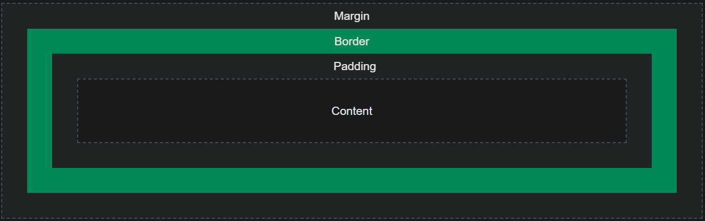

# box model 

  
Content - The content of the box, where text and images appear   
Padding(**transparent**) - Clears an area around the content.  
Border - A border that goes around the padding and content  
Margin(**transparent**)- Clears an area outside the border.   


Margin & Padding 
```java
Container
+-----------------------+
|            +------+   |
|<-- left -- |      |   |
|            +------+   |
+-----------------------+
```

## Parameter (Shorthand Property)

```scss
padding|margin : top , right , bottom, left

// or
[padding|margin]-top
[padding|margin]-right
[padding|margin]-bottom
[padding|margin]-left
```

property has three values : `top, right , bottom`
property has two values : `top, right`
property has one values : all four sides

## margin special parameter

### `auto`

```html
<style>
div {
  width: 300px;
  margin: auto;
  border: 1px solid red;
}
</style>

<div>
This div will be horizontally centered because it has margin: auto;
</div>
```

### `inherit`

to inherit value from from father

```html
<style>
div {
  border: 1px solid red;
  margin-left: 100px;
}

p.ex1 {
  margin-left: inherit;
}
</style>

<div>
	<p class="ex1">This paragraph has an inherited left margin (from the div element).</p>
</div>
```
