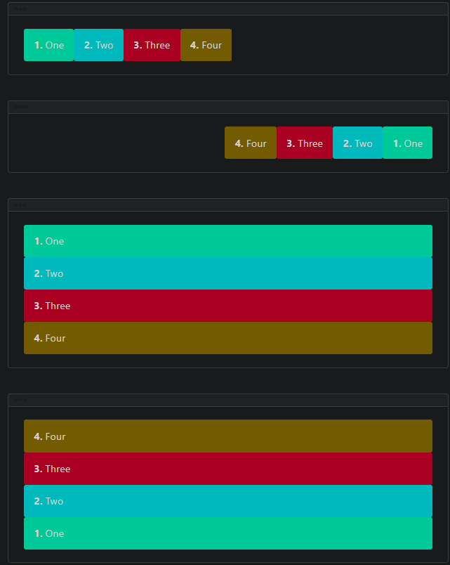
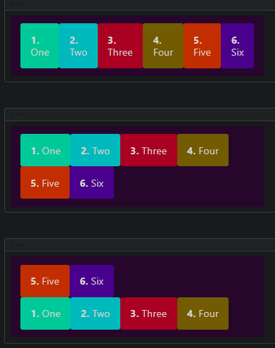
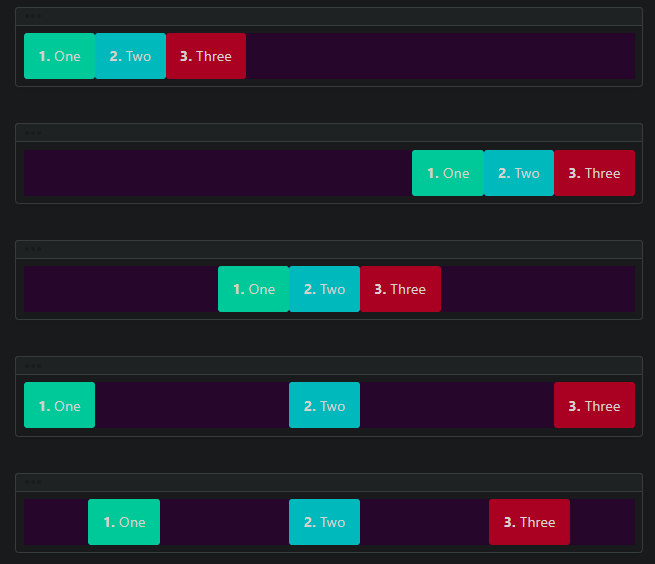
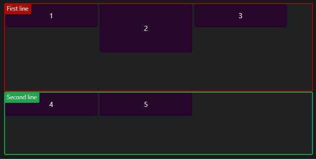
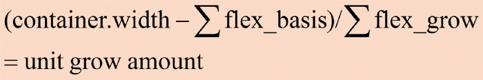
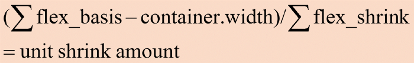

# Flex

[CSS FLEXBOX — 伸縮自如的排版|基礎觀念](https://reurl.cc/AORWkK)    
[Day 5 : HTML - 網頁排版超強神器，CSS Flex到底是什麼？](https://reurl.cc/8pDq37)      


- [Flex](#flex)
  - [CSS container `display : flex`](#css-container-display--flex)
    - [container's flex-direction](#containers-flex-direction)
    - [container's flex-wrap](#containers-flex-wrap)
    - [container's flex-flow](#containers-flex-flow)
    - [container's justify-content (x-axis)](#containers-justify-content-x-axis)
    - [container's align-item (y-axis)](#containers-align-item-y-axis)
    - [container's align-content](#containers-align-content)
    - [item's align-self (y-axis)](#items-align-self-y-axis)
    - [flex](#flex-1)
    - [flex-grow & flex-shrink](#flex-grow--flex-shrink)
      - [Grow](#grow)
      - [Shrink](#shrink)
  - [Angular](#angular)
    - [angular flex-layout](#angular-flex-layout)
    - [Controls Items In Container](#controls-items-in-container)
      - [fxLayout and fxLayoutAlign](#fxlayout-and-fxlayoutalign)
    - [dir and fxLayoutGap](#dir-and-fxlayoutgap)
    - [Control Items within Containers (`fxFlex`-)](#control-items-within-containers-fxflex-)
  - [special responsive features](#special-responsive-features)

## CSS container `display : flex`
[flex help](https://flexbox.help/)   
[w3 flex-box](https://www.w3schools.com/css/css3_flexbox_container.asp)   

elements in container
```css
.container{
  display : flex;
}
```
```html
<div id="container" class="flex-container">
  <div id="item1">1</div>
  <div id="item2">2</div>
  <div id="item3">3</div>  
</div>
```

- `flex-wrap`: whether items wrap to the next row (**only applies if combined width of items is greater than container's**)   
- `justify-content` : alignment along the x axis       
- `align-items` : alignment along the y axis(單列items)     
- `align-content` :only applies if there is more than one row of items (Item以Row為單位)  
- `align-self` : 對單一特定item進行(Y-axis)    


### container's flex-direction

Defines how flexbox items are ordered within a flexbox container.
```css
flex-direction:row | row-reverse | column | column-reverse;
```
  

### container's flex-wrap

自動換行
```css
.container{
  flex-wrap:nowrap | wrap | wrap-reverse;
}
```
  


### container's flex-flow

The flex-flow property is a shorthand property for: `flex-direction` and `flex-wrap`

```css
.flex_container {
  flex-direction:column;
  flex-wrap:wrap;
}
.flex_container {
  flex-flow:column wrap;
}
```

### container's justify-content (x-axis)

  

Defines how flexbox/grid items are aligned according to the **main axis**, within a flexbox/grid container.


```css
.flex_container {
    justify-content:flex-start | flex-end | center | space-between | space-around | space-evenly;
}
```
### container's align-item (y-axis)

align-item : each item in the container (y-axis)

```css
.flex_container {
    align-items:stretch | flex-start | flex-end | center | baseline;
}
```

### container's align-content

- [With Images](https://cssreference.io/flexbox/)

align-content each line in the container
```css
.flex_container {
  flex-wrap:wrap;　/*flex-wrap property is needed*/
  align-content:stretch | flex-start | flex-end | center | space-around | space-between | space-evenly;
}
```

  


### item's align-self (y-axis)

align-self (y-axis)
```css
.item{
  /** height property is forbidden **/
  align-self : stretch | flex-start | flex-end | center |baseline;
}
```

### flex 

- [](https://www.w3cplus.com/css3/flexbox-layout-and-calculation.html)

The flex property is a shorthand property for: `flex-grow `, `flex-shrink` and `flex-basis`

`flex-basis` : Same as `width`, and has higher priority than `width`, `auto` by default, 

```css
/**
  * item's width will be 50px not 100px
  */
.item{
  Flex-basis:50px;
  width : 100px;
}
```

### flex-grow & flex-shrink

`flex-grow` :	A number specifying how much the item will grow relative to the rest of the flexible items
`flex-shrink` : A number specifying how much the item will shrink relative to the rest of the flexible items
- [examples](https://ithelp.ithome.com.tw/articles/10227188)

#### Grow
  
```html
Container's width : 600px
Each Item's width : 100px
Total Items : 4
4 Items' flex-grow are 1, 2, 3, 4
```

via formula
```html
600–100*4/10=20px
```
Each Items grow
```html
100 + 20px, 100 + 40px, 100 + 60px, 100 + 80px
```
#### Shrink
  

## Angular

### angular flex-layout

- [使用 Angular Flex-Layout 輔助版面布局](https://blog.poychang.net/use-angular-flex-layout-package/)
- [Containers](https://tburleson-layouts-demos.firebaseapp.com/#/docs)
- [Example](https://jonny-huang.github.io/angular/training/08_angular_ui-flex_layout/)

HTML API 可以分出以下三類：
1. 容器類 Container
2. 子元素類 Items (Child Elements Within Container)
3. 特殊響應功能 Special Responsive Features

### Controls Items In Container

#### fxLayout and fxLayoutAlign

```html
          <!-- item排列方式-->
<div fxLayout="row | column">
                  
<!-- fxLayoutAlign= x-axis y-axis-->
<div fxLayoutAlign="x-axis y-axis"></div>
```
x-axis : `space-evenly | space-around | space-between | center | start | end`
y-axis : `start | end | center | stretch`


### dir and fxLayoutGap

```html
<!-- 
  order of items
  right to left | left to right   
-->
<div dir = "rtl | ltl">

<!-- each item's gap -->
<div fxLayoutGap = "20px">
```

### Control Items within Containers (`fxFlex`-)

`fxFlex` controls item size
```html
<!--         grow shrink basis-->
<div fxFlex="1    2      calc(15em + 20px)"></div>
```
- unit : `%、px、vw、vh`

`fxFlexOrder` : order of each item
```html
<div fxFlexOrder="2">
  fxFlexOrder = int number
</div>
```  

`fxFlexOffset` offset of item  
```html
<div fxFlexOffset="% | px | vw | vh"></div>
```

`fxFlexAlign` (對應grid's `align-self`) : Align specific item
```html
<div fxFlexAlign="start | baseline | center | end "></div>
```

`fxFlexFill` : stretch each item's width and height 100%
```html
 `<div fxFlexFill></div>`
```

## special responsive features 

xs : **E**xtra**S**mall 
sm : **SM**all 
md : **M**e**D**ium 
lg : **L**ar**G**e 
xl : **E**xtra **L**arge 

```typescript
xs	width < 600px
sm	600px <= width < 960px
md	960px <= width < 1279px
lg	1280px <= width < 1919px
xl	1920px <= width < 5000px
```

lt : less than
gt : great than
```typescript
lt-sm	width < 600px
lt-md	width < 960px
lt-lg	width < 1280px
lt-xl	width < 1920px

gt-xs	width >= 600px 
gt-sm	width >= 960px
gt-md	width >= 1280px
gt-lg	width >= 1920px
```