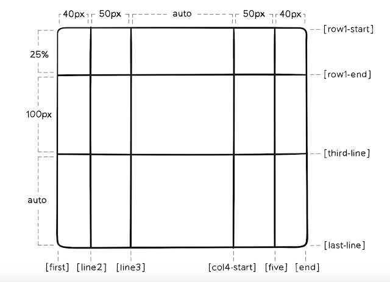
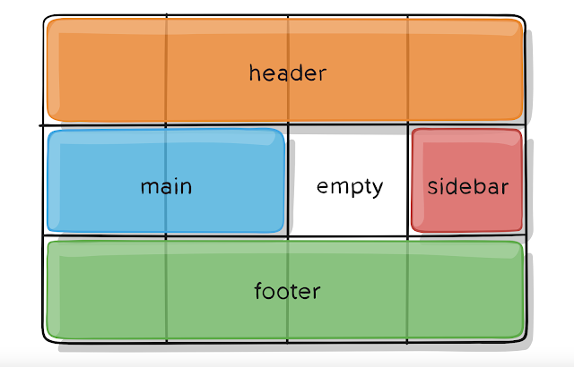

# Grid 

[Css Grid 概念介紹及使用教學](https://ballaediworkshop.blogspot.com/2019/10/css-grid-introduction-and-tutorial.html)   
[Angular Grid](https://hychen39.github.io/angular/2021/01/13/u13_rwd_layout.html#%E5%AF%A6%E4%BD%9C-1-%E4%BD%BF%E7%94%A8-grid-directive-%E8%A3%BD%E4%BD%9C-rwd-%E7%89%88%E9%9D%A2)

- [Grid](#grid)
  - [Angular Grid And Css Grid](#angular-grid-and-css-grid)
  - [container](#container)
    - [`gird-template-columns` & `grid-template-rows`](#gird-template-columns--grid-template-rows)
    - [Alias name for each line](#alias-name-for-each-line)
    - [`reapeat(num, line)`](#reapeatnum-line)
  - [Item](#item)
    - [`grid-column|row-start|end`](#grid-columnrow-startend)
    - [`grid-column|row : 起點/終點`](#grid-columnrow--起點終點)
    - [`grid-column|row : x/ x+1`](#grid-columnrow--x-x1)
    - [`grid-column|row : line alias name / line alias name`](#grid-columnrow--line-alias-name--line-alias-name)
    - [`grid-column|row 往左或往上span x/ 往右或下span y`](#grid-columnrow-往左或往上span-x-往右或下span-y)
  - [Grid Area](#grid-area)
    - [Container's `grid-template-areas`](#containers-grid-template-areas)
    - [Item's `grid-area`](#items-grid-area)
    - [Name Item's grid area via Container's `grid-template-areas`](#name-items-grid-area-via-containers-grid-template-areas)
    - [Angular](#angular)
  - [Align](#align)
    - [grid-gap](#grid-gap)
    - [justify|align|place-items|self](#justifyalignplace-itemsself)
    - [justify-items AND justify-self (x-axis)](#justify-items-and-justify-self-x-axis)
    - [align-self & align-items (y-axis)](#align-self--align-items-y-axis)
    - [place](#place)
    - [justify-content, align-content AND place-content](#justify-content-align-content-and-place-content)

Css Grid 的組成，一個 Grid 有兩個部分： Container and Item
Container is formed by each grid's lines (`grid-template-columns|rows`)， Item is formed by line btw line (`grid-column|row-start|end`)
```html
<div class="container">
    <div class="item-a">A</div>
    <div class="item-b">B</div>
    <div class="item-c">C</div>
</div>
```
  


## Angular Grid And Css Grid

| Grid Directive   | CSS Property(s)                           | Extra Inputs               |
| ---------------- |:-----------------------------------------:| --------------------------:|
| `gdAlignColumns` | `align-content` and `align-items`         | `gdInline` for inline-grid |
| `gdAlignRows`    | `justify-content` and `justify-items`     | `gdInline` for inline-grid |
| `gdArea`         | `grid-area`                               | none                       |
| `gdAreas`        | `grid-areas`                              | `gdInline` for inline-grid |
| `gdAuto`         | `grid-auto-flow`                          | `gdInline` for inline-grid |
| `gdColumn`       | `grid-column`                             | none                       |
| `gdColumns`      | `grid-template-columns`                   | `gdInline` for inline-grid<br>`!` at the end means `grid-auto-columns` |
| `gdGap`          | `grid-gap`                                | `gdInline` for inline-grid |
| `gdGridAlign`    | `justify-self` and `align-self`           | none                       |
| `gdRow`          | `grid-row`                                | none                       |
| `gdRows`         | `grid-template-rows`                      | `gdInline` for inline-grid<br>`!` at the end means `grid-auto-rows`  |

## container

container的設定`grid-template-`開頭
### `gird-template-columns` & `grid-template-rows`

設定Container內的每個grid的分界線
```css
grid-template-columns: 40px 50px auto 50px 40px;
grid-template-rows: 25% 100px auto;
```

### Alias name for each line
```css
grid-template-columns: [first] 40px [line2] 50px [line3] auto [col4-start] 50px [five] 40px [end];
grid-template-rows: [row1-start] 25% [row1-end] 100px [third-line] auto [last-line];
```

### `reapeat(num, line)`

```css
/* 20px [col-start] 20px [col-start] 20px [col-start] */
grid-template-columns: repeat(3, 20px [col-start]);

/* (col-start的第2條) */
grid-column-start: col-start 2;
```
## Item 

Form Item via Grid Line
  

### `grid-column|row-start|end`
```css
.item{
  grid-column-start: 2; (2nd line)
  grid-column-end:  5; (5th line)
  grid-row-start: 1; (1st line)
  grid-row-end: 3; (3rd line)
}
```

### `grid-column|row : 起點/終點`
```css
.container{
  grid-column: 2 / 5;    /* (<startLine> / <endLine>) */
  grid-row: 1 / 3;    /* (<startLine> / <endLine>) */
}
```

### `grid-column|row : x/ x+1`
```css
grid-column : 2   /*  相當於 2 / 3  */
```

### `grid-column|row : line alias name / line alias name`
```css
grid-column: line2 / five;
grid-row: row1-start / third-line;
```

### `grid-column|row 往左或往上span x/ 往右或下span y` 
```css
/*
 * grid-column 或 grid-row : span startLine , span endLine語法
 * span startLine 會往前一條(startLine - 1) 往左或上擴張
 * span endLine會往後一條(endLine + 1) 往右或下
 */
grid-column: span 3 / span 4;
/*          
    == 2 / 5        
    == span line3 / span col4-start
    == line2 / five    
*/
```

## Grid Area
### Container's `grid-template-areas`
```css
.container{
  grid-template-areas: "<grid-ara-name>" | "." | none 
}
```
- `.` : empty Area
- `none` : undefine Area


### Item's `grid-area`

The `grid-area` property can be used as a shorthand property for (the grid line) `grid-row-start`, `grid-column-start`, `grid-row-end `and the `grid-column-end` properties.
`row起點/column起點/row終點/column終點`

```css
.itemA{
  grid-area: 1 / col4-start / last-line / 6;
}
.itemB{
  grid-area: 2 / 1 / span 2 / span 3;
}
```

### Name Item's grid area via Container's `grid-template-areas`

  

container 設定每個Grid內規定的Header
```css
.container{
 grid-template-areas:
    "header header header header"
    "main   main   .      sidebar"
    "footer footer footer footer";
}
```

item 只需設定 container 設定好的名字
```css
.iteamA{grid-area: header;}
.iteamB{grid-area: main;}
.iteamC{grid-area: sidebar;}
.iteamD{grid-area: footer;}
```

<!DOCTYPE html>
<html>
<style>
.containerA {
  gap: 10px;
  background-color: #2196F3;
  padding: 10px;
  display: grid;
  grid-template-columns: 40px 50px auto 50px 40px;
  grid-template-rows: 25% 100px auto;
  grid-template-areas:
    "header header header header"
    "main main . sidebar"
    "footer footer footer footer";
}
.containerA > div {
  background-color: rgba(255, 255, 255, 0.8);
  text-align: center;
  padding: 20px 0;
  font-size: 30px;
}
.itemA1{
  grid-area: header;
}
.itemA2{
  grid-area: main;
  width:300px;
}
.itemA3{
  grid-area: sidebar;
}
.itemA4{grid-area: footer;}
</style>
<head>
<content>Example</content>
</head>
<body>
<div class="containerA">
   <div class="itemA1">1</div>
   <div class="itemA2">2</div>
   <div class="itemA3">3</div>
   <div class="itemA4">4</div>
</div>
<br>
</body>
</html>

**在 Area 中，被分配的 item 不能是分段的或是非長方形**


### Angular

`gd`: grid

```html
<div id='gridContainer' gdAreas="header header header | sidebar content sidebar1 | footer footer footer"
    gdColumn="20% auto 20%" gdGap="1rem">

    <div class='blocks header' gdArea='header'>Header</div>
    <div class='blocks sidebar' gdArea='sidebar'>Sidebar (20% of width)</div>
    <div class='blocks content' gdArea='content'> Content (Auto width)
        <p>
            More content than we had before so this column is now quite tall.
        </p>
    </div>
    <div class='blocks sidebar1' gdArea='sidebar1'>Sidebar 2 (20% of width) </div>
    <div class='blocks footer' gdArea='footer'>Footer</div>
</div>
```

## Align 

### grid-gap 

Each Item's gap in Container
```scss
.container{
  grid-column-gap: 10px
  grid-row-gap: 15px

  grid-gap   : 15px /** row **/  10px  /** column **/ ; 
}
```

### justify|align|place-items|self

`justify|align|place-items` 利用 container 一次設定所有 items
```css
.container{
  justify-items: start | end | center | strech
  align-items: start | end | center | strech
  place-items: start | end | center | strech
}
```

`justify|align|place-self`: 特定item 個別設定的對齊方式
```css
.item{
  justify-self: start | end | center | strech
  align-self: start | end | center | strech
  place-self:  start | end | center | strech
}
```

### justify-items AND justify-self (x-axis)

**item的height 100% (上下填滿)**

```css
.container{
  justify-items : start  ;  /** 最左邊 **/
  justify-items : end    ;  /** 最右邊 **/
  justify-items : center ; 
  justify-items : stretch;  /** default**/ 
}
.item{
  justify-self: start  ;
  justify-self: end    ;
  justify-self: center ;
  justify-self: stretch; /** default **/
}
```

### align-self & align-items (y-axis)

**item的width 100%（左右填滿)**

```css
.container{
  align-items|self : start  ; 
  align-items|self : end    ;
  align-items|self : center ;
  align-items|self : stretch;  /** default **/
}
.item{
  align-self: start  ;
  align-self: end    ;
  align-self: center ;
  align-self: stretch;
}
```


### place

同時調整單justify以及align
```scss
/*  place-items : <align-items> / <justify-items>  */
.item{
  place-self: center stretch;
}
.container{
  place-items: center center;
  // same as
  place-items: center;
}
```

### justify-content, align-content AND place-content

grid-template-area為單位做調整
```css
.container{
  justify-content : space-evenly | space-between | space-around | stretch | center | start | end;
  align-content : space-evenly | space-between | space-around | stretch | center | start | end;
  
  place-content : space-evenly | space-between | space-around | stretch | center | start | end / 
  space-evenly | space-between | space-around | stretch | center | start | end;
}
```

