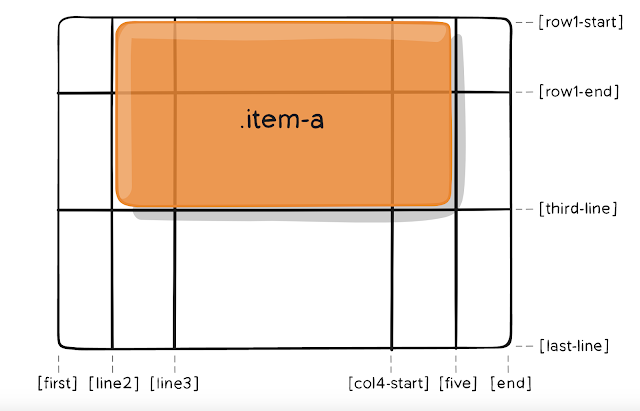

# Grid 

[Css Grid 概念介紹及使用教學](https://ballaediworkshop.blogspot.com/2019/10/css-grid-introduction-and-tutorial.html)

- [Grid](#grid)
  - [gird-template-columns & grid-template-rows](#gird-template-columns--grid-template-rows)
    - [設定Container內的line分界線](#設定container內的line分界線)
    - [Alias name for each line](#alias-name-for-each-line)
    - [`reapeat(num, line)`](#reapeatnum-line)
  - [Item](#item)
  - [Grid Area](#grid-area)
    - [Container's grid-template-area](#containers-grid-template-area)
    - [Item grid-area](#item-grid-area)
    - [Name Iteam's grid area via Container's grid-template-area](#name-iteams-grid-area-via-containers-grid-template-area)
  - [Align](#align)
    - [grid-gap](#grid-gap)
    - [justify-,align-, place-](#justify-align--place-)
    - [justify (x-axis + height 100%)](#justify-x-axis--height-100)
    - [align (y-axis)](#align-y-axis)
    - [place-](#place-)
    - [-content](#-content)

Css Grid 的組成，一個 Grid 有兩個部分：Container and Item

```html
<div class="container">
    <div class="item-a">A</div>
    <div class="item-b">B</div>
    <div class="item-c">C</div>
</div>
```

## gird-template-columns & grid-template-rows

container 設定各虛擬線間之距離，item 個別設定區域大小
   
### 設定Container內的line分界線
```css
grid-template-columns: 40px 50px auto 50px 40px;
grid-template-rows: 25% 100px auto;
```

### Alias name for each line
```css
grid-template-columns: [first] 40px [line2] 50px [line3] auto [col4-start] 50px [five] 40px [end];
grid-template-rows: [row1-start] 25% [row1-end] 100px [third-line] auto [last-line];
```

### `reapeat(num, line)`

```css
/* 20px [col-start] 20px [col-start] 20px [col-start] */
grid-template-columns: repeat(3, 20px [col-start]);

/* (col-start的第2條) */
grid-column-start: col-start 2;
```
## Item 

Form Item via Grid Line
  
```css
.item{
  grid-column-start: 2; (2nd line)
  grid-column-end:  5; (5th line)
  grid-row-start: 1; (1st line)
  grid-row-end: 3; (3rd line)
}
```

`起點/終點`
```css
.container{
  grid-column: 2 / 5;    /* (<startLine> / <endLine>) */
  grid-row: 1 / 3;    /* (<startLine> / <endLine>) */
}
```

`x / x+1`
```css
grid-column : 2   /*  相當於 2 / 3  */
```

`line alias name / Line alias name`
```css
grid-column: line2 / five;
grid-row: row1-start / third-line;
```

`往左或往上span / 往右或下span ` 
```css
/*
 * grid-column 或 grid-row : span startLine , span endLine語法
 * span startLine 會往前一條(startLine - 1) 往左或上擴張
 * span endLine會往後一條(endLine + 1) 往右或下
 */
grid-column: span 3 / span 4;
/*          
    == 2 / 5        
    == span line3 / span col4-start
    == line2 / five    
*/
```

## Grid Area
### Container's grid-template-area
```css
.container{
  grid-template-areas: "<grid-ara-name>" | "." | none 
}
```
- `.` : empty Area
- `none` : undefine Area


### Item grid-area

The `grid-area` property can be used as a shorthand property for (the grid line) `grid-row-start`, `grid-column-start`, `grid-row-end `and the `grid-column-end` properties.
`row起點/column起點/row終點/column終點`

```css
.itemA{
  grid-area: 1 / col4-start / last-line / 6;
}
.itemB{
  grid-area: 2 / 1 / span 2 / span 3;
}
```

### Name Iteam's grid area via Container's grid-template-area

  

container 設定每個Grid內規定的Header
```css
.container{
 grid-template-areas:
    "header header header header"
    "main   main   .      sidebar"
    "footer footer footer footer";
}
```

item 只需設定 container 設定好的名字
```css
.iteamA{grid-area: header;}
.iteamB{grid-area: main;}
.iteamC{grid-area: sidebar;}
.iteamD{grid-area: footer;}
```

<!DOCTYPE html>
<html>
<style>
.containerA {
  gap: 10px;
  background-color: #2196F3;
  padding: 10px;
  display: grid;
  grid-template-columns: 40px 50px auto 50px 40px;
  grid-template-rows: 25% 100px auto;
  grid-template-areas:
    "header header header header"
    "main main . sidebar"
    "footer footer footer footer";
}
.containerA > div {
  background-color: rgba(255, 255, 255, 0.8);
  text-align: center;
  padding: 20px 0;
  font-size: 30px;
}
.itemA1{
  grid-area: header;
}
.itemA2{
  grid-area: main;
  width:300px;
}
.itemA3{
  grid-area: sidebar;
}
.itemA4{grid-area: footer;}
</style>
<head>
<content>Example</content>
</head>
<body>
<div class="containerA">
   <div class="itemA1">1</div>
   <div class="itemA2">2</div>
   <div class="itemA3">3</div>
   <div class="itemA4">4</div>
</div>
<br>
</body>
</html>


**在 Area 中，被分配的 item 不能是分段的或是非長方形**
## Align 

### grid-gap 

Each Item's gap in Container
```typescript
grid-column-gap: 10px
grid-row-gap: 15px

/* grid-gap: <grid-row-gap> <grid-column-gap> */
grid-gap   : 15px           10px;
```

### justify-,align-, place-

`justify|align|place-items` 利用 container 一次設定所有 items
```css
.container{
  justify-items: start | end | center | strech
  align-items:
  place-items:
}
```

`justify|align|place-self`: 特定item 個別設定的對齊方式
```css
.item{
  justify-self:
  align-self:
  place-self:
}
```

### justify (x-axis + height 100%)

**item的height 100% (上下填滿)**

```css
.container{
  justify-items|-self : start  ;  /** 最左邊 **/
  justify-items|-self : end    ;  /** 最右邊 **/
  justify-items|-self : center ;  /** 至中 **/
  justify-items|-self : stretch;  /** default 每個item佔滿**/ 
}
```

### align (y-axis)

**item的width 100%（左右填滿)**

```css
align-items|self : start  ; 
align-items|self : end    ;
align-items|self : center ;
align-items|self : stretch;  /** default **/
```


### place-

同時調整單justify-以及align-

```css
/*  place-items : <align-items> / <justify-items>  */

place-self: center stretch;

/*
如果只設定一個值
則為同時設定兩個屬性
*/

place-items: center;
/*   == center center    */
```

### -content

content是以一組grid-templae-area為單位做調整
```css
.container{
  justify-content : space-evenly | space-between | space-around | stretch | center | start | end;
  align-content : space-evenly | space-between | space-around | stretch | center | start | end;
  
  place-content : space-evenly | space-between | space-around | stretch | center | start | end / 
  space-evenly | space-between | space-around | stretch | center | start | end;

}
```

