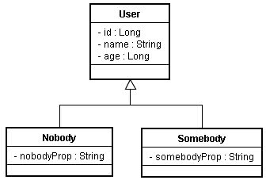

# ORM Mapping Relationship 

- [ORM Mapping Relationship](#orm-mapping-relationship)
  - [Table Per Concrete Class](#table-per-concrete-class)
  - [Single Table per Class Hierarchy](#single-table-per-class-hierarchy)
  - [Table per Subclass](#table-per-subclass)

## Table Per Concrete Class

[openhome.cc Table Per Concrete Class](https://openhome.cc/Gossip/EJB3Gossip/TableperConcreteClass.html)

  

透過`@Inheritance(strategy = InheritanceType.TABLE_PER_CLASS)`實現

```java
@Entity
@Table(name = "T_USER")
@Inheritance(strategy = InheritanceType.TABLE_PER_CLASS)
class User{
    @Id
    private Long id;
    private String name;
    private Long age;

    // setter and getter 
}
@Entity
@Table(name="T_SOMEBODY")
public class Somebody extends User {
    private String someBodyProp;

    // no Args Constructor is needed
    public String getSomeBodyProp() {
        return someBodyProp;
    }

    // setter
}
@Entity
@Table(name="T_NOBODY")
public class Nobody extends User {
    private String nobodyProp;

    // no Args Constructor is needed
    public String getNobodyProp() {
        return nobodyProp;
    }

    // ...
}
```

## Single Table per Class Hierarchy

- [oepnhome.cc Single Table per Class Hierarchy](https://openhome.cc/Gossip/EJB3Gossip/SingleTableperClassHierarchy.html)

透過`@DiscriminatorColumn` AND `@DiscriminatorValue` TO discriminate 來設定區別類型欄位的名稱與儲存值。

Single Table Per Class Hierarchy 缺點為，子類別屬性的不同，對映儲存時會有許多欄位為`NULL`，較浪費資料庫空間，但查詢效率較好。

```java
Table T_USER
+---------------+--------+------+-----+------------+--------------+
| DISCRIMINATOR | ID<PK> | NAME | AGE | NOBODYPROP | SOMEBODYPROP |
+---------------+--------+------+-----+------------+--------------+
```
- `DISCRIMINATOR` : Given By each Entity OBJECT'S `@DiscriminatorValue("column_name")`
- `NobodyPROP` : Attribute From Derived Class
- `SomebodyPROP` : Attribute From Derived Class 

```java
@Entity
@Table(name="T_USER")
@Inheritance(strategy=InheritanceType.SINGLE_TABLE)
@DiscriminatorColumn(
    name="DISCRIMINATOR", 
    discriminatorType=DiscriminatorType.STRING
)
@DiscriminatorValue("User")
public class User implements Serializable {
    @Id
    @GeneratedValue(strategy = GenerationType.AUTO)
    private Long id;
    private String name;
    private Long age;

    // getter and setter
}

@Entity
@DiscriminatorValue("Somebody") 
public class Somebody extends User {
    private String someBodyProp;

    // no Args Constructor is needed
    public String getSomeBodyProp() {
        return someBodyProp;
    }

    // setter 
}

@Entity
@DiscriminatorValue("Nobody") 
public class Nobody extends User {
    private String nobodyProp;

    // no Args Constructor is needed
    public String getNobodyProp() {
        return nobodyProp;
    }

    // setter 
}
```

## Table per Subclass

Reference
[Table per Subclass（Joined-Tables）](https://openhome.cc/Gossip/EJB3Gossip/TableperSubclassJoinedTables.html)

透過`@Inheritance(strategy=InheritanceType.JOINED)`實現，父類與子類對應的表格透過外鍵來產生關聯，其中`T_USER`的`ID`與`T_Nobody`及`T_Somebody`的`ID`為PK-FK關係(利用`@PrimaryKeyJoinColumn(name="sub_table_id_name")`關聯)。
```
        +------+
        |T-USER|
        +------+
        |ID<PK>|
        |NAME  |
        |AGE   |
        +------+
         /    \
 +----------+  +------------+
 |T_NOBODY  |  |T_SOMEBODY  |
 +----------+  +------------+
 |NOBDOY_ID |  |SOMEBODY_ID |
 |NOBODYPROP|  |SOMEBODYPROP|
 +----------+  +------------+
```

```java
@Entity
@Table(name="T_USER")
@Inheritance(strategy=InheritanceType.JOINED)
public class User implements Serializable {
    @Id
    @GeneratedValue(strategy = GenerationType.AUTO)
    private Long id;
    private String name;
    private Long age;
    // 以下為 Getter、Setter
    ...
}
@Entity
@Table(name="T_NOBODY")
@PrimaryKeyJoinColumn(name="NOBODY_ID")
public class Nobody extends User {
    private String nobodyProp;
    // getter and setter 
}
@Entity
@Table(name="T_SOMEBODY")
@PrimaryKeyJoinColumn(name="SOMEBODY_ID")
public class Somebody extends User {
    private String someBodyProp;
    // getter and setter 
}
```

Table Would Look like 
```
Table T_User
+----+-----+------+
| id | age | name |
+----+-----+------+
| 1  |  18 | tom  |
| 2  |  20 | john |
| 3  |  21 | Lisa |
+----+-----+------+

Table T_NOBODY
+------------+-----------+
| nobodyProp | noBody_id |
+------------+-----------+
| noBody     |   2       |
+------------+-----------+

Table T_SOMEBODY
+--------------+-------------+
| somebodyProp | someBody_id |
+--------------+-------------+
| someBody     |    3        |
+--------------+-------------+
```