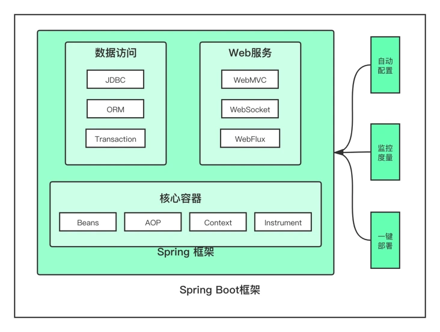

# Spring Note

[Spring Boot Tutorial](https://morosedog.gitlab.io/categories/Spring-Boot/)  
## Base
- [Framework MVC, MVP and MVVM](framework.md)
- [loC](SpringBase/IoC.md)  
## Annotation

- [Annotation](annotation/Annotations.md)
- [Spring MVC](annotation/mvcAnnotation.md)
- [@Conditional](annotation/condition.md) 
- [Layer Annotation](annotation/layerAnnotation.md) 
- [AOP](annotation/AOP.md)
- [Security](annotation/Springsecurity.md)
- [JPA annotation](annotation/jap.md)
- [Java Validators](annotation/javaValidator.md) 
## Spring Boot

  
- [Annotations to run Spring Boot Application](annotation/SpringBootApplication.md)
### Spring boot Security

- [Authentication](SpringBoot/Authentication.md)
- [Filter](SpringBoot/Filter.md)   
  - [UsernamePasswordAuthenticationFilter extends AbstractAuthenticationProcessingFilter](SpringBoot/AuthenticationFilter.md)
- [Authorization](SpringBoot/Authorization.md)
- [WebSecurity](SpringBoot/WebSecurity.md)
  - [CORS setup](SpringBoot/CORS.md)   
  - [UserDetailService](UserdetailsService.md)
- [SpringBoot In Action Login](JWTAuth.md) 
#### Token
- [KeyStore](SpringBoot/Keystore.md)
- [Java JWT](SpringBoot/JWT.md)
- [Jwt Bash Command](SpringBoot/KeystoreInCommand.sh)
## Hibernate && JPA
- [Spring Data JPA Query Method 方法名稱查詢範例](https://matthung0807.blogspot.com/2020/04/spring-data-jpa-query-method.html)

- [Introduction of Transaction](SpringWithDatabase/Transactional.md)   
- **[CascadeType](SpringWithDatabase/CascadeType.md)**   
- [Spring Boot @Transaction](SpringWithDatabase/@Transaction.md)
- **[HQL](SpringWithDatabase/HQL.md)**
- [SpringBoot JPA & JPQL](SpringWithDatabAse/JPA_JELQ.md)
- **[Database Relationship](SpringWithDatabase/TableRelationship.md)**  
  - [Different btw OneToMany and ManyToMany ](SpringWithDatabase/ManyToMany&OneToMany.md)   
- **[`@Embedded` and `@Emenddable`](SpringWithDatabase/AnnotationEmbeddedAndEmbeddable.md)**    

### Swagger

- [Spring boot 自動產生 OpenAPI 3.0 文件 (Swagger UI) 教學](https://www.ruyut.com/2022/05/spring-boot-openapi-3-swagger-ui.html)
- [SpringBoot 使用 Springfox Swagger 3.0 ](http://www.mydlq.club/article/108/)

#### Cache 
- [Cache Annotation](SpringWithDatabase/Cache.md)
- [Caffeine](SpringWithDatabase/Caffeine.md)
- [redis](SpringWithDatabase/Redis.md)  
- [redisTemplate](SpringWithDatabase/RedisMethod.md) 

#### RxJAVA
- [Reactive Programming](reactive/RxJava.md)
- [Spring WebClient](reactive/webclient.md)
