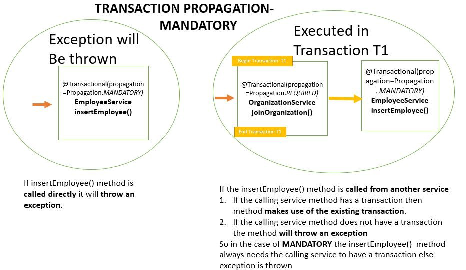
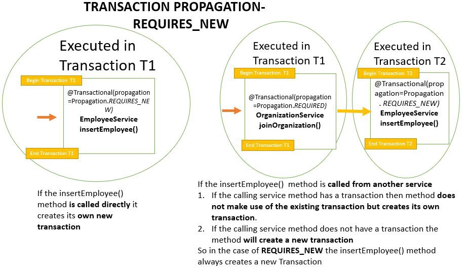

# @Transaction

[transaction-configuration-with-jpa-and-spring](https://www.baeldung.com/transaction-configuration-with-jpa-and-spring)

- [@Transaction](#transaction)
  - [Flow of Transaction](#flow-of-transaction)
    - [Attribute of `@Transactional`](#attribute-of-transactional)
  - [propagation](#propagation)
      - [`MANDATORY`(A active transaction is mandatory)](#mandatorya-active-transaction-is-mandatory)
      - [`NOT_SUPPORTED`](#not_supported)
      - [`REQUIRES_NEW`](#requires_new)
      - [`NESTED`](#nested)
      - [REQUIRES_NEW vs NESTED](#requires_new-vs-nested)
  - [read-only](#read-only)
  - [rollbackFor & noRollbackFor](#rollbackfor--norollbackfor)


- Spring creates **proxies** for all the classes annotated with `@Transactional`, either on the class or on any of the methods.

---


Transactional is implemented by AOP (`@Around`)


```java 
@Service
public class AuthorService {     
    private AuthorRepository authorRepository;     
     
    public AuthorService(AuthorRepository authorRepository) {               
        this.authorRepository = authorRepository;     
    }     
     
    @Transactional(propagation = Propagation.REQUIRES_NEW)
    public void updateAuthorNameTransaction() {         
        Author author = authorRepository.findById(1L).get(); 
        author.setName("new name");     
    } 
}
```
When you inject the `AuthorService` somewhere, Spring generates a proxy object that wraps the `AuthorService` object and provides the required code to manage the transaction.

By default, that proxy starts a transaction before (`@Around`) your request enters the first method that's annotated with `@Transactional`

After that method got executed, the proxy either commits the transaction or rolls it back if a `RuntimeException` or `Error` occurred. 

Everything that happens in between, including all method calls, gets executed within the context of that transaction.

If the transactional bean is implementing an interface, by default the proxy will be a <u>Java Dynamic Proxy.</u>
- This means that only external method calls that come in through the proxy will be intercepted. 
- A `@Transactional` of an interface class is not recommended
- Any `self-invocation` calls will not start any transaction, even if the method has the `@Transactional` annotation.

Another cases of using proxies is that **only public methods or classes should be annotated with `@Transactional`.** 

**Methods of any other visibilities(e.g. `private` ... etc ) will simply ignore the annotation silently as these are not proxies.**

---

All Transactions extends  `org.springframework.transaction.PlatformTransactionManager`  

```java
public interface PlatformTransactionManager {
  TransactionStatus getTransaction(TransactionDefinition definition)
  throws TransactionException;

  void commit(TransactionStatus status) throws TransactionException;
  
  void rollback(TransactionStatus status) throws TransactionException;
}
```
- It makes use of the attributes `rollbackFor` or `rollbackFor{ClassName}` to rollback the transactions
- The attributes `noRollbackFor` or `noRollbackFor{ClassName}` to avoid rollback on listed exceptions.
- By default, **rollback happens for run-time**, unchecked exceptions only.    
**The checked exception does not trigger a rollback of the transaction.**   
We can, of course, configure this behavior with the `rollbackFor{check_exceptionName.class | unchecked_exceptionName.class}` and `noRollbackFor{check_exceptionName.class | unchecked_exceptionName.class}`.   

## Flow of Transaction

[@Transactional gotchas](https://virtualmackem.blog/2019/03/28/transactional-gotchas/)

- The `before` advice for Method A creates a transaction then calls Method A
- Method A then calls Method B
- The `before` advice for Method B checks to see if there’s a transaction and there is Method B then runs and the exception is thrown
- The `after` advice for Method B sees the exception bubble up through it and sets rollback onl” on the transaction. This cannot be undone Thus, the entire transaction (originally created by Method A) is rolled back


### Attribute of `@Transactional`

[Spring Boot Transaction Tutorial — Understanding Transaction Propagation](https://medium.com/@rameez.s.shaikh/spring-boot-transaction-tutorial-understanding-transaction-propagation-ad553f5d85d4)   


The annotation `@Transactional` supports further configuration :
- the `Propagation` Type of the transaction
- the `Isolation` Level of the transaction
    > [<u>more details</u>](https://dev.to/ildar10/spring-transaction-management-isolation-and-propagation-483m) 
- a `Timeout` for the operation wrapped by the transaction
- a `readOnly` flag(set as false by default)
    > 
- the `Rollback` rules for the transaction


## propagation

[](http://deltamaster.is-programmer.com/posts/28489.html)

`propagation` enables you to **control the handling of existing and creation of new transactions**.

```java
//in A.java
Class A {
    @Transactional(propagation=propagation.REQUIRED)
    public void aMethod {
        B b = new B();
        b.bMethod();
    }
}
 
//in B.java
Class B {
    @Transactional(propagation=propagation.REQUIRED)
    public void bMethod { //something }
}
```
- If there is no transactions before calling `aMethod`, a new transaction will start(`T1`). `bMethod` is called within `aMethod` while a transaction(`T`) already exists. This means any exceptions thrown by `bMethod` rollbacks, `aMethod` also rollbacks. Because they have same transaction(`T1`)


1. `REQUIRED` (default) :  
   - Join an active(existing) transaction
   - Start a new one if the `@Transaction(propagation=propagation.REQUIRED) method` gets called without a transaction. 
2. `SUPPORTS` 
   - Join an activate transaction if one exists.  
   - **If the `@Transaction(propagation=propagation.SUPPORTS) method` gets called without an active transaction, this method will be executed without a transactional context.**

#### `MANDATORY`(A active transaction is mandatory)

  
- Join an activate transaction if one exists 
- Throw an Exception if the `methodA` gets called without an active transaction.

#### `NOT_SUPPORTED`

SUSPEND an active transaction(`@Transaction(...) method`) and execute the `@Transaction(NOT_SUPPORTED) method_` without any transactional context. (DOES NOT JOIN AN ACTIVE TRANSACTION)

#### `REQUIRES_NEW`  

  

- **Always start a new transaction for `@Transaction(REQUIRES_NEW) method_`.**

- If it gets called with an active transaction, that transaction gets SUSPENDED until it got executed.

#### `NESTED`  

Start a new transaction if the `@Transaction(NESTED)` gets called without an active transaction.   

If it gets called with an active transaction, Spring sets a savepoint and rolls back to that savepoint if an Exception occurs.


#### REQUIRES_NEW vs NESTED

```java
// a.java
@Transaction(...)
public void aMethod(){
    bMethod();
}

// b.java
@Transaction(REQUIRES_NEW)
public void bMethod(){
    ....
}
```
- If `aMethod` can handle the exception thrown by `bMethod`), transaction from `aMethod` might commit successfully. Otherwise `aMethod` rollbacks too.
- If `bMethod`'s transaction committed successfully, only `aMethod` rollbacks when an exception is thrown.


```java
@Transaction(NESTED)
public void bMethod(){
    ....
}
```
If parent transaction rollbacks the derived one also rollbacks


## read-only

[](https://thorben-janssen.com/transactions-spring-data-jpa/#Defining_Transaction_Propagation)

mark your transaction as read-only to avoids dirty checks on all retrieved entities.

```java
@Transactional(readOnly = true)
public Author getAuthor() {
     return authorRepository.findById(1L).get();
}
```

## rollbackFor & noRollbackFor

Unchecked exception  
To handle these exceptions with `try…catch…finally`, but **it better that we adjust our code to deal with the exceptions.**

common unchecked exceptions
```java
ArithmetricException
ClassCastException
NullPointerException
```
 
Checked exception   
**Checked Exception will cause compiler error, and maintainer must use try-catch or throws to handle the error**

Common Checked Exceptions
```java 
SQLException
IOException
ClassNotFoundException
```

```java
@Transactional(
    // exception will be handled by Exception.class
    rollbackFor = Exception.class, 
    // ignore exception (EntityNotFoundException)
    noRollbackFor = EntityNotFoundException.class )
public void updateAuthorName() {
    Author author = authorRepository.findById(1L).get();
    author.setName("new name");
}
```


```java
@Transactional(rollbackFor = { SQLException.class })
public void createCourseDeclarativeWithCheckedException(Course course) throws SQLException {
    courseDao.create(course);

    if(.. ){
        throw new SQLException("Throwing exception for demoing rollback");
    }
}

@Transactional(noRollbackFor = { SQLException.class })
public void createCourseDeclarativeWithNoRollBack(Course course) throws SQLException {
    courseDao.create(course);

    // ignore the SQLException
    if(.. ){
        throw new SQLException("Throwing exception for demoing rollback");
    }
}
```

