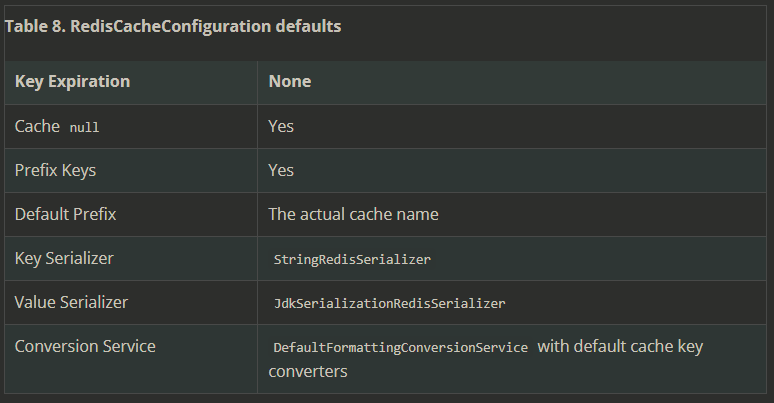
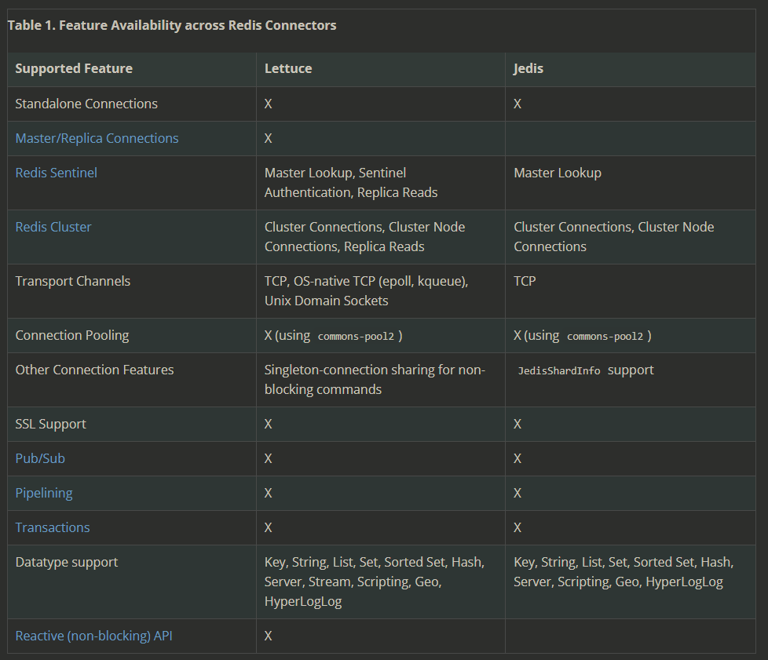
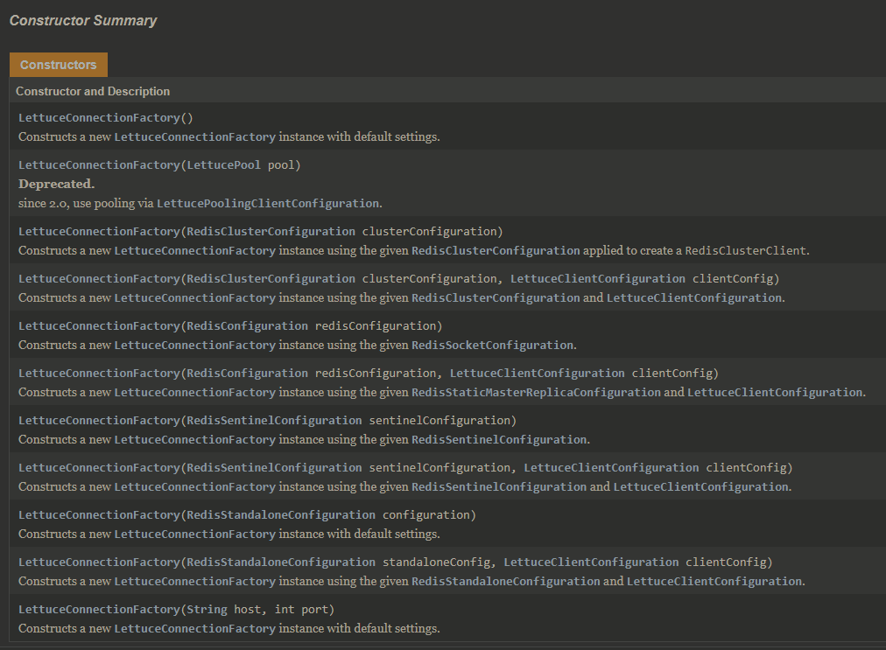
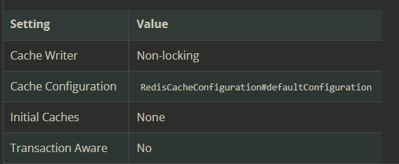

# Redis

**Redis Stands For Remote Dictionary Serve**

- [Redis](#redis)
  - [References](#references)
  - [Dependency](#dependency)
  - [application.properties](#applicationproperties)
  - [Configuration](#configuration)
    - [1. `RedisCacheConfiguration` Configuration](#1-rediscacheconfiguration-configuration)
      - [Configure Prefix for `Key`](#configure-prefix-for-key)
    - [2. `RedisConnectionFactory` Configuration](#2-redisconnectionfactory-configuration)
      - [Redis Connectors](#redis-connectors)
      - [Lettuce Connector](#lettuce-connector)
      - [Unix domain sockets](#unix-domain-sockets)
      - [Jedis Connector](#jedis-connector)
    - [3. `CacheManager` Configuration](#3-cachemanager-configuration)
      - [Configure Cache Manager Behavior for Redis](#configure-cache-manager-behavior-for-redis)
      - [lockingRedisCacheWriter](#lockingrediscachewriter)
  - [Redis Configuration by extending CachingConfigurerSupport](#redis-configuration-by-extending-cachingconfigurersupport)
  - [RedisTemplate's Serializer Types](#redistemplates-serializer-types)
  - [`RedisTemplate` Configuration](#redistemplate-configuration)
  - [Multiple Redis Configuration](#multiple-redis-configuration)
    - [Application Properties and YML](#application-properties-and-yml)
    - [Property Class for Different Redis Servers](#property-class-for-different-redis-servers)
    - [Redis Pool, `RedisConnectionFactory` and `RedisTemplate` configuration](#redis-pool-redisconnectionfactory-and-redistemplate-configuration)
  - [`RedisConnectionFactory` Configuration via `RedisStandaloneConfiguration`](#redisconnectionfactory-configuration-via-redisstandaloneconfiguration)
    - [2. CacheManager by extending `CachingConfigurerSupport `](#2-cachemanager-by-extending-cachingconfigurersupport-)
    - [3. RedisTemplate Configuration](#3-redistemplate-configuration)
    - [`@Cacheable( ... , cacheManager = ... ,)` in Service Layer](#cacheable---cachemanager----in-service-layer)
  - [Multiple RedisTemplates](#multiple-redistemplates)
  - [Tips](#tips)
  - [`@Transactional` Support](#transactional-support)

---
## References

[Implementation of Spring-Boot Data Redis for caching in my application](https://kumarshivam-66534.medium.com/implementation-of-spring-boot-data-redis-for-caching-in-my-application-218d02c31191)       
[善用Spring Cache優雅的管理 Caches](https://medium.com/brucehsu-backend-dev/%E5%88%A9%E7%94%A8spring-cache%E5%84%AA%E9%9B%85%E7%9A%84%E4%BD%BF%E7%94%A8caches-5aad2630eb0a)
[Matthew Frank Spring Boot cache annotation with Redis ](https://medium.com/@MatthewFTech/spring-boot-cache-with-redis-56026f7da83a)      
[SpringBoot整合Redis](https://blog.csdn.net/qq_36781505/article/details/86612988)
**[Difference btw Lettuce and Jedis](https://github.com/spring-projects/spring-session/issues/789)**  

[class `RedisStandaloneConfiguration`](https://docs.spring.io/spring-data/redis/docs/2.3.0.RELEASE/api/index.html?org/springframework/data/redis/connection/RedisStandaloneConfiguration.html)
- Configuration class used for setting up RedisConnection via RedisConnectionFactory using connecting to a single node Redis installation.

[class `RedisCacheConfiguration`](https://docs.spring.io/spring-data/redis/docs/current/api/org/springframework/data/redis/cache/RedisCacheConfiguration.html)     
**[RedisCacheAutoConfiguration](https://github.com/justauth/justauth-spring-boot-security-starter/blob/master/src/main/java/top/dcenter/ums/security/core/oauth/config/RedisCacheAutoConfiguration.java)**   
- [Install wsl window 10](https://redis.com/blog/redis-on-windows-10/)   
- [Disable wsl window 10](https://www.windowscentral.com/install-windows-subsystem-linux-windows-10)      

`Redis Connection Factory = RedisDataBaseConfiguration(PoolConfiguration)`
`RedisTemplate = Redis Connection Factory + Serializer(key-value + hashkey-hashvalue)`

## Dependency
```xml
<dependency>
    <groupId>org.springframework.boot</groupId>
    <artifactId>spring-boot-starter-data-redis</artifactId>
</dependency>
```

## application.properties

```bash 
# **** REDIS (RedisProperties) ****
# **** spring.redis.XXXX       **** 

# Redis資料庫索引（預設為0）
spring.redis.database= 0

# Redis伺服器地址
spring.redis.host = localhost

# Redis伺服器連接端口
spring.redis.port = 6379

# Redis伺服器連接密碼（預設為空）
spring.redis.password =

# 連接池最大連接數（使用負值表示沒有限制）
spring.redis.pool.max-active = 8

# 連接池最大阻塞等待時間（使用負值表示沒有限制）
spring.redis.pool.max-wait = -1

# 連接池中的最大空閒連接
spring.redis.pool.max-idle = 8

# 連接池中的最小空閒連接
spring.redis.pool.min-idle = 0

# 連接超時時間（毫秒）
spring.redis.timeout = 1000
```

For Spring 2.x
```yml
spring.cache.cache-names= cacheName1 , cacheName2 , ...

# {redis, generic, simple, ... }
spring.cache.type= 

# caching null value (default : false)
spring.cache.redis.cache-null-values=

# caches ttl (default : 60000ms)
spring.cache.redis.time-to-live=

# Allow using key prefix (default : true)
spring.cache.redis.use-key-prefix=

# Create key-prefix
# We can also set key-prefix in RedisCacheConfiguration
spring.cache.redis.key-prefix=
```

## Configuration

Redis Java Configuration 

1. [`RedisCacheConfiguration` (Redis Server Configuration)](#1-rediscacheconfiguration-configuration)
    dataBase port , hostname , TTL, ... etc 
2. [Redis Connection Cnfiguration](#2-cache-configuration-with-cachingconfigurersupport)
   1. `RedisConnectionFactory` Configuration  `Lettuce` or `jedis`
   2. Connection Configuration = RedisCacheConfiguration + RedisConnectionFactory
3. [`CacheManager` Configuration](#3-cachemanager-cache-configuration)
    CacheManager = Multiple RedisCacheConfigurations (defaultCacheConfiguration + others) + Connection Factory Configuration

```java
@Bean
CacheManager cacheManager(RedisConnectionFactory connectionFactory) {
    /**
      * Cache Names Space Configuration
      */
    var userCacheConfiguration = RedisCacheConfiguration
                                    .defaultCacheConfig()
                                    .entryTtl(Duration.ofMinutes(30))
                                    .disableCachingNullValues()
                                    .prefixKeysWith("user");
    var productCacheConfiguration = RedisCacheConfiguration.defaultCacheConfig()
                                    .entryTtl(Duration.ofMinutes(10))
                                    .disableCachingNullValues()
                                    .prefixKeysWith("product");

    Map<String, RedisCacheConfiguration> redisCacheConfigurationMap = new HashMap<>();
    redisCacheConfigurationMap.put("user", userCacheConfiguration);
    redisCacheConfigurationMap.put("product", productCacheConfiguration);

    // RedisCacheWriter
    RedisCacheWriter redisCacheWriter = RedisCacheWriter.nonLockingRedisCacheWriter(connectionFactory);
    
    //ClassLoader loader = this.getClass().getClassLoader();
    //JdkSerializationRedisSerializer jdkSerializer = new JdkSerializationRedisSerializer(loader);
    //RedisSerializationContext.SerializationPair<Object> pair = RedisSerializationContext.SerializationPair.fromSerializer(jdkSerializer);
    //RedisCacheConfiguration defaultCacheConfig=RedisCacheConfiguration.defaultCacheConfig().serializeValuesWith(pair);
    
    
    var defaultCacheConfig = RedisCacheConfiguration.defaultCacheConfig()
                                                    .entryTtl(Duration.ofSeconds(30));
                                                    .disableCachingNullValues();        

    
    var cacheManager = new RedisCacheManager(redisCacheWriter, 
                                             defaultCacheConfig, 
                                             redisCacheConfigurationMap);
    return cacheManager;
```

### 1. `RedisCacheConfiguration` Configuration

The `RedisCacheConfiguration` lets you set `Key` expiration `TTL`, `Prefixes`, and `Serializer` implementations for converting to and from the binary storage format
```java
var config = RedisCacheConfiguration.defaultCacheConfig() // <--- redisCacheConfiguration defaults
                                    .entryTtl(Duration.ofSeconds(1))
                                    .disableCachingNullValues();        
```
  

#### Configure Prefix for `Key`

By default, **any key for a cache entry gets prefixed** with the actual cache name followed by two colons. This behavior can be changed to a `static` as well as a computed prefix.

```java
// static key prefix
RedisCacheConfiguration.defaultCacheConfig().prefixKeysWith("( ͡° ᴥ ͡°)");

//The following example shows how to set a computed prefix:
// computed key prefix
RedisCacheConfiguration.defaultCacheConfig().computePrefixWith(cacheName -> "¯\_(ツ)_/¯" + cacheName);
```
### 2. `RedisConnectionFactory` Configuration 

`RedisConnectionFactory` provides the core building block for Redis communication, as it handles the communication with the Redis backend.
- It's something similar to `JdbcTemplate` to connect with `MySql` Server.

Spring Redis provides an implementation for the Spring cache abstraction through the `org.springframework.data.redis.cache` package, for example :: 
```java 
@Bean
public RedisCacheManager cacheManager(RedisConnectionFactory connectionFactory) {
	return RedisCacheManager.create(connectionFactory);
}
```

#### Redis Connectors

  
- The easiest way to work with a `RedisConnectionFactory` is to configure the appropriate connector through the IoC container (`@Configuration` , `＠bean`) and inject it (`@Autrowried`) into the using class.

#### Lettuce Connector

```xml
<dependency>
    <groupId>io.lettuce</groupId>
    <artifactId>lettuce-core</artifactId>
    <version>6.1.5.RELEASE</version>
</dependency>
```

An object of Connector 
```java
@Bean
  public LettuceConnectionFactory redisConnectionFactory() {
    return new LettuceConnectionFactory(
        new RedisStandaloneConfiguration("server", 6379));
  }
```
- Via `RedisStandaloneConfiguration` to tweak settings such as the host or password for Connection Configuration  

- By default, all LettuceConnection instances created by the `LettuceConnectionFactory` share the **same thread-safe native connection for all non-blocking and non-transactional operations**

  


#### Unix domain sockets

Lettuce integrates with Netty’s native transports, letting you use Unix domain sockets to communicate with Redis via `RedisSocketConfiguration`
```java
@Configuration
class AppConfig {

  @Bean
  public LettuceConnectionFactory redisConnectionFactory() {

    return new LettuceConnectionFactory(new RedisSocketConfiguration("/var/run/redis.sock"));
  }
}
```
#### Jedis Connector 

```xml
<dependency>

    <!-- ... -->    

    <groupId>redis.clients</groupId>
    <artifactId>jedis</artifactId>
    <version> ..... </version>  

</dependency>
```


```java
@Configuration
class RedisConfiguration {
    @Bean
    public JedisConnectionFactory redisConnectionFactory() {
    return new JedisConnectionFactory();
    }   

    @Bean
    public JedisConnectionFactory redisConnectionFactory() {
        RedisStandaloneConfiguration config = new RedisStandaloneConfiguration("server", 6379);
        return new JedisConnectionFactory(config);
    }
}
```

- [Redis:Sentinel](https://docs.spring.io/spring-data/data-redis/docs/current/reference/html/#redis:sentinel)

### 3. `CacheManager` Configuration  

**Cache Configuration = Behavior of Cache Provider in Cache Manager**   

`RedisCacheManager` Defaults
  
- Spring Boot will auto-configure a `RedisCacheManager` with default cache configuration. 

#### Configure Cache Manager Behavior for Redis

```java
@Configuration
@EnableCaching
public class CacheConfig {

    /**
      * <p> RedisCacheManager must build 
            with Redis Connection Factory and RedisCacheConfiguration </p>
      */
    @Bean
    public CacheManager redisCacheManager(RedisConnectionFactory redisConnectionFactory) {
        // Cache Configuration
        var redisCacheConfiguration = RedisCacheConfiguration.defaultCacheConfig()
                                                             .entryTtl(Duration.ofMinutes(30));
        
        // Redis Cache Manager configuration
        return RedisCacheManager.builder(RedisCacheWriter
                                            .nonLockingRedisCacheWriter(redisConnectionFactory))
                                            .cacheDefaults(redisCacheConfiguration).build();
    }
}
```

`RedisCacheManager` configuration via `RedisCacheManagerBuilder` 
```java
var cm = RedisCacheManager.builder(connectionFactory)
                          .cacheDefaults(defaultCacheConfig())
                          .withInitialCacheConfigurations(singletonMa(
                              "predefined", defaultCacheConfig().disableCachingNullValues()))
                          .transactionAware()
                          .build();
```
- `RedisCacheManager` defaults to a lock-free `RedisCacheWriter` for reading and writing binary values. 


#### lockingRedisCacheWriter

**Lock-free caching improves throughput**. 

The lack of entry locking can lead to overlapping, non-atomic commands for the `putIfAbsent` and `clean` methods, as those require multiple commands to be sent to Redis. 

the locking counterpart prevents command overlap by setting an explicit lock key and checking against presence of this key, which leads to additional requests and potential command wait times.

```java
RedisCacheManager cm = RedisCacheManager.build(RedisCacheWriter.lockingRedisCacheWriter())
	                                    .cacheDefaults(defaultCacheConfig())
	                                    ...
```


## Redis Configuration by extending CachingConfigurerSupport
- [Configuration Example with `CachingConfigurerSupport`](https://www.tpisoftware.com/tpu/articleDetails/1525)   
```java
@Configuration
@EnableCaching
public class RedisConfig extends CachingConfigurerSupport {

    // Connection Configuration
	@Bean
	public JedisConnectionFactory redisConnectionFactory() {

		return new JedisConnectionFactory();
	}

    // Custom keyGenerator
	@Bean
	public KeyGenerator wiselyKeyGenerator() {
		return new KeyGenerator() {
			@Override
			public Object generate(Object target, Method method, Object... params) {
                StringBuilder sb = new StringBuilder();
                
                // get class name
                sb.append(target.getClass().getName());
                // get method name
                sb.append(method.getName());
				
                // get other params
                for (Object obj : params) {
					sb.append(obj.toString());
				}
				
				return sb.toString();
			}
		};
	}
    
    
    // Redis Template Configuration ( Using Redis to query the data )
	@Bean
	public RedisTemplate<String, String> redisTemplate(RedisConnectionFactory factory) {

		RedisTemplate<String, String> redisTemplate = new RedisTemplate<String, String>();
		
        redisTemplate.setConnectionFactory(factory);
		return redisTemplate;
	}

    //  Cache Manager Configuration ( Use Redis As Cache Provider ) 
	@Bean
	public CacheManager cacheManager(RedisConnectionFactory factory) {

		RedisSerializationContext.SerializationPair<Object> pair = RedisSerializationContext.SerializationPair
				.fromSerializer(new GenericJackson2JsonRedisSerializer());
                
		var defaultCacheConfig = RedisCacheConfiguration.defaultCacheConfig()
				                 .serializeValuesWith(pair) 
				                 .entryTtl(Duration.ofHours(1)); 

		return RedisCacheManager.builder(RedisCacheWriter
                                    .nonLockingRedisCacheWriter(factory))
                                    .cacheDefaults(defaultCacheConfig).build();

	}

}
```

## RedisTemplate's Serializer Types

These types are implementation of `RedisSerializer<T>`    
- ***(Redis DEFAULT) JDK*** (e.g.  key : `\xac\xed\x00\x05t\x00\x05KeyName`, value : `\xac\xed\x00\x05t\x00\x05Value` )
- **String (MOST USED)** ( e.g. `1 -> 1 `, `test -> test`)
- **JACKSON2JSON** ( e.g. `2016 -> "2016"` )
- XML     

[Get Set value from Redis using RedisTemplate](https://stackoverflow.com/questions/31608394/get-set-value-from-redis-using-redistemplate)   
[redis使用Jackson2JsonRedisSerializer問題](https://blog.csdn.net/weixin_44167627/article/details/108516013)   
[`serializeValuesWith`](https://stackoverflow.com/questions/48991608/how-to-use-spring-cache-redis-with-a-custom-resttemplate)

## `RedisTemplate` Configuration

`RedisTemplate` uses a Java-based SERIALIZER for most of its operations. 
- Any object written or read by the template is `serialized` and `deserialized` through Java

The Redis modules provides two extensions to `RedisConnection` and `RedisTemplate`, respectively the `StringRedisConnection` (and its `DefaultStringRedisConnection` implementation) and `StringRedisTemplate` as a convenient one-stop solution for intensive String operations. 
- **In addition to being bound to String keys, the template and the connection use the `StringRedisSerializer` underneath, which means the stored keys and values are human-readable**

```java
Connection Factory Configuration = Connect Pool configuration + Redis Database Configuration
RedisTemplate = Connection Factory Configuration + key-vale serialized + hashkey-hashvalue serialized
```


```java
@Configuration
public class RedisConfig {

    // Factory Configuration = Connect Pool configuration + Redis Database Configuration
    @Bean
    @Primary
    public LettuceConnectionFactory redis1LettuceConnectionFactory(
            // redis database configuration
            RedisStandaloneConfiguration redis1RedisConfig, 
            // redis pool connection
            GenericObjectPoolConfig redis1PoolConfig) 
    {
        var clientConfig = LettucePoolingClientConfiguration.builder()
                            .commandTimeout(Duration.ofMillis(100))
                            // REDIS CONNECT POOL CONFIGURATION
                            .poolConfig(redis1PoolConfig).build();
                                        //  REDIS DATABASE CONFIGURATION
        return new LettuceConnectionFactory(redis1RedisConfig, clientConfig);
    }

    // RedisTemplate<String, String> Configuration
    @Bean
    public RedisTemplate<String, String> redis1Template(
            @Qualifier("redis1LettuceConnectionFactory") LettuceConnectionFactory redis1LettuceConnectionFactory) {
        
        RedisTemplate<String, String> redisTemplate = new RedisTemplate<>();

        // Key-Value
        redisTemplate.setKeySerializer(new StringRedisSerializer());
        redisTemplate.setValueSerializer(new GenericJackson2JsonRedisSerializer());

        // Hash Key-Value
        redisTemplate.setHashKeySerializer(new StringRedisSerializer());
        redisTemplate.setHashValueSerializer(new GenericJackson2JsonRedisSerializer());
        
        // Enable Transaction Support 
        redisTemplate.setEnableTransactionSupport(true);
        
        // Connection Factory Set Up
        redisTemplate.setConnectionFactory(redis1LettuceConnectionFactory);

        // Commit The Above Properties         
        redisTemplate.afterPropertiesSet();

        return redisTemplate;
    }


    // RedisTemplate<String, Object> Configuration
    @Bean
    public RedisTemplate<String, Object> redisTemplate1(RedisConnectionFactory factory) throws UnknownHostException {
        
        // define <String , Object> as Key Pair
        RedisTemplate<String, Object> template = new RedisTemplate<String, Object>();
        
        // factory set up
        template.setConnectionFactory(factory);
     
        // Create Json Serializer
        Jackson2JsonRedisSerializer jackson2JsonRedisSerializer = new Jackson2JsonRedisSerializer(Object.class);
        

        var objectMapper = new ObjectMapper();
        
        objectMapper.setVisibility(PropertyAccessor.ALL, JsonAutoDetect.Visibility.ANY);
        objectMapper.enableDefaultTyping(ObjectMapper.DefaultTyping.NON_FINAL);

        jackson2JsonRedisSerializer.setObjectMapper(objectMapper);

        // Create String Serializer
        StringRedisSerializer stringRedisSerializer = new StringRedisSerializer();

        /**
          * <p> Configure Template via String and Json Serializer 
          *     for Redis Template<.. , ..> to handle different Data Type</p>
          */
        // Keys whose data Type is String will serialize as String
        template.setKeySerializer(stringRedisSerializer);
        // Keys whose Data Type is hash will serialize as String 
        template.setHashKeySerializer(stringRedisSerializer);

        // Value will serialize as jackson2Json
        template.setValueSerializer(jackson2JsonRedisSerializer);
        // Values of Hash will serialize as jackson2Json
        template.setHashValueSerializer(jackson2JsonRedisSerializer);

        // Commit The Above Properties 
        template.afterPropertiesSet();

        return template;

    }

    // Redis DataBase Cache Configuration
    @Configuration
    public static class Redis1Config {
        @Value("${spring.redis1.host}")
        private String host;
        @Value("${spring.redis1.port}")
        private Integer port;
        @Value("${spring.redis1.password}")
        private String password;
        @Value("${spring.redis1.database}")
        private Integer database;

        @Value("${spring.redis1.lettuce.pool.max-active}")
        private Integer maxActive;
        @Value("${spring.redis1.lettuce.pool.max-idle}")
        private Integer maxIdle;
        @Value("${spring.redis1.lettuce.pool.max-wait}")
        private Long maxWait;
        @Value("${spring.redis1.lettuce.pool.min-idle}")
        private Integer minIdle;

        // Connector Pool 
        @Bean
        public GenericObjectPoolConfig redis1PoolConfig() {
            GenericObjectPoolConfig config = new GenericObjectPoolConfig();
            config.setMaxTotal(maxActive);
            config.setMaxIdle(maxIdle);
            config.setMinIdle(minIdle);
            config.setMaxWaitMillis(maxWait);
            return config;
        }

        // Redis DataBase 
        @Bean
        public RedisStandaloneConfiguration redis1RedisConfig() {
            RedisStandaloneConfiguration config = new RedisStandaloneConfiguration();
            config.setHostName(host);
            config.setPassword(RedisPassword.of(password));
            config.setPort(port);
            config.setDatabase(database);
            return config;
        }
    }
}
```
- [`ObjectMapper`](https://www.baeldung.com/jackson-object-mapper-tutorial)
- [`Redis Via ObjectMapper Code Example`](https://www.jianshu.com/p/5b7296445a0e)

## Multiple Redis Configuration

[Code Reference 1](https://www.bswen.com/2021/03/springboot-how-to-connect-multiple-redis-server.html)    
**[Code Reference 2](https://www.liujiajia.me/2021/5/25/spring-boot-multi-redis)**
[Code Reference 3 ](https://hsiehjenhsuan.medium.com/spring-boot-%E4%BD%BF%E7%94%A8-lettuce-%E8%A8%AD%E5%AE%9A%E5%A4%9A%E5%80%8B-redis-%E9%80%A3%E7%B7%9A-55307dc6a480)   
[Code Reference 4](https://programmer.help/blogs/spring-boot-configures-multiple-instances-of-redis-data-source-operation.html)  
**[Code Reference 5](https://github.com/idreamshen/spring-boot-with-multi-redis/blob/master/src/main/java/com/idreamshen/demo/redis/config/RedisCacheConfiguration.java)**
### Application Properties and YML

```yml
spring:
  redis:
    user:
      host: 127.0.0.1
      port: ${redis.port:6379}
      database: 10
      password: 
    role:
      host: 127.0.0.1
      port: ${redis.port:26379}
      database: 12
      password: 
```

```xml
spring.redis.host=localhost
spring.redis.port=6379
spring.redis.database=10

spring.redis2.host=localhost
spring.redis2.port=26379
spring.redis2.database=12
```

### Property Class for Different Redis Servers

```java
@Data
public class RedisCommonProperty {
    private String host;
    private int port;
    private int database;
}

@Configuration
@ConfigurationProperties(prefix = "spring.redis")
public class Redis1Property extends RedisCommonProperty {
}

@Configuration
@ConfigurationProperties(prefix = "spring.redis2")
public class Redis2Property extends RedisCommonProperty {
}
```

### Redis Pool, `RedisConnectionFactory` and `RedisTemplate` configuration
```java
@Configuration
public class Redis1Configuration {

    @Autowired
    private Redis1Property redis1Property;

    @Primary
    @Bean(name = "redis1ConnectionFactory")
    public RedisConnectionFactory userRedisConnectionFactory() {
        JedisConnectionFactory redisConnectionFactory = new JedisConnectionFactory();
        redisConnectionFactory.setHostName(redis1Property.getHost());
        redisConnectionFactory.setPort(redis1Property.getPort());
        redisConnectionFactory.setDatabase(redis1Property.getDatabase());
        redisConnectionFactory.setPoolConfig(getPoolConfig());
        return redisConnectionFactory;
    }

    private JedisPoolConfig getPoolConfig() {
        JedisPoolConfig jedisPoolConfig = new JedisPoolConfig();
        jedisPoolConfig.setMaxIdle(8);
        jedisPoolConfig.setMinIdle(1);
        jedisPoolConfig.setMaxTotal(8);
        return jedisPoolConfig;
    }

    // ----------------------------------------------------------------------------//

    @Bean(name = "redis1StringRedisTemplate")
    public StringRedisTemplate userStringRedisTemplate(
        @Qualifier("redis1ConnectionFactory") RedisConnectionFactory cf)
    {    
        StringRedisTemplate stringRedisTemplate = new StringRedisTemplate();

        stringRedisTemplate.setConnectionFactory(cf);
        return stringRedisTemplate;
    }

    @Bean(name = "redis1RedisTemplate")
    public RedisTemplate userRedisTemplate(
        @Qualifier("redis1ConnectionFactory") RedisConnectionFactory cf) 
    {
        StringRedisTemplate stringRedisTemplate = new StringRedisTemplate();
        stringRedisTemplate.setConnectionFactory(cf);
        //setSerializer(stringRedisTemplate);
        return stringRedisTemplate;
    }

}
```

```java
@Configuration
public class Redis2Configuration {
    @Autowired
    private Redis2Property redis2Property;

    private JedisPoolConfig getPoolConfig() {
        JedisPoolConfig jedisPoolConfig = new JedisPoolConfig();
        jedisPoolConfig.setMaxIdle(8);
        jedisPoolConfig.setMinIdle(1);
        jedisPoolConfig.setMaxTotal(8);
        return jedisPoolConfig;
    }

    // roleRedisConnectionFactory = jedisPoolConfig + database configuration
    @Bean(name = "redis2ConnectionFactory")
    public RedisConnectionFactory roleRedisConnectionFactory() {
        JedisConnectionFactory redisConnectionFactory = new JedisConnectionFactory();
        redisConnectionFactory.setHostName(redis2Property.getHost());
        redisConnectionFactory.setPort(redis2Property.getPort());
        redisConnectionFactory.setDatabase(redis2Property.getDatabase());
        redisConnectionFactory.setPoolConfig(getPoolConfig()); // call get PoolConfig
        return redisConnectionFactory;
    }

    @Bean(name = "redis2StringRedisTemplate")
    public StringRedisTemplate roleStringRedisTemplate(@Qualifier("redis2ConnectionFactory") RedisConnectionFactory cf) {
        StringRedisTemplate stringRedisTemplate = new StringRedisTemplate();
        stringRedisTemplate.setConnectionFactory(cf);
        return stringRedisTemplate;
    }

    @Bean(name = "redis2RedisTemplate")
    public RedisTemplate roleRedisTemplate(@Qualifier("redis2ConnectionFactory") RedisConnectionFactory cf) {
        StringRedisTemplate stringRedisTemplate = new StringRedisTemplate();
        stringRedisTemplate.setConnectionFactory(cf);
        //setSerializer(stringRedisTemplate);
        return stringRedisTemplate;
    }

}
```
## `RedisConnectionFactory` Configuration via `RedisStandaloneConfiguration`

```java
import lombok.RequiredArgsConstructor;
w
import org.springframework.context.annotation.Bean;
import org.springframework.context.annotation.Configuration;
import org.springframework.context.annotation.Primary;
import org.springframework.data.redis.connection.RedisConnectionFactory;
import org.springframework.data.redis.connection.RedisStandaloneConfiguration;
import org.springframework.data.redis.connection.jedis.JedisConnectionFactory;

@Configuration
@RequiredArgsConstructor
public class MyRedisConnectionConfiguration {

    // import our Properties for redis 
    private final UserRedisProperty userRedisProperty;
    private final RoleRedisProperty roleRedisProperty;

    @Primary
    @Bean(name = "userRedisConnectionFactory")
    public RedisConnectionFactory userRedisConnectionFactory() {
        RedisStandaloneConfiguration redisConfiguration = new RedisStandaloneConfiguration();
        redisConfiguration.setHostName(userRedisProperty.getHost());
        redisConfiguration.setPort(userRedisProperty.getPort());
        redisConfiguration.setDatabase(userRedisProperty.getDatabase());
        redisConfiguration.setPassword(userRedisProperty.getPassword());
        return new JedisConnectionFactory(redisConfiguration);
    }

    @Bean(name = "roleRedisConnectionFactory")
    public RedisConnectionFactory roleRedisConnectionFactory() {
        RedisStandaloneConfiguration redisConfiguration = new RedisStandaloneConfiguration();
        redisConfiguration.setHostName(roleRedisProperty.getHost());
        redisConfiguration.setPort(roleRedisProperty.getPort());
        redisConfiguration.setDatabase(roleRedisProperty.getDatabase());
        redisConfiguration.setPassword(roleRedisProperty.getPassword());
        return new JedisConnectionFactory(redisConfiguration);
    }

}
```

### 2. CacheManager by extending `CachingConfigurerSupport `

```java
import org.springframework.beans.factory.annotation.Qualifier;
import org.springframework.cache.CacheManager;
import org.springframework.cache.annotation.CachingConfigurerSupport;
import org.springframework.cache.annotation.EnableCaching;
import org.springframework.context.annotation.Bean;
import org.springframework.context.annotation.Configuration;
import org.springframework.context.annotation.Primary;
import org.springframework.data.redis.cache.RedisCacheConfiguration;
import org.springframework.data.redis.cache.RedisCacheManager;
import org.springframework.data.redis.cache.RedisCacheWriter;
import org.springframework.data.redis.connection.RedisConnectionFactory;
import org.springframework.data.redis.serializer.GenericJackson2JsonRedisSerializer;
import org.springframework.data.redis.serializer.RedisSerializationContext;
import org.springframework.data.redis.serializer.StringRedisSerializer;

import java.time.Duration;

@Configuration
@EnableCaching
public class MyRedisCacheConfiguration extends CachingConfigurerSupport {


    // Redis Server 1
    @Primary
    @Bean(name = "userCacheManager")
    public CacheManager userCacheManager(@Qualifier("userRedisConnectionFactory") RedisConnectionFactory cf) {
        RedisCacheWriter redisCacheWriter = RedisCacheWriter.nonLockingRedisCacheWriter(cf);

        var cacheConfiguration = RedisCacheConfiguration.defaultCacheConfig()
                .serializeKeysWith(RedisSerializationContext
                        .SerializationPair.fromSerializer(new StringRedisSerializer()))
                .serializeValuesWith(RedisSerializationContext
                        .SerializationPair.fromSerializer(new GenericJackson2JsonRedisSerializer()))
                .entryTtl(Duration.ofMinutes(30));

        return new RedisCacheManager(redisCacheWriter, cacheConfiguration);
    }

    // Redis Server 2
    @Bean(name = "roleCacheManager")
    public CacheManager roleCacheManager(@Qualifier("roleRedisConnectionFactory") RedisConnectionFactory cf) {
        RedisCacheWriter redisCacheWriter = RedisCacheWriter.nonLockingRedisCacheWriter(cf);

        RedisCacheConfiguration cacheConfiguration = RedisCacheConfiguration.defaultCacheConfig()
                .serializeKeysWith(RedisSerializationContext
                        .SerializationPair.fromSerializer(new StringRedisSerializer()))
                .serializeValuesWith(RedisSerializationContext
                        .SerializationPair.fromSerializer(new GenericJackson2JsonRedisSerializer()))
                .entryTtl(Duration.ofMinutes(30));

        return new RedisCacheManager(redisCacheWriter, cacheConfiguration);
    }

    @Bean
    @Override
    public KeyGenerator keyGenerator() {
        return (target, method, params) -> {
            StringBuilder sb = new StringBuilder();
            sb.append(target.getClass().getName());
            sb.append(method.getName());
            for (Object obj : params) {
                sb.append(obj.toString());
            }
            return sb.toString();
        };
    }

}
```

### 3. RedisTemplate Configuration

```java
import lombok.RequiredArgsConstructor;
import org.springframework.beans.factory.annotation.Qualifier;
import org.springframework.context.annotation.Bean;
import org.springframework.context.annotation.Configuration;
import org.springframework.context.annotation.Primary;
import org.springframework.data.redis.connection.RedisConnectionFactory;
import org.springframework.data.redis.core.RedisTemplate;
import org.springframework.data.redis.core.StringRedisTemplate;
import org.springframework.data.redis.serializer.GenericJackson2JsonRedisSerializer;
import org.springframework.data.redis.serializer.StringRedisSerializer;

@Configuration
@RequiredArgsConstructor
public class RedisTemplateConfiguration {

    // user redis server 
    @Primary
    @Bean(name = "userStringRedisTemplate")
    public StringRedisTemplate userStringRedisTemplate(
        @Qualifier("userRedisConnectionFactory") RedisConnectionFactory cf) {
        
        return new StringRedisTemplate(cf);
    }

    @Primary
    @Bean(name = "userRedisTemplate")
    public RedisTemplate userRedisTemplate(
        @Qualifier("userRedisConnectionFactory") RedisConnectionFactory cf) {
        
        StringRedisTemplate stringRedisTemplate = new StringRedisTemplate(cf);
        
        setSerializer(stringRedisTemplate);
        return stringRedisTemplate;
    }

    // Role Redis Server 

    @Bean(name = "roleStringRedisTemplate")
    public StringRedisTemplate roleStringRedisTemplate(
        @Qualifier("roleRedisConnectionFactory") RedisConnectionFactory cf) {
        
        return new StringRedisTemplate(cf);
    }

    @Bean(name = "roleRedisTemplate")
    public RedisTemplate roleRedisTemplate(
        @Qualifier("roleRedisConnectionFactory") RedisConnectionFactory cf) {
        
        StringRedisTemplate stringRedisTemplate = new StringRedisTemplate(cf);
        setSerializer(stringRedisTemplate);
        return stringRedisTemplate;
    }

    // How stored data will be presented
    private void setSerializer(RedisTemplate<String, String> template) {
        
        // Default
        template.setDefaultSerializer(new GenericJackson2JsonRedisSerializer());
        
        // Key is presented as StringRedisSerializer
        template.setKeySerializer(new StringRedisSerializer());
        
        // hashKey is presented as GenericJackson2JsonRedisSerializer
        template.setHashKeySerializer(new GenericJackson2JsonRedisSerializer());
        
        // value is presented as GenericJackson2JsonRedisSerializer
        template.setValueSerializer(new GenericJackson2JsonRedisSerializer());
    }
}
```

### `@Cacheable( ... , cacheManager = ... ,)` in Service Layer 
```java
@RequiredArgsConstructor
@Service
@Slf4j
public class UserService{
    
    @Override
    @Cacheable(cacheNames = "user", cacheManager = "userCacheManager")
    public int getUser(int id) {
        log.info("return user id = {}", id);
        return id;
    }

    @Override
    @Cacheable(cacheNames = "role", cacheManager = "roleCacheManager")
    public int getRole(int id) {
        log.info("return role id = {}", id);
        return id;
    }
}

```

## Multiple RedisTemplates 

- [Multiple Templates Configuration](https://zhuanlan.zhihu.com/p/254638881)

CacheConfiguration extending `CachingConfigurerSupport`

```java
import xxx.yyy.RedisProperties;

import org.springframework.beans.factory.annotation.Autowired;
import org.springframework.cache.annotation.CachingConfigurerSupport;
import org.springframework.cache.annotation.EnableCaching;
import org.springframework.context.annotation.Bean;
import org.springframework.context.annotation.Configuration;
import org.springframework.context.support.PropertySourcesPlaceholderConfigurer;
import org.springframework.data.redis.connection.RedisPassword;
import org.springframework.data.redis.connection.RedisStandaloneConfiguration;
import org.springframework.data.redis.connection.jedis.JedisClientConfiguration;
import org.springframework.data.redis.connection.jedis.JedisConnectionFactory;
import org.springframework.data.redis.core.RedisTemplate;
import org.springframework.data.redis.serializer.GenericToStringSerializer;
import org.springframework.data.redis.serializer.StringRedisSerializer;
import redis.clients.jedis.JedisPoolConfig;


@Configuration
@EnableCaching
public class RedisConfig extends CachingConfigurerSupport {

    @Autowired
    private RedisProperties redisProperties;

    @Bean
    public JedisConnectionFactory jedisConnectionFactory() {
        
        // .. connection configuration ...

        return jedisConnectionFactory;
    }


    @Bean
    public static PropertySourcesPlaceholderConfigurer propertySourcesPlaceholderConfigurer() {
        return new PropertySourcesPlaceholderConfigurer();
    }

    @Bean
    RedisTemplate<Object, Object> redisTemplate() {
        RedisTemplate<Object, Object> redisTemplate = new RedisTemplate<>();
        redisTemplate.setConnectionFactory(jedisConnectionFactory());
        return redisTemplate;
    }

    @Bean
    RedisTemplate<String, String> strRedisTemplate() {
        final RedisTemplate<String, String> template = new RedisTemplate<>();
        template.setConnectionFactory(jedisConnectionFactory());
        template.setKeySerializer(new StringRedisSerializer());
        template.setHashValueSerializer(new GenericToStringSerializer<>(String.class));
        template.setValueSerializer(new GenericToStringSerializer<>(String.class));
        return template;
    }

    @Bean
    RedisTemplate<String, Long> longRedisTemplate() {
        final RedisTemplate<String, Long> template = new RedisTemplate<>();
        template.setConnectionFactory(jedisConnectionFactory());
        template.setKeySerializer(new StringRedisSerializer());
        template.setHashValueSerializer(new GenericToStringSerializer<>(Long.class));
        template.setValueSerializer(new GenericToStringSerializer<>(Long.class));
        return template;
    }

    @Bean
    RedisTemplate<String, Boolean> booleanRedisTemplate() {
        final RedisTemplate<String, Boolean> template = new RedisTemplate<>();
        template.setConnectionFactory(jedisConnectionFactory());
        template.setKeySerializer(new StringRedisSerializer());
        template.setHashValueSerializer(new GenericToStringSerializer<>(Boolean.class));
        template.setValueSerializer(new GenericToStringSerializer<>(Boolean.class));
        return template;
    }
}

@RestController
public class RedisController {

    @Autowired
    private RedisTemplate<String, String> strRedisTemplate;
    @Autowired
    private RedisTemplate<String, Long> longRedisTemplate;
    @Autowired
    private RedisTemplate<String, Boolean> booleanRedisTemplate;

    @RequestMapping(value = "/get/redis", method = RequestMethod.GET)
    public Map xmlAnalysis() {

        String strRedisKey = "zh:boot:String";
        String longRedisKey = "zh:boot:long";
        String booleanRedisKey = "zh:boot:bollean";

        String strRedisValue = strRedisTemplate.opsForValue().get(strRedisKey);
        
        if (StringUtils.isNullOrEmpty(strRedisValue)) {
            strRedisTemplate.opsForValue().set(strRedisKey, "JOHNMAYER");
        }

        Long longRedisValue = longRedisTemplate.opsForValue().get(longRedisKey);
        if (ObjectUtils.isEmpty(longRedisValue)) {
            longRedisTemplate.opsForValue().set(longRedisKey, 1L);
        }

        Boolean booleanRedisValue = booleanRedisTemplate.opsForValue().get(booleanRedisKey);
        if (ObjectUtils.isEmpty(booleanRedisValue)) {
            booleanRedisTemplate.opsForValue().set(booleanRedisKey, true);
        }

        strRedisValue = strRedisTemplate.opsForValue().get(strRedisKey);
        longRedisValue = longRedisTemplate.opsForValue().get(longRedisKey);
        booleanRedisValue = booleanRedisTemplate.opsForValue().get(booleanRedisKey);

        
        Map result = new HashMap();
        result.put(strRedisKey, strRedisValue);
        result.put(longRedisKey, longRedisValue);
        result.put(booleanRedisKey, booleanRedisValue);

        return result;
    }
}
```

## Tips

- Define `TTLs`   
Time-to-live (TTL), is the time span after which your Cache will be deleting an entry.   
If you want to fetch data only once a minute, just guard it with a` @Cacheable` Annotation and set the TTL to `1` minute.

- Implement Serializable: If you are adding an object in Redis cache then the object should implement a Serializable interface.

- Redis Cache Limits: When cache size reaches the memory limit, old data is removed to make a place for a new one. Although Redis is very fast, **it still has no limits on storing any amount of data on a 64-bit system. It can only store 3GB of data on a 32-bit system.**

- Never Call Cacheable Method from the same class
  - The reason is that Spring proxy the access to these methods to make the Cache Abstraction work.  
  When you call it within the same class this Proxy mechanic is not kicking in.  
  By this, you basically bypass your Cache and make it non-effective.

- Use `Lettuce`, If you need something highly scalable  
`Lettuce` is a scalable **thread-safe, non-blocking** Redis client based on netty and Reactor.  
 `Jedis` is easy to use and supports a vast number of Redis features, however, it is not thread-safe and needs connection pooling to work in a multi-threaded environment.

## `@Transactional` Support

For use this annotations by enabling explicitly transaction support for each `RedisTemplate` by setting `setEnableTransactionSupport(true)`
- Enabling transaction support binds RedisConnection to the current transaction backed by a ThreadLocal. 

If the transaction finishes without errors, the Redis transaction gets committed with `EXEC`, otherwise rolled back with `DISCARD`. 

Redis transactions are batch-oriented. 
- Commands issued during an ongoing transaction are queued and only applied when committing the transaction.

Spring Data Redis distinguishes between **read-only and write** commands in an ongoing transaction.  
- `Read-only` commands, such as `KEYS`, are **PIPED** to a fresh (non-thread-bound) `RedisConnection` to allow reads. 
- `Write` commands are **QUEUED** by `RedisTemplate` and applied upon commit.


