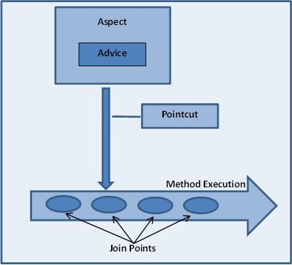

# AOP
- [AOP](#aop)
  - [Reference](#reference)
  - [Enable Aspect-JS Annotation](#enable-aspect-js-annotation)
    - [@EnableAspectJAutoProxy class/interface](#enableaspectjautoproxy-classinterface)
    - [@Aspect class/interface](#aspect-classinterface)
  - [Pointcut designators](#pointcut-designators)
  - [execution](#execution)
  - [within](#within)
  - [arg & @args](#arg--args)
  - [this(proxy) & target(object)](#thisproxy--targetobject)
  - [@target(CLASS-WITH-ANNOTATION)](#targetclass-with-annotation)
  - [@annotation(ANNOTATION-NAME)](#annotationannotation-name)
  - [@within(CLASS-WITH-ANNOTATION)](#withinclass-with-annotation)
  - [bean](#bean)
  - [Combining the pointcut](#combining-the-pointcut)
  - [Sharing common pointcut definitions](#sharing-common-pointcut-definitions)
  - [Advice Configuration](#advice-configuration)
    - [Parameter In Advices](#parameter-in-advices)
      - [@Around methodX](#around-methodx)
      - [@After(YY) methodX](#afteryy-methodx)
      - [@Before(YY) methodX](#beforeyy-methodx)
      - [@AfterReturning(YY) methodX](#afterreturningyy-methodx)
      - [@AfterThrowing(YY) methodX](#afterthrowingyy-methodx)
  - [In-place pointcut](#in-place-pointcut)
  - [Passing parameters to advice from pointcut](#passing-parameters-to-advice-from-pointcut)
  - [Determining argument names](#determining-argument-names)
  - [AOP Introductions](#aop-introductions)
  - [Retried](#retried)

## Reference
- [Spring AOP](https://segmentfault.com/a/1190000020904086) 
- [PointCut表示式](https://openhome.cc/Gossip/Spring/Pointcut.html)
- [PointCut designators](https://tedblob.com/pointcut-designators-of-spring-aop/)  
- [[Day 27] 遠征 Kotlin × Spring Boot 介紹 Spring AOP 機制](https://ithelp.ithome.com.tw/articles/10249999)
- [Spring AOP白話文，淺談Spring AOP的學習分享](https://medium.com/appxtech/spring-aop%E7%99%BD%E8%A9%B1%E6%96%87-%E6%B7%BA%E8%AB%87spring-aop%E7%9A%84%E5%AD%B8%E7%BF%92%E5%88%86%E4%BA%AB-1985489d008)  
- [Expression](https://www.eclipse.org/aspectj/doc/released/progguide/semantics-pointcuts.html)

  
- Aspect 切面：由切入點（PointCut）與 通知（Advice）組成，主要就是用來設定切入點（PointCut）與切入特定動作（Advice）   
- PointCut：設定要被 AOP 切入的位置，例如某個類別或函數     
- JoinPoint：為 PointCut 切入後的實際切入點，通常是一個函數   
- Advice為 Joint Point 切入點實際要執行的動作，通常會將 Advice 模擬為一個攔 截器（Interceptor），並且會在連接點（Join Point）上維護多個 Advice 進行層層攔截  
## Enable Aspect-JS Annotation

- `@enableAspectJAutoProxy` + `@Configuration`
- `@Component` + `@Aspect` (Point-Cut and Advise Setup )

### @EnableAspectJAutoProxy class/interface

Enable the aspect setup for spring application

```java 
@Configuration
@EnableAspectJAutoProxy
public class Config {
    // ...
}
```

### @Aspect class/interface

Define a `@Component` class is a cross-cutting concern
```java 
@Aspect
@Component // @aspect must annotate with component 
public class ExampleAspect {
    // ...
}
```
## Pointcut designators
    
|    `*`   |   `*(..)`   |  .  + `.*` |
| ------ | -------------| --- |
|  any   | any methods with `>=0` parameters | include this 
layer `.` +  and `*` all its sub layers

## execution

```java
// ? : optional
execution(modifiers-pattern? 
          return-type-pattern 
          declaring-type-pattern? 
          Method-name-pattern(param-pattern)
          throws-pattern?)

// any public method with 
// any return types 
// having >= 0 parameters
execution(public * *(..))

// any method with 
// '--> name starting with accountBy
// '--> having >= 0  parameters
execution(* accountBy*(..))

// any method with
// '--> name starting with accountBy
// '--> having String type parameter
// e.g. accountByXyc or accountByVoo
execution(* accountBy*(String))

// the first parameter can be of any type
// the second parameter must be String type 
execution(* get*(*,String))

// first parameter should be String type
// rest parameters can be of any types
execution(* get*(String, ..))

// the execution of any method defined 
// by the AccountService interface:
execution(* com.xyz.service.AccountService.*(..)) 

// the execution of any method 
// defined in the service package:
execution(* com.xyz.service.*.*(..))

// the execution of any method 
// defined in the service package or a sub-package
execution(* com.xyz.service..*.*(..))
```


## within 

Any JoinPoint within the service package
```java
within(com.xyz.service.*)
```
Any JoinPoint within the service package or a sub-package
```java
within(com.xyz.service..*)
```

---

```java
within(com.sample.model.AccountDAO) 
//equals 
execution(* com.sample.model.AccountDAO.*(..))

within(com.sample.model.*) 
//equals 
execution(* com.sample.model.*.*(..))

// Methods of com/sample/model/
// Methods of com/sample/model/*/
within(com.sample.model..*) 
// equals
execution(* com.sample.model.service..*.*(..))
```
## arg & @args

`args(xxx.yyy.dataType)`
Any JoinPoint which takes a single parameter, and where the argument passed at runtime is `Serializable`
```java
// the execution matches 
// if the ARGUMENT passed at runtime 
// is Serializable
args(java.io.Serializable)

// the execution matches 
// if the target method signature
// declares a single PARAMETER of type Serializable
execution(* *(java.io.Serializable))
```

`@args(com.xxx.annotations.YOUR-ANNOTATION)`
```java
@Retention(RUNTIME)
public @interface Country {
}

@Country
public enum CountryCode {
    US, UK, IN, JA
}

// any join point
// which method takes a single parameter, 
// and where the argument passed at runtime 
// has the @Country annotation
@Pointcut("@args(com.xxxx.annotations.Country)")
public void countryPointcut() {}

// Give pointcut advise
@After("countryPointcut()")
public void afterCountryAdvice(JoinPoint joinPoint) {
    log.info("After - countryPointcut" + joinPoint.getSignature().getName());
}

// Add Jointcut for this method   
// coz arg `countryCode` has the @Country annotation
public String getCountryCode(CountryCode countryCode) {
    return countryCode;
}
```

## this(proxy) & target(object)

this : all join points where `this instanceof Some-Type` is true

```java
public class IMPLEMENTATION implements INTERFACE {
  //....
}

@Pointcut("target(com.xxx.pointcutadvice.dao.INTERFACE)")
```

On the other hand, if `IMPLEMENTATION` doesn't implement any INTERFACE, or the `proxyTargetClass` property is set to `true`, then the proxied object will be a SUBCLASS of `IMPLEMENTATION` and we can use the `this` PCD:
```java
@Pointcut("this(com.xxx.pointcutadvice.dao.IMPLEMENTATION)")
```

For example 
```java
@Component  
public class CountriesRepositoryImpl implements CountryRepository {
    @Override
    public List<String> getCountries() {
       return countries;
    }
}

@Component
@Aspect
public class CurrenciesRepositoryAspect {

    // Add JoinCut for
    // All implementation and interface of CountryRepository
    @Before("target(com.xxx.repo.CountryRepository)")
    public void beforeTargetCountriesRepository() {
        //...
    }
 
    @After("this(com.xxx.repo.CountryRepository)")
    public void afterCountriesRepository() {
        //...
    }
}
```

## @target(CLASS-WITH-ANNOTATION)

It limits matching to join points where the **TARGET CLASS** of the executing `OBJECT` has an ANNOTATION of the given type
```java
// Any JoinPoints match Classes with Annotation @Repository
@Pointcut("@target(org.springframework.stereotype.Repository)")
```
## @annotation(ANNOTATION-NAME)

- [source code](https://www.baeldung.com/spring-aop-annotation)

It limits matching to method executions where the **TARGET METHOD** has the given annotation.
```java
@Target(ElementType.METHOD)
@Retention(RetentionPolicy.RUNTIME)
public @interface LogExecutionTime {
    //..
}

@Aspect
@Component
public class adviseConfig {
    //                    annotation name
    @Around("@annotation(LogExecutionTime)")
    public Object logExecutionTime(ProceedingJoinPoint joinPoint) throws Throwable {
            long start = System.currentTimeMillis();
    
            //-------------- end of before 
            
            /* Target Method is proceeding       */ 
            Object proceed = joinPoint.proceed();
            /*-----------------------------------*/

            // ------------- start of after
            long executionTime = System.currentTimeMillis() - start;
            System.out.println(joinPoint.getSignature() + " executed in " + executionTime + "ms");            
            return proceed;
    }
}

// A method with @LogExcutionTime annotation
@LogExecutionTime
public void serve() throws InterruptedException {
    Thread.sleep(2000);
}
// console : 
// void org.pttClone.Service.serve() executed in 2030ms
```


## @within(CLASS-WITH-ANNOTATION)

Add JoinPoint within any class with `@xxx` annotation
```java
@Secured
public class Security {
  public String getSecurityAlgorithm() {
    //..
  }
  public int getSecurityScore() {
    //...
  }
}
// all the methods inside the class annotated with @Secured.
@Pointcut("@within(com.project.annotations.Secured)") 
public void securedClassPointcut() {}
```


## bean

Any JoinPoint with method has named `@bean(name = tradeService)`:
```java
bean(tradeService)
```

Any JoinPoint `@beans` having names that match the wildcard expression `*Service`
```java
bean(*Service)
```


## Combining the pointcut 

via `&&`, `||` and `!`. 

```java
@Pointcut("execution(public * *(..))")
 private void anyPublicOperation() {}
 
@Pointcut("within(com.demo.trading..*)")
private void inTrading() {}
```

`tradingOperation` matches if a method execution represents any public methods in the trading module (`com/demo/trading` or `com.demo.trading/*`)
```java
@Pointcut("anyPublicOperation() && inTrading()")
private void tradingOperation() {}
```

## Sharing common pointcut definitions

Spring recommends defining a class named `SystemArchitecture` aspect that captures common pointcut expressions.

A typical such aspect would look as follows:
```java
import org.aspectj.lang.annotation.Aspect;
import org.aspectj.lang.annotation.Pointcut;

@Aspect
public class SystemArchitecture {
  /**
   * A join point is in the web layer 
   * if the method is defined 
   * in a type in the com.xyz.someapp.web package 
   * or any sub-package
   * under that.
   */
  @Pointcut("within(com.xyz.someapp.web..*)")
  public void inWebLayer() {}

  /**
   * A join point is in the service layer 
   * if the method is defined
   * in a type in the 
   * com.xyz.someapp.service package 
   * or any sub-package under that.
   */
  @Pointcut("within(com.xyz.someapp.service..*)")
  public void inServiceLayer() {}

  /**
   * A join point is in the data access layer if the method is defined
   * in a type in the 
   * com.xyz.someapp.dao package 
   * or any sub-package under that.
   */
  @Pointcut("within(com.xyz.someapp.dao..*)")
  public void inDataAccessLayer() {}

  /**
   * A business service is the execution of any methods defined on a service
   * interface. 
   * This definition assumes that interfaces are placed in the
   * "service" package, and that implementation types are in sub-packages.
   * 
   * If you group service interfaces by functional area (for example, 
   * in packages com.xyz.someapp.abc.service and com.xyz.def.service) then
   * the pointcut expression 
   * "execution(* com.xyz.someapp..service.*.*(..))"
   * could be used instead.
   */
  @Pointcut("execution(* com.xyz.someapp.service.*.*(..))")
  public void businessService() {}
  
  /**
   * A {@code dataAccessOperation} is 
   * the execution of any method 
   * defined on a dao interface. 
   * This definition assumes that interfaces are placed 
   * in the "dao" package, 
   * and that implementation types are in sub-packages.
   */
  @Pointcut("execution(* com.xyz.someapp.dao.*.*(..))")
  public void dataAccessOperation() {}

}
```

## Advice Configuration

Giving Advises to pointCuts

```java
Advices = {@Around, @Before, @After, @AfterReturning, @AfterThrowing}
```
### Parameter In Advices

`JoinPoint` : `@Before, @After, @AfterThrowing, and @AfterReturning`

`ProceedingJoinPoint` : is an extension of the JoinPoint that exposes the additional `proceed()` method

#### @Around methodX
around advice means we are adding extra code both `@before` and `@after` target method execution. 

#### @After(YY) methodX

advice(methodX)會在Target Method返回或拋出異常後呼叫，類似例外中的`finally`

**It is typically used for releasing resources.**
#### @Before(YY) methodX

advice(methodX)會在Target Method呼叫之前被呼叫
#### @AfterReturning(YY) methodX

advice(methodX) After Target Method returning

```java
import org.aspectj.lang.annotation.Aspect;
import org.aspectj.lang.annotation.AfterReturning;

@Aspect
public class AfterReturningExample {

  @AfterReturning(
    pointcut="com.xxx.applicationName.SystemArchitecture.dataAccessOperation()",
    returning="retVal" /** return value of Join Cut **/)
  public void doAccessCheck(Object retVal) {
    // ...
  }
  
}
```
- The name used in the returning attribute must correspond to the name of a parameter in the advice method.
#### @AfterThrowing(YY) methodX
Advice(`methodX`)會在Target Method(`YY`)拋出異常後被呼叫
```java
import org.aspectj.lang.annotation.Aspect;
import org.aspectj.lang.annotation.AfterThrowing;

@Aspect
public class AfterThrowingExample {

  @AfterThrowing(
    pointcut="com.xyz.myapp.SystemArchitecture.dataAccessOperation()",
    throwing="ex")
  public void doRecoveryActions(DataAccessException ex) {
    // ...
  }
}
```

--- 

```java
@Aspect
@Component
public class GlobalAopAdvice {

    @Before("com.demo.aop.SystemArchitecture.dataAccessOperation()")
    public void doAccessCheck() {
        // ... 
    }

    @Before("...") 
    public void logArgs(JoinPoint joinPoint) {
        System.out.println("Target Method's parameters" + 
                            Arrays.toString(joinPoint.getArgs()));
    }

    // intercept after target method returns val without throwing exception
    @AfterReturning( pointcut="...", returning="returnVal")
    public void logReturnVal(Object returnVal) {
        log.info("Target method return value：" + returnVal);
    }

    // Only intercept the exception thrown by target method
    @AfterThrowing("com.demo.aop.SystemArchitecture.dataAccessOperation()")
    public void doRecoveryActions() {
        // ... 
    }

    // Intercept Both Exception/Return value 
    // from target method
    @After("com.demo.aop.SystemArchitecture.dataAccessOperation()")
    public void doReleaseLock() {
        // after method is kinda like finally in try-catch-finally
    }

    // @around =  @Before + @AfterReturning 
    @Around("com.demo.aop.SystemArchitecture.businessService()")
    public Object doBasicProfiling(ProceedingJoinPoint pjp) throws Throwable {
        /** ********************************************
          * Code Block 
          * Before target method
          * ------------------------------------------ */
        Object retVal = pjp.proceed();
        /** -----------------------------------------------------
          * Code Block 
          * after target method
          * -----------------------------------------------------*/
        return retVal;
    }
}
```
## In-place pointcut 

```java
package xxx.com.PointCutConfig;
@Pointcut("execution(* ric.study.demo.dao.*.*(..))")
public void daoLayer() {}

package xxx.com.AdviseConfig;
@Before("xxx.com.PointCutConfig.daoLayer()")
    public void doBeforedaoLayer(){
        //....
}
```

or using an in-place pointcut expression
```java 
// without configuring Point cut
// with point-cut argument
@Before("execution(* ric.study.demo.dao.*.*(..))")
public void doAccessCheck() {
    // ...
}
```

## Passing parameters to advice from pointcut

Use the binding form of `args` to make argument values available to the advice body. 

If a parameter name is used in place of a type name in an args expression, then the value of the corresponding argument will be passed as the parameter value when the advice is invoked.

Suppose you want to advise the execution of dao operations that take an Account object as the first parameter, and you need access to the account in the advice body :
```typescript 
@Pointcut("execution(* com.xyz.someapp.dao.*.*(..))")
public void dataAccessOperation() {}

// 
@Before("com.xyz.myapp.SystemArchitecture.dataAccessOperation() &&" + "args(account,..)")
//              '---------------------+
public void validateAccount(Account account) {
  // ...
}

// or 
@Pointcut("com.xyz.myapp.SystemArchitecture.dataAccessOperation() &&" + "args(account,..)")
private void accountDataAccessOperation(Account account) {}

@Before("accountDataAccessOperation(account)")
public void validateAccount(Account account) {
  // ...
}
```

```java
@Retention(RetentionPolicy.RUNTIME)
@Target(ElementType.METHOD)
public @interface Auditable {
	AuditCode value();
}

// pointcut : @auditable anyPublicMethod()
// extract the AuditCode value
@Before("com.xyz.lib.Pointcuts.anyPublicMethod() && " + 
        "@annotation(auditable)")
public void audit(Auditable auditable) {
  AuditCode code = auditable.value();
  // ...
}
```

## Determining argument names

If the parameter names have been specified by the user explicitly, then the specified parameter names are used
```java
@Before(
   value="com.xyz.lib.Pointcuts.anyPublicMethod() && target(bean) && @annotation(auditable)",
   argNames="bean,auditable")
public void audit(JoinPoint jp,Object bean, Auditable auditable) {
  AuditCode code = auditable.value();
  // ... use code and bean
}
```


If the first parameter is of the `JoinPoint`, `ProceedingJoinPoint`, or `JoinPoint.StaticPart` type, **you may leave out(ignore) the name of parameter fo them from the value of the `argNames` attribute**

```java
@Around("execution(List<Account> find*(..)) &&" +
        "com.xyz.myapp.SystemArchitecture.inDataAccessLayer() && " +
        "args(accountHolderNamePattern)" /** ignore them **/)		
public Object preProcessQueryPattern(ProceedingJoinPoint pjp, String accountHolderNamePattern)
throws Throwable {
  String newPattern = preProcess(accountHolderNamePattern);
  return pjp.proceed(new Object[] {newPattern});
}        
```


## AOP Introductions

- [Spring AOP之Introduction(@DeclareParents)](https://www.cnblogs.com/lcngu/p/6346777.html)
- [定義 Introduction](https://openhome.cc/Gossip/Spring/Introduction.html)
Introductions (known as inter-type declarations in AspectJ) **enable an aspect to declare that advised objects implement a given interface, and to provide an implementation of that interface on behalf of those objects.**

**An introduction is made using the `@DeclareParents` annotation.** 
  
For example, given an interface `Verifier`, and an implementation of that interface `VerifierImpl`, the following aspect declares that all implementors of service interfaces also implement the `Verifier` interface.
```java
public interface Verifier {
    public boolean incrementUseCount();
}
public class VerifierImpl implements Verifier {
    @Override
    public boolean incrementUseCount() {
      /** Implementations **/
    }
}

@Aspect
public class UsageTracking {
  // All the service types objects are now also
  // implementing VerifierImpl
  @DeclareParents(
    value="com.xzy.myapp.service.*+",
    defaultImpl=VerifierImpl.class)
  public static Verifier mixin; // Configuration

  @Before("com.xyz.myapp.SystemArchitecture.businessService() &&" + "this(Verifier)")
  public void recordUsage(Verifier verifier) {
      Verifier.incrementUseCount();
  }
}
```

## Retried

**The execution of business services can sometimes fail due to concurrency issues (e.g, deadlock loser).** 

If the operation is retried, it is quite likely to succeed next time round. 

For business services where it is appropriate to retry in such conditions (idempotent operations that don't need to go back to the user for conflict resolution), **we'd like to transparently retry the operation to avoid the client seeing a `PessimisticLockingFailureException`.**

**Use `@around` advice so that we can call proceed multiple times** 
```java 
@Retention(RetentionPolicy.RUNTIME)
public @interface Idempotent {
  // marker annotation
}

@Aspect
public class ConcurrentOperationExecutor implements Ordered {
    private static final int DEFAULT_MAX_RETRIES = 2;
    private int maxRetries = DEFAULT_MAX_RETRIES;

    // Higher Order than transaction advise
    private int order = 1;

    // Setters
    public void setMaxRetries(int maxRetries) {
        this.maxRetries = maxRetries;
    }
   
    public int getOrder() {
        return this.order;
    }
   
    public void setOrder(int order) {
        this.order = order;
    }
   
    // retry for 
    // class with annotation @idempotent under the package
    // businessService 
   @Around("com.xyz.myapp.SystemArchitecture.businessService() && " + 
        "@annotation(com.xyz.myapp.service.Idempotent)")
    public Object doConcurrentOperation(ProceedingJoinPoint pjp) throws Throwable { 
        
        int numAttempts = 0;
        
        PessimisticLockingFailureException lockFailureException;
        do {
            numAttempts++;
            try { 
                return pjp.proceed();
            }catch(PessimisticLockingFailureException ex){
                lockFailureException = ex;
            }
        }
        while(numAttempts <= this.maxRetries);
        throw lockFailureException;
    }
}
```
- Note that the aspect implements the `Ordered` interface so we can set the precedence of the aspect higher than the transaction advice (we want a fresh transaction each time we retry).