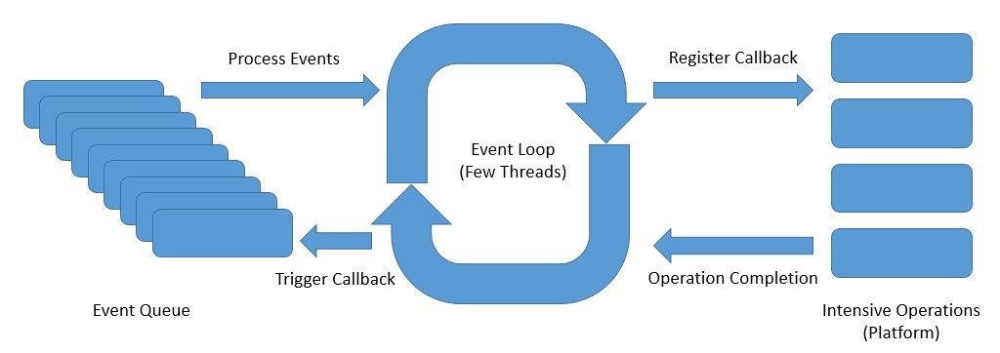

# Reactive Programming in Spring Framework

[docs.spring.io web-reactive](https://docs.spring.io/spring-framework/docs/current/reference/html/web-reactive.html#webflux)

The reactive-stack web framework, Spring WebFlux, was added later in version 5.0  
- It is fully non-blocking, supports Reactive Streams back pressure, and runs on such servers as Netty, Undertow, and Servlet 3.1+ containers.

The original web framework included in the Spring Framework, **Spring Web MVC, was purpose-built for the Servlet API and Servlet containers.**

## Spring MVC 

**Spring MVC是透過thread-per-request model，也就是一個request會對應一條thread**，但是request很有可會會因為call 其他服務的api、讀取或寫入DB等等的事情導致thread等待，也就是所謂的blocking。

在傳統的javascript網頁開發沒有非同步的概念，讀取資料時整個畫面會loading無法控制，造成使用者體驗很差，效率相對不好。

**為減少thread等待時間，Spring MCX利用Event Loop，專門處理thread，當request進來把要處理的task放入queue中，就釋放request對應的thread**，Event Loop內有worker thread來處理queue的tasks，worker threads會從queue內把task處理完畢後再回傳，藉此省去thread的等待時間，可以更有效的利用CPU，提高處理效能，從javascript來思考，當AJAX出現後，開發者將需要等待的任務交由AJAX完成，透過`callback`來取回結果，避免view處於一直Loading畫面。

  

## Spring WebFlux

Spring WebFlux，核心是建立於Reactor之上，有別於以往使用Tomcat，改為非阻斷的Netty，Netty改用了Event Loop的方式來處理Request，對應的DB也需要有支援 Reactive，呼應到之前所說，進入到Reactive的世界後，所有相關的都需要改為Reactive。

## (Applicability) Spring MVC or WebFlux?

1. If you have a Spring MVC application that works fine, there is no need to change.   

2. **If you are already shopping for a non-blocking web stack**, Spring WebFlux offers the same execution model benefits as others in this space and also provides a choice of servers (Netty, Tomcat, Jetty, Undertow, and Servlet 3.1+ containers), a choice of programming models (annotated controllers and functional web endpoints), and a choice of reactive libraries (Reactor, RxJava, or other).

3. **If you are interested in a lightweight, functional web framework for use with Java 8 lambdas or Kotlin**
    - you can use the Spring WebFlux functional web endpoints. That can also be a good choice for smaller applications or microservices with less complex requirements that can benefit from greater transparency and control.

4. In a microservice architecture, you can have a mix of applications with either Spring MVC or Spring WebFlux controllers or with Spring WebFlux functional endpoints. 
    - Having support for the same annotation-based programming model in both frameworks makes it easier to re-use knowledge while also selecting the right tool for the right job.

5. **A simple way to evaluate an application is to check its dependencies.** 
    - If you have blocking persistence APIs (JPA, JDBC) or networking APIs to use, Spring MVC is the best choice for common architectures at least. It is technically feasible(MACHBAR) with both Reactor and RxJava to perform blocking calls on a separate thread but you would not be making the most of a non-blocking web stack.


- **If you have a Spring MVC application with calls to remote services, try the reactive WebClient** 
    > (The greater the latency per call or the interdependency among calls, the more dramatic the benefits.). 
    - You can return reactive types (Reactor, RxJava, or other) directly from Spring MVC controller methods. 
    - Spring MVC controllers can call other reactive components too.

> Latency or network delay is the **overall amount of time it takes for information to be transmitted from the source to the destination** in a data network. Latency can affect the interaction between the participants on the call.

- **If you have a large team**, keep in mind the steep learning curve in the shift to non-blocking, functional, and declarative programming. 
    - A practical way to start without a full switch is to use the reactive WebClient.

## BackPressure in WebFlux

  

- WebFlux uses TCP flow control to regulate the backpressure in bytes. 
    - But it does not handle the logical elements the consumer can receive. 
    - Let's see the interaction flow happening under the hood:

- WebFlux framework is responsible for the conversion of events to bytes in order to transfer/receive them through TCP
    - It may happen that the consumer starts and long-running job before requesting the next logical element

- Due to the nature of the TCP protocol, if there are new events the publisher will continue sending them to the network

- Spring WebFlux does not ideally manage backpressure between the services interacting as a whole system. 


```java
@Test
public void whenRequestingChunks10_thenMessagesAreReceived() {
    Flux request = Flux.range(1, 50);

    request.subscribe(
      System.out::println,
      err -> err.printStackTrace(),
      () -> System.out.println("All 50 items have been successfully processed!!!"),
      subscription -> {
          for (int i = 0; i < 5; i++) {
              System.out.println("Requesting the next 10 elements!!!");
              subscription.request(10);
          }
      }
    );

    StepVerifier.create(request)
      .expectSubscription()
      .thenRequest(10)
      .expectNext(1, 2, 3, 4, 5, 6, 7, 8, 9, 10)
      .thenRequest(10)
      .expectNext(11, 12, 13, 14, 15, 16, 17, 18, 19, 20)
      .thenRequest(10)
      .expectNext(21, 22, 23, 24, 25, 26, 27 , 28, 29 ,30)
      .thenRequest(10)
      .expectNext(31, 32, 33, 34, 35, 36, 37 , 38, 39 ,40)
      .thenRequest(10)
      .expectNext(41, 42, 43, 44, 45, 46, 47 , 48, 49 ,50)
      .verifyComplete();
```

