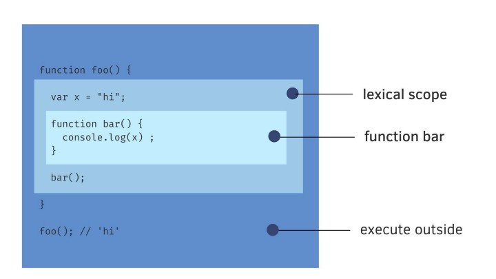
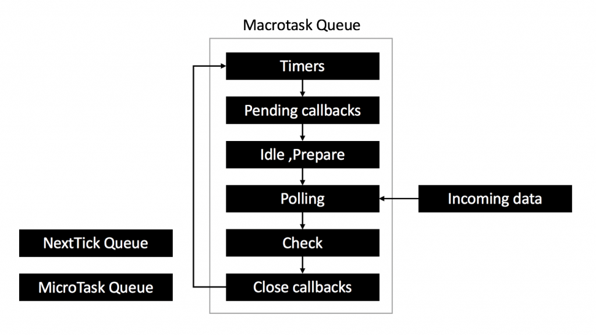
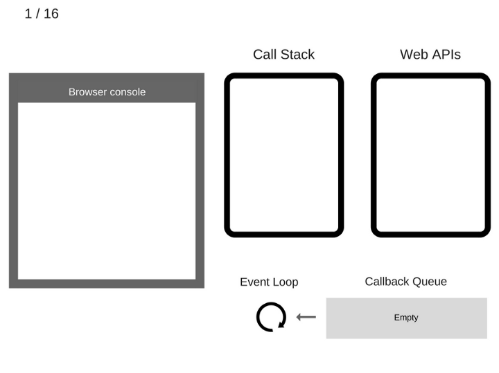

- [[轉職] Junior 後端工程師面試技術題](https://reurl.cc/x1lnK1)
- [[面試] 前端工程師一定要會的 JS 觀念題-中英對照之上篇](https://reurl.cc/pZLOKa)

## Closure 

>> Closure is when a function `remembers its lexical scope` even when the function is executed outside that lexical scope

  

```typescript
function createCounter() {
    let val = 0;
    return {
        increment() { val++ },
        getVal() { return val }
    }
}

let counter = createCounter();
counter.increment();
console.log(counter.getVal()); // 1
counter.increment();
console.log(counter.getVal()); // 2
```

## Hoisting

>>> JavaScript's default behavior of moving declarations to the top.

- var: 變數會被初始化為 undefined
- let, const : 不會先被初始化所以在賦值之前的 Temporal Dead Zone(TDZ, 時間死區) 取值會發生錯誤。

## FunctionProgramming

```javascript
function makeAdder(x) {

    return function(y) {
        // 函數被 return 後，還是能繼續存取環境中的 x 變數
        return x + y;
    };
}

// 建立一個新變數指向原本的函數 傳入 x 值，調用後可以得到 x 就是一個閉包
var add5 = makeAdder(5);
console.log(add5(2)) // 所以這裡結果為 7
```

## Prototype

- [Prototype-Based](https://maxleebk.com/2020/07/25/prototype/)
- [prototype(原型)](https://hackmd.io/@WangShuan/HJQgaUjhu#prototype%E5%8E%9F%E5%9E%8B)

基於原型(Prototype-Based)：與Class-Based相比沒有類別與實體的概念，它只有物件，新物件在初始化時以原型物件為範本獲得屬性，比如 JavaScript。

>>> A prototype is an object that can inherit other object properties.

在 JavaScript 裡，每個Function(including constructor)都擁有 prototype 這個訪問器屬性
```typescript
function Car(wheel, door, fuel) {
  this.wheel = wheel,
  this.door = door,
  this.fuel = fuel
};

let truck = new Car(6, 2, "柴油");

// instance 
truck.__proto__

// Constructor | Function
Car.prototype

// Ref to same Object
console.log(truck.__proto__ === Car.prototype);
```
- `new` 它將實例以及原型之間建立了連結。也就是 new 出來的物件中就可以呼叫Constructor | Function 中的方法與其原型中的方法，

通過原型建立的方法可以讓所有 new 出來的物件都使用到，
假設你在每個 new 出來的物件中撰寫方法，
會導致佔用非常多記憶體位置，
但如果你是使用原型方式建立方法，
就只需要佔用一個記憶體位置了。

### prototype chain

>>>在 JS 中每個Object都有自己的原型(.prototype)，而Object的原型還會有其原型(.__proro__)，直到該原型的原型(.__proro__)輸出為 null 為止。

物件之間的繼承關係，原來是一個接著一個不斷延續的，看起來就像條鎖鏈一樣
```typescript
truck.__proto__ // Car.prototype
truck.__proto__.__proto__ // Object.prototype
truck.__proto__.__proto__.__proto__  // null 代表 Object 是原型鏈的最頂端
```

## (ASYNC Actions) Promise & setTimeout

- [[RxJS] 認識 Scheduler](https://fullstackladder.dev/blog/2020/10/19/mastering-rxjs-34-introduce-scheduler-of-rxjs/)

>>> Promise & setTimeout : 非同步呼叫，會先將裡面的程式碼丟到一個「等待區 (task queue)」，然後繼續處理其他同步的程式碼，直到目前同步的程式碼處理完後，再從「等待區」將程式碼拿出來以「同步」的方式執行裡面的程式碼

  


## Deep Copy , Shallow Copy and Normal Copy

- [shallow-vs-deep-copy](https://dev.to/saimwebhr/normal-vs-shallow-vs-deep-copy-in-javascripttypescript-lhh)

If the copied instance value is updated, the original value is updated
```javascript
const original = { x: 0 }
const normalCopy = original;
normalCopy.x = 1; // also updates original.x
```

Shallow copy copies the outermost object value and does not copy the nested objects. 
```typescript
const user = {
  name: "John",
  contact: {
    home: "+4321",
  }
}

const shallowCopy = { ...user };
shallowCopy.name = "John Smith";// updates its own copy
shallowCopy.contact.home = "+9587";// updates both original and copy

console.log(user);
console.log(shallowCopy);

[LOG]: {
  "name": "John",
  "contact": {
    "home": "+9587"
  }
} 
[LOG]: {
  "name": "John Smith",
  "contact": {
    "home": "+9587"
  }
} 

const user = {
  name: "John",
  contact: {
    home: "+098",
  }
}
const deepCopy = JSON.parse(JSON.stringify(user));
deepCopy.name = "John Smith";
deepCopy.contact.home = "+070";

console.log(user);
console.log(shallowCopy);
```

## JS Runtime(執行環境): Call Stack, Event Loop, Callback Queue

- [【筆記】到底 Event Loop 關我啥事？](https://medium.com/infinitegamer/why-event-loop-exist-e8ac9d287044)
- [[JS基礎] 從for loop搭配setTimeout理解JS runtime, scope, var & let](https://medium.com/johnny%E7%9A%84%E8%BD%89%E8%81%B7%E5%B7%A5%E7%A8%8B%E5%B8%AB%E7%AD%86%E8%A8%98/js%E5%9F%BA%E7%A4%8E-%E5%BE%9Efor-loop%E6%90%AD%E9%85%8Dsettimeout%E7%90%86%E8%A7%A3-event-loop-scope-chain-var-let-ab63da5d792)

Event Loop 將「費時較久」或「須等待事件才能啟動」的任務往後安排，因而能打造流暢的使用者體驗（Outstanding UX）：

  

```javascript
// i is global variable
for(var i = 1; i < 6; i++) {
  setTimeout(function() { // 丟到Callback Queue
     console.log(i)
  },1000)
}
console.log('The loop is done!')


// i is local variable
for(let i = 1; i < 6; i++) {
  setTimeout(function() { // 丟到Callback Queue
     console.log(i)
  },1000)
}
console.log('The loop is done!')
```
- setTimeout function -> push to stack -> after 1 sec -> push to callback queue (6 times iterations)
- When stack is empty 
- `console.log(i)` in callback queue and `i` is now 6