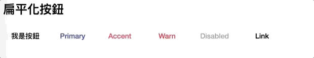
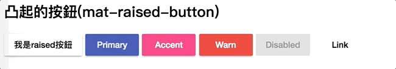
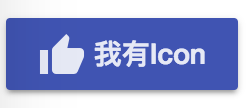
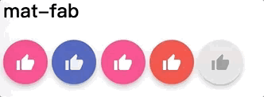
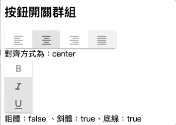

# Button 
[[Angular Material完全攻略] Day 04 - MatButton、MatButtonToggle和MatRipple](https://ithelp.ithome.com.tw/articles/10193055)

- [Button](#button)
  - [mat-button](#mat-button)
  - [mat-raised-button](#mat-raised-button)
  - [Button with mat-icon](#button-with-mat-icon)
  - [mat-icon-button](#mat-icon-button)
  - [mat-icon-button with mat-raised-button](#mat-icon-button-with-mat-raised-button)
  - [mat-fab](#mat-fab)
    - [mat-mini-fab](#mat-mini-fab)
  - [mat-button-toggle](#mat-button-toggle)

## mat-button

```html
<button mat-button color=".." >

<button mat-button color="primary">Primary</button>
<button mat-button color="accent">Accent</button>
<button mat-button color="warn">Warn</button>
<button mat-button disabled>Disabled</button>
<a mat-button>Link</a> 
```



## mat-raised-button

```html
<button mat-raised-button color="primary">Primary</button>
<button mat-raised-button color="accent">Accent</button>
<button mat-raised-button color="warn">Warn</button>
<button mat-raised-button disabled>Disabled</button>
<a mat-button>Link</a>
```




## Button with mat-icon

```html
<button mat-raised-button color="primary"><mat-icon>thumb_up</mat-icon> 我有Icon</button>
```

  


## mat-icon-button

```html
<button mat-icon-button color="primary"><mat-icon>thumb_up</mat-icon></button>
```
  


## mat-icon-button with mat-raised-button

```html
<button mat-raised-button 
        mat-icon-button 
        color="primary">
                <mat-icon>thumb_up</mat-icon>
</button>
```
  


## mat-fab

```html
<button mat-fab>
  <mat-icon>thumb_up</mat-icon>
</button>
<button mat-fab color="primary">
  <mat-icon>thumb_up</mat-icon>
</button>
<button mat-fab color="accent">
  <mat-icon>thumb_up</mat-icon>
</button>
<button mat-fab color="warn">
  <mat-icon>thumb_up</mat-icon>
</button>
<button mat-fab disabled>
  <mat-icon>thumb_up</mat-icon>
</button>
```



### mat-mini-fab

```html
<button mat-mini-fab>
  <mat-icon>thumb_up</mat-icon>
</button>
<button mat-mini-fab color="primary">
  <mat-icon>thumb_up</mat-icon>
</button>
<button mat-mini-fab color="accent">
  <mat-icon>thumb_up</mat-icon>
</button>
<button mat-mini-fab color="warn">
  <mat-icon>thumb_up</mat-icon>
</button>
<button mat-mini-fab disabled>
  <mat-icon>thumb_up</mat-icon>
</button>
```


## mat-button-toggle

```html
<mat-button-toggle-group #formatAlignGroup="matButtonToggleGroup">
  
  <!-- formatAlignGroup.value= left/center/right/justify-->
  <mat-button-toggle value="left">
    <mat-icon>format_align_left</mat-icon>
  </mat-button-toggle>
  
  <!-- 預設被選取 -->
  <mat-button-toggle value="center" checked="true">
    <mat-icon>format_align_center</mat-icon>
  </mat-button-toggle>
  
  <mat-button-toggle value="right">
    <mat-icon>format_align_right</mat-icon>
  </mat-button-toggle>

  <!-- disabled button toggle -->
  <mat-button-toggle value="justify" disabled>
    <mat-icon>format_align_justify</mat-icon>
  </mat-button-toggle>
</mat-button-toggle-group>
<div>對齊方式為：{{ formatAlignGroup.value }}</div>

<!-- 加上multiple，則裡面的mat-buttong-toggle可以複選 -->
<!-- 加上vertical="true", 改變排列方式 -->
<mat-button-toggle-group multiple vertical="true">
  <mat-button-toggle value="bold" #buttonToggleBold>
    <mat-icon>format_bold</mat-icon>
  </mat-button-toggle>
  <mat-button-toggle value="italic" checked="true" #buttonToggleItalic>
    <mat-icon>format_italic</mat-icon>
  </mat-button-toggle>
  <mat-button-toggle value="underlined" checked="true" #buttonToggleUnderlined>
    <mat-icon>format_underlined</mat-icon>
  </mat-button-toggle>
</mat-button-toggle-group>
<div>粗體：{{ buttonToggleBold.checked }}、斜體：{{ buttonToggleItalic.checked }}、底線：{{ buttonToggleUnderlined.checked }}</div>
```


