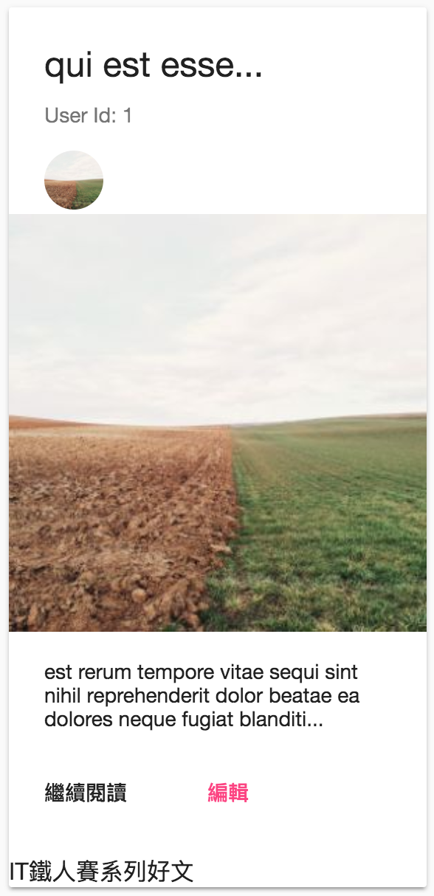
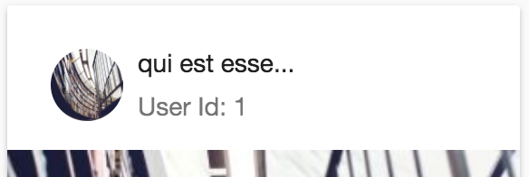
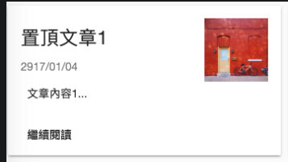
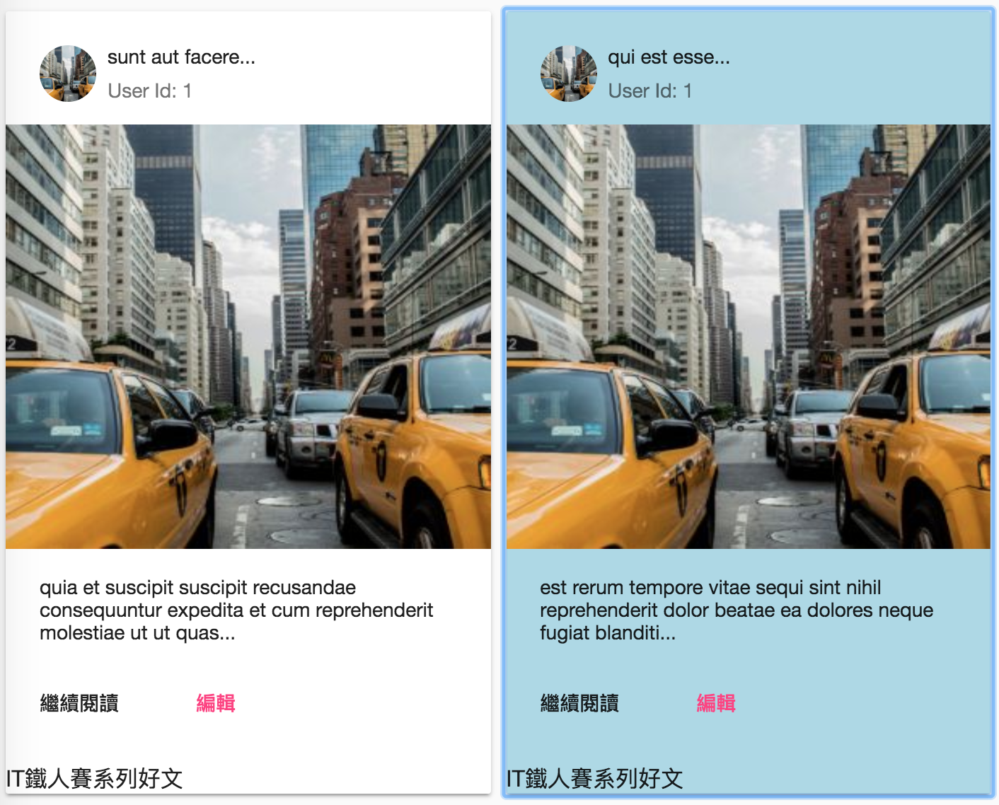

# mat-card

- [mat-card](#mat-card)
  - [mat-card-header](#mat-card-header)
  - [mat-card-tile-group](#mat-card-tile-group)
  - [mat-card's tabindex](#mat-cards-tabindex)

```html
<mat-grid-tile>
    
    <!-- EACH mat-card setUp -->
    <mat-card>
        <mat-card-tile-group> or <mat-card-header>
            <mat-card-title></mat-card-title>
            <mat-subtitle></mat-subtitle>
            
        </mat-card-tile-group> or </mat-card-header>
                    
                        <mat-card-content></mat-card-content>
                            <mat-card-actions></mat-card-actions>
                                <button mat-button></button>
    <mat-card-footer></mat-card-footer>
    </mat-card>

    
</mat-grid-tile>
```


```html
<!--   
  .post-tile {
  align-self: flex-start;
  width: 100%;
  margin: 5px;
}  
-->
<mat-grid-tile *ngFor="let post of posts$ | async" rowspan="6"> 
  <mat-card class="post-tile"> 
    
    <mat-card-title>{{ post.title.substring(0, 15) }}...</mat-card-title> 
    
    <mat-card-subtitle>User Id: {{ post.userId }}</mat-card-subtitle> 
    
     
    
     
    
    <mat-card-content>{{ post.body.substring(0, 100) }}...</mat-card-content> 
    
    <mat-card-actions> 
      <button mat-button color="paimray">繼續閱讀</button> 
      <button mat-button color="accent">編輯</button> 
    </mat-card-actions> 
    
    <mat-card-footer>IT鐵人賽系列好文</mat-card-footer> 
  </mat-card> 
</mat-grid-tile> 
```
  


## mat-card-header

wrap `mat-card-title`, `mat-card-subtitle` and `img mat-card-avatar` as a block

```html
<mat-card-header>
  <mat-card-title>{{ post.title.substring(0, 15) }}...</mat-card-title>
  <mat-card-subtitle>User Id: {{ post.userId }}</mat-card-subtitle>
  
</mat-card-header>
```
  


## mat-card-tile-group

place `mat-card-title` and `mat-card-subtitle` on the left side and `mat-card-image` on the right side

```html
<mat-grid-tile rowspan="2">

  <mat-card class="post-tile">
    <mat-card-title-group>
      <mat-card-title>置頂文章1</mat-card-title>
      <mat-card-subtitle>2917/01/04</mat-card-subtitle>
      
    </mat-card-title-group>
    <mat-card-content>文章內容1...</mat-card-content>
    <mat-card-actions>
      <button mat-button color="paimray">繼續閱讀</button>
    </mat-card-actions>
  </mat-card>

</mat-grid-tile>
```
  

## mat-card's tabindex

```html
<!--
mat-card:focus {
 background: lightblue;
}
-->
<mat-grid-tile *ngFor="let post of posts$ | async; let index = index" rowspan="6">
  <mat-card class="post-tile" [tabindex]="index">
    ...
  </mat-card>
</mat-grid-tile>
```
  
