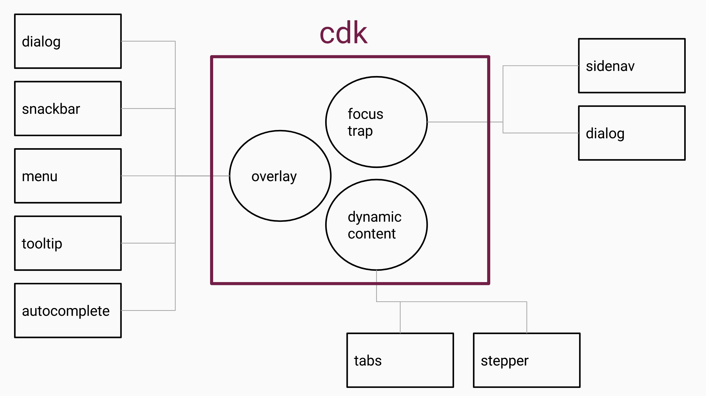

# CDK


CDK : mutual parts of each material

- [CDK](#cdk)
  - [Reference](#reference)
  - [Layout Set Up](#layout-set-up)
    - [BreakpointObserver#isMatched](#breakpointobserverismatched)
    - [BreakpointObserver#observe](#breakpointobserverobserve)
  - [Observables](#observables)
    - [(@output) CdkObserveContent observes ng-content](#output-cdkobservecontent-observes-ng-content)
    - [debounce property](#debounce-property)
  - [Scrolling](#scrolling)
    - [Observable ScrollDispatcher#scrolled and `<x cdkScrollable></x>`](#observable-scrolldispatcherscrolled-and-x-cdkscrollablex)
  - [Overlay](#overlay)
  - [Portal](#portal)
    - [TemplatePortal](#templateportal)

  


## Reference 
- [[Angular Material完全攻略] Day 26 - Angular CDK(2) - Accessibility](https://ithelp.ithome.com.tw/articles/10197159)
- [BreakpointObserver](https://material.angular.io/cdk/layout/overview)
- [Overlay](https://material.angular.io/cdk/overlay/api)
- [[Angular Material完全攻略] Day 29 - Angular CDK(5) - Portal](https://ithelp.ithome.com.tw/articles/10197393)
- [[Angular Material完全攻略]Angular CDK(隱藏版) - Coercion、Platform](https://ithelp.ithome.com.tw/articles/10197609)
## Layout Set Up


`BreakpointObserver` helps us to set up Layout for different devices.

```typescript 
import { LayoutModule } from '@angular/cdk/layout';

@NgModule({
  exports: [
    LayoutModule
  ]
})
export class SharedMaterialModule {}
```

### BreakpointObserver#isMatched

```typescript
export class DashboardComponent implements OnInit {
  constructor(private breakpointObserver: BreakpointObserver) {}
  ngOnInit() {
    // check if current screen size is matched 
    // > 599px : false
    // < 599ps : true 
    const isSmallScreen = breakpointObserver.isMatched('(max-width: 599px)');
  }
}
```

### BreakpointObserver#observe

`const Breakpoints: { XSmall: string; Small: string; Medium: string; Large: string; XLarge: string; Handset: string; Tablet: string; Web: string; HandsetPortrait: string; TabletPortrait: string; WebPortrait: string; HandsetLandscape: string; TabletLandscape: string; WebLandscape: string; };`


```typescript
this.breakpointObserver.observe('(orientation: portrait)').subscribe(result => {
  console.log(`{portrait: ${result.matches}`);
});

this.breakpointObserver.observe('(orientation: landscape)').subscribe(result => {
  console.log(`{landscape: ${result.matches}`);
});

// use these predefined breakpoints with BreakpointObserver 
this.breakpointObserver.observe([Breakpoints.HandsetLandscape, Breakpoints.HandsetPortrait])
  .subscribe(result => {
    console.log(`Handset: ${result.matches}`);
  });
```

## Observables

```typescript
import { LayoutModule } from '@angular/cdk/layout';
import { ObserversModule } from '@angular/cdk/observers';


@NgModule({
  exports: [
    LayoutModule,
    ObserversModule
  ]
})
export class SharedMaterialModule {}
```

### (@output) CdkObserveContent observes ng-content

```typescript
@Directive({
  selector: '[cdkObserveContent]',
  exportAs: 'cdkObserveContent',
})
export class CdkObserveContent implements AfterContentInit, OnDestroy {
  @Output('cdkObserveContent') event = new EventEmitter<MutationRecord[]>();
}
```


```typescript
<div class="content-wrapper" (cdkObserveContent)="projectContentChanged($event)">
  <ng-content></ng-content>
</div>

@Component({ ... })
export class CdkObserveContentDemoComponent {
    count = 0;
    
    projectContentChanged($event: MutationRecord[]) {
        ++this.count;
        console.log(`資料變更，第${this.count}次`);
        console.log($event, this.count);
    }
}
```

### debounce property

```html
<!-- activate after 1000/1000 seconds-->
<div class="content-wrapper" (cdkObserveContent)="projectContentChanged($event)" debounce="1000">
  <ng-content></ng-content>
</div>
```

## Scrolling

Listen scroll event

```typescript
import { ScrollDispatchModule } from '@angular/cdk/scrolling';

@NgModule({
  exports: [
    ScrollDispatchModule
  ]
})
export class SharedMaterialModule {}
```

### Observable ScrollDispatcher#scrolled and `<x cdkScrollable></x>`

```html
<mat-sidenav-content cdkScrollable>
  ...
</mat-sidenav-content>
```
```typescript
@Component({ ... })
export class DashboardComponent implements OnInit {
  constructor(private scrollDispatcher: ScrollDispatcher) {}
           
  ngOnInit() { 
    this.scrollDispatcher.scrolled().subscribe((scrollable: CdkScrollable) => {
      console.log('發生scroll了，來源為：');
      console.log(scrollable.getElementRef().nativeElement);
    });
  }
}
```

## Overlay

```typescript
import { OverlayModule } from '@angular/cdk/overlay';

@NgModule({
  exports: [
    OverlayModule
  ]
})
export class SharedMaterialModule {}
```

## Portal

A Portal is a piece of UI that can be dynamically rendered to an open slot on the page.


```html
<ng-template cdkPortal>
  <p>The content of this template is captured by the portal.</p>
</ng-template>

<!-- OR -->

<!-- This result here is identical to the syntax above -->
<p *cdkPortal>
  The content of this template is captured by the portal.
</p>
```
```typescript
@Component({ ... })
export class MainComponent implements OnInit {
    
    @ViewChildren(CdkPortal) templatPortals: QueryList<CdkPortal>;
    currentPortal: Portal<any>;
    
    changePortal1() {
        this.currentPortal = this.templatPortals.first;
    }
    
    changePortal2() {
        this.currentPortal = this.templatPortals.last;
    }
}
```

### TemplatePortal

```html
<div class="portal-demo">
  <div class="tabs">
    <button mat-button (click)="changePortal1()">功能1</button>
    <button mat-button (click)="changePortal2()">功能2</button>
    <button mat-button (click)="changePortal3()">功能3</button>
    <button mat-button (click)="changePortal4()">功能4</button>
  </div>
  <div class="tab-content">
    <div [cdkPortalOutlet]="currentPortal"></div>
  </div>
</div>


<!--     @ViewChildren(CdkPortal) templatPortals: QueryList<CdkPortal>; -->
<ng-template cdkPortal let-nameInTemplate="nameInObject">
  <p>
    this is used by @ViewChildren(cdkPortal)
  </p>
</ng-template>
<p *cdkPortal>
    this is used by @ViewChildren(cdkPortal)
</p>

<!-- @ViewChild('template') template3: TemplateRef<any>; -->
<ng-template #template let-nameInTemplate="nameInObject">
    @ViewChild('template') template3: TemplateRef<any>;
</ng-template>

```

`TemplatePortal(template: TemplateRef<any>：要傳入的template的參考, viewContainerRef: ViewContainerRef：畫面上的ViewContainerRef，來源可由注入取得,context?: any：要傳入的外部內容)`

```typescript
export class MainComponent implements OnInit {
    @ViewChildren(CdkPortal) templatPortals: QueryList<CdkPortal>;
    @ViewChild('template') template3: TemplateRef<any>;
    currentPortal: Portal<any>;

    constructor(
    private viewContainerRef: ViewContainerRef,
    private injector: Injector,
    @Inject(DOCUMENT) private document: any,
    private componentFactoryResolver: ComponentFactoryResolver,
    private appRef: ApplicationRef) {}
    
    // ... 

    // <ng-template cdkPortal>
    changePortal1() {
        this.templatPortals.first.context = { nameInObject: this.name };
        this.currentPortal = this.templatPortals.first;
    }

    changePortal2() {
        this.currentPortal = this.templatPortals.last;
    }


    // <ng-template #template>
    changePortal3() {
        this.currentPortal = new TemplatePortal(this.template3, this.viewContainerRef, { nameInObject: this.name });
    }

    // component
    changePortal4() {
        this.currentPortal = new ComponentPortal(Portal4Component, undefined, this._createInjector());
    }

    private _createInjector(): PortalInjector {
        const injectionTokens = new WeakMap();
        
        injectionTokens.set(PORTAL4_INJECT_DATA, { nameInObject: this.name });
        
        return new PortalInjector(this.injector, injectionTokens);
    }
}
```