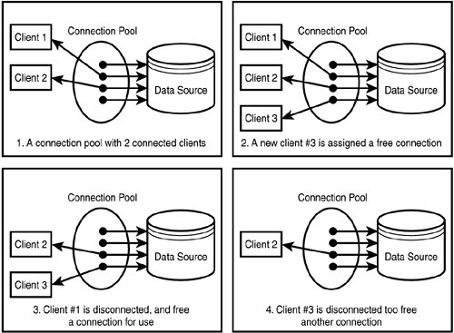

# Connection Pool
- [Connection Pool](#connection-pool)
    - [Def of Pool](#def-of-pool)
      - [Idle Time and Wait Timeout](#idle-time-and-wait-timeout)
  - [maxIdleTime](#maxidletime)
  - [Wait Timeout](#wait-timeout)
  - [`maxActive`](#maxactive)
  - [`maxIdle`](#maxidle)

[what-is-database-pooling](https://stackoverflow.com/questions/4041114/what-is-database-pooling)  
[Connection Pool](https://vocus.cc/article/5f800406fd89780001365d17)

Database connection pooling is a method used to keep database connections open so they can be reused by others.   

- Pooling keeps the connections active so that, when a connection is later requested, one of the active ones is used in preference to having to create another one.  

### Def of Pool

- Reusability (reduce to `new` an connecting-object to communicate with database)
    - With Connection Pool you don't have to create a connection (object) to DB for each request from client**

  

#### Idle Time and Wait Timeout
[maxactive-vs-maxidle-for-tomcat-connection-pools](https://stackoverflow.com/questions/9451818/what-is-the-difference-between-maxactive-vs-maxidle-for-tomcat-connection-pools)
[maxidletime-is-same-as-wait-timeout-of-mysql](https://stackoverflow.com/questions/24565274/c3p0-maxidletime-is-same-as-wait-timeout-of-mysql)
## maxIdleTime

TimeUnit (Default: 0) Seconds   

A Connection can remain pooled but unused before being discarded. 
- `0` means Idle Connections never EXPIRE.

## Wait Timeout

The amount of seconds during inactivity that DATABASE will wait before it will close a connection on a non-interactive connection in seconds. 

For Example, Connected from java. connections are in sleep state.

## `maxActive`

The maximum number of active connections that can be allocated from this pool **at the same time.**

**For example, 100 max Active means the pool can have 100 requests from e.g. request at the same time going to database**

## `maxIdle`

The maximum number of connections that should be kept in the pool **at all times.**   
This is to limit the idle connections when there are no requests go to database 

The connections (Not larger than the value of maxIdle) will not be released so that the next request for connections will be much faster.

So in a word, `maxActive` is to limit max connections (at the same time).   
But Idle (`maxIdle` or `minIdle`) is more for performance issue (exchange time with space/resources) , among which, the `maxIdle` is to limit the max connections(the resources) that you are going to exchange time with.
- Control the connections to less load of server

For example, say you have 100 Max Active connections and say you set `maxIdle` to 80. 
- **Assuming there are no requests going to the database, only 80 connections will be tested (via the validation query) and will stay active.** The other 20 will be closed. So at any point you can only have 80 idle connections.   

We also must set these two (idle, active) to be a different number to prevent additional (unnecessary) connections going out to the database. 
- It's because **every connection that is served by the database consumes resources (like memory)**.  But, assuming you have set the `maxActive` size to 100 and all 100 are in use almost all the time, this setting will obviously not matter.    
