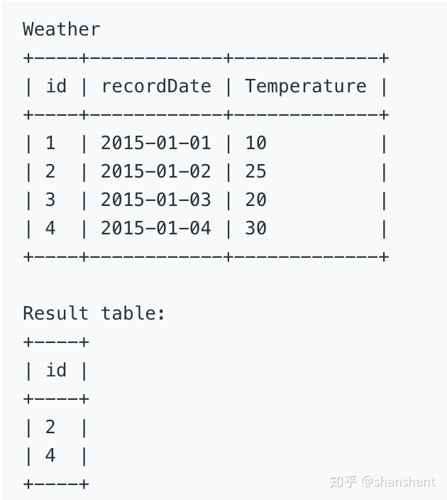

# mysql
[MysqlCheatSheet](https://devhints.io/mysql)


- [mysql](#mysql)
  - [Reference](#reference)
  - [TIPS](#tips)
  - [Average Selling Price](#average-selling-price)
  - [Sales Analysis I](#sales-analysis-i)
  - [Product Sales Analysis I](#product-sales-analysis-i)
  - [Second Highest Salary](#second-highest-salary)
  - [Duplicate Emails](#duplicate-emails)
  - [Customers Who Never Order](#customers-who-never-order)
  - [Rising Temperature](#rising-temperature)
  - [Delete Duplicate Emails\*\*](#delete-duplicate-emails)
  - [Game Play Analysis I](#game-play-analysis-i)
  - [Game Play Analysis II](#game-play-analysis-ii)
  - [Employee Bonus](#employee-bonus)
  - [Customer Placing the Largest Number of Orders](#customer-placing-the-largest-number-of-orders)
  - [Find Customer Referee](#find-customer-referee)
          - [tags : `NOT IN`, `IS NULL`, `NOT EXISTS`, `IFNull(colum, setDefaultVal)`](#tags--not-in-is-null-not-exists-ifnullcolum-setdefaultval)
  - [Classes More Than 5 Students](#classes-more-than-5-students)
  - [Consecutive Available Seats](#consecutive-available-seats)
  - [Friend Requests I: Overall Acceptance Rate\*\*](#friend-requests-i-overall-acceptance-rate)
  - [Sales Person](#sales-person)
  - [Triangle Judgement](#triangle-judgement)
  - [Shortest Distance in a Line](#shortest-distance-in-a-line)
  - [Biggest Single Number\*\*](#biggest-single-number)
  - [Not Boring Movies](#not-boring-movies)
  - [Swap Salary\*\*](#swap-salary)
  - [Actors \& Directors Cooperated \>= 3 Times\*\*](#actors--directors-cooperated--3-times)
  - [Project Employee I\*\*](#project-employee-i)
  - [Project Employees II](#project-employees-ii)
  - [Sales Analysis I](#sales-analysis-i-1)
  - [:star: Sales Analysis II](#star-sales-analysis-ii)
          - [tags : `with tableName as`](#tags--with-tablename-as)
  - [:star: Sales Analysis II](#star-sales-analysis-ii-1)
          - [tags : `Group by` , `min(YEAR)`](#tags--group-by--minyear)
  - [:star::star:Sales Analysis III](#starstarsales-analysis-iii)
  - [:star: Reported Posts](#star-reported-posts)
          - [tags : `datediff(x,y) = x-y`](#tags--datediffxy--x-y)
  - [User Activity for the Past 30 Days I](#user-activity-for-the-past-30-days-i)
          - [Keyword : `DATEDIFF`](#keyword--datediff)
  - [:star: User Activity For The Past 30 Days II](#star-user-activity-for-the-past-30-days-ii)
          - [Keyword : `AVG` , `DISTINCT`, `DATEDIFF`, `ROUND(... , 2)`](#keyword--avg--distinct-datediff-round--2)
  - [Article Views I](#article-views-i)
          - [Keyword : `SELECT DISTINCT`](#keyword--select-distinct)
  - [:star: Immediate Food Delivery I](#star-immediate-food-delivery-i)
        - [Keyword : `SUM(X=Y)/COUNT(*)`語法](#keyword--sumxycount語法)
  - [:star: Reformat Department Table](#star-reformat-department-table)
          - [Keyword : `CASE WHEN X THEN Y ELSE NULL END`, `IF(X, true, false)`](#keyword--case-when-x-then-y-else-null-end-ifx-true-false)
  - [:star: Queries Quality and Percentage](#star-queries-quality-and-percentage)
          - [Keyword : `aggregation function with query`](#keyword--aggregation-function-with-query)
  - [:star: Number of Comments per Post](#star-number-of-comments-per-post)
  - [:warning: Students and Examinations](#warning-students-and-examinations)
  - [:star: Weather Type in Each Country](#star-weather-type-in-each-country)
          - [Keyword : `case WHEN x THEN y WHEN j THEN z ELSE k end`, `LEFT(day, 7) = '2019-11'`](#keyword--case-when-x-then-y-when-j-then-z-else-k-end-leftday-7--2019-11)
  - [:star: Find the Team Size](#star-find-the-team-size)
  - [Ads Performance](#ads-performance)
  - [:star::star: List the Products Ordered in a Period](#starstar-list-the-products-ordered-in-a-period)
  - [:star: Students With Invalid Departments](#star-students-with-invalid-departments)
          - [KEYWORD : `NOT EXISTS`](#keyword--not-exists)
  - [Replace Employee ID with The Unique Identifier](#replace-employee-id-with-the-unique-identifier)
          - [KEYWORD : `LEFT JOIN`](#keyword--left-join)
  - [:star: Traveler](#star-traveler)
          - [Keyword : `LEFT JOIN`, `ORDER BY, IFNULL(x,0)`](#keyword--left-join-order-by-ifnullx0)
  - [:warning: Create a Session Bar Chart (分類)](#warning-create-a-session-bar-chart-分類)
          - [Keyword : `Count(1)` , `UNION`, `New A table`](#keyword--count1--union-new-a-table)
  - [Group Sold Products By The Date](#group-sold-products-by-the-date)
          - [Keyword : `group_concat( [ATTRIBUTE] [ORDER BY] [SEPARATOR 'STRING'])`](#keyword--group_concat-attribute-order-by-separator-string)
  - [Friendly Movies Streamed Last Month](#friendly-movies-streamed-last-month)
  - [:star::star: Customer Order Frequency](#starstar-customer-order-frequency)
          - [Keyword : `EQUI-JOIN THREE TABLES`, `SUM` , `INNER JOIN THREE TABLES`](#keyword--equi-join-three-tables-sum--inner-join-three-tables)
  - [Find Users With Valid E-Mails](#find-users-with-valid-e-mails)
          - [Keyword : `regexp`](#keyword--regexp)
  - [Patients With a Condition](#patients-with-a-condition)
          - [Keyword : `LIKE` , `WILDCARD`](#keyword--like--wildcard)
  - [Fix Product Name Format](#fix-product-name-format)
          - [Keyword : `SUBSTRING()` , `TRIM()` , `LOWER()`, `ORDER BY 1,2` AND `GROUP BY 1,2`](#keyword--substring--trim--lower-order-by-12-and-group-by-12)
  - [:star: Unique Orders and Customers Per Month](#star-unique-orders-and-customers-per-month)
          - [Keyword : `GROUP BY 1` , `LEFT(x, len) col_name`](#keyword--group-by-1--leftx-len-col_name)
  - [Warehouse Manager](#warehouse-manager)
          - [Keyword : `INNER JOIN`](#keyword--inner-join)
  - [Customer Who Visited but Did Not Make Any Transactions](#customer-who-visited-but-did-not-make-any-transactions)
  - [Bank Account Summary II](#bank-account-summary-ii)
          - [Keyword : `INNER JOIN` , `NESTED QUERY`](#keyword--inner-join--nested-query)
  - [:star::star: Sellers With No Sales](#starstar-sellers-with-no-sales)
          - [Keyword : `WHERE ... NOT EXISTS ...`](#keyword--where--not-exists-)
  - [:star: All Valid Triplets That Can Represent a Country](#star-all-valid-triplets-that-can-represent-a-country)
          - [keyword : `for-loop concept via inner join different tables`](#keyword--for-loop-concept-via-inner-join-different-tables)


## Reference

[QUESTION EASY](https://zhuanlan.zhihu.com/p/265354299)     
[QUESTION SOLUTIONS](https://github.com/kamyu104/LeetCode-Solutions/blob/master/MySQL)    
[`RANK OVER()`](https://www.begtut.com/mysql/mysql-rank-function.html)    
[`HAVING`](https://www.yiibai.com/mysql/having.html)    
[`GROUP BY`](https://blog.csdn.net/u014717572/article/details/80687042)    
[`JOIN` and `INNER JOIN`](https://stackoverflow.com/questions/565620/difference-between-join-and-inner-join)   
[`union` and `union all`](https://www.fooish.com/sql/union.html)    
[`JOIN ... WHERE ...`](https://stackoverflow.com/questions/354070/sql-join-where-clause-vs-on-clause)     
[sql summary](https://towardsdatascience.com/sql-questions-summary-df90bfe4c9c)    

## TIPS

[Tips](https://github.com/shawlu95/Beyond-LeetCode-SQL)  

- Using the `like` operator and wildcards (flexible search)
- Avoiding the `or` operator, use `in` operator
  - data retrieval is measurably faster by replacing `OR` conditions with the `IN` predicate
- Avoiding the `HAVING` clause
  1. try to frame the restriction earlier (`where` clause)  
  2. try to keep `HAVING` clause **SIMPLE** (use constant, not function)  
- Avoiding large SORT operations
  - it is best to schedule queries with large sorts as periodic batch processes during off-peak database usage so that the performance of most user processes is not affected.
- Prefer stored procedure
  - compiled and permanently stored in the database in an executable format.
- Disabling indexes during batch loads
  - When the batch load is complete, you should rebuild the indexes.
  - reduction of fragmentation that is found in the index
- Use `view`
  - Keep the levels of code in your query as flat as possible and to test and tune the statements that make up your views

## Average Selling Price

[Average Selling Price](https://code.dennyzhang.com/average-selling-price)

Write an SQL query to find the average selling price for each product.  
- Result table's `average_price` should be rounded to 2 decimal places.  
```java
Prices table : 
+------------+------------+------------+--------+
| product_id | start_date | end_date   | price  |
+------------+------------+------------+--------+
| 1          | 2019-02-17 | 2019-02-28 | 5      |
| 1          | 2019-03-01 | 2019-03-22 | 20     |
| 2          | 2019-02-01 | 2019-02-20 | 15     |
| 2          | 2019-02-21 | 2019-03-31 | 30     |
+------------+------------+------------+--------+
```
- `(product_id, start_date, end_date)` is the primary key for this table.
- For each `product_id` there will be no two overlapping periods. That means there will be no two intersecting periods for the same product_id.

```java
UnitsSold table:
+------------+---------------+-------+
| product_id | purchase_date | units |
+------------+---------------+-------+
| 1          | 2019-02-25    | 100   |
| 1          | 2019-03-01    | 15    |
| 2          | 2019-02-10    | 200   |
| 2          | 2019-03-22    | 30    |
+------------+---------------+-------+
```
- There is no primary key for this table, it may contain duplicates.

```diff
  Result table:
  +------------+---------------+
  | product_id | average_price |
  +------------+---------------+
  | 1          | 6.96          |
  | 2          | 16.96         |
  +------------+---------------+
- Average selling price = Total Price of Product / Number of products sold.
- Average selling price for product 1 = ((100 * 5) + (15 * 20)) / 115 = 6.96
- Average selling price for product 2 = ((200 * 15) + (30 * 30)) / 230 = 16.96
```

```sql
SELECT UnitsSold.product_id, round(sum(units*price)/sum(units), 2) AS average_price
FROM UnitsSold 
Inner join Prices
ON UnitsSold.product_id = Prices.product_id
AND UnitsSold.purchase_date between Prices.start_date AND Prices.end_date
GROUP BY UnitsSold.product_id
```

## [Sales Analysis I](https://code.dennyzhang.com/sales-analysis-i)    

Write an SQL query that reports the best seller by total sales price, If there is a tie, report them all.  
```diff
  Product table:
  +------------+--------------+------------+
  | product_id | product_name | unit_price |
  +------------+--------------+------------+
  | 1          | S8           | 1000       |
  | 2          | G4           | 800        |
  | 3          | iPhone       | 1400       |
  +------------+--------------+------------+

  Sales table:
  +-----------+------------+----------+------------+----------+-------+
  | seller_id | product_id | buyer_id | sale_date  | quantity | price |
  +-----------+------------+----------+------------+----------+-------+
  | 1         | 1          | 1        | 2019-01-21 | 2        | 2000  |
  | 1         | 2          | 2        | 2019-02-17 | 1        | 800   |
  | 2         | 2          | 3        | 2019-06-02 | 1        | 800   |
  | 3         | 3          | 4        | 2019-05-13 | 2        | 2800  |
  +-----------+------------+----------+------------+----------+-------+

  Result table:
  +-------------+
  | seller_id   |
  +-------------+
  | 1           |
  | 3           |
  +-------------+
```

```sql
SELECT seller_id
FROM Sales
GROUP BY seller_id
HAVING SUM(price) = SELECT SUM(price)
                    FROM Sales
                    /** Find The Best Seller **/
                    GROUP BY seller_id
                    ORDER BY SUM(price) DESC
                    LIMIT 1
```

## [Product Sales Analysis I](https://zhuanlan.zhihu.com/p/259935444)

Write an SQL query that reports all product names of the products in the Sales table along with their selling year and price.

```diff
Sales table:
+---------+------------+------+----------+-------+
| sale_id | product_id | year | quantity | price |
+---------+------------+------+----------+-------+ 
| 1       | 100        | 2008 | 10       | 5000  |
| 2       | 100        | 2009 | 12       | 5000  |
| 7       | 200        | 2011 | 15       | 9000  |
+---------+------------+------+----------+-------+

Product table:
+------------+--------------+
| product_id | product_name |
+------------+--------------+
| 100        | Nokia        |
| 200        | Apple        |
| 300        | Samsung      |
+------------+--------------+

Result table:
+--------------+-------+-------+
| product_name | year  | price |
+--------------+-------+-------+
| Nokia        | 2008  | 5000  |
| Nokia        | 2009  | 5000  |
| Apple        | 2011  | 9000  |
+--------------+-------+-------+
```
```sql
SELECT S.product_name, S.year, S.price
FROM Sales AS S
LEFT JOIN Product AS P
ON S.product_id = P.product_id
```
## [Second Highest Salary](https://zhuanlan.zhihu.com/p/250015043)

Write a SQL query to get the second highest salary from the Employee Table.    

For example, given the above Employee table, the query should return 200 as the second highest salary.  
```diff
+----+--------+
| Id | Salary |
+----+--------+
| 1  | 100    |
| 2  | 200    |
| 3  | 300    |
+----+--------+

+---------------------+
| SecondHighestSalary |
+---------------------+
| 200                 |
+---------------------+
- If there is no second highest salary, then the query should return null.

```

```mysql
select ifnull((
       select Salary from Employee
       group by Salary order by Salary desc limit 1,1), null) as SecondHighestSalary

SELECT
 (SELECT DISTINCT Salary
  FROM Employee
  ORDER BY Salary DESC
  LIMIT 1 OFFSET 1) 
AS SecondHighestSalary;
```

## [Duplicate Emails](https://zhuanlan.zhihu.com/p/251960784)


Write a SQL query to find all duplicate emails in a table named Person.
```diff
Person Table :
+----+-------------+
| id |   Email     |
+----+-------------+
| 1  | a@b.com     |
| 2  | c@d.com     |
| 3  | a@b.com     |
+----+-------------+
```

```sql
SELECT Email FROM
  -- Create A table showing total count of Each Mail
 (SELECT Email, COUNT(id) AS num 
  FROM Person GROUP BY Email) AS tmp
WHERE num > 1;
```

```sql
SELECT DISTINCT p.Email FROM Person AS p
JOIN Person AS p2
ON p.Email = p2.Email
AND p.Id <> p2.Id;
```

## [Customers Who Never Order](https://zhuanlan.zhihu.com/p/251983949)

Write a SQL query to find all customers who never order anything.  

hint : `WHERE ... NOT IN ...`

## [Rising Temperature](https://zhuanlan.zhihu.com/p/252403796)  

Write an SQL query to find all dates' id with higher temperature compared to its previous dates (yesterday).

  


1. using `JOIN` to compare two same table via function
   > `DATEDIFF(date1, date2) = Difference`   
   > `DATE_SUB`    
   > `DATE_ADD`   
   > `SUB_DATE`    

- [lag Function](https://www.mysqltutorial.org/mysql-window-functions/mysql-lag-function/)  

## Delete Duplicate Emails**

- [Delete Duplicate Emails](https://zhuanlan.zhihu.com/p/252243481)   

Write a SQL query to delete all duplicate email entries in a table named Person, keeping only unique emails based on its smallest Id. For example, after running your query, the above Person table should have the following rows:
```
+----+------------------+
| Id | Email            |
+----+------------------+
| 1  | john@example.com |
| 2  | bob@example.com  |
| 3  | john@example.com |
+----+------------------+

Result 
+----+------------------+
| Id | Email            |
+----+------------------+
| 1  | john@example.com |
| 2  | bob@example.com  |
+----+------------------+
```

Zwei Tabellen vergleichen via
1. `DELETE FROM ... WHERE ... NOT IN (NESTED QUERY) ` 
2. `DELETE FROM ... WHERE ... AND ...`


```diff
TABLE B
+----+------------------+
| Id | Email            |
+----+------------------+
| 1  | john@example.com |
| 2  | bob@example.com  |
+----+------------------+
TMP      P
+----+   +----+
|Id  |   | Id | 
+----+   +----+
| 1  |   | 1  | 
| 2  |   | 2  | 
+----+   | 3  | 
         +----+
```

```sql
DELETE FROM Person AS P
WHERE Id NOT IN
/** 
  * NO DUPLICATES TABLE
  **/
(SELECT MinId 
 FROM (SELECT Email, 
              MIN(Id) AS MinId
       FROM Person AS B 
       GROUP BY Email) 
 AS TMP);
```
---

```diff
TABLE P
+----+------------------+
| Id | Email            |
+----+------------------+
| 1  | john@example.com |
| 2  | bob@example.com  |
| 3  | john@example.com |----+
+----+------------------+    |
                             |
TABLE TMP                    |
+----+------------------+    |
| Id | Email            |    |
+----+------------------+    |
| 1  | john@example.com | <--+
| 2  | bob@example.com  |
| 3  | john@example.com |
+----+------------------+
```
```sql
DELETE P FROM Person P, Person TMP
WHERE P.Id > TMP.Id AND P.Email = TMP.Email
```

## [Game Play Analysis I](https://zhuanlan.zhihu.com/p/254355214)


Write an SQL query that reports the first login date for each player.

concept : `min(data)`

```diff

Activity table:
+-----------+-----------+------------+--------------+
| player_id | device_id | event_date | games_played |
+-----------+-----------+------------+--------------+
| 1         | 2         | 2016-03-01 | 5            *----+
| 1         | 2         | 2016-05-02 | 6            |    |    
| 2         | 3         | 2017-06-25 | 1            * ---|---+     
| 3         | 1         | 2016-03-02 | 0            * ---|---|-----+  
| 3         | 4         | 2018-07-03 | 5            |    |   |     |
+-----------+-----------+------------+--------------+    |   |     |
                                                         |   |     |
Result table:                                            |   |     |
+-----------+-------------+                              |   |     |
| player_id | first_login |                              |   |     |
+-----------+-------------+                              |   |     |
| 1         | 2016-03-01  |<-----------------------------+   |     |
| 2         | 2017-06-25  |<---------------------------------+     |
| 3         | 2016-03-02  |<---------------------------------------+
+-----------+-------------+
```

```diff
+-----------+-----------+------------+--------------+
| player_id | device_id | event_date | games_played |
+-----------+-----------+------------+--------------+
| 1         | 2         | 2016-03-01 | 5            | 
| 1         | 2         | 2016-05-02 | 6            |    
| 2         | 3         | 2017-06-25 | 1            |   
| 3         | 1         | 2016-03-02 | 0            | 
| 3         | 4         | 2018-07-03 | 5            |  
+-----------+-----------+------------+--------------+   


+-----------+-----------+------------+--------------+
| player_id | device_id | event_date | games_played |
+-----------+-----------+------------+--------------+
| 1         | 2         | 2016-03-01 | 5            | 
|           | 2         | 2016-05-02 | 6            | 
|-----------|-----------|------------|--------------|   
| 2         | 3         | 2017-06-25 | 1            |  
|-----------|-----------|------------|--------------| 
| 3         | 1         | 2016-03-02 | 0            | 
|           | 4         | 2018-07-03 | 5            |  
+-----------+-----------+------------+--------------+   


+-----------+------------+
| player_id | event_date |
+-----------+------------+
| 1         | 2016-03-01 |
| 2         | 2017-06-25 |
| 3         | 2016-03-02 |
+-----------+------------+

+-----------+-------------+
| player_id | first_login | 
+-----------+-------------+ 
| 1         | 2016-03-01  | 
| 2         | 2017-06-25  | 
| 3         | 2016-03-02  | 
+-----------+-------------+ 
```

```sql
SELECT player_id, 
       min(event_date) AS first_login
FROM activity 
GROUP BY player_id
ORDER BY player_id;
```


## Game Play Analysis II

- [Game Play Analysis II](https://zhuanlan.zhihu.com/p/254370126)
Write a SQL query that reports the **DEVICE that is first logged in for each player.**

hint : TMP table

```diff
Activity table:
+-----------+-----------+------------+--------------+
| player_id | device_id | event_date | games_played |
+-----------+-----------+------------+--------------+
| 1         | 2         | 2016-03-01 | 5            |
| 1         | 2         | 2016-05-02 | 6            |
| 2         | 3         | 2017-06-25 | 1            |
| 3         | 1         | 2016-03-02 | 0            |
| 3         | 4         | 2018-07-03 | 5            |
+-----------+-----------+------------+--------------+

Result table:
+-----------+-----------+
| player_id | device_id |
+-----------+-----------+
| 1         | 2         |
| 2         | 3         |
| 3         | 1         |
+-----------+-----------+
```

```diff
Activity
+-----------+-----------+------------+--------------+
| player_id | device_id | event_date | games_played |
+-----------+-----------+------------+--------------+
| 1         | 2         | 2016-03-01 | 5            |
| 1         | 2         | 2016-05-02 | 6            |
| 2         | 3         | 2017-06-25 | 1            |
| 3         | 1         | 2016-03-02 | 0            |
| 3         | 4         | 2018-07-03 | 5            |
+-----------+-----------+------------+--------------+
Table Result
+-----------+-----------+------------+--------------+
| player_id | device_id | event_date | games_played |
+-----------+-----------+------------+--------------+
| 1         | 2         | 2016-03-01 | 5            |
| 1         | 2         | 2016-05-02 | 6            |----------+
| 2         | 3         | 2017-06-25 | 1            |----+     |
| 3         | 1         | 2016-03-02 | 0            |--+  |    |  
| 3         | 4         | 2018-07-03 | 5            |  |  |    |
+-----------+-----------+------------+--------------+  |  |    |
                                                       |  |    |
TMP                                                    |  |    |
+-----------+-----------+------------+--------------+  |  |    |
| player_id | device_id | event_date | games_played |  |  |    |
+-----------+-----------+------------+--------------+  |  |    |
| 1         | 2         | 2016-03-01 | 5            |<-|--|----+    
| 2         | 3         | 2017-06-25 | 1            |<-|--+
| 3         | 1         | 2016-03-02 | 0            |<-+
+-----------+-----------+------------+--------------+
```
```sql
SELECT player_id, device_id FROM Activity AS Result
WHERE player_id IN (SELECT player_id, min(event_date) from Activity As TMP GROUP BY player_id )
```


## [Employee Bonus](https://zhuanlan.zhihu.com/p/258318063)

Select all employee's name and bonus whose bonus is < 1000 (or NULL).

- using `IFNULL()`
- using `WHERE ... OR ...`

```diff
Employee
+-------+--------+-----------+--------+
| empId |  name  | supervisor| salary |
+-------+--------+-----------+--------+
|   1   | John   |  3        | 1000   |
|   2   | Dan    |  3        | 2000   |
|   3   | Brad   |  null     | 4000   |
|   4   | Thomas |  3        | 4000   |
+-------+--------+-----------+--------+

Bonus
+-------+-------+
| empId | bonus |
+-------+-------+
| 2     | 500   |
| 4     | 2000  |
+-------+-------+

JOIN TABLE
+-------+--------+-----------+--------+-------+-------+
| empId |  name  | supervisor| salary | empId | bonus |
+-------+--------+-----------+--------+-------+-------+
|   1   | John   |  3        | 1000   |  NA   |  NA   |
|   2   | Dan    |  3        | 2000   |  2    | 500   |
|   3   | Brad   |  null     | 4000   |  NA   |  NA   |
|   4   | Thomas |  3        | 4000   |  4    | 2000  |
+-------+--------+-----------+--------+-------+-------+

Result
+-------+-------+
| name  | bonus |
+-------+-------+
| John  | null  |
| Dan   | 500   |
| Brad  | null  |
+-------+-------+
```

```sql
SELECT name, bonus
FROM EmployeeLEFT JOIN Bonus USING (empId)
WHERE IFNULL(bonus, 0) < 1000　　

SELECT a.name, 
b.bonus
FROM Employee AS a
LEFT JOIN Bonus AS b
ON a.empId = b.empId
WHERE b.bonus < 1000 OR b.bonus IS NULL;
```

## [Customer Placing the Largest Number of Orders](https://zhuanlan.zhihu.com/p/258700620)

Query the `customer_number` from the orders table for the customer who has placed the largest number of orders.
- It is guaranteed that exactly one customer will have placed more orders than any other customer.

```diff
Order table : 
+--------------+-----------------+------------+---------------+--------------+--------+---------+
| order_number | customer_number | order_date | required_date | shipped_date | status | comment |
|--------------|-----------------|------------|---------------|--------------|--------|---------|
| 1            | 1               | 2017-04-09 | 2017-04-13    | 2017-04-12   | Closed |         |
| 2            | 2               | 2017-04-15 | 2017-04-20    | 2017-04-18   | Closed |         |
| 3            | 3               | 2017-04-16 | 2017-04-25    | 2017-04-20   | Closed |         |
| 4            | 3               | 2017-04-18 | 2017-04-28    | 2017-04-25   | Closed |         |
+--------------+-----------------+------------+---------------+--------------+--------+---------+

Sample Output
+-----------------+
| customer_number |
|-----------------|
| 3               |
+-----------------+
```

```sql
-- +--------------+-----------------+
-- | COUNT(*)      | customer_number |
-- |--------------|-----------------|
-- | 2            | 3               |
-- | 1            | 2               |
-- | 1            | 1               |
-- +--------------+-----------------+

SELECT customer_number 
FROM orders
GROUP BY customer_number 
ORDER BY COUNT(*) DESC
LIMIT 1; -- find the max


/** 
  * Using having 
  **/
SELECT customer_number FROM orders 
GROUP BY customer_number
HAVING COUNT(customer_number) >= ALL(SELECT COUNT(customer_number) FROM orders GROUP BY customer_number);
```

## Find Customer Referee
- [Find Customer Referee](https://zhuanlan.zhihu.com/p/258694894)

###### tags : `NOT IN`, `IS NULL`, `NOT EXISTS`, `IFNull(colum, setDefaultVal)`

Write a query to return the list of customers NOT referred by the person with id `2`. 

Given a table customer holding customers information and the referee.
```sql
create table customer(
	id int not null auto_increment,
    name varchar(20) not null,
    reference_id int,
    primary key(id)    
) engine=innodb default character set=utf8 collate=utf8_general_ci;
```

```diff
+------+------+-----------+
| id   | name | referee_id|
+------+------+-----------+
|    1 | Will |      NULL |
|    2 | Jane |      NULL |
|    3 | Alex |         2 |
|    4 | Bill |      NULL |
|    5 | Zack |         1 |
|    6 | Mark |         2 |
+------+------+-----------+

+------+
| name |
+------+
| Will |
| Jane |
| Bill |
| Zack |
+------+
```

```sql
SELECT name 
FROM customer 
WHERE referee_id <> 2 OR referee_id IS NULL;

-- NOT IN and NOT EXISTS
SELECT name FROM customer WHERE
id NOT IN
(SELECT id FROM customer WHERE referee_id = 2);

SELECT NAME FROM customer WHERE NOT EXISTS(
	SELECT 1 WHERE REFERENCE_ID = 2
);

-- IFNULL
SELECT name FROM customer
WHERE IFNULL(referee_id, 0) <> 2;
```

## Classes More Than 5 Students

- [Classes More Than 5 Students](https://zhuanlan.zhihu.com/p/258705251)

Please list out all classes which have more than or equal to 5 students.

```diff
Courses 
+---------+------------+
| student | class      |
+---------+------------+
| A       | Math       |
| B       | English    |
| C       | Math       |
| D       | Biology    |
| E       | Math       |
| F       | Computer   |
| G       | Math       |
| H       | Math       |
| I       | Math       |
+---------+------------+

Should output:
+---------+
| class   |
+---------+
| Math    |
+---------+
```

```sql
SELECT class 
FROM courses 
GROUP BY class
HAVING COUNT(SELECT DISTINCT student) > 4;
```

## Consecutive Available Seats

- [Consecutive Available Seats](https://zhuanlan.zhihu.com/p/259420594) **

Query all the consecutive available seats order by the `seat_id` using the following cinema table
- The `seat_id` is an auto increment `int`, and free is bool 
  - `1` means free, and `0` means occupied.
- Consecutive available seats are **more than 2(inclusive) seats consecutively available.**

```diff
+---------+------+   +---------+------+
| seat_id | free |   | seat_id | free |
|---------|------|   |---------|------|
| 1       | 1    |   | 1       | 1    |
| 2       | 0    |   | 2       | 0    |
| 3       | 1    |   | 3       | 1    |
| 4       | 1    |   | 4       | 1    | 
| 5       | 1    |   | 5       | 1    |
+---------+------+   +---------+------+

+---------+
| seat_id |
|---------|
| 3       |
| 4       |
| 5       |
+---------+
```

1. consecutive seats
2. check free 

```sql
SELECT DISTINCT a.seat_id             
FROM
    cinema a JOIN cinema b ON
    ABS(a.seat_id - b.seat_id) = 1 AND
    a.free = 1 AND 
    b.free = 1
ORDER BY a.seat_id

SELECT DISTINCT c1.seat_id 
FROM cinema c1, cinema c2 
WHERE (c1.seat_id + 1 = c2.seat_id or c1.seat_id-1 = c2.seat_id) 
AND(c1.free=TRUE and c2.free=TRUE)
ORDER BY a.seat_id;
```

## Friend Requests I: Overall Acceptance Rate**

- [Friend Requests I: Overall Acceptance Rate](https://zhuanlan.zhihu.com/p/258790804)

Write a query to find the overall acceptance rate of requests rounded to 2 decimals, which is the number of acceptance divides the number of requests.
```diff
friend_request
+-----------+------------+------------+
| sender_id | send_to_id |request_date|
|-----------|------------|------------|
| 1         | 2          | 2016_06-01 |
| 1         | 3          | 2016_06-01 |
| 1         | 4          | 2016_06-01 |
| 2         | 3          | 2016_06-02 |
| 3         | 4          | 2016-06-09 |
+-----------+------------+------------+

request_accepted
+--------------+-------------+------------+
| requester_id | accepter_id |accept_date |
|--------------|-------------|------------|
| 1            | 2           | 2016_06-03 |
| 1            | 3           | 2016-06-08 |
| 2            | 3           | 2016-06-08 |
| 3            | 4           | 2016-06-09 |
| 3            | 4           | 2016-06-10 |
+--------------+-------------+------------+

RESULT
+-----------+
|accept_rate|
|-----------|
|       0.80|
+-----------+
```

```sql
-- Time:  O(rlogr + aloga)
-- Space: O(r + a)
SELECT
ROUND(
    IFNULL(
    (SELECT COUNT(*) FROM (SELECT DISTINCT requester_id, accepter_id FROM request_accepted) AS r)/
    (SELECT COUNT(*) FROM (SELECT DISTINCT sender_id, send_to_id FROM friend_request) AS a),
    0)
, 2) AS accept_rate;
```


```sql
select coalesce(
       round(count(distinct requester_id, accepter_id)/
       count(distinct sender_id, send_to_id),2),
       0) 
       as accept_rate
from friend_request, request_accepted
```

```sql
/** concat **/
SELECT 
round(ifnull((SELECT count(distinct(concat(requester_id,',', accepter_id))) 
from request_accepted) /
(SELECT count(distinct(concat(sender_id,',', send_to_id))) 
from friend_request), 0),2) as accept_rate
```

## Sales Person

- [Sales Person](https://zhuanlan.zhihu.com/p/259424830) **

Output all the names in the table salesperson, who didn’t have sales to company `RED`.
```diff
Salesperson table
+----------+------+--------+-----------------+-----------+
| sales_id | name | salary | commission_rate | hire_date |
+----------+------+--------+-----------------+-----------+
|   1      | John | 100000 |     6           | 4/1/2006  |
|   2      | Amy  | 120000 |     5           | 5/1/2010  |
|   3      | Mark | 65000  |     12          | 12/25/2008|
|   4      | Pam  | 25000  |     25          | 1/1/2005  |
|   5      | Alex | 50000  |     10          | 2/3/2007  |
+----------+------+--------+-----------------+-----------+
                                      ^
Company table                         |
+---------+--------+------------+     |
| com_id  |  name  |    city    |     |
+---------+--------+------------+     |
|   1     |  RED   |   Boston   |     |
|   2     | ORANGE |   New York |     |
|   3     | YELLOW |   Boston   |     |
|   4     | GREEN  |   Austin   |     |
+---------+--------+------------+     |
                              ^       |
Orders Table                  |       |
+----------+------------+---------+----------+--------+
| order_id | order_date | com_id  | sales_id | amount |
+----------+------------+---------+----------+--------+
| 1        |   1/1/2014 |    3    |    4     | 100000 |
| 2        |   2/1/2014 |    4    |    5     | 5000   |
| 3        |   3/1/2014 |    1    |    1     | 50000  |
| 4        |   4/1/2014 |    1    |    4     | 25000  |
+----------+------------+---------+----------+--------+
- order_id is PK


Output
+------+
| name | 
+------+
| Amy  | 
| Mark | 
| Alex |
+------+
```

```sql
SELECT name 
from salesperson 
WHERE (SELECT sales_id FROM orders WHERE com_id  NOT IN 
(SELECT com_id FROM company WHERE CITY = 'RED') GROUP BY sales_id);

-- INNER JOIN
SELECT name FROM salesperson
WHERE sales_id NOT IN (
SELECT b.sales_id FROM company AS a
INNER JOIN orders AS b
ON a.com_id = b.com_id
WHERE a.name = 'RED'
);

-- LEFT JOIN 
SELECT name
FROM salesperson
WHERE sales_id NOT IN (SELECT o.sales_id 
                       FROM orders o LEFT JOIN company c ON o.com_id = c.com_id
                       WHERE c.name = 'RED'
                       GROUP BY o.sales_id);
```

## Triangle Judgement

- [Triangle Judgement](https://zhuanlan.zhihu.com/p/259435481)  

For the sample data above, your query should return the follow result:
```diff
+----+----+----+
| x  | y  | z  |
|----|----|----|
| 13 | 15 | 30 |
| 10 | 20 | 15 |
+----+----+----+

+----+----+----+----------+
| x  | y  | z  | triangle |
|----|----|----|----------|
| 13 | 15 | 30 | No       |
| 10 | 20 | 15 | Yes      |
+----+----+----+----------+
```


```sql
CASE WHEN
(x + y > z) AND (x + z > y) AND (y + z > x) THEN 'Yes'
ELSE 'No' END AS triangle
FROM triangle

select *, 
    IF(x + y > z AND x + z > y AND y + z > x, 'Yes', 'No') as triangle 
    FROM triangle;
```


## Shortest Distance in a Line
Table point holds the x coordinate of some points on x-axis in a plane, which are all integers.

Write a query to find the shortest distance between two points in these points.
- The shortest distance is '1' obviously, which is from point '-1' to '0'. So the output is as below:

```diff
+-----+
| x   |
|-----|
| -1  |
| 0   |
| 2   |
+-----+

+---------+
| shortest|
|---------|
| 1       |
+---------+
```

```sql
SELECT MIN(ABS(a.x - b.x)) AS shortest
FROM point AS a
JOIN point AS b
ON a.x <> b.x;
```

## Biggest Single Number**

Can Not use `ORDER BY num DESC LIMIT 1` if there is no such **bigger single number**

```console
Input: {"headers": {"number": ["num"]}, "rows": {"number": [[8],[1],[8],[3],[4],[3],[1],[4],[5],[5],[6],[6]]}}
Output: {"headers":["num"],"values":[]}
Expected: {"headers":["num"],"values":[[null]]}
```

```diff
       Result
+---+  +---+
|num|  |num|
+---+  +---+
| 8 |  | 6 |
| 8 |  +---+
| 3 |  
| 3 |  
| 1 |  
| 4 |  
| 5 |  
| 6 |   
+---+  
```

```sql
SELECT MAX(num) AS num FROM
(SELECT num FROM my_numbers
 GROUP BY num
 HAVING COUNT(*) = 1);
```


## [Not Boring Movies](https://zhuanlan.zhihu.com/p/259714269)

Please write a SQL query to output movies with an odd numbered `id` and a description that is not `boring`. 

Order the result by rating.
```
+---------+-----------+--------------+-----------+
|   id    | movie     |  description |  rating   |
+---------+-----------+--------------+-----------+
|   1     | War       |   great 3D   |   8.9     |
|   2     | Science   |   fiction    |   8.5     |
|   3     | irish     |   boring     |   6.2     |
|   4     | Ice song  |   Fantasy    |   8.6     |
|   5     | House card|   Interesting|   9.1     |
+---------+-----------+--------------+-----------+


+---------+-----------+--------------+-----------+
|   id    | movie     |  description |  rating   |
+---------+-----------+--------------+-----------+
|   5     | House card|   Interesting|   9.1     |
|   1     | War       |   great 3D   |   8.9     |
+---------+-----------+--------------+-----------+
```

- via `mod(attribute, integer) = q`
```sql
SELECT * FROM cinema
WHERE MOD(id, 2) = 1 AND description <> 'boring'
ORDER BY rating DESC;
```


## Swap Salary**

- [Swap Salary](https://zhuanlan.zhihu.com/p/259763823)

`UPDATE ... SET ... CASE ... WHEN ... THEN ...`

Swap all `f` and `m` values (i.e. change all `f` values to `m` and vice versa) with a single update statement and no intermediate temp table.  
```diff 
+----+------+-----+--------+
| id | name | sex | salary |
|----|------|-----|--------|
| 1  | A    | m   | 2500   |
| 2  | B    | f   | 1500   |
| 3  | C    | m   | 5500   |
| 4  | D    | f   | 500    |
+----+------+-----+--------+

result 
+----+------+-----+--------+
| id | name | sex | salary |
|----|------|-----|--------|
| 1  | A    | f   | 2500   |
| 2  | B    | m   | 1500   |
| 3  | C    | f   | 5500   |
| 4  | D    | m   | 500    |
+----+------+-----+--------+
```

- **Note that you must write a single update statement, DO NOT write any select statement for this problem.**

```sql
UPDATE salary 
SET sex = CASE sex 
          WHEN 'm' THEN 'f' 
          WHEN 'f' THEN 'm' 
          END;    

--                      if(sex = m) sex = f else sex = m
UPDATE salary SET sex = IF(sex = 'm', 'f', 'm');

-- XOR
UPDATE salary SET sex = CHAR(ASCII(sex) ^ (ASCII('m') ^ ASCII('f')));
```


## Actors & Directors Cooperated >= 3 Times**

- [Actors & Directors Cooperated >= 3 Times](https://zhuanlan.zhihu.com/p/259934531) 


Write a SQL query for a report that provides the pairs (`actor_id`, `director_id`) where the actor have cooperated with the director **at least 3 times**.

```diff
ActorDirector table:
+-------------+-------------+-------------+
| actor_id    | director_id | timestamp   |
+-------------+-------------+-------------+
| 1           | 1           | 0           |
| 1           | 1           | 1           |
| 1           | 1           | 2           |
| 1           | 2           | 3           |
| 1           | 2           | 4           |
| 2           | 1           | 5           |
| 2           | 1           | 6           |
+-------------+-------------+-------------+

Result table:
+-------------+-------------+
| actor_id    | director_id |
+-------------+-------------+
| 1           | 1           |
+-------------+-------------+
The only pair is (1, 1) where they cooperated exactly 3 times.
```

```sql
+-------------+-------------+-------------+
| actor_id    | director_id | timestamp   |
+-------------+-------------+-------------+
| 1           | 1           | 0           |
|             |             | 1           |
|             |             | 2           |
| 1           | 2           | 3           |
|             |             | 4           |
| 2           | 1           | 5           |
|             |             | 6           |
+-------------+-------------+-------------+

SELECT actor_id, director_id FROM ActorDirector
GROUP BY actor_id, director_id
HAVING COUNT(timestamp) >= 3;
```
## Project Employee I** 

- [Project Employees I](https://zhuanlan.zhihu.com/p/259948436)

Write an SQL query that reports **the average experience years of all the employees for each project**, rounded to 2 digits.

`GROUP BY ...; ORDER BY NULL`
 
```diff
Project table:
  +-------------+-------------+
- | project_id  | employee_id |
  +-------------+-------------+
  | 1           | 1           |
  | 1           | 2           |
  | 1           | 3           |
  | 2           | 1           |
  | 2           | 4           |
  +-------------+-------------+

Employee table:
  +-------------+--------+------------------+
- | employee_id | name   | experience_years |
  +-------------+--------+------------------+
  | 1           | Khaled | 3                |
  | 2           | Ali    | 2                |
  | 3           | John   | 1                |
  | 4           | Doe    | 2                |
  +-------------+--------+------------------+ 
  
Result table:
  +-------------+---------------+
- | project_id  | average_years |
  +-------------+---------------+
  | 1           | 2.00          |
  | 2           | 2.50          |
  +-------------+---------------+

+ The average experience years 
  for the first project is (3 + 2 + 1) / 3 = 2.00 and 
  for the second project is (3 + 2) / 2 = 2.50
```


```sql
+-------------+--------+-------------------------------+
| employee_id | name   | experience_years |project_id  |
+-------------+--------+------------------+------------+
|     1       | Khaled |         3        | 1          |   
|     2       | Ali    |         2        | 1          |
|     3       | John   |         1        | 1          |
|     1       | Khaled |         3        | 2          | 
|     4       | Doe    |         2        | 2          |
+-------------+--------+------------------+------------+

-- Time:  O(m + n) 
-- Space: O(m + n) 
SELECT P.project_id, 
       ROUND(AVG(E.experience_years),2) AS average_years 
FROM Project AS P
     [INNER] JOIN Employee AS E
     ON P.employee_id = E.employee_id
GROUP BY P.project_id;
ORDER BY NULL 
```
## Project Employees II

Write an SQL query that reports **all the projects** that have the most employees.

```diff
  Project table:
  +-------------+-------------+
  | project_id  | employee_id |
  +-------------+-------------+
  | 1           | 1           |
  | 1           | 2           |
  | 1           | 3           |
  | 2           | 1           |
  | 2           | 4           |
  +-------------+-------------+


  Result table:
  +-------------+
  | project_id  |
  +-------------+
  | 1           |
  +-------------+
```

```sql
-- Time:  O(n)
-- Space: O(n)

/**
  FIND THE MAX (MAY CONTAINS TWO SAME MAXIMUMS)

  SELECT project_id 
  FROM   project 
  GROUP  BY project_id 
  +-------------+-------------+
  | project_id  | employee_id |
  +-------------+-------------+
  | 1           | 1           |
  |             | 2           |
  |             | 3           |
  | 2           | 1           |
  |             | 4           |
  +-------------+-------------+  
  
(SELECT Count(employee_id) 
 FROM   project 
 GROUP  BY project_id 
 ORDER  BY Count(employee_id) DESC 
 LIMIT  1)

 The MAX is 3 (there might have multiple maximums existing (TIE)) 
  +-------------+-------------+
  | Count(employee_id)        |
  +-------------+-------------+
  | 3                         |
  +-------------+-------------+
*/
   
SELECT project_id 
FROM project 
GROUP BY project_id 
-- If HAVING(employee_id) has multiple maximums
HAVING Count(employee_id) = (SELECT Count(employee_id) 
                             FROM project 
                             GROUP BY project_id 
                             ORDER BY Count(employee_id) DESC -- maximum
                             LIMIT  1) 
```

## Sales Analysis I

Write an SQL query that reports the best seller by total sales price, If there is a tie, report them all.

```sql
create table product(
	product_id int,
  product_name varchar(10),
  unit_price int
  Primary key (product_id)
);
Insert into product values
  (1,'S8',1000),
  (2,'G4',800),
  (3,'Iphone',1400);

create table sales(
	seller_id int,
	product_id int,
	buyer_id int,
	sale_date DATE,
	quantity int ,
	price int
);
INSERT INTO `practice`.`sales` VALUES
  ('1','1','1','2019-01-21','2','2000'),
  ('1','2','2','2019-02-17','1','800 '),
  ('2','2','3','2019-06-02','1','800 '),
  ('3','3','3','2019-05-13','2','2800')

  Product table:
  +------------+--------------+------------+
  | product_id | product_name | unit_price |
  +------------+--------------+------------+
  | 1          | S8           | 1000       |
  | 2          | G4           | 800        |
  | 3          | iPhone       | 1400       |
  +------------+--------------+------------+

  Sales table:
  +-----------+------------+----------+------------+----------+-------+
  | seller_id | product_id | buyer_id | sale_date  | quantity | price |
  +-----------+------------+----------+------------+----------+-------+
  | 1         | 1          | 1        | 2019-01-21 | 2        | 2000  |
  | 1         | 2          | 2        | 2019-02-17 | 1        | 800   |
  | 2         | 2          | 3        | 2019-06-02 | 1        | 800   |
  | 3         | 3          | 4        | 2019-05-13 | 2        | 2800  |
  +-----------+------------+----------+------------+----------+-------+
+ This table has no primary key..

  Result table:
  +-------------+
  | seller_id   |
  +-------------+
  | 1           |
  | 3           |
  +-------------+
+ Both sellers with id 1 and 3 sold products with the most total price of 2800.
```

Using Rank
```sql
WITH tmp AS (
  SELECT seller_id, RANK() OVER(ORDER BY SUM(price) DESC) AS rnk 
  FROM Sales
  GROUP BY seller_id
)

SELECT seller_id FROM tmp
WHERE rnk = 1;
```

```sql
  +-----------+------------+----------+------------+----------+-------+
  | seller_id | product_id | buyer_id | sale_date  | quantity | price |
  +-----------+------------+----------+------------+----------+-------+
  | 1         | 1          | 1        | 2019-01-21 | 2        | 2000  |
  | 1         | 2          | 2        | 2019-02-17 | 1        | 800   |
  | 2         | 2          | 3        | 2019-06-02 | 1        | 800   |
  | 3         | 3          | 4        | 2019-05-13 | 2        | 2800  |
  +-----------+------------+----------+------------+----------+-------+

select seller_id
from Sales
group by seller_id
HAVING sum(price) = (
    SELECT sum(price)
    FROM Sales
    GROUP BY seller_id
    ORDER BY sum(price) desc
    LIMIT 1
    )
```

## :star: Sales Analysis II


###### tags : `with tableName as`


Write an SQL query that reports the buyers who have bought `S8` but not `iPhone`. 
- Note that S8 and iPhone are products present in the Product table.


```sql
Sales table:
+-----------+------------+----------+------------+----------+-------+
| seller_id | product_id | buyer_id | sale_date  | quantity | price |
+-----------+------------+----------+------------+----------+-------+
| 1         | 1          | 1        | 2019-01-21 | 2        | 2000  |
| 1         | 2          | 2        | 2019-02-17 | 1        | 800   |
| 2         | 1          | 3        | 2019-06-02 | 1        | 800   |
| 3         | 3          | 3        | 2019-05-13 | 2        | 2800  |
+-----------+------------+----------+------------+----------+-------+

Result table:
+-------------+
| buyer_id    |
+-------------+
| 1           |
+-------------+
- The buyer with id 1 bought an S8 but didn't buy an iPhone.
- The buyer with id 3 bought both.
```

`WITH AS` CLAUSE 
```sql
+---+-------+
| 1	|S8
| 2	|G4
| 3	|G4
| 3	|Iphone 
+---+-------+
WITH tmp AS (
  SELECT a.buyer_id, b.product_name 
  FROM Sales AS a
  JOIN Product AS b
  ON a.product_id = b.product_id
)

SELECT DISTINCT buyer_id FROM tmp
WHERE buyer_id NOT IN (SELECT buyer_id FROM tmp WHERE product_name = 'iPhone')
AND buyer_id IN (SELECT buyer_id FROM tmp WHERE product_name = 'S8');
```

```sql
/** nested query with JOIN **/
SELECT distinct buyer_id
FROM Sales INNER JOIN Product
ON Sales.product_id = Product.product_id
WHERE Product_name = 'S8' 
AND buyer_id NOT IN  /** Buyer who bought Iphone**/
     (SELECT distinct buyer_id
      FROM Sales inner join Product
      WHERE Sales.product_id = Product.product_id
            AND product_name = 'iPhone')
```

## :star: Sales Analysis II

###### tags : `Group by` , `min(YEAR)`

Write an SQL query that selects the `product_id`, `year`, `quantity`, and `price` for the FIRST YEAR of every product sold.
```sql
CREATE TABLE Sales(
	sale_id int,
    product_id int,
    year YEAR,
    quantity int,
    price int
)Engine = Innodb;

INSERT INTO sales Values 
	(1,100,2008,10,5000),
	(2,100,2009,12,5000),
  (7,200,2011,15,9000)

  
Sales
+---------+------------+------+----------+-------+
| sale_id | product_id | year | quantity | price |
+---------+------------+------+----------+-------+ 
| 1       | 100        | 2008 | 10       | 5000  |
| 2       | 100        | 2009 | 12       | 5000  |
| 7       | 200        | 2011 | 15       | 9000  |
+---------+------------+------+----------+-------+

Product
+------------+--------------+
| product_id | product_name |
+------------+--------------+
| 100        | Nokia        |
| 200        | Apple        |
| 300        | Samsung      |
+------------+--------------+

---

Result
+------------+------------+----------+-------+
| product_id | first_year | quantity | price |
+------------+------------+----------+-------+ 
| 100        | 2008       | 10       | 5000  |
| 200        | 2011       | 15       | 9000  |
+------------+------------+----------+-------+
```

```sql 
SELECT product_id,
       min(year) as first_year,
       quantity,
       price
FROM sales
GROUP BY product_id
```

## :star::star:Sales Analysis III

Write an SQL query that reports the products that were only sold in spring 2019.   
- That is, between `2019-01-01` and `2019-03-31` inclusive.

```sql
  Product table:
  +------------+--------------+------------+
  | product_id | product_name | unit_price |
  +------------+--------------+------------+
  | 1          | S8           | 1000       |
  | 2          | G4           | 800        |
  | 3          | iPhone       | 1400       |
  +------------+--------------+------------+

  Sales table:
  +-----------+------------+----------+------------+----------+-------+
  | seller_id | product_id | buyer_id | sale_date  | quantity | price |
  +-----------+------------+----------+------------+----------+-------+
  | 1         | 1          | 1        | 2019-01-21 | 2        | 2000  |
  | 1         | 2          | 2        | 2019-02-17 | 1        | 800   |
  | 2         | 1          | 3        | 2019-06-02 | 1        | 800   |
  | 3         | 3          | 4        | 2019-05-13 | 2        | 2800  |
  +-----------+------------+----------+------------+----------+-------+
```

```sql
/**
  * The following wont work
  * 
  * result table is   
    1	S8
    2	G4
  */
SELECT DISTINCT a.product_id, b.product_name FROM Sales_ex AS a
JOIN Product AS b
ON a.product_id = b.product_id
WHERE sale_date BETWEEN '2019-01-01' AND '2019-03-31'
```

```sql
SELECT DISTINCT a.product_id, b.product_name FROM Sales AS a
JOIN Product AS b
ON a.product_id = b.product_id
WHERE a.product_id NOT IN (
  SELECT product_id FROM Sales WHERE sale_date < '2019-01-01'
)
AND a.product_id NOT IN (
  SELECT product_id FROM Sales WHERE sale_date > '2019-03-31'
);

SELECT product_id, 
       product_name 
FROM   product 
WHERE  product_id NOT IN (SELECT product_id 
                          FROM   sales 
                          WHERE  sale_date NOT BETWEEN 
                                 '2019-01-01' AND '2019-03-31'); 
```

## :star: Reported Posts 

###### tags : `datediff(x,y) = x-y`

Write an SQL query that **reports the number of posts** reported yesterday`("2019-07-05", action_date)` for each report reason. 
- There might be duplicate posts

```sql
create table actions(
	user_id int,
    post_id int,
    action_date date,
    action varchar(10),
    extra  varchar(10)
);
insert into actions values
('1', '1','2019-07-01','view  ',null    ),
('1', '1','2019-07-01','like  ',null    ),
('1', '1','2019-07-01','share ',null    ),
('2', '4','2019-07-04','view  ',null    ),
('2', '4','2019-07-04','report','spam'  ),
('3', '4','2019-07-04','view  ',null    ),
('3', '4','2019-07-04','report','spam'  ),
('4', '3','2019-07-02','view  ',null    ),
('4', '3','2019-07-02','report','spam'  ),
('5', '2','2019-07-04','view  ',null    ),
('5', '2','2019-07-04','report','racism'),
('5', '5','2019-07-04','view  ',null    ),
('5', '5','2019-07-04','report','racism')
```

Assume today is `2019-07-05`.
```diff
 Actions table:
  +---------+---------+-------------+--------+--------+
  | user_id | post_id | action_date | action | extra  |
  +---------+---------+-------------+--------+--------+
  | 1       | 1       | 2019-07-01  | view   | null   |
  | 1       | 1       | 2019-07-01  | like   | null   |
  | 1       | 1       | 2019-07-01  | share  | null   |
! | 2       | 4       | 2019-07-04  | view   | null   |
+ | 2       | 4       | 2019-07-04  | report | spam   |
! | 3       | 4       | 2019-07-04  | view   | null   |
+ | 3       | 4       | 2019-07-04  | report | spam   |
  | 4       | 3       | 2019-07-02  | view   | null   |
  | 4       | 3       | 2019-07-02  | report | spam   |
! | 5       | 2       | 2019-07-04  | view   | null   |
- | 5       | 2       | 2019-07-04  | report | racism |
! | 5       | 5       | 2019-07-04  | view   | null   |
- | 5       | 5       | 2019-07-04  | report | racism |
  +---------+---------+-------------+--------+--------+
  Result table:
  +---------------+--------------+
  | report_reason | report_count |
  +---------------+--------------+
  | spam          | 1            |
  | racism        | 2            |
  +---------------+--------------+
```

```sql
+-------+--+
|spam	  | 4|
|spam	  | 4|
|racism	| 2|
|racism	| 5|
+-------+--+
SELECT extra AS report_reason, post_id
FROM Actions
WHERE extra IS NOT NULL 
AND action = 'report'
AND DATEDIFF("2019-07-05", action_date) = 1


-- using DISTINCT filter the duplicate post_id
SELECT extra AS report_reason, COUNT(DISTINCT post_id) AS report_count
FROM Actions
WHERE extra IS NOT NULL 
AND action = 'report'
AND DATEDIFF("2019-07-05", action_date) = 1
GROUP BY extra;
```

## User Activity for the Past 30 Days I   

###### Keyword : `DATEDIFF`

Write an SQL query to find the daily active user count for a period of 30 days ending `2019-07-27` inclusively.(找出`datediff(2019-07-27,activity_date)<30)`有上過線的user)
- A user was active on some day if he/she made at least one activity on that day.
```sql
Activity table:
+---------+------------+---------------+---------------+
| user_id | session_id | activity_date | activity_type |
+---------+------------+---------------+---------------+
| 1       | 1          | 2019-07-20    | open_session  |
| 1       | 1          | 2019-07-20    | scroll_down   |
| 1       | 1          | 2019-07-20    | end_session   |
| 2       | 4          | 2019-07-20    | open_session  |
| 2       | 4          | 2019-07-21    | send_message  |
| 2       | 4          | 2019-07-21    | end_session   |
| 3       | 2          | 2019-07-21    | open_session  |
| 3       | 2          | 2019-07-21    | send_message  |
| 3       | 2          | 2019-07-21    | end_session   |
| 4       | 3          | 2019-06-25    | open_session  |
| 4       | 3          | 2019-06-25    | end_session   |
+---------+------------+---------------+---------------+
```
- There is no primary key for this table, it may have duplicate rows. 
- The `activity_type` column is an `ENUM` of type (`'open_session', 'end_session', 'scroll_down', 'send_message'`).

Result table:
```sql
+------------+--------------+ 
| day        | active_users |
+------------+--------------+ 
| 2019-07-20 | 2            |
| 2019-07-21 | 2            |
+------------+--------------+ 
```
- Note that we do not care about days with zero active users.

```sql
+---------+------------+---------------+---------------+
| user_id | session_id | activity_date | activity_type |
+---------+------------+---------------+---------------+
| 1       | 1          | 2019-07-20    | open_session  |
| 1       | 1          |               | scroll_down   |
| 1       | 1          |               | end_session   |
| 2       | 4          |               | open_session  |
| 2       | 4          | 2019-07-21    | send_message  |
| 2       | 4          |               | end_session   |
| 3       | 2          |               | open_session  |
| 3       | 2          |               | send_message  |
| 3       | 2          |               | end_session   |
+---------+------------+---------------+---------------+ 

SELECT activity_date           AS day, 
       Count(DISTINCT user_id) AS active_users 
FROM   activity 
GROUP  BY activity_date 
HAVING Datediff("2019-07-27", activity_date) < 30 
ORDER  BY NULL 
```

## :star: User Activity For The Past 30 Days II

- [User Activity for the Past 30 Days II](https://zhuanlan.zhihu.com/p/260558715)

###### Keyword : `AVG` , `DISTINCT`, `DATEDIFF`, `ROUND(... , 2)`

Write an SQL query to find the **average number of sessions per user for a period of 30 days ending 2019-07-27 inclusively**, rounded to 2 decimal places.  

The sessions we want to count for a user are those with at least one activity in that time period.
```sql
Activity table:
+---------+------------+---------------+---------------+
| user_id | session_id | activity_date | activity_type |
+---------+------------+---------------+---------------+
| 1       | 1          | 2019-07-20    | open_session  |
| 1       | 1          | 2019-07-20    | scroll_down   |
| 1       | 1          | 2019-07-20    | end_session   |
| 2       | 4          | 2019-07-20    | open_session  |
| 2       | 4          | 2019-07-21    | send_message  |
| 2       | 4          | 2019-07-21    | end_session   |
| 3       | 2          | 2019-07-21    | open_session  |
| 3       | 2          | 2019-07-21    | send_message  |
| 3       | 2          | 2019-07-21    | end_session   |
| 3       | 5          | 2019-07-21    | open_session  |
| 3       | 5          | 2019-07-21    | scroll_down   |
| 3       | 5          | 2019-07-21    | end_session   |
| 4       | 3          | 2019-06-25    | open_session  |
| 4       | 3          | 2019-06-25    | end_session   |
+---------+------------+---------------+---------------+

Result table:
+---------------------------+ 
| average_sessions_per_user |
+---------------------------+ 
| 1.33                      |
+---------------------------+ 
```
- User `1` and `2` each had `1` session in the past 30 days while user `3` had `2` sessions 
so the average  is `(1 + 1 + 2) / 3 = 1.33`. 


```sql
-- (1 + 1 + 2) / 3 = 1.33
-- IfNull(Count(DISTINCT session_id) / Count(DISTINCT user_id), 0)
+---------+------------+---------------+---------------+
| user_id | session_id | activity_date | activity_type |
+---------+------------+---------------+---------------+
| 1       | 1          | 2019-07-20    | open_session  |
| 1       | 1          | 2019-07-20    | scroll_down   |
| 1       | 1          | 2019-07-20    | end_session   |
+---------+------------+---------------+---------------+
| 2       | 4          | 2019-07-20    | open_session  |
| 2       | 4          | 2019-07-21    | send_message  |
| 2       | 4          | 2019-07-21    | end_session   |
+---------+------------+---------------+---------------+
| 3       | 2          | 2019-07-21    | open_session  |
| 3       | 2          | 2019-07-21    | send_message  |
| 3       | 2          | 2019-07-21    | end_session   |
| 3       | 5          | 2019-07-21    | open_session  |
| 3       | 5          | 2019-07-21    | scroll_down   |
| 3       | 5          | 2019-07-21    | end_session   |
+---------+------------+---------------+---------------+


-- Time:  O(n)
-- Space: O(n)
SELECT Round(Ifnull(Count(DISTINCT session_id) / Count(DISTINCT user_id), 0), 2) 
       AS average_sessions_per_user 
FROM   activity 
WHERE  Datediff("2019-07-27", activity_date) < 30 
```

## Article Views I

[Article Views I](https://zhuanlan.zhihu.com/p/260564257)

###### Keyword : `SELECT DISTINCT`

Write an SQL query to find all the authors that viewed at least one of their own articles, sorted in ascending order by their id.
- Note that equal `author_id` and `viewer_id` indicate the same person.
```sql
  Views TABLE 
  +------------+-----------+-----------+------------+
  | article_id | author_id | viewer_id | view_date  |
  +------------+-----------+-----------+------------+
  | 1          | 3         | 5         | 2019-08-01 |
  | 1          | 3         | 6         | 2019-08-02 |
  | 2          | 7         | 7         | 2019-08-01 |
  | 2          | 7         | 6         | 2019-08-02 |
  | 4          | 7         | 1         | 2019-07-22 |
  | 3          | 4         | 4         | 2019-07-21 |
  | 3          | 4         | 4         | 2019-07-21 |
  +------------+-----------+-----------+------------+

  Result
  +------+
  | id   |
  +------+
  | 4    |
  | 7    |
  +------+
```

```sql
SELECT DISTINCT author_id AS id 
FROM Views
WHERE author_id = viewer_id
ORDER BY id;
```

## :star: Immediate Food Delivery I

##### Keyword : `SUM(X=Y)/COUNT(*)`語法

Write an SQL query to find the percentage of `immediate` orders in the table, rounded to 2 decimal places.  
- **If the preferred delivery date of the customer is the same as the order date then the order is called `immediate` otherwise it's called scheduled.**
- count `(immediate orders) / (all orders)`

```diff
  +-------------+-------------+------------+-----------------------------+
  | delivery_id | customer_id | order_date | customer_pref_delivery_date |
  +-------------+-------------+------------+-----------------------------+
  | 1           | 1           | 2019-08-01 | 2019-08-02                  |
- | 2           | 5           | 2019-08-02 | 2019-08-02                  |
- | 3           | 1           | 2019-08-11 | 2019-08-11                  |
  | 4           | 3           | 2019-08-24 | 2019-08-26                  |
  | 5           | 4           | 2019-08-21 | 2019-08-22                  |
  | 6           | 2           | 2019-08-11 | 2019-08-13                  |
  +-------------+-------------+------------+-----------------------------+
  
  Result table:
  +----------------------+
  | immediate_percentage |
  +----------------------+
  | 33.33                |
  +----------------------+
- The orders with delivery id 2 and 3 are immediate while the others are scheduled.
```

```sql
SELECT ROUND(100* (SELECT COUNT(*) FROM Delivery WHERE order_date = customer_pref_delivery_date) / (
       SELECT COUNT(*) FROM Delivery),2) 
AS immediate_percentage;

-- Time:  O(n)
-- Space: O(1)
SELECT Round(100 * Sum(order_date = customer_pref_delivery_date) / Count(*), 2) 
       AS 
       immediate_percentage 
FROM   delivery;
```

## :star: Reformat Department Table

###### Keyword : `CASE WHEN X THEN Y ELSE NULL END`, `IF(X, true, false)`

Write an SQL query to reformat the table such that there is a department id column and a revenue column for each month.
```sql
  Department table:
  +------+---------+-------+
  | id   | revenue | month |
  +------+---------+-------+
  | 1    | 8000    | Jan   |
  | 2    | 9000    | Jan   |
  | 3    | 10000   | Feb   |
  | 1    | 7000    | Feb   |
  | 1    | 6000    | Mar   |
  +------+---------+-------+
- The month has values in ["Jan","Feb","Mar","Apr","May","Jun","Jul","Aug","Sep","Oct","Nov","Dec"].

  Result table:
  +------+-------------+-------------+-------------+-----+-------------+
  | id   | Jan_Revenue | Feb_Revenue | Mar_Revenue | ... | Dec_Revenue |
  +------+-------------+-------------+-------------+-----+-------------+
  | 1    | 8000        | 7000        | 6000        | ... | null        |
  | 2    | 9000        | null        | null        | ... | null        |
  | 3    | null        | 10000       | null        | ... | null        |
  +------+-------------+-------------+-------------+-----+-------------+
- Note that the result table has 13 columns (1 for the department id + 12 for the months).
```

```sql
SELECT id,
SUM(CASE WHEN month = 'Jan' THEN revenue ELSE NULL END) AS Jan_Revenue,
SUM(CASE WHEN month = 'Feb' THEN revenue ELSE NULL END) AS Feb_Revenue,
SUM(CASE WHEN month = 'Mar' THEN revenue ELSE NULL END) AS Mar_Revenue,
SUM(CASE WHEN month = 'Apr' THEN revenue ELSE NULL END) AS Apr_Revenue,
SUM(CASE WHEN month = 'May' THEN revenue ELSE NULL END) AS May_Revenue,
SUM(CASE WHEN month = 'Jun' THEN revenue ELSE NULL END) AS Jun_Revenue,
SUM(CASE WHEN month = 'Jul' THEN revenue ELSE NULL END) AS Jul_Revenue,
SUM(CASE WHEN month = 'Aug' THEN revenue ELSE NULL END) AS Aug_Revenue,
SUM(CASE WHEN month = 'Sep' THEN revenue ELSE NULL END) AS Sep_Revenue,
SUM(CASE WHEN month = 'Oct' THEN revenue ELSE NULL END) AS Oct_Revenue,
SUM(CASE WHEN month = 'Nov' THEN revenue ELSE NULL END) AS Nov_Revenue,
SUM(CASE WHEN month = 'Dec' THEN revenue ELSE NULL END) AS Dec_Revenue
FROM Department
GROUP BY id;

# Time:  O(n)
# Space: O(n)
SELECT id, 
       SUM(IF(month = 'Jan', revenue, NULL)) AS Jan_Revenue, 
       SUM(IF(month = 'Feb', revenue, NULL)) AS Feb_Revenue, 
       SUM(IF(month = 'Mar', revenue, NULL)) AS Mar_Revenue, 
       SUM(IF(month = 'Apr', revenue, NULL)) AS Apr_Revenue, 
       SUM(IF(month = 'May', revenue, NULL)) AS May_Revenue, 
       SUM(IF(month = 'Jun', revenue, NULL)) AS Jun_Revenue, 
       SUM(IF(month = 'Jul', revenue, NULL)) AS Jul_Revenue, 
       SUM(IF(month = 'Aug', revenue, NULL)) AS Aug_Revenue, 
       SUM(IF(month = 'Sep', revenue, NULL)) AS Sep_Revenue, 
       SUM(IF(month = 'Oct', revenue, NULL)) AS Oct_Revenue, 
       SUM(IF(month = 'Nov', revenue, NULL)) AS Nov_Revenue, 
       SUM(IF(month = 'Dec', revenue, NULL)) AS Dec_Revenue 
FROM   department 
GROUP  BY id;
```

## :star: Queries Quality and Percentage

- [Queries Quality and Percentage](https://zhuanlan.zhihu.com/p/260937964)

###### Keyword : `aggregation function with query`

Write an SQL query to find each `query_name`, the `quality` and `poor_query_percentage`. 
- Both `quality` and `poor_query_percentage` should be rounded to 2 decimal places.

- We define query `quality` as:   
  The average of the ratio between query `rating` and its `position`.
- We also define `poor_query_percentage` as:    
  The percentage of all queries with `rating` less than 3.
  if `rating > 3` then `1` else `0`

```diff
  Queries table:
  +------------+-------------------+----------+--------+
  | query_name | result            | position | rating |
  +------------+-------------------+----------+--------+
  | Dog        | Golden Retriever  | 1        | 5      |
  | Dog        | German Shepherd   | 2        | 5      |
  | Dog        | Mule              | 200      | 1      |
  | Cat        | Shirazi           | 5        | 2      |
  | Cat        | Siamese           | 3        | 3      |
  | Cat        | Sphynx            | 7        | 4      |
  +------------+-------------------+----------+--------+

  Result table:
  +------------+---------+-----------------------+
  | query_name | quality | poor_query_percentage |
  +------------+---------+-----------------------+
  | Dog        | 2.50    | 33.33                 |
  | Cat        | 0.66    | 33.33                 |
  +------------+---------+-----------------------+
- Dog queries quality is ((5 / 1) + (5 / 2) + (1 / 200)) / 3 = 2.50
- Dog queries poor_query_percentage is (1 / 3) * 100 = 33.33

- Cat queries quality equals ((2 / 5) + (3 / 3) + (4 / 7)) / 3 = 0.66
- Cat queries poor_ query_percentage is (1 / 3) * 100 = 33.33
```

```sql
  +------------+-------------------+----------+--------+
  | query_name | result            | position | rating |
  +------------+-------------------+----------+--------+
  | Dog        | Golden Retriever  | 1        | 5      |
  | Dog        | German Shepherd   | 2        | 5      |
  | Dog        | Mule              | 200      | 1      |
  |------------+-------------------+----------+--------|
  | Cat        | Shirazi           | 5        | 2      |
  | Cat        | Siamese           | 3        | 3      |
  | Cat        | Sphynx            | 7        | 4      |
  +------------+-------------------+----------+--------+
select query_name, round(avg(rating/position), 2) AS quality,
       round(100*sum(case when rating < 3 then 1 else 0 end)/count(1), 2) AS poor_query_percentage
from Queries
group by query_name
```

## :star: Number of Comments per Post

Write an SQL query to find number of comments per each post.  
- Result table should contain `post_id` and its corresponding number of comments, and must be sorted by `post_id` in ascending order.
- You should count the number of unique comments per post.  
- Submissions may contain duplicate comments.  
- Submissions may contain duplicate posts. You should treat them as one post.

```diff
  Submissions table:
  +---------+------------+
  | sub_id  | parent_id  |
  +---------+------------+
  | 1       | Null       |
  | 2       | Null       |
  | 1       | Null       |
  | 12      | Null       |
- | 3       | 1          |
+ | 5       | 2          |
- | 3       | 1          |
- | 4       | 1          |
- | 9       | 1          |
+ | 10      | 2          |
  | 6       | 7          |
  +---------+------------+
- sub_id 1,2,12 are submissions
- There is no primary key for this table, it may have duplicate rows.

  Result Table
  +---------+--------------------+
  | post_id | number_of_comments |
  +---------+--------------------+
  | 1       | 3                  |
  | 2       | 2                  |
  | 12      | 0                  |
  +---------+--------------------+
```

Concept
- Nested Query
- `SELECT DISTINCT` TO FIND SUBS
- `LEFT JOIN` TO FROM SUBS AND SUBS OF COMMENT
- `COUNT()` AND `GROUP BY` TO COUNT COMMENTS

```sql
/** 
    +---------+------------+
    | sub_id  | parent_id  |
    +---------+------------+
    | 1       | Null       |
    | 2       | Null       |
    | 12      | Null       | 
    +---------+------------+
                              
    +---------+------------+    
    | sub_id  | parent_id  |  
    +---------+------------+
    | 3       | 1          |
  + | 5       | 2          |
  - | 3       | 1          |
  - | 4       | 1          |
  - | 9       | 1          |
  + | 10      | 2          |
    | 6       | 7          |
    +---------+------------+
  */
SELECT DISTINCT post_id, COUNT(distinct sub_id) AS number_of_comments FROM (
/** SUBS TABLE**/
(SELECT DISTINCT sub_id AS post_id FROM submissions WHERE parent_id IS NULL) AS P
/** FOUND COMMENT OF EACH SUBS **/
LEFT JOIN submissions C ON P.post_id = C.parent_id) AS tmp
GROUP BY post_id


# Time:  O(n)
# Space: O(n)
SELECT COMMENTS.sub_id                 AS post_id, 
       Count(DISTINCT POST.sub_id) AS number_of_comments 
FROM   submissions COMMENTS
       LEFT JOIN submissions POST
              ON COMMENTS.sub_id = POST.parent_id 
WHERE  COMMENTS.parent_id IS NULL 
GROUP  BY COMMENTS.sub_id 
ORDER  BY NULL 
```

## :warning: Students and Examinations 

Write an SQL query to find the number of times each student attended each exam.   
Order the result table by `student_id` and `subject_name`.   

```diff
  Students table:
  +------------+--------------+
  | student_id | student_name |
  +------------+--------------+
  | 1          | Alice        |
  | 2          | Bob          |
  | 13         | John         |
  | 6          | Alex         |
  +------------+--------------+
  Subjects table:
  +--------------+
  | subject_name |
  +--------------+
  | Math         |
  | Physics      |
  | Programming  |
  +--------------+
  Examinations table:
  +------------+--------------+
  | student_id | subject_name |
  +------------+--------------+
  | 1          | Math         |
  | 1          | Physics      |
  | 1          | Programming  |
  | 2          | Programming  |
  | 1          | Physics      |
  | 1          | Math         |
  | 13         | Math         |
  | 13         | Programming  |
  | 13         | Physics      |
  | 2          | Math         |
  | 1          | Math         |
  +------------+--------------+

  Result table:
  +------------+--------------+--------------+----------------+
  | student_id | student_name | subject_name | attended_exams |
  +------------+--------------+--------------+----------------+
  | 1          | Alice        | Math         | 3              |
  | 1          | Alice        | Physics      | 2              |
  | 1          | Alice        | Programming  | 1              |
  | 2          | Bob          | Math         | 1              |
  | 2          | Bob          | Physics      | 0              |
  | 2          | Bob          | Programming  | 1              |
  | 6          | Alex         | Math         | 0              |
  | 6          | Alex         | Physics      | 0              |
  | 6          | Alex         | Programming  | 0              |
  | 13         | John         | Math         | 1              |
  | 13         | John         | Physics      | 1              |
  | 13         | John         | Programming  | 1              |
  +------------+--------------+--------------+----------------+
```
- The result table should contain all students and all subjects.   
  `Alice` attended Math exam 3 times, Physics exam 2 times and Programming exam 1 time.    
  `Bob` attended Math exam 1 time, Programming exam 1 time and didn't attend the Physics exam.    
  `Alex` didn't attend any exam.   
  `John` attended Math exam 1 time, Physics exam 1 time and Programming exam 1 time.

```sql 
-- Time:  O((m * n) * log(m * n))
-- Space: O(m * n)

SELECT a.student_id, 
       a.student_name, 
       b.subject_name, 
       Count(c.subject_name) AS attended_exams 
FROM   students AS a 
       CROSS JOIN subjects AS b 
       LEFT JOIN examinations AS c 
              ON a.student_id = c.student_id 
                 AND b.subject_name = c.subject_name 
GROUP  BY a.student_id, 
          b.subject_name
ORDER  BY a.student_id, 
          b.subject_name;
```

## :star: Weather Type in Each Country 


###### Keyword : `case WHEN x THEN y WHEN j THEN z ELSE k end`, `LEFT(day, 7) = '2019-11'`

Write an SQL query to find the type of weather in each country for November 2019(`2019-11`).
- The type of weather is 
  > `Cold` if the average weather_state is <= 15,    
  > `Hot` if the average weather_state is >= 25 and   
  > `Warm` otherwise.     

Return result table in any order.

```sql
  Countries table:
  +------------+--------------+
  | country_id | country_name |
  +------------+--------------+
  | 2          | USA          |
  | 3          | Australia    |
  | 7          | Peru         |
  | 5          | China        |
  | 8          | Morocco      |
  | 9          | Spain        |
  +------------+--------------+
  
  Weather table:
  +------------+---------------+------------+
  | country_id | weather_state | day        |
  +------------+---------------+------------+
  | 2          | 15            | 2019-11-01 |
  | 2          | 12            | 2019-10-28 |
  | 2          | 12            | 2019-10-27 |
  | 3          | -2            | 2019-11-10 |
  | 3          | 0             | 2019-11-11 |
  | 3          | 3             | 2019-11-12 |
  | 5          | 16            | 2019-11-07 |
  | 5          | 18            | 2019-11-09 |
  | 5          | 21            | 2019-11-23 |
  | 7          | 25            | 2019-11-28 |
  | 7          | 22            | 2019-12-01 |
  | 7          | 20            | 2019-12-02 |
  | 8          | 25            | 2019-11-05 |
  | 8          | 27            | 2019-11-15 |
  | 8          | 31            | 2019-11-25 |
  | 9          | 7             | 2019-10-23 |
  | 9          | 3             | 2019-12-23 |
  +------------+---------------+------------+
  Result table:
  +--------------+--------------+
  | country_name | weather_type |
  +--------------+--------------+
  | USA          | Cold         |
  | Australia    | Cold         |
  | Peru         | Hot          |
  | China        | Warm         |
  | Morocco      | Hot          |
  +--------------+--------------+
```
- Average weather_state `AVG(each country's weather_state)`

```sql
SELECT country_name,  CASE 
                          when avg(weather_state) <= 15 then "Cold"
                          when avg(weather_state) >= 25 then "Hot"
                          else "Warm" 
                      End as weather_type
FROM Countries INNER JOIN Weather
ON Countries.country_id = Weather.country_id
WHERE LEFT(day, 7) = '2019-11'
GROUP BY country_name

/** USING BETWEEN ... AND ... **/
SELECT c.country_name,
       CASE
           WHEN AVG(w.weather_state * 1.0) <= 15.0 THEN 'Cold'
           WHEN AVG(w.weather_state * 1.0) >= 25.0 THEN 'Hot'
           ELSE 'Warm'
       END AS weather_type
FROM Countries AS c
INNER JOIN Weather AS w ON c.country_id = w.country_id
WHERE w.day BETWEEN '2019-11-01' AND '2019-11-30'
GROUP BY c.country_id;
```
## :star: Find the Team Size  

Write an SQL query to find the team size of each of the employees.
- Return result table in any order.
```diff
  Employee Table:
  +-------------+------------+
  | employee_id | team_id    |
  +-------------+------------+
- |     1       |     8      |
- |     2       |     8      |
- |     3       |     8      |
! |     4       |     7      |
+ |     5       |     9      |
+ |     6       |     9      |
  +-------------+------------+

  Result table:
  +-------------+------------+
  | employee_id | team_size  |
  +-------------+------------+
  |     1       |     3      |
  |     2       |     3      |
  |     3       |     3      |
  |     4       |     1      |
  |     5       |     2      |
  |     6       |     2      |
  +-------------+------------+
```


Wrong Concept
```sql
select employee_id , count(team_id)  team_size
from Employee
group by team_id;
```

```sql
-- Time:  O(n)
-- Space: O(n)
SELECT employee_id, 
       team_size 
FROM   employee AS e 
LEFT JOIN (SELECT team_id, 
                  Count(1) AS team_size 
           FROM employee 
           GROUP BY team_id) AS teams 
ON e.team_id = teams.team_id 
              
SELECT t1.employee_id, t2.team_size
FROM Employee as t1
INNER JOIN (select team_id, count(1) as team_size
            FROM Employee
            GROUP BY team_id) as t2
ON t1.team_id = t2.team_id

SELECT employee_id, COUNT(employee_id)OVER(PARTITION BY team_id) AS team_size
FROM Employee
ORDER BY employee_id;
```
## Ads Performance

Write an SQL query to find the ctr of each Ad.

Round ctr to 2 decimal points. Order the result table by ctr in descending order and by ad_id in ascending order in case of a tie.
```diff
  Ads table:
  +-------+---------+---------+
  | ad_id | user_id | action  |
  +-------+---------+---------+
  | 1     | 1       | Clicked |
  | 2     | 2       | Clicked |
  | 3     | 3       | Viewed  |
  | 5     | 5       | Ignored |
  | 1     | 7       | Ignored |
  | 2     | 7       | Viewed  |
  | 3     | 5       | Clicked |
  | 1     | 4       | Viewed  |
  | 2     | 11      | Viewed  |
  | 1     | 2       | Clicked |
  +-------+---------+---------+
  Result table:
  +-------+-------+
  | ad_id | ctr   |
  +-------+-------+
  | 1     | 66.67 |
  | 3     | 50.00 |
  | 2     | 33.33 |
  | 5     | 0.00  |
  +-------+-------+
```
- for `ad_id = 1, ctr = (2/(2+1)) * 100 = 66.67`
- for `ad_id = 2, ctr = (1/(1+2)) * 100 = 33.33`
- for `ad_id = 3, ctr = (1/(1+1)) * 100 = 50.00`
- for `ad_id = 5, ctr = 0.00`, Note that `ad_id` has no clicks or views.
- Note that we don't care about Ignored Ads.
- Result table is ordered by the ctr. in case of a tie we order them by `ad_id`

```sql
select ad_id,
    (case when clicks+views = 0 then 0 else round(clicks/(clicks+views)*100, 2) end) as ctr
from 
    (select ad_id,
        sum(case when action='Clicked' then 1 else 0 end) as clicks,
        sum(case when action='Viewed' then 1 else 0 end) as views
    from Ads
    group by ad_id) as t
order by ctr desc, ad_id asc
```
## :star::star: List the Products Ordered in a Period 

Write an SQL query to get the names of products with greater than or equal to 100 units(`>100`) ordered in `February 2020` and their amount.
```diff
  Products table:
  +-------------+-----------------------+------------------+
  | product_id  | product_name          | product_category |
  +-------------+-----------------------+------------------+
  | 1           | Leetcode Solutions    | Book             |
  | 2           | Jewels of Stringology | Book             |
  | 3           | HP                    | Laptop           |
  | 4           | Lenovo                | Laptop           |
  | 5           | Leetcode Kit          | T-shirt          |
  +-------------+-----------------------+------------------+
  - Product_id is PK
  Orders table:
  +--------------+--------------+----------+
  | product_id   | order_date   | unit     |
  +--------------+--------------+----------+
  | 1            | 2020-02-05   | 60       |
  | 1            | 2020-02-10   | 70       |
  | 2            | 2020-01-18   | 30       |
  | 2            | 2020-02-11   | 80       |
  | 3            | 2020-02-17   | 2        |
  | 3            | 2020-02-24   | 3        |
  | 4            | 2020-03-01   | 20       |
  | 4            | 2020-03-04   | 30       |
  | 4            | 2020-03-04   | 60       |
  | 5            | 2020-02-25   | 50       |
  | 5            | 2020-02-27   | 50       |
  | 5            | 2020-03-01   | 50       |
  +--------------+--------------+----------+

  Result table:
  +--------------------+---------+
  | product_name       | unit    |
  +--------------------+---------+
  | Leetcode Solutions | 130     |
  | Leetcode Kit       | 100     |
  +--------------------+---------+

- Products with product_id = 1 is ordered in February a total of (60 + 70) = 130.
Products with product_id = 2 is ordered in February a total of 80.
Products with product_id = 3 is ordered in February a total of (2 + 3) = 5.
Products with product_id = 4 was not ordered in February 2020.
- Products with product_id = 5 is ordered in February a total of (50 + 50) = 100.
```


Concept 
- GET DESIRED `product_id` and `order_date` FROM `Orders` table
- INNER JOIN WITH `Product`

```sql
SELECT product_name, sum(unit) AS unit
FROM Products inner join Orders
ON Products.product_id = Orders.product_id
Where left(order_date, 7) = "2020-02"
GROUP BY Products.product_id
HAVING sum(unit)>=100


SELECT product_name, SUM(unit) AS unit FROM Products AS p 
JOIN Orders AS o 
ON p.product_id = o.product_id 
WHERE order_date BETWEEN '2020-02-01' AND '2020-02-29' 
GROUP BY product_name 
HAVING sum(unit) >= 100

# Time:  O(n)  
# Space: O(n)  
SELECT p.product_name, 
       o.unit 
FROM   (/** Table with product_id with desired order_Date **/
        SELECT product_id, 
               Sum(unit) AS unit 
        FROM   orders 
        WHERE  order_date BETWEEN '2020-02-01' AND '2020-02-29' 
        GROUP  BY product_id 
        HAVING unit >= 100) o 
INNER JOIN products p 
ON o.product_id = p.product_id 
```

## :star: Students With Invalid Departments 

###### KEYWORD : `NOT EXISTS`

Write a query that student does not exist in the department 

```Departments table:
+------+--------------------------+
| id   | name                     |
+------+--------------------------+
| 1    | Electrical Engineering   |
| 7    | Computer Engineering     |
| 13   | Bussiness Administration |
+------+--------------------------+

Students table:
+------+----------+---------------+
| id   | name     | department_id |
+------+----------+---------------+
| 23   | Alice    | 1             | 
| 1    | Bob      | 7             |
| 5    | Jennifer | 13            |
+| 2    | John     | 14            |
+| 4    | Jasmine  | 77            |
+| 3    | Steve    | 74            |
| 6    | Luis     | 1             |
| 8    | Jonathan | 7             |
+| 7    | Daiana   | 33            |
| 11   | Madelynn | 1             |
+------+----------+---------------+

Result table:
+------+----------+
| id   | name     |
+------+----------+
| 2    | John     |
| 7    | Daiana   |
| 4    | Jasmine  |
| 3    | Steve    |
+------+----------+
```

```sql
-- Time:  O(n) 
-- Space: O(n) 
SELECT s.id, 
       s.name 
FROM   students s 
       LEFT JOIN departments d 
              ON d.id = s.department_id 
WHERE  d.id IS NULL; 

-- Time:  O(n) 
-- Space: O(n) 
SELECT s.id, 
       s.name 
FROM   students s
WHERE  NOT EXISTS (SELECT id 
                   /** EQUI JOIN **/
                   FROM   departments d
                   WHERE  d.id = s.department_id); 
```

## Replace Employee ID with The Unique Identifier 

A PROBLEM THAT FIND WHO DOESN'T EXIST ON ANOTHER TABLE

###### KEYWORD : `LEFT JOIN`

Write an SQL query to show the unique ID of each user, If a user doesn’t have a unique ID replace just show `NULL`.
- Return the result table in any order.
```
Employees table:
+----+----------+
| id | name     |
+----+----------+
| 1  | Alice    |
| 7  | Bob      |
| 11 | Meir     |
| 90 | Winston  |
| 3  | Jonathan |
+----+----------+

EmployeeUNI table:
+----+-----------+
| id | unique_id |
+----+-----------+
| 3  | 1         |
| 11 | 2         |
| 90 | 3         |
+----+-----------+

EmployeeUNI table:
+-----------+----------+
| unique_id | name     |
+-----------+----------+
| null      | Alice    |
| null      | Bob      |
| 2         | Meir     |
| 3         | Winston  |
| 1         | Jonathan |
+-----------+----------+

Alice and Bob don't have a unique ID, We will show null instead.
The unique ID of Meir is 2.
The unique ID of Winston is 3.
The unique ID of Jonathan is 1.
```

```mysql
# Time:  O(n)
# Space: O(n)
SELECT u.unique_id, e.name
FROM employees e
LEFT JOIN EmployeeUNI u
ON e.id = u.id
```


## :star: Traveler

[Traveler](https://code.dennyzhang.com/top-travel 

###### Keyword : `LEFT JOIN`, `ORDER BY, IFNULL(x,0)` 

Write an SQL query to report the distance traveled by EACH USER.
- Return the result table ordered by `traveled_distance` in **descending order**, if two or more users traveled the same distance, order them by their name in ascending order.
```diff
  Users table:
  +------+-----------+
  | id   | name      |
  +------+-----------+
  | 1    | Alice     |
  | 2    | Bob       |
  | 3    | Alex      |
  | 4    | Donald    |
  | 7    | Lee       |
  | 13   | Jonathan  |
  | 19   | Elvis     |
  +------+-----------+
- Id is PK

  Rides table:
  +------+----------+----------+
  | id   | user_id  | distance |
  +------+----------+----------+
  | 1    | 1        | 120      |
  | 2    | 2        | 317      |
  | 3    | 3        | 222      |
  | 4    | 7        | 100      |
  | 5    | 13       | 312      |
  | 6    | 19       | 50       |
  | 7    | 7        | 120      |
  | 8    | 19       | 400      |
  | 9    | 7        | 230      |
  +------+----------+----------+

Result table:
+----------+--------------------+
| name     | traveled_distance  |
+----------+--------------------+
| Elvis    | 450                |
| Lee      | 450                |
| Bob      | 317                |
| Jonathan | 312                |
| Alex     | 222                |
| Alice    | 120                |
| Donald   | 0                  |
+----------+--------------------+
```

```sql
SELECT U.name , IFNULL(distance,0) AS traveled_distance 
FROM Users as U 
LEFT JOIN Rides AS R
OB U.Id = R.user_id
GROUP BY U.name
ORDER BY traveled_distance ASEC, U.name ASEC 
```

## :warning: Create a Session Bar Chart (分類)
Write an SQL query to report the (`bin`, `total`) in any order.

###### Keyword : `Count(1)` , `UNION`, `New A table`

```sql
  Sessions table:
  +-------------+---------------+
  | session_id  | duration      |
  +-------------+---------------+
  | 1           | 30            |
  | 2           | 299           |
  | 3           | 340           |
  | 4           | 580           |
  | 5           | 1000          |
  +-------------+---------------+
  
  Result table:
  +--------------+--------------+
  | bin          | total        |
  +--------------+--------------+
  | [0-5>        | 3            |
  | [5-10>       | 1            |
  | [10-15>      | 0            |
  | 15 or more   | 1            |
  +--------------+--------------+
```
- For `session_id` 1, 2 and 3 have a duration greater or equal than 0 minutes and less than 5 minutes.
- For `session_id` 4 has a duration greater or equal than 5 minutes and less than 10 minutes.
- There are no session with a duration greater or equal than 10 minutes and less than 15 minutes.
- For `session_id` 5 has a duration greater or equal than 15 minutes.


```sql
/**
  * create attributes
  *    [0-5>
  *    [5-10>
  *    [10-15>
  *    15 or more
  */

-- Time:  O(n)
-- Space: O(1)
SELECT '[0-5>'  AS bin, 
       Count(1) AS total 
FROM   sessions 
WHERE  duration >= 0 
       AND duration < 300 
UNION ALL
SELECT '[5-10>' AS bin, 
       Count(1) AS total 
FROM   sessions 
WHERE  duration >= 300 
       AND duration < 600 
UNION ALL 
SELECT '[10-15>' AS bin, 
       Count(1)  AS total 
FROM   sessions 
WHERE  duration >= 600 
       AND duration < 900 
UNION ALL 
SELECT '15 or more' AS bin, 
       Count(1)     AS total 
FROM   sessions 
WHERE  duration >= 900;

-- Time:  O(n)
-- Space: O(n)
SELECT
    t2.BIN,
    COUNT(t1.BIN) AS TOTAL
FROM (
SELECT
    CASE 
        WHEN duration/60 BETWEEN 0 AND 5 THEN "[0-5>"
        WHEN duration/60 BETWEEN 5 AND 10 THEN "[5-10>"
        WHEN duration/60 BETWEEN 10 AND 15 THEN "[10-15>"
        WHEN duration/60 >= 15 THEN "15 or more" 
        ELSE NULL END AS BIN
FROM Sessions
) t1 
RIGHT JOIN(
    SELECT "[0-5>"        AS BIN
    UNION ALL
    SELECT "[5-10>"       AS BIN
    UNION ALL
    SELECT "[10-15>"      AS BIN
    UNION ALL
    SELECT "15 or more"   AS BIN
) t2
ON t1.bin = t2.bin
GROUP BY t2.bin
ORDER BY NULL;
```
## Group Sold Products By The Date 

###### Keyword : `group_concat( [ATTRIBUTE] [ORDER BY] [SEPARATOR 'STRING'])`

Write an SQL query to find for each date, the number of distinct products sold and their names.   
The sold-products names for each date should be sorted lexicographically.   
- Return the result table ordered by sell_date.
```sql
  Activities table:
  +------------+-------------+
  | sell_date  | product     |
  +------------+-------------+
  | 2020-05-30 | Headphone   |
  | 2020-06-01 | Pencil      |
  | 2020-06-02 | Mask        |
  | 2020-05-30 | Basketball  |
  | 2020-06-01 | Bible       |
  | 2020-06-02 | Mask        |
  | 2020-05-30 | T-Shirt     |
  +------------+-------------+

  Result table:
  +------------+----------+------------------------------+
  | sell_date  | num_sold | products                     |
  +------------+----------+------------------------------+
  | 2020-05-30 | 3        | Basketball,Headphone,T-shirt |
  | 2020-06-01 | 2        | Bible,Pencil                 |
  | 2020-06-02 | 1        | Mask                         |
  +------------+----------+------------------------------+
```
- For 2020-05-30, Sold items were (Headphone, Basketball, T-shirt), we sort them lexicographically and separate them by comma.
- For 2020-06-01, Sold items were (Pencil, Bible), we sort them lexicographically and separate them by comma.
- For 2020-06-02, Sold item is (Mask), we just return it.

```mysql
# Time:  O(nlogn)
# Space: O(n)

SELECT sell_date,
       COUNT(DISTINCT(product)) AS num_sold, 
       GROUP_CONCAT(DISTINCT product ORDER BY product ASC SEPARATOR ',') AS products
FROM Activities
GROUP BY sell_date
ORDER BY sell_date ASC;
```

## Friendly Movies Streamed Last Month 

Write an SQL query to report the distinct titles of the kid-friendly movies streamed in `June 2020`.
- Return the result table in any order.
```
  TVProgram table:
  +--------------------+--------------+-------------+
  | program_date       | content_id   | channel     |
  +--------------------+--------------+-------------+
  | 2020-06-10 08:00   | 1            | LC-Channel  |
  | 2020-05-11 12:00   | 2            | LC-Channel  |
  | 2020-05-12 12:00   | 3            | LC-Channel  |
  | 2020-05-13 14:00   | 4            | Disney Ch   |
  | 2020-06-18 14:00   | 4            | Disney Ch   |
  | 2020-07-15 16:00   | 5            | Disney Ch   |
  +--------------------+--------------+-------------+

  Content table:
  +------------+----------------+---------------+---------------+
  | content_id | title          | Kids_content  | content_type  |
  +------------+----------------+---------------+---------------+
  | 1          | Leetcode Movie | N             | Movies        |
  | 2          | Alg. for Kids  | Y             | Series        |
  | 3          | Database Sols  | N             | Series        |
  | 4          | Aladdin        | Y             | Movies        |
  | 5          | Cinderella     | Y             | Movies        |
  +------------+----------------+---------------+---------------+
- content_id is PK
  Result table:
  +--------------+
  | title        |
  +--------------+
  | Aladdin      |
  +--------------+
```
- "Leetcode Movie" is not a content for kids.
- "Alg. for Kids" is not a movie.
- "Database Sols" is not a movie
- "Alladin" is a movie, content for kids and was streamed in June 2020.
- "Cinderella" was not streamed in June 2020.

```sql
SELECT DISTINCT c.title FROM Content AS c
JOIN TVProgram AS t
ON c.content_id = t.content_id
WHERE c.content_type = 'Movies'
AND t.Kids_content = 'Y'
AND LEFT(b.program_date,7) ='2020-06';

--
/**
  * JOIN The tables implicitly 
  * using FROM multiple tables
  */
SELECT DISTINCT title
FROM Content c, TVProgram tv
WHERE c.content_id = tv.content_id
        and Kids_content = 'Y'
        and content_type = 'Movies'
        and program_date between '2020-06-01' and '2020-06-30'
```

## :star::star: Customer Order Frequency

Write an SQL query to report the `customer_id` and of customers who have spent at least `$100` in each month of `June and July 2020`.
- Return the result table in any order.

###### Keyword : `EQUI-JOIN THREE TABLES`, `SUM` , `INNER JOIN THREE TABLES`

```diff
  Customers
  +--------------+-----------+-------------+
  | customer_id  | name      | country     |
  +--------------+-----------+-------------+
  | 1            | Winston   | USA         |
  | 2            | Jonathan  | Peru        |
  | 3            | Moustafa  | Egypt       |
  +--------------+-----------+-------------+

  Product
  +--------------+-------------+-------------+
  | product_id   | description | price       |
  +--------------+-------------+-------------+
  | 10           | LC Phone    | 300         |
  | 20           | LC T-Shirt  | 10          |
  | 30           | LC Book     | 45          |
  | 40           | LC Keychain | 2           |
  +--------------+-------------+-------------+

  Orders
  +--------------+-------------+-------------+-------------+-----------+
  | order_id     | customer_id | product_id  | order_date  | quantity  |
  +--------------+-------------+-------------+-------------+-----------+
  | 1            | 1           | 10          | 2020-06-10  | 1         |
  | 2            | 1           | 20          | 2020-07-01  | 1         |
  | 3            | 1           | 30          | 2020-07-08  | 2         |
  | 4            | 2           | 10          | 2020-06-15  | 2         |
  | 5            | 2           | 40          | 2020-07-01  | 10        |
  | 6            | 3           | 20          | 2020-06-24  | 2         |
  | 7            | 3           | 30          | 2020-06-25  | 2         |
  | 9            | 3           | 30          | 2020-05-08  | 3         |
  +--------------+-------------+-------------+-------------+-----------+


  Result table:
  +--------------+------------+
  | customer_id  | name       |  
  +--------------+------------+
  | 1            | Winston    |
  +--------------+------------+ 
- Winston spent $300 (300 * 1) in June and $100 ( 10 * 1 + 45 * 2) in July 2020.
- Jonathan spent $600 (300 * 2) in June and $20 ( 2 * 10) in July 2020.
- Moustafa spent $110 (10 * 2 + 45 * 2) in June and $0 in July 2020.
```

THREAD
1. `EQUI-JOIN` Three tables
2. `GROUP BY` CUSTOMER ID
3. `CASE WHEN ... LIKE ... THEN ... ELSE ... END` to find the month off June and July 2020
   > Or we can use `CASE WHEN LEFT = ... THEN ... ELSE ... END`  

```sql
/**
  * Condition : July and June
  * Display : the customer spent total price > 100
  */
select o.customer_id, c.name
from Customers c, Product p, Orders o
where c.customer_id = o.customer_id AND p.product_id = o.product_id
group by o.customer_id
having 
(
    sum(case when o.order_date like '2020-06%' then o.quantity*p.price else 0 end) >= 100
    and
    sum(case when o.order_date like '2020-07%' then o.quantity*p.price else 0 end) >= 100
)


-- Time:  O(n)
-- Space: O(n)
SELECT a.customer_id, a.name
FROM Customers AS a
-- JOIN TABLE with order btw 2020-06-01 AND 2020-07-31 
INNER JOIN (SELECT *
            FROM Orders
            WHERE order_date BETWEEN "2020-06-01" AND "2020-07-31" ) AS b
  ON a.customer_id = b.customer_id
-- JOIN TABLE Product
INNER JOIN Product AS c
  ON b.product_id = c.product_id
-- Filter WHO spent $100
GROUP BY a.customer_id
HAVING SUM(CASE
               WHEN LEFT(b.order_date, 7) = "2020-06" THEN c.price * b.quantity
               ELSE 0
           END) >= 100
AND    SUM(CASE
               WHEN LEFT(b.order_date, 7) = "2020-07" THEN c.price * b.quantity
               ELSE 0
           END) >= 100
ORDER BY NULL;
```

## [Find Users With Valid E-Mails](https://cloud.tencent.com/developer/article/1787722)
Write an SQL query to find the users who have valid emails.
Return the result table in any order.

A valid e-mail has a prefix name and a domain where:
- The prefix name is a string that may contain letters (upper or lower case), digits, underscore `_`, period `.` and/or dash `-`.
- The prefix name must start with a letter.
- The domain is `@leetcode.com`.

###### Keyword : `regexp`

```
  Users
  +---------+-----------+-------------------------+
  | user_id | name      | mail                    |
  +---------+-----------+-------------------------+
- | 1       | Winston   | winston@leetcode.com    |
  | 2       | Jonathan  | jonathanisgreat         |
- | 3       | Annabelle | bella-@leetcode.com     |
- | 4       | Sally     | sally.come@leetcode.com |
  | 5       | Marwan    | quarz#2020@leetcode.com |
  | 6       | David     | david69@gmail.com       |
  | 7       | Shapiro   | .shapo@leetcode.com     |
  +---------+-----------+-------------------------+

  Result table:
  +---------+-----------+-------------------------+
  | user_id | name      | mail                    |
  +---------+-----------+-------------------------+
  | 1       | Winston   | winston@leetcode.com    |
  | 3       | Annabelle | bella-@leetcode.com     |
  | 4       | Sally     | sally.come@leetcode.com |
  +---------+-----------+-------------------------+
The mail of user 2 doesn't have a domain.
The mail of user 5 has # sign which is not allowed.
The mail of user 6 doesn't have leetcode domain.
The mail of user 7 starts with a period.
```


```sql
SELECT * 
FROM   users AS u   
WHERE  u.mail REGEXP '^[a-zA-Z][a-zA-Z0-9._-]*@leetcode.com$'; 
```

## Patients With a Condition 

###### Keyword : `LIKE` , `WILDCARD`

Write an SQL query to report the `patient_id`, `patient_name` all conditions of patients who have Type I Diabetes.   
Type I Diabetes always starts with `DIAB1` prefix

Return the result table in any order.

```
  Patients
  +------------+--------------+--------------+
  | patient_id | patient_name | conditions   |
  +------------+--------------+--------------+
  | 1          | Daniel       | YFEV COUGH   |
  | 2          | Alice        |              |
  | 3          | Bob          | DIAB100 MYOP |
  | 4          | George       | ACNE DIAB100 |
  | 5          | Alain        | DIAB201      |
  +------------+--------------+--------------+

  Result table:
  +------------+--------------+--------------+
  | patient_id | patient_name | conditions   |
  +------------+--------------+--------------+
  | 3          | Bob          | DIAB100 MYOP |
  | 4          | George       | ACNE DIAB100 | 
  +------------+--------------+--------------+
```
- Bob and George both have a condition that starts with `DIAB1`(`LIKE`).
```sql
select *
from Patients
where conditions like "%DIAB1%"
```

## Fix Product Name Format 

###### Keyword : `SUBSTRING()` , `TRIM()` , `LOWER()`, `ORDER BY 1,2` AND `GROUP BY 1,2` 

Write an SQL query to report
- `product_name` in lowercase(`LOWER()`) without leading or trailing white spaces.
- `sale_date` in the format ('YYYY-MM')`LEFT` OR ``SUBSTRING`
- total the number of times the product(`COUNT`) was sold in this month.
- Return the result table ordered by `product_name` in ascending order, in case of a tie order it by `sale_date` in ascending order.
```diff
  Sales
  +------------+------------------+--------------+
  | sale_id    | product_name     | sale_date    |
  +------------+------------------+--------------+
  | 1          | LCPHONE          | 2000-01-16   |
  | 2          | LCPhone          | 2000-01-17   |
  | 3          | LcPhOnE          | 2000-02-18   |
  | 4          | LCKeyCHAiN       | 2000-02-19   |
  | 5          | LCKeyChain       | 2000-02-28   |
  | 6          | Matryoshka       | 2000-03-31   | 
  +------------+------------------+--------------+

  Result table:
  +--------------+--------------+----------+
  | product_name | sale_date    | total    |
  +--------------+--------------+----------+
  | lcphone      | 2000-01      | 2        |
  | lckeychain   | 2000-02      | 2        | 
  | lcphone      | 2000-02      | 1        | 
  | matryoshka   | 2000-03      | 1        | 
  +--------------+--------------+----------+
```
- In January, 2 LcPhones were sold, 
- In Februery, 2 LCKeychains and 1 LCPhone were sold.
- In March, 1 matryoshka was sold.
- NOTE that the product names are not case sensitive and may contain spaces.

```mysql
/**
    SELECT account_id, open_emp_id
             ^^^^        ^^^^
              1           2

    FROM account
    GROUP BY 1;
  */
# Time:  O(nlogn)
# Space: O(n)
SELECT LOWER(TRIM(product_name)) product_name,
       substring(sale_date, 1, 7) sale_date,
       count(sale_id) total
FROM Sales
GROUP BY 1, 2
ORDER BY 1, 2;

-- SAME AS 
SELECT LOWER(TRIM(product_name)) AS product_name, 
       LEFT(sale_date, 7) AS sale_date, 
       COUNT(*) AS total FROM Sales
GROUP BY LOWER(TRIM(product_name)), LEFT(sale_date, 7)
ORDER BY product_name, sale_date;
```

## :star: Unique Orders and Customers Per Month

###### Keyword : `GROUP BY 1` , `LEFT(x, len) col_name`

Write an SQL query to find the number of **unique orders and the number of unique customers(`DISTINCT`)** with `invoices` > `$20` for each different month.
- Return the result table sorted in any order.
```sql
  Orders
  + customer_id might contain duplicates
  +----------+------------+-------------+------------+
  | order_id | order_date | customer_id | invoice    |
  +----------+------------+-------------+------------+
  | 1        | 2020-09-15 | 1           | 30         |
  | 2        | 2020-09-17 | 2           | 90         |
  | 3        | 2020-10-06 | 3           | 20         |
  | 4        | 2020-10-20 | 3           | 21         |
  | 5        | 2020-11-10 | 1           | 10         |
  | 6        | 2020-11-21 | 2           | 15         |
  | 7        | 2020-12-01 | 4           | 55         |
  | 8        | 2020-12-03 | 4           | 77         |
  | 9        | 2021-01-07 | 3           | 31         |
  | 10       | 2021-01-15 | 2           | 20         |
  +----------+------------+-------------+------------+

  Result table:
  +---------+-------------+----------------+
  | month   | order_count | customer_count |
  +---------+-------------+----------------+
  | 2020-09 | 2           | 2              |
  | 2020-10 | 1           | 1              |
  | 2020-12 | 2           | 1              |
  | 2021-01 | 1           | 1              |
  +---------+-------------+----------------+
```

Tips
```
filter invoices > $20
count(each distinct order) for each month
count(each distinct customer) for each month
```

```sql
-- Time:  O(n)
-- Space: O(n)
SELECT LEFT(order_date, 7) month,
       COUNT(DISTINCT order_id) order_count,
       COUNT(DISTINCT customer_id) customer_count
FROM orders
WHERE invoice > 20
GROUP BY 1
ORDER BY NULL;
```

## Warehouse Manager 

###### Keyword : `INNER JOIN`

Write an SQL query to report how much cubic feet of volume does the inventory occupy in **each warehouse**.
- Return the result table in any order.

```
Warehouse table:
+------------+--------------+-------------+
| name       | product_id   | units       |
+------------+--------------+-------------+
| LCHouse1   | 1            | 1           |
| LCHouse1   | 2            | 10          |
| LCHouse1   | 3            | 5           |
| LCHouse2   | 1            | 2           |
| LCHouse2   | 2            | 2           |
| LCHouse3   | 4            | 1           |
+------------+--------------+-------------+

Products table:
+------------+--------------+------------+----------+-----------+
| product_id | product_name | Width      | Length   | Height    |
+------------+--------------+------------+----------+-----------+
| 1          | LC-TV        | 5          | 50       | 40        |
| 2          | LC-KeyChain  | 5          | 5        | 5         |
| 3          | LC-Phone     | 2          | 10       | 10        |
| 4          | LC-T-Shirt   | 4          | 10       | 20        |
+------------+--------------+------------+----------+-----------+

Result table:
+----------------+------------+
| warehouse_name | volume     | 
+----------------+------------+
| LCHouse1       | 12250      | 
| LCHouse2       | 20250      |
| LCHouse3       | 800        |
+----------------+------------+
Volume of product_id = 1 (LC-TV), 5x50x40 = 10000
Volume of product_id = 2 (LC-KeyChain), 5x5x5 = 125 
Volume of product_id = 3 (LC-Phone), 2x10x10 = 200
Volume of product_id = 4 (LC-T-Shirt), 4x10x20 = 800
```
- LCHouse1: 1 unit of LC-TV + 10 units of LC-KeyChain + 5 units of LC-Phone.
  > Total volume: `1*10000 + 10*125  + 5*200 = 12250` cubic feet
- LCHouse2: 2 units of LC-TV + 2 units of LC-KeyChain.
  > Total volume: `2*10000 + 2*125 = 20250` cubic feet
- LCHouse3: 1 unit of LC-T-Shirt.
  > Total volume: `1*800 = 800` cubic feet.


```mysql
SELECT name AS warehouse_name, SUM(units*Width*LENGTH*Height) AS volume
FROM Warehouse w
INNER JOIN Products p
ON w.product_id = p.product_id
GROUP BY name
ORDER BY NULL;

SELECT name as warehouse_name, sum(units * vol) AS volume
FROM Warehouse w
JOIN (select product_id, Width*Length*Height AS vol
     from Products) p
ON w.product_id = p.product_id
GROUP BY name
```

## Customer Who Visited but Did Not Make Any Transactions

Write an SQL query to find the IDs of the users who visited without making any transactions and the number of times they made these types of visits.
- Return the result table sorted in any order.

```diff
  Visits
  +----------+-------------+
  | visit_id | customer_id |
  +----------+-------------+
+ | 1        | 23          |
+ | 2        | 9           |
  | 4        | 30          |
+ | 5        | 54          |
  | 6        | 96          |
  | 7        | 54          |
  | 8        | 54          |
  +----------+-------------+
- visit_id is PK

Transactions
+----------------+----------+--------+
| transaction_id | visit_id | amount |
+----------------+----------+--------+
| 2              | 5        | 310    | -- 54
| 3              | 5        | 300    | -- 54
| 9              | 5        | 200    | -- 54
| 12             | 1        | 910    | -- 23
| 13             | 2        | 970    | -- 9
+----------------+----------+--------+

Result table:
+-------------+----------------+
| customer_id | count_no_trans |
+-------------+----------------+
| 54          | 2              |
| 30          | 1              |
| 96          | 1              | 
+-------------+----------------+
```
- Customer with id = 23 visited the mall once and made one transaction during the visit with id = 12.
- Customer with id = 9 visited the mall once and made one transaction during the visit with id = 13.
- Customer with id = 30 visited the mall once and did not make any transactions.
- Customer with id = 54 visited the mall three times. 
  > During 2 visits they did not make any transactions, and during one visit they made 3 transactions.
- Customer with id = 96 visited the mall once and did not make any transactions.

As we can see, users with IDs 30 and 96 visited the mall one time without making any transactions.   
Also user 54 visited the mall twice and did not make any transactions.

```sql
/**
 *
   +--------+------------+----------+----------+--------+
   |visit_id| customer_id| trans_id | visit_id | amount |
   +--------+------------+----------+----------+--------+
   |1       | 23         | 12       | 1        | 910    |
   |2       | 9          | 13       | 2        | 970    |
   |4       | 30         | null     | null     | null   |
   |5       | 5          | 2        | 5        | 310    |
   |5       | 5          | 3        | 5        | 300    |
   |5       | 5          | 9        | 5        | 200    |
   |6       | 96         | null     | null     | null   |
   |7       | 54         | null     | null     | null   |
   |8       | 54         | null     | null     | null   |
   +--------+------------+----------+----------+--------+
 
   +--------+------------+----------+----------+--------+
   |visit_id| customer_id| trans_id | visit_id | amount |
   +--------+------------+----------+----------+--------+
   |4       | 30         | null     | null     | null   |
   |6       | 96         | null     | null     | null   |
   |7       | 54         | null     | null     | null   |
   |8       | 54         | null     | null     | null   |
   +--------+------------+----------+----------+--------+
 *
 */
-- Time:  O(n)
-- Space: O(n)
SELECT DISTINCT customer_id,
                count(customer_id) AS count_no_trans
FROM visits v
LEFT JOIN transactions t 
     ON v.visit_id = t.visit_id
WHERE transaction_id IS NULL
GROUP BY customer_id
ORDER BY NULL;
```

## Bank Account Summary II

###### Keyword : `INNER JOIN` , `NESTED QUERY`

Write an SQL query to report the `name` and `balance` of users with a balance higher than 10000(`balance > 1000`).   
- The balance of an account is equal to the sum of the amounts of all transactions involving that account.
- Return the result table in any order.

```diff
Users table:
  +------------+--------------+
  | account    | name         |
  +------------+--------------+
  | 900001     | Alice        |
  | 900002     | Bob          |
  | 900003     | Charlie      |
  +------------+--------------+

Transactions table:
  +------------+------------+------------+---------------+
  | trans_id   | account    | amount     | transacted_on |
  +------------+------------+------------+---------------+
  | 1          | 900001     | 7000       |  2020-08-01   |
  | 2          | 900001     | 7000       |  2020-09-01   |
  | 3          | 900001     | -3000      |  2020-09-02   |
  | 4          | 900002     | 1000       |  2020-09-12   |
  | 5          | 900003     | 6000       |  2020-08-07   |
  | 6          | 900003     | 6000       |  2020-09-07   |
  | 7          | 900003     | -4000      |  2020-09-11   |
  +------------+------------+------------+---------------+

Result table:
  +------------+------------+
  | name       | balance    |
  +------------+------------+
  | Alice      | 11000      |
  +------------+------------+
```

```sql
/**
  * Condition : Total Transaction > 1000
  * Join Later
  * Filter first
  */
SELECT U.name, T.sum(amount) 
FROM User U JOIN Transactions T
ON U.account = T.account
GROUP BY U.name
HAVING sum(amount) > 1000;

/** 
  * VIA NESTED QUERY
  * Filter balance first 
  * Join Later
  **/
SELECT name, balance
FROM (SELECT account, sum(amount) AS balance
      FROM Transactions
      GROUP BY account
      HAVING sum(amount) > 10000) As t
JOIN Users As u
on u.account = t.account;
```

## :star::star: Sellers With No Sales 

###### Keyword : `WHERE ... NOT EXISTS ...`

Write an SQL query to report the names of all sellers who did not make any sales in 2020.
- Return the result table ordered by `seller_name` in ascending order.

```diff
Customer table:
 +--------------+---------------+
 | customer_id  | customer_name |
 +--------------+---------------+
 | 101          | Alice         |
 | 102          | Bob           |
 | 103          | Charlie       |
 +--------------+---------------+
- customer_id is PK
 
Orders table:
 +-------------+------------+--------------+-------------+-------------+
 | order_id    | sale_date  | order_cost   | customer_id | seller_id   |
 +-------------+------------+--------------+-------------+-------------+
 | 1           | 2020-03-01 | 1500         | 101         | 1           |
 | 2           | 2020-05-25 | 2400         | 102         | 2           |
 | 3           | 2019-05-25 | 800          | 101         | 3           |
 | 4           | 2020-09-13 | 1000         | 103         | 2           |
 | 5           | 2019-02-11 | 700          | 101         | 2           |
 +-------------+------------+--------------+-------------+-------------+
 
Seller table:
 +-------------+-------------+
 | seller_id   | seller_name |
 +-------------+-------------+
 | 1           | Daniel      |
 | 2           | Elizabeth   |
 | 3           | Frank       |
 +-------------+-------------+
 
Result table:
 +-------------+
 | seller_name |
 +-------------+
 | Frank       |
 +-------------+
+ Daniel made 1 sale in March 2020.
+ Elizabeth made 2 sales in 2020 and 1 sale in 2019.
+ Frank made 1 sale in 2019 but no sales in 2020.
```

```html
 +------------+--------------+-------------+------------+--------------+-------------+-------------+
 |customer_id | customer_name| order_id    | sale_date  | order_cost   | customer_id | seller_id   |
 +------------+--------------+-------------+------------+--------------+---------------------------+
 | 101        | Alice        |  1          | 2020-03-01 | 1500         | 101         |           1 |
 | 102        | Bob          |  2          | 2020-05-25 | 2400         | 102         |           2 |  
 | 101        | Alice        |  3          | 2019-05-25 | 800          | 101         |           3 |  
 | 103        | Charlie      |  4          | 2020-09-13 | 1000         | 103         |           2 |  
 | 101        | Alice        |  5          | 2019-02-11 | 700          | 101         |           2 |  
 +------------+--------------+-------------+------------+--------------+-------------+-------------+
```

```sql
-- Time:  O(nlogm)
-- Space: O(n + m)
SELECT seller_name
FROM seller s
WHERE NOT EXISTS
  (
    SELECT 1
    FROM orders o
    WHERE s.seller_id = o.seller_id AND o.sale_date >= '2020-01-01'
  )
ORDER BY 1;
```

## :star: All Valid Triplets That Can Represent a Country

Write an SQL query to find all the possible triplets representing the country under the given constraints.
- Return the result table in any order.

###### keyword : `for-loop concept via inner join different tables`

```
SchoolA table:
+------------+--------------+
| student_id | student_name |
+------------+--------------+
| 1          | Alice        |
| 2          | Bob          |
+------------+--------------+

SchoolB table:
+------------+--------------+
| student_id | student_name |
+------------+--------------+
| 3          | Tom          |
+------------+--------------+

SchoolC table:
+------------+--------------+
| student_id | student_name |
+------------+--------------+
| 3          | Tom          |
| 2          | Jerry        |
| 10         | Alice        |
+------------+--------------+

Result table:
+----------+----------+----------+
| member_A | member_B | member_C |
+----------+----------+----------+
| Alice    | Tom      | Jerry    |
| Bob      | Tom      | Alice    |
+----------+----------+----------+
```
- (Alice, Tom, Tom) --> Rejected because member_B and member_C have the same name and the same ID.
- (Alice, Tom, Jerry) --> Valid triplet.
- (Alice, Tom, Alice) --> Rejected because member_A and member_C have the same name.
- (Bob, Tom, Tom) --> Rejected because member_B and member_C have the same name and the same ID.
- (Bob, Tom, Jerry) --> Rejected because member_A and member_C have the same ID.
- (Bob, Tom, Alice) --> Valid triplet.

```sql
SELECT a.student_name AS 'member_A',
b.student_name AS 'member_B',
c.student_name AS 'member_C'
FROM SchoolA AS a
JOIN SchoolB AS b
ON a.student_id <> b.student_id
AND a.student_name <> b.student_name
JOIN SchoolC AS c
ON a.student_id <> c.student_id
AND b.student_id <> c.student_id
AND a.student_name <> c.student_name
AND b.student_name <> c.student_name;

-- Time:  O(n^3)
-- Space: O(n^3)
SELECT a.student_name AS member_A,
       b.student_name AS member_B,
       c.student_name AS member_c
FROM SchoolA a
INNER JOIN SchoolB b ON (a.student_id != b.student_id AND a.student_name != b.student_name) -- compare with each b
INNER JOIN SchoolC c ON (a.student_id != c.student_id AND a.student_name != c.student_name) -- compare with each c
AND (b.student_id != c.student_id
     AND b.student_name != c.student_name);
```
