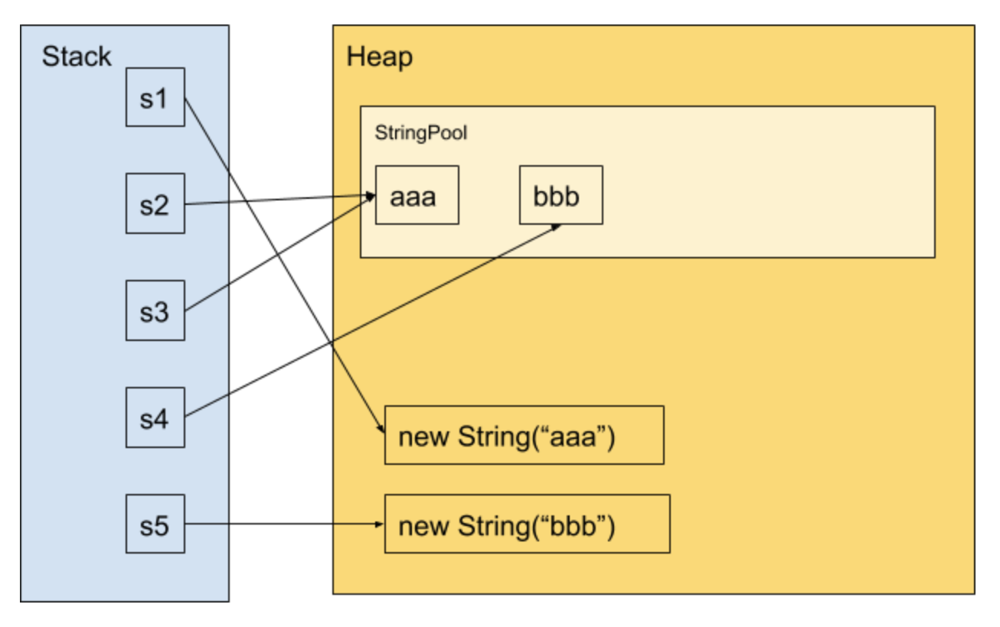

# String

- [String](#string)
  - [String is `final` type](#string-is-final-type)
  - [String Pool And `new String(...)` And `intern()`](#string-pool-and-new-string-and-intern)
  - [Methods](#methods)
      - [equals(Object obj) and equalsIgnoreCase(String s)](#equalsobject-obj-and-equalsignorecasestring-s)
      - [compareTo(String s) and compareToIgnoreCase(String s)](#comparetostring-s-and-comparetoignorecasestring-s)
      - [trim()](#trim)
      - [replace(char oldChar, char newChar)](#replacechar-oldchar-char-newchar)
      - [valueOf()](#valueof)
  - [`toCharArray` and `charAt(x)`](#tochararray-and-charatx)
  - [`String`, `StringBuffer` and `StringBuilder`](#string-stringbuffer-and-stringbuilder)
  - [StringBuilder](#stringbuilder)
    - [insert and append](#insert-and-append)
    - [xxxChar operation](#xxxchar-operation)


**Since Java 7, Each string in String Pool is stored in Stack to prevent from `OutOfMemoryError`**.   

Since Java 9 `String` value is used for `byte[]` as character storage instead of `char`  
```java
/**
  * String Class In Java 8 (array)
  */
public final class String
    implements java.io.Serializable, Comparable<String>, CharSequence {
    // character storage. 
    private final char value[];
}

/**
  * String Class In Java 9 (byte) 
  */
public final class String   
    implements java.io.Serializable, Comparable<String>, CharSequence {
    
    // character storage
    private final byte[] value;

    /** The identifier of the encoding used to encode the bytes in {@code value}. */
    private final byte coder;
}
```


## String is `final` type

Reason
1. Hash Value  : Reduce duplicate Strings
2. String Pool : It keeps all literal strings stored **at the compiler time** to reduce `new` operation
3. Security   
4. Thread Safe

## String Pool And `new String(...)` And `intern()`


Process `new String("v")`
```java
STACK               HEAP
| ... |             | ... |
+-----+             +-----+
| ref | - ref to -> |  v  |
+-----+             +-----+
| ... |             | ... |
```
>>> **If string is created by `new`, it wont add its reference into string pool**


```java
String s1 = new String("aaa");
String s2 = s1.intern(); // add "aaa" to string pool
String s3 = "aaa"; 
String s4 = "bbb";
String s5 = new String("bbb");
```
  
- [Source Code & Images](https://www.jyt0532.com/2020/03/11/runtime-data-area/)


```java
String str1 = "a";
String str2 = "b";
String str3 = "ab";
String str4 = str1 + str2; 
String str5 = new String("ab");

System.out.println(str5.equals(str3)); // true , content is the same
System.out.println(str5 == str3); // false , address not the same
```

Method `intern()` checks first in string pool if `"ab"` exists, due to `str3` already defined `"ab"` in string pool.  
It then returns reference of `"ab"` in string pool to `str5` which is same reference as `str3`
```java
System.out.println(str5.intern() == str3);
System.out.println(str5.intern() == str4);
```

>>> 如果其中含有變量（如f中的e）則不會進入字符串池中。但是字符串一旦進入字符串池中，就會先查找池中有無此對象。如果有此對象，則讓對象引用指向此對象。如果無此對象，則先創建此對象，再讓對象引用指向此對象。


```java 
String a = "abc"; // CHECK STRING POOL FIRST IF NOT EXISTS THEN PUT "abc" TO THE STRING POOL
String b = "abc"; // CHECK STRING POOL THEN RETURN THE REFERENCE OF "abc"
String c = "a" + "b" + "c"; // CHECK STRING POOL THEN RETURN THE REFERENCE OF "abc"
String d = "a" + "bc"; // CHECK STRING POOL THEN RETURN THE REFERENCE OF "abc"
String e = "ab" + "c"; // CHECK STRING POOL THEN RETURN THE REFERENCE OF "abc"
        
System.out.println(a == c); // true 
System.out.println(a == d); // true
System.out.println(a == e); // true
System.out.println(c == d); // true
System.out.println(c == e); // true
```


## Methods

```java
boolean matches(String regex)

String replace(char oldChar, char newChar)
String replaceAll(String regex, String replacement)
String replaceFirst(String regex, String replacement)

int compareTo(Object o)
int compareTo(String anotherString) 
int compareToIgnoreCase(String str)

static String copyValueOf(char[] data)
static String copyValueOf(char[] data, int offset, int count)

String toString()
boolean contentEquals(StringBuffer sb)
```

```java
// most used
char[] toCharArray()
char charAt(int index))

boolean equals(Object anObject)
boolean equalsIgnoreCase(String anotherString)

byte[] getBytes()
byte[] getBytes(String charsetName) 
// str.getBytes( "UTF-8" );

String substring(int beginIndex)
String substring(int beginIndex, int endIndex_Exclusive)
// "GeeksForGeeks".substring(3); // returns "ksForGeeks"
//"GeeksForGeeks".substring(2, 5); // returns "eks"

String toLowerCase()
String toUpperCase()

String trim() // "  abc  " => "abc"

int length()
Boolean isEmpty()
int hashCode()

Boolean contains(CharSequence chars)

String concat( String str)
//String s1 = "Geeks";
//String s2 = "ForGeeks";
//String output = s1.concat(s2); 
//returns "GeeksForGeeks"

// PREFIX or SUFFIX
boolean endsWith(String chars)
boolean startsWith(String chars, ?int offset)

// search string pool first 
// if the string does not exist
// then create one in pool return the reference
String intern() 
//String s3 = new String("1234").intern()     ;
//String s4 = new String("1234").intern()     ;
//System.out.println(s3 == s4); 

String[] split(String regex, ?int arrayLength)
// IN.MA.CA.LA split("\\.") => [IN,MA,CA,LA]
// -----------------------
// IN.MA.CA.LA split("\\.", arrayLength)
// arrayLength : 2 => {IN , MA.CA.LA}
// arrayLength : 3 =? IN, MA, CA.LA}
// arrayLength >= 4 {IN,MA,CA,LA}


int indexOf(int ch, int ?fromIndex) // search character
int indexOf(String str, ?int fromIndex) // search string
int lastIndexOf(int ch, ?int startFromIndex) // searching ch
int lastIndexOf(String str, ?int startFromIndex)
// String s = "Learn Share";
// int output = s.indexOf("Share"); returns 6
// int output = s.indexOf("ea",3); returns -1
// int output = s.lastIndexOf("a"); returns 8
```

#### equals(Object obj) and equalsIgnoreCase(String s)

Compare string's content
```java
boolean equals(Object otherObj)
Boolean out = "Geeks".equals("Geeks"); // returns true
Boolean out = "Geeks".equals("geeks"); // returns false

boolean equalsIgnoreCase(String anotherString)
Boolean out= "Geeks".equalsIgnoreCase("Geeks"); // returns true
Boolean out ="Geeks".equalsIgnoreCase("geeks"); // returns true
```
#### compareTo(String s) and compareToIgnoreCase(String s)

Compares two string lexicographically.
```java
int compareTo(String anotherString)
int out = s1.compareTo(s2);  // where s1 ans s2 are
                             // strings to be compared
out < 0  // s1 comes before s2
out = 0  // s1 and s2 are equal.
out > 0  // s1 comes after s2.
```

```java
int compareToIgnoreCase(String anotherString)
int out = s1.compareToIgnoreCase(s2);  
```
This returns difference s1-s2. If :
```java
out < 0  // s1 comes before s2
out = 0   // s1 and s2 are equal.
out > 0   // s1 comes after s2.
```

#### trim()

Returns the copy of the String, **by removing white spaces at both ends. It does not affect white spaces in the middle.**
```java
String word1 = " Learn Share Learn ";
String word2 = word1.trim(); 
/***
 * Learn Share Learn
 */
```

#### replace(char oldChar, char newChar)

Returns new string by replacing all occurrences of oldChar with newChar.
```java
String s1 = "feeksforfeeks";

String s2 = "feeksforfeeks".replace('f' ,'g'); // returns "geeksgorgeeks"
```
- s1 is still `feeksforfeeks` and s2 is `geeksgorgeeks`

#### valueOf()

convert type `boolean` , `char`, `char[]`, `double`, `float`, `int`, `long`, `object` to `String`

```java
// Returns the string representation of the boolean argument.
static String valueOf(boolean b)

// Returns the string representation of the char argument.
static String valueOf(char c)

// Returns the string representation of the char array argument.
static String valueOf(char[] data)

// Returns the string representation of a specific sub-array of the char array argument.
static String valueOf(char[] data, int offset, int count)

// Returns the string representation of the double argument.
static String valueOf(double d)

// Returns the string representation of the float argument.
static String valueOf(float f)

// Returns the string representation of the int argument.
static String valueOf(int i)

// Returns the string representation of the long argument.
static String valueOf(long l)

// Returns the string representation of the Object argument.
static String valueOf(Object obj)
```

## `toCharArray` and `charAt(x)`

```java
String s1 ="hello";  
char c = s.charAt(0); //returns h  
char[] ch=s1.toCharArray();    
```

## `String`, `StringBuffer` and `StringBuilder`

1. Mutable
    - [x] `StringBuffer` & `StringBuilder` are `mutable`
2. Thread Safe
    - [x] String 
    - [x] StringBuffer via `synchronized`

Use `StringBuffer` for Multiple Thread Tasks otherwise `StringBuilder`

## StringBuilder

StringBuilder is not thread-safe and final type

It gives us to append/insert/delete/trim to size/set its length operations ...

### insert and append

  

```java
StringBuilder append(boolean b)
StringBuilder append(char c)
StringBuilder append(char[] str)
StringBuilder append(char[] str, int offset, int len) // Appends the string representation of a subarray of the char array argument to this sequence.
StringBuilder append(CharSequence s) // Appends the specified character sequence to this Appendable.
StringBuilder append(CharSequence s, int start, int end) // Appends a subsequence of the specified CharSequence to this sequence.
StringBuilder append(double d)
StringBuilder append(float f)
StringBuilder append(int i)
StringBuilder append(long lng)
StringBuilder append(Object obj)
StringBuilder append(String str)
StringBuilder append(StringBuffer sb)

// Append with offset arg
StringBuilder insert(int offset, boolean b)
StringBuilder insert(int offset, char c)
StringBuilder insert(int offset, char[] str)
StringBuilder insert(int index, char[] str, int offset, int len)
StringBuilder insert(int dstOffset, CharSequence s)
StringBuilder insert(int dstOffset, CharSequence s, int start, int end)
StringBuilder insert(int offset, double d)
StringBuilder insert(int offset, float f)
StringBuilder insert(int offset, int i)
StringBuilder insert(int offset, long l)
StringBuilder insert(int offset, Object obj)
StringBuilder insert(int offset, String str)

StringBuilder delete(int start, int end_exclusive) // like List#clear()
```


```java
int length()
void setLength(int newLength) // set new Length (not add new length with onl length)
void trimToSize()  

StringBuilder reverse()
String toString() // Builder to String

String substring(int start)
String substring(int start, int end_exclusive)

int capacity() // Returns the current capacity.
void ensureCapacity(int minimumCapacity)

// Index of given string
int indexOf(String str)
int indexOf(String str, int fromIndex)
int lastIndexOf(String str)
int lastIndexOf(String str, int fromIndex)

StringBuilder replace(int start, int end, String str)
CharSequence subSequence(int start, int end)
```

### xxxChar operation

```java
void getChars(int srcBegin, int srcEnd_exclusive, char[] dst, int dstBegin)

StringBuilder str = new StringBuilder("GONE WRONG_01");
char[] array = new char[10];
Arrays.fill(array, '_');

// get char from index 5 to 9
// and store these char in new array starting at index 3
str.getChars(5, 10, array, 3);
Stream.of(array).forEach(System.out::print);
//___WRONG___
```

```java
char charAt(int index) 
// Returns the char value in this sequence at the specified index.

void setCharAt(int index, char ch)
StringBuilder deleteCharAt(int index)
```