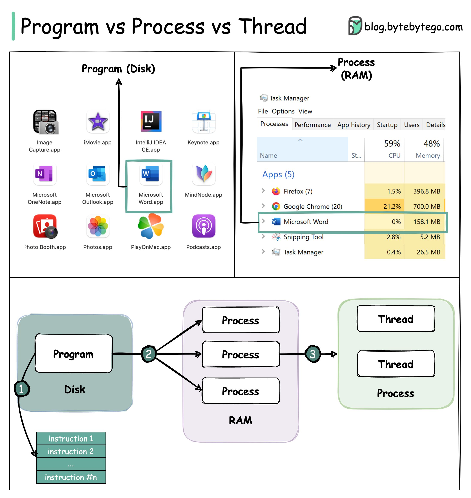
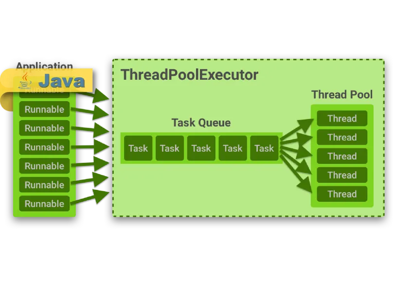
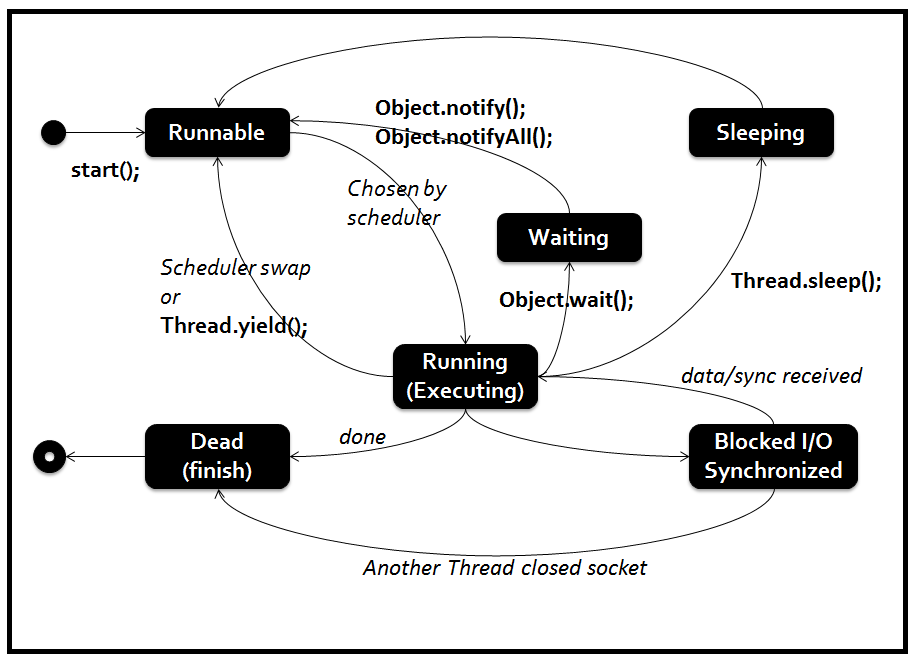
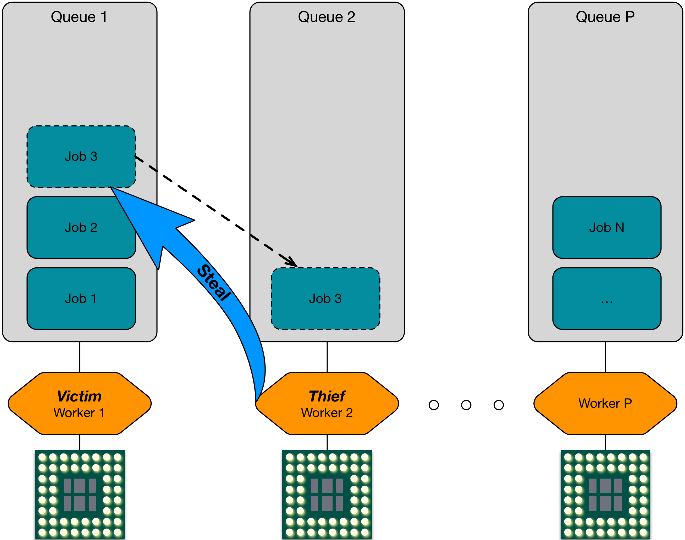
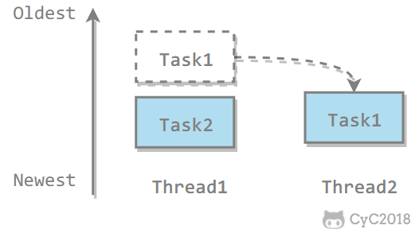
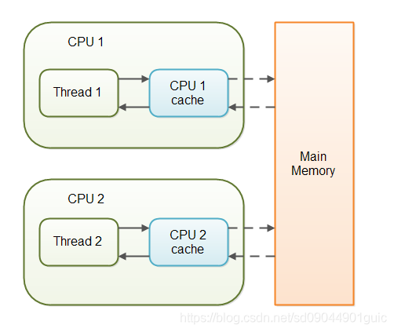
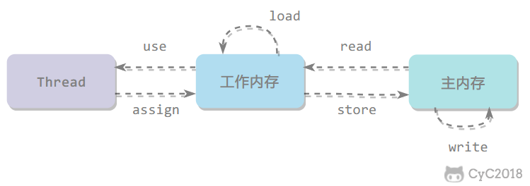

# Thread 
[Program Process & Thread](https://programming.im.ncnu.edu.tw/J_Chapter9.htm)   
[smddzcy mutiplethreading](https://smddzcy.com/posts/2016-10-11/multithreading-in-java)  
[牛年自強計畫 Week 2 - SpringBoot - 番外篇 Java 執行緒 Thread Pool](https://hackmd.io/@KaiChen/HyJwzDqxu)

- [Thread](#thread)
  - [Life Cycle of a Thread](#life-cycle-of-a-thread)
  - [Thread Life Cycle In JAVA](#thread-life-cycle-in-java)
    - [Tips](#tips)
  - [Java Thread Management `util.concurrent.Executors`](#java-thread-management-utilconcurrentexecutors)
  - [Execute Thread Via ExecutorService](#execute-thread-via-executorservice)
  - [Threads In Java (`Runnable`, `Callable` and `Thread`)](#threads-in-java-runnable-callable-and-thread)
    - [extends `Thread`](#extends-thread)
    - [implements `Runnable`](#implements-runnable)
    - [implements `Callable<T>`](#implements-callablet)
  - [Thread Methods](#thread-methods)
    - [`Thread#setDaemon(true)`](#threadsetdaemontrue)
    - [`Thread#sleep(millisec)`](#threadsleepmillisec)
    - [:star: `Thread#yield()`](#star-threadyield)
    - [`Thread#interrupt()`](#threadinterrupt)
    - [Interrupt specific thread](#interrupt-specific-thread)
    - [InterruptedException](#interruptedexception)
    - [`shutdown()` and `shutdownNow()`](#shutdown-and-shutdownnow)
    - [wait(), notify() and notifyAll()](#wait-notify-and-notifyall)
    - [wait vs sleep](#wait-vs-sleep)
    - [`Thread#join`](#threadjoin)
    - [ReentrantLock await, signal, and signalAll](#reentrantlock-await-signal-and-signalall)
  - [MUTUAL EXCLUSION LOCK](#mutual-exclusion-lock)
    - [Lock Level](#lock-level)
    - [`synchronized`](#synchronized)
    - [ReentrantLock](#reentrantlock)
    - [`reentrantLock` vs `synchronized`](#reentrantlock-vs-synchronized)
  - [State of threads](#state-of-threads)
  - [:star: J.U.C](#star-juc)
    - [`FutureTask<T>`](#futuretaskt)
    - [`BlockingQueue<T>`](#blockingqueuet)
    - [ForkJoin](#forkjoin)
  - [Java Memory Model](#java-memory-model)
  - [Properties](#properties)
  - [Happen Before](#happen-before)
    - [1. Single Thread rule](#1-single-thread-rule)
    - [2. Monitor Lock Rule](#2-monitor-lock-rule)
    - [3. Volatile Variable Rule](#3-volatile-variable-rule)
    - [4. Thread Start Rule](#4-thread-start-rule)
    - [5. Thread Join Rule](#5-thread-join-rule)
    - [6. Thread Interruption Rule](#6-thread-interruption-rule)
    - [7. Finalizer Rule](#7-finalizer-rule)
    - [8. Transitivity](#8-transitivity)
  - [:star: Thread Safe In Java Strategies to avoiding Race Condition](#star-thread-safe-in-java-strategies-to-avoiding-race-condition)
    - [Immutable Object](#immutable-object)
    - [Mutual Exclusion Lock](#mutual-exclusion-lock-1)
    - [非阻塞(non-block)同步](#非阻塞non-block同步)
      - [PCC](#pcc)
      - [OCC](#occ)
    - [Compare-and-Swap，CAS](#compare-and-swapcas)
    - [ABA issues of multi-threaded computing](#aba-issues-of-multi-threaded-computing)
    - [Without `Synchronize`](#without-synchronize)
      - [Stack Closure](#stack-closure)
      - [Stack Local Storage](#stack-local-storage)
    - [Reentrant Code (Pure Code)](#reentrant-code-pure-code)




    

Program (Code and Data on DISK)
- **A Program allow to execute multiple times，OS manages the EXECUTING PROGRAM(PROCESS) (資源與空間的排程單位)**

Process (Executing Program or Running Application )
- **Instance of a Program & Organization of a Program in RAM**
- Process 指已經執行(EXECUTED) 並且被記憶體載入的Program 
  - 不同 Process 的 Memory Space 也不同，彼此看不到對方的Memory Space 
- Program的每一行程式碼隨時都有可能被 CPU 執行
- **Process is a Container of Threads**
  - e.g. ChatRoom Application 可以同時接受對方傳來的訊息以及發送自己的訊息給對方。

Thread (A running Application handles different tasks at same time)
-  **O.S manages each thread inside a Queue，優先權高的可能會執行比較久，但優先權低的也會執行到，只是可能會一直被插隊。**
-  thread 之間工作切換的速度很快，因此看來就像在同時執行
- **代表從某個起始點開始(例如 `main()` )，到目前為止所有function的呼叫路徑、這些呼叫路徑上所用到的區域變數**、程式的執行狀態，除了紀錄在主記憶體外，CPU內部的暫存器(e.g. Program Counter, Stack Pointer, Program Status Word)也需要一起紀錄
- 每一個Thread各自擁有 Stack : 紀錄 Functions 的**呼叫路徑**、它們所用到的**Local Variable**，以及Current CPU Status


>>> **一個Process可以有多個Thread，同一個Process內的Thread使用相同的(HEAPf)Memory Space，但這些Thread各自擁有其Stack** 換句話說，Thread能透過JVM STACK的Reference(JVM HEAP)存取到相同的Object(Process)，但是有各獨立的Local variables，OS會根據Thread的優先權以及已經用掉的CPU時間,在不同的Thread作切換，以讓各個Thread都有機會執行。

## Life Cycle of a Thread

  

## Thread Life Cycle In JAVA
  
1. `new` a thread object and call `start()` 後，會進入 Runnable Status
2. JVM 中有一個 scheduler 專門負責處理所有狀態為 Runnable Thread 排程(Scheduling)，因此即使狀態是 Runnable Thread，也必須要被排入(scheduled)執行才會真的執行`run()`。


### Tips 
1. **Using synchronized blocks instead of synchronized method** to decrease race condition 
2. First priority using Class `CountDownLatch`, `CyclicBarrier`, `Semaphore` and `Exchanger` instead of `wait()` and `notify()`
3. Using `BlockingQueue` to handle Producer-Consumer Problem 
4. Using Local Variable and Immutable Objects to make sure Thread Safe 
5. Using Thread Pool instead `new` a thread
6. Using `Collection.synchronizedCollection` (e.g `ConcurrentHashMap`) instead of `Collection` (e.g. `HashTable`)


## Java Thread Management `util.concurrent.Executors`

ExecutorService 中會有專門集合 Task Queue，並依照最大上限(Thread Pool Max Size)的 Thread 數量去執行依序的工作，並蒐集這些結果，Programmer 可以透過呼叫 Methods ，一次性 OR 按需求性取得這些結果的回傳集合，接續進行後續的處理動作


Go ROUTINE (Fork Join Pool) 類似 JAVA THREAD POOL
- GO : Synchronize Tasks in Different Task Queue 

Thread Pool Executors 
```java
// ExecutorsService is implementation of Executor
public interface Executor {
    void execute(Runnable command);
}

// Configure ExecutorService 
ExecutorsService executorService = // Executors.new______ThreadPool(...);
                                   Executors.newFixedThreadPool(int nThreads)
                                   Executors.newCachedThreadPool()	
                                   Executors.newScheduledThreadPool(int corePoolSize)
                                   Executors.newWorkStealingPool()

ExecutorsService executorService = Executors.newSingleThreadExecutor(...);

// execute the thread
executorService.execute(thread);
```
- `newCachedThreadPool` ：Creates a thread pool that creates new threads as needed, but will **REUSE** previously constructed threads when they are available.
- `newFixedThreadPool` ：Creates fixed size threads in pool and shared by tasks in queue
- `newSingleThreadExecutor` ： Creates an Executor that uses a single worker thread (Thread Pool th size is 1) operating off an unbounded queue.
- `newScheduledThreadPool` : A thread pool that can schedule commands to run after a given delay, or to execute periodically.


## Execute Thread Via ExecutorService

```java
public class MyRunnable implements Runnable{
    //...
}

// example.java
public static void main(String[] args) {

    // Expandable Thread Pool 
    ExecutorService executorService = Executors.newCachedThreadPool();
    for (int i = 0; i < 5; i++) {
        executorService.execute(new MyRunnable());
    }
    executorService.shutdown();
    
    // ...
    Runnable n1 = new MyRunnable();
    Runnable n2 = new MyRunnable();
    
    // pool with size 2 threads 
    ExecutorService e = Executors.newFixedThreadPool(2);

    e.execute(n1);
    e.execute(n2);
    e.shutdown();
}
```

## Threads In Java (`Runnable`, `Callable` and `Thread`)


| Class   | 
|-------- |
| Runnable : Interface         |
| Callable : Interface        |
| Thread   : Inheritance(EXPENSIVE) |

### extends `Thread`

It's expensive to inherit Thread

```java
/**
  * <p> Thread </p>
  */
public class MyThread extends Thread {
    public void run() {
        // ...
    }
}
public static void main(String[] args) {

    MyThread mt = new MyThread();
    
    mt.start();
}
```

### implements `Runnable`

`Runnable` and `Callable` Both are interface which we still have to create a thread via `new Thread(Runnable/Callable obj)` 
```java
/**
  * <p> Runnable </p>
  */
public class MyRunnable implements Runnable {
    @Override
    public void run() {
        // ...
    }
}

public static void main(String[] args) {
    
    MyRunnable instance = new MyRunnable();

    Thread thread = new Thread(instance);
    
    thread.start();
}
```

### implements `Callable<T>`

`Callable` allows us to return `T`(value) and being encapsulated via `FutureTask<T>(Callable Obj)`
```java
/**
  * {@code Callable} 
  */
public class MyCallable implements Callable<Integer> {
    public Integer call() {
        // Return Value 
        return 123;
    }
}
public static void main(String[] args) throws ExecutionException, InterruptedException {

    MyCallable mc = new MyCallable();
    
    // allow value to be encapsulated
    FutureTask<Integer> ft = new FutureTask<>(mc);
    
    Thread thread = new Thread(ft);
    thread.start();
    
    System.out.println(ft.get());
}
```

## Thread Methods

### `Thread#setDaemon(true)`

Daemon是 Program 運行時在背景背景提供服務的執行緒，不屬於Program中不可或缺的部分。
- 當所有非Daemon執行緒(e.g. `main()`)結束時，Program也就終止，同時會殺死(KILL)所有Daemon執行緒。
```java
public static void main(String[] args) {
    
    Thread thread = new Thread(new MyRunnable());
   
    // Set current thread as Daemon
    thread.setDaemon(true);
}
```

### `Thread#sleep(millisec)`

`Thread.sleep(millisec)`使當前正在執行的執行緒進入休眠
- `sleep`可能會拋出`InterruptedException`，因為Exception不能跨執行緒傳播回`main()`中，因此必須在本地(Local)進行處理。執行緒中拋出的其它例外也同樣需要在本地進行處理。

```java
public void run() {
    try {
        Thread.sleep(3000);
    } catch (InterruptedException e) {
        e.printStackTrace();
    }
}
```

### :star: `Thread#yield()`

It provides a mechanism to inform the SCHEDULER that the current thread is willing to relinquish(give up) its current use of processor but it'd like to be scheduled back soon as possible.
- `yield()`的呼叫聲明了當前執行緒已經完成了生命周期中最重要的部分，可以切換給其它執行緒來執行。     
- **`yield()`只是對執行緒調度器SCHEDULER的一個`建議`，而且也只是`建議`具有相同優先級的其它執行緒可以運行**   

```java
public void run() {
    Thread.yield();
}
```

### `Thread#interrupt()`

Interrupt an Thread
```java
public class InterruptExample {

    private static class MyThread2 extends Thread {
        @Override
        public void run() {
            // Check state of the thread 
            // can be interrupted or not
            while (!interrupted()) {
                // ..
            }
            System.out.println("Thread end");
        }
    }
}
public static void main(String[] args) throws InterruptedException {
    Thread thread2 = new MyThread2();
    thread2.start();

    thread2.interrupt();
}
```

### Interrupt specific thread 

使用 `ExecutorService#submit()` with return `Future<T>` type，並利用`Future#cancel(true)`進行中斷。  
```java
Future<T> future = executorService.submit(
    () -> {
        // ..
    }
);

future.cancel(true);
```

### InterruptedException
```java
public class InterruptExample {

    private static class MyThread1 extends Thread {
        @Override
        public void run() {
            try {
                Thread.sleep(2000);
                System.out.println("Thread run");
            } catch (InterruptedException e) {
                e.printStackTrace();
            }
        }
    }
}
public static void main(String[] args) throws InterruptedException {
    Thread thread1 = new MyThread1();
    thread1.start();
    thread1.interrupt(); 
    // you cant interrupt a thread 
    // while the thread is sleeping
    
    System.out.println("Main run");
}
```
- I/O Blocking and `synchronized` also can not be interrupted  


### `shutdown()` and `shutdownNow()`

- `shutdown`  
shutdown when each thread finishes its the tasks 

- `shutdownNow()`  
same as calling `thread.interrupt()` for each thread 

```java
public static void main(String[] args) {
    ExecutorService executorService = Executors.newCachedThreadPool();
    executorService.execute(() -> {
        try {
            Thread.sleep(2000);
            System.out.println("Thread run");
        } catch (InterruptedException e) {
            e.printStackTrace();
        }
    });
    executorService.shutdownNow();
    System.out.println("Main run");
}
```
### wait(), notify() and notifyAll()

`wait()` (Do nothing just wait)
- Tells the executing thread to give up the lock and go sleeping until some other thread enters the same monitor and calls `notify()`

`notify()` 
- Give the notification only one thread which is waiting but it does not mean that current running thread to give up a lock just notify. However, the lock is not actually given up until the notifier’s synchronized block has finished/completed.

`notifyAll()`
- Notify all the waiting threads

### wait vs sleep

`wait()` : Object Method and allow to release lock  
`sleep()` : Thread's Static Method    
 
**The highest priority thread will run first in most of the situation**, though not guaranteed. Rests are same as `notify()`

```java
public class WaitNotifyExample {


    public synchronized void before() {
        System.out.println("before");
        notifyAll();
    }

    // If a thread calls this method of this object then it will go sleeping  
    // until other thread calls method `before` of this object
    public synchronized void after() {
        try {
            wait();
        } catch (InterruptedException e) {
            e.printStackTrace();
        }
        System.out.println("after");
    }
}
public static void main(String[] args) {
    ExecutorService executorService = 
        Executors.newCachedThreadPool();
    
    WaitNotifyExample example = new WaitNotifyExample();
    
    // this thread calls wait()
    executorService.execute(() -> example.after()); 
    
    executorService.execute(() -> example.before()); 
    // notify the suspend threads 
}

// before
// after
```

### `Thread#join`

```java
public class JoinExample {

    private class A extends Thread {
        @Override
        public void run() {
            System.out.println("A");
        }
    }

    private class B extends Thread {

        private A a;

        B(A a) {
            this.a = a;
        }

        @Override
        public void run() {
            try {
               // join thread a 
               // thread b must wait(suspend) 
               // until thread a exit
               a.join();
            } catch (InterruptedException e) {
                e.printStackTrace();
            }
            System.out.println("B");
        }
    }

    public void test() {
        A a = new A();
        B b = new B(a);
        b.start(); 
        // suspend (wait before thread a start and exit)
        
        a.start(); 
    }
}

public static void main(String[] args) {
    JoinExample example = new JoinExample();
    example.test();
}
// A B
``` 
- 雖然 b 執行緒先啟動，但是因為在 b 執行緒中呼叫 a 執行緒的`join()`方法，b 執行緒會等待 a 執行緒結束才繼續執行，因此最後能夠保證 a 執行緒的輸出先於 b 執行緒的輸出。

### ReentrantLock await, signal, and signalAll

`java.util.concurrent` 提供了 Condition 類來實現執行緒之間的協調，可以在 `Condition` 上呼叫 `await()` 方法使執行緒等待，或呼叫`signal()`/`signalAll()` 方法喚醒等待的執行緒。

```java
public class AwaitSignalExample {

    private Lock lock = new ReentrantLock();
    
    // lock with the condition 
    private Condition condition = lock.newCondition();

    public void before() {
        lock.lock();

        try {
            System.out.println("before");
            condition.signalAll();
        } finally {
            lock.unlock();
        }
    }

    public void after() {
        lock.lock();

        try {
            condition.await();
            System.out.println("after");
        } catch (InterruptedException e) {
            e.printStackTrace();
        } finally {
            lock.unlock();
        }
    }
}

public static void main(String[] args) {
    ExecutorService executorService = Executors.newCachedThreadPool();
    AwaitSignalExample example = new AwaitSignalExample();
    executorService.execute(() -> example.after());
    executorService.execute(() -> example.before());
}
```

## MUTUAL EXCLUSION LOCK

In order to prevent the race conditions, one should ensure that only one process can access the shared data at a time. 

It is the main reason why we need to synchronize the processes.

- JVM  
  `synchronized`

- JDK  
  `ReentrantLock` (`java.util.concurrent`) 
  `private Lock lock = new ReentrantLock()`

:warning: **`synchronized` IS NOT THE SAME AS ReentrantLock** :warning:

### Lock Level 

Biased Lock -> Lightweight Lock(原地轉圈圈) -> Heavyweight Lock(Queue)  
- **Heavyweight Lock : Threads are managed By OS**

### `synchronized` 

```java
synchronized (o) // lock the object

synchronized returned method() {
    synchronized (this) // lock this
}

static synchronized void m() {
    synchronized (xxx.class)
}
```


```java
public class SynchronizedExample {

    public void func1() {
        synchronized (this) {
            for (int i = 0; i < 10; i++) {
                System.out.print(i + " ");
            }
        }
    }
}
public static void main(String[] args) {
    SynchronizedExample e1 = new SynchronizedExample();

    ExecutorService executorService = Executors.newCachedThreadPool();
    
    // its the same object e1 
    // one of thread need to wait the other one
    executorService.execute(() -> e1.func1()); 
    executorService.execute(() -> e1.func1());
}

// Async
public class SynchronizedExample {

    public void func2() {
        synchronized (SynchronizedExample.class) {
            for (int i = 0; i < 10; i++) {
                System.out.print(i + " ");
            }
        }
    }
}
public static void main(String[] args) {
    SynchronizedExample e1 = new SynchronizedExample();
    SynchronizedExample e2 = new SynchronizedExample();
    
    ExecutorService executorService = 
        Executors.newCachedThreadPool();
    
    // different objects => ASYNC 
    executorService.execute(() -> e1.func2());
    executorService.execute(() -> e2.func2());
}
```

### ReentrantLock

```java
public class LockExample {

    private Lock lock = new ReentrantLock();

    public void func() {
        
        lock.lock();
        
        try {
            for (int i = 0; i < 10; i++) {
                System.out.print(i + " ");
            }
        } finally {
            lock.unlock(); // prevent from dead lock
        }
    }
}

public static void main(String[] args) {
    LockExample lockExample = new LockExample();
    ExecutorService executorService = Executors.newCachedThreadPool();
    executorService.execute(() -> lockExample.func());
    executorService.execute(() -> lockExample.func());
}
// 0 1 2 3 4 5 6 7 8 9 0 1 2 3 4 5 6 7 8 9
```

### `reentrantLock` vs `synchronized`

除非需要使用 `ReentrantLock` 的高級功能，否則優先使用 `synchronized`。 
這是因為`synchronized`是 JVM 實現的一種鎖機制，JVM 原生地支持它，而 `ReentrantLock` 不是所有的 JDK 版本都支持。 且**使用 `synchronized` 不用擔心沒有釋放鎖而導致 Dead Lock 問題，因為 JVM 會確保鎖的釋放。**

1. ReentrantLock 為 等待可中斷，`synchronized` 不是。
   - 等待可中斷 : **當持有鎖的執行緒長期不釋放鎖的時候，正在等待的執行緒可以選擇放棄等待，改為處理其他事情**

2. `synchronized` 中的鎖是非公平的， `ReentrantLock` 也是非公平的 By Default，但是也可以是公平的
   - Fair lock : **多個執行緒在等待同一個鎖時，必須按照申請鎖的時間順序來依次獲得鎖)**

3. 一個 `ReentrantLock` 可以同時綁定多個 Condition 對象
## State of threads

  

| State    |   |
| -----    |---|
|New           | When instance of thread is created using `new` operator (before `threadObj.start()`)  
|Runnable      | When `threadObj.start()` method is called 
|WAITING       | The thread is waiting indefinitely for another thread to perform a particular action. (The Waiting Thread is waken up by Another Thread)
|TIMED_WAITING | The waiting thread to be waken after certain time. e.g. `.sleep()` (The thread is waiting for another thread to perform an action for up to a specified waiting time.)
|TERMINATED    | `.exit()` or exception being thrown   


## :star: J.U.C

JUC provides different Lock Level to enhance efficiency  

### `FutureTask<T>`

Returned Value from method in Implementation of `Callable` will be encapsulated by `Future<V>` which makes class `FutureTask<V>` can be a task for a thread and has returned value
```java
public interface RunnableFuture<V> extends Runnable, Future<V>

public class FutureTask<V> implements RunnableFuture<V>

FutureTask<T> futureTask = 
    new FutureTask<T>(
        new Callable<T>{
            @Override
            public Integer call() throws Exception{
                // ...
            }
            }
)
Thread taskThread = new Thread(futureTask);
taskThread.start();
```

For example
```java
public class FutureTaskExample {

    public static void main(String[] args) throws ExecutionException, InterruptedException {

        // Task
        FutureTask<Integer> futureTask = new FutureTask<Integer>(
            new Callable<Integer>(){
                @Override
                public Integer call() throws Exception {
                    int result = 0;
                    for (int i = 0; i < 100; i++) {
                        Thread.sleep(10);
                        result += i;
                    }
                    return result;
                }
            });

        Thread computeThread = new Thread(futureTask);
        computeThread.start();

        Thread otherThread = new Thread(() -> {            
            System.out.println("other task is running...");
            try {
                Thread.sleep(1000);
            } catch (InterruptedException e) {
                e.printStackTrace();
            }
        });
        
        otherThread.start();
        System.out.println(futureTask.get());
    }
}
// other task is running...
// 4950
```

### `BlockingQueue<T>`

`java.util.concurrent.BlockingQueue` has these Queues
-   **FIFO**   
LinkedBlockingQueue、ArrayBlockingQueue（Fixed Size）

-   **Priority**  
PriorityBlockingQueue

The [`take()`](https://www.geeksforgeeks.org/blockingqueue-take-method-in-java-with-examples/) is used to retrieve and remove the head of this queue.    
- If the queue is empty then it will wait until an element becomes available.   
So **the thread that initially calls `take()` goes to sleep if there is no element available, letting other threads do whatever they need to do.**

The [`put(E e)`](https://www.geeksforgeeks.org/blockingqueue-put-method-in-java-with-examples/) inserts element passed as parameter to method at the tail of this BlockingQueue, if queue is not full.  
- If the queue is full, then this method will wait for space to become available and after space is available, it inserts the element to BlockingQueue.


**`BlockingQueue` is often used for Producer-consumer Problem**, for example 
```java
public class ProducerConsumer {

    private static BlockingQueue<String> queue = new ArrayBlockingQueue<>(5);

    private static class Producer extends Thread {
        
        @Override
        public void run() {
            try {
                queue.put("product");
            } catch (InterruptedException e) {
                e.printStackTrace();
            }
            System.out.print("produce..");
        }
    }

    private static class Consumer extends Thread {

        @Override
        public void run() {
            try {
                String product = queue.take();
            } catch (InterruptedException e) {
                e.printStackTrace();
            }
            System.out.print("consume..");
        }
    }
}
public static void main(String[] args) {
    for (int i = 0; i < 2; i++) {
        Producer producer = new Producer();
        producer.start();
    }
    for (int i = 0; i < 5; i++) {
        Consumer consumer = new Consumer();
        consumer.start();
    }
    for (int i = 0; i < 3; i++) {
        Producer producer = new Producer();
        producer.start();
    }
}
```
```html
produce..produce..consume..consume..produce..consume..produce..consume..produce..consume..
```

### ForkJoin

主要用於Concurrency，和 MapReduce 類似，都是**把大的計算任務拆分成多個小任務並行計算。**

- **與Thread Pool不同，ForkJoin Pool是每個thread有一個自己的queue**
- 發現task還是太大，就會繼續切更小，並再放到queue的最後方。如此一邊切一邊往下執行，直到task夠小可以直接運算為止。


需ForkJoinPool類來實現ForkJoin，它是一個特殊的Thread Pool，執行緒數量取決於 CPU 核心數。
```java
public class ForkJoinPool extends AbstractExecutorService

ForkJoinPool handleForkJoinTask = new ForkJoinPool();
handleForkJoinTask.submit(forkJoinTask);
```

For example 
```java
public class ForkJoinExample extends RecursiveTask<Integer> {

    // Threshold of Task  (bound of task)
    private final int threshold = 5;

    private int first;
    private int last;

    public ForkJoinExample(int first, int last) {
        this.first = first;
        this.last = last;
    }

    @Override
    protected Integer compute() {
        int result = 0;
        if (last - first <= threshold) {
            for (int i = first; i <= last; i++) {
                result += i;
            }
        } else {
            // task > threshold 
            // Split task into smaller ones 
            int middle = first + (last - first) / 2;
            ForkJoinExample leftTask = new ForkJoinExample(first, middle);
            
            ForkJoinExample rightTask = new ForkJoinExample(middle + 1, last);

            leftTask.fork();
            rightTask.fork();

            result = leftTask.join() + rightTask.join();
        }
        return result;
    }
}
```

```java
public static void main(String[] args) throws ExecutionException, InterruptedException {
    ForkJoinExample example = new ForkJoinExample(1, 10000);

    ForkJoinPool forkJoinPool = new ForkJoinPool();
    
    Future result = forkJoinPool.submit(example);

    System.out.println(result.get());
}
```

     
- 每個執行緒都維護了一個Deque，用來存儲需要執行的任務。     

**ForkJoinPool 實現了Work-Stealing Algorithm來提高CPU的利用率。**  
**Work-Stealing Algorithm允許的執行緒從其它執行緒的Deque中竊取一個任務來執行**  
**Stealing的Task必須是最晚的任務，避免和Deque所屬執行緒發生Race Condition**    
  
- Thread2 從 Thread1的Deque中拿出最晚的 Task1 任務，Thread1 會拿出 Task2 來執行，這樣就避免發生Race Condition。**:warning:但是如果Deque中只有一個Task時還是會發生Race Condition。:warning:**


>>> 而ForkJoinPool有一個很大的好處是減少thread因為blocking造成context switching。不管是fork, compute, join都幾乎不會blocking(只有join少數情況會要等待結果)。這可以讓thread一直保持running的狀態，一直到時間到了被context switch，而不是自己卡住了造成的context switch。
>>> 但ForkJoinPool對於不可分割的task，並且處理時間差異很大的情境比較不適合，畢竟每個thread都有一個queue。就很像在大賣場排隊結帳，只要運氣不好排到一個前面卡比較久的task就要等比較久。但是別排又沒有閒到可以把你steal走，那就沒有辦法做到先到先處理的特性了。
## Java Memory Model

所有的資源都存儲在Memory中，**每個Thread還有自己的工作快取**，工作快取存儲在CPU Cache或者Register，使用Memory的資源副本(Copy from Memory)  

:warning: **執行緒只能直接操作CPU Cache/Register中的資源，不同執行緒之間的資源的值傳遞需要通過Main Memory 來成** :warning:
   
    
|  動作 |  解釋  |
| ----- | ------ |
| read  | 把一個Variable的值從Memory傳輸到Cache中
| load  | 在 read 後執行，把 read 得到的值放入Cache的Variable 副本(COPY)中
| use   | 把Cache中一個Variable的值傳遞給Thread
| assign| 把一個從Thread接收到的值賦給Cache的Variable (Assign a value from Thread to Cache)
| store | (PASSING) 把Cache的一個Variable的值傳送到Memory中 
| write | (STORE)   在 store 後執行，把 store 得到的值放入Memory的Variable中
| lock  | 作用於Memory的Variable

## Properties

[more detail](https://javamana.com/2021/05/20210506201033668K.html)

1. atomicity
2. visibility 
3. orderliness

## Happen Before 
- [happen-before](https://www.geeksforgeeks.org/happens-before-relationship-in-java/)

### 1. Single Thread rule   


### 2. Monitor Lock Rule

Thread A's unlock happen before thread B's lock   


### 3. Volatile Variable Rule 

a volatile variable's `write()` happen before `read()` 

### 4. Thread Start Rule

Thread a (`a.start()`) happen before each operations in a  


### 5. Thread Join Rule    


### 6. Thread Interruption Rule 

Only code that implements a thread's interruption policy may swallow an interruption request.

### 7. Finalizer Rule  

A object's `Constructor()` happen before `finalize()` 

### 8. Transitivity 
operation A先行於 operation B, operation B先行於 operation C  operation A先行 operation C 


## :star: Thread Safe In Java Strategies to avoiding Race Condition 

### Immutable Object

Immutable Objects in Java are Thread Safe
- `final`
- `String`
- `ENUM`
- `Long`
- `Double`
- `BigInteger`
- `BigDecimal` 

:warning:**AtomicInteger And AtomicLong are not immutable**:warning:

### Mutual Exclusion Lock

- `Synchronized` 
- `ReentrantLock`

### 非阻塞(non-block)同步

Mutual Exclusion and Synchronization 最主要的問題就是執行緒阻塞(BLOCK)和喚醒所帶來的性能問題，因此這種同步也稱為阻塞同步。


#### PCC

- Mutual Exclusion and Synchronization 屬於一種悲觀並行策略)(Pessimistic Concurrency Control)，總是認為只要不去做正確的同步措施，那就肯定會出現問題。
  無論Shared Source是否真的會出現Race Condition，它都要進行Locking（該處討論的是概念模型，實際上虛擬機會優化掉很大一部分不必要的加鎖）、用戶態核心態轉換、維護鎖Counter和檢查是否有被阻塞的執行緒需要喚醒等操作。

#### OCC

隨著硬體指令集的發展，我們可以使用基於衝突檢測的樂觀並行策略(Optimistic Concurrency Control)：先進行操作，如果沒有其它執行緒競爭Shared Sources，那操作就成功了，否則採取補償措施（不斷地重試，直到成功為止）。
- 這種樂觀的並行策略的許多實現都不需要將執行緒阻塞，因此這種同步操作稱為非阻塞同步

### Compare-and-Swap，CAS

- [compare-and-swap-cas-algorithm](https://howtodoinjava.com/java/multi-threading/compare-and-swap-cas-algorithm/)

Linux command : `lock cmpxchg`

Using `synchronized` keyword in java, is said to be pessimistic technique.

Optimistic approach to CAS relies on collision detection to determine if there has been interference from other parties during the update, in which case the operation fails and can be retried (or not).
- CAS has 3 variables
  - `V` : target value (where we expect to change this value)
  - **`A` : A SNAPSHOT of `V`(compare with V) expect the `V` value is equal to itself (last read value of `V`)**
  - `B` : new value for assign to `V` if `V == A`


For Example ::   
Assume `V` is a memory location where value `10` is stored.    
There are multiple threads who want to increment same(this) value and use the incremented value for other operations.     

Assume Thread#1 and #2 want to increment it, they both read the value and increment `V` to `11`.  
```java
V = 10, A = 0, B = 0

// CAS procedure
if A = V then 
    V = B  
else 
    print operation failed 
    return V
```

Now thread#1 comes FIRST and compare `V` with it's last read value(`A`):
```java 
// Current Values
V = 10, A = 10, B = 11
```
Assign `B`(new value) to `V`

Thread#2 comes and try the same operation as thread 1
```java 
// Current Values
V = 11, A = 10, B = 11
```
In this case, V is not equal to `A`, so value is not replaced and current value of V.    


Now thread#2 read `V`'s last value(`A = 11`), again retry this operation with values:
```java
V = 11, A = 11, B = 12
```
The Condition is met and incremented value is returned this time.  

### ABA issues of multi-threaded computing

> Wiki :
>> In multi-threaded computing, the ABA problem occurs during synchronization, when a location is read twice, has the same value for both reads, and **value is the same is used to indicate nothing has changed**.  
>> **However, another thread can execute between the two reads and `change the value, do other work, then change the value back`, thus fooling the first thread into thinking "nothing has changed" even though the second thread did work that violates that assumption**.(`value_A->value_B->value_A`)(https://en.wikipedia.org/wiki/ABA_problem)

**大部分情況下 ABA issue不會影響Program的正確性，如果需要解決 ABA Issue ，改用傳統的互斥同步可能會比原子類更高效。**  
J.U.C 提供了一個帶有標記(MARK)的原子引用類 `AtomicStampedReference` 來解決 ABA issues，它可以**通過控制Variable的版本來保證 CAS 的正確性**。   
   
### Without `Synchronize`

要保證Thread Safe，並不是一定就要使用`synchronized`。


如果一個 Method 本來就不涉及資料共享(Shared Sources)，自然就無須任何同步措施去保證正確性。For example :
1. Stack Closure : it's Thread Safe for multiple threads access method's **local variable**
2. Thread Local Storage : **it's Thread Safe to handle the shared resource in one thread** 

#### Stack Closure
```java
public class StackClosedExample {
    public void add100() {
        int cnt = 0;
        for (int i = 0; i < 100; i++) {
            cnt++;
        }
        System.out.println(cnt);
    }
}
public static void main(String[] args) {
    StackClosedExample example = new StackClosedExample();
    ExecutorService executorService = Executors.newCachedThreadPool();

    // same result 
    executorService.execute(() -> example.add100());
    executorService.execute(() -> example.add100());
    executorService.shutdown();
}
//100
//100
```

#### Stack Local Storage

Thread Local Storage(MAP)常用在當某段Code Block的資源必須與其他Code Block共享，那**就看看這些共享資源是否能保證在同一個執行緒中執行**如果能保證，我們就可以把共享數據的可見範圍限制在同一個執行緒之內，避免利用`Synchronized`情況下也能保證執行緒之間不出現資源競爭的問題，如Producer Consumer Pattern 將產品的消費過程盡量在一個Thread中消費完)以及Thread-per-Request Approach(Web Server Application都可以使用執行緒Thread Local Storage來解決Thread Safe Problem)
- 某些scenarios (尤其是使用thread local pool) ，**由於 `ThreadLocal#ThreadLocalMap` 的底層資料結構導致Thread Local cache has a memory leak ，應該盡可能在每次使用 ThreadLocal後手動呼叫`remove()`**

Each Thread has `ThreadLocal.ThreadLocalMap` Object
```java
/* 
 * ThreadLocal values pertaining to this thread. 
 * This map is maintained by the ThreadLocal class. 
 */
ThreadLocal.ThreadLocalMap threadLocals = null;

// get current thread 
Thread.currentThread() 
// get ThreadLocalStorage
ThreadLocalMap map = getMap(thread);
```
`ThreadLocal#get()` and `ThreadLocal#set(T value)`

```java
public void set(T value) {

    Thread t = Thread.currentThread();
  
    // Create A Thread Local Storage
    ThreadLocalMap map = getMap(t);

    if (map != null)
        map.set(this, value);
    else
        createMap(t, value);
}

public T get() {
    Thread t = Thread.currentThread();

    ThreadLocalMap map = getMap(t);

    if (map != null) {
        // Get entry (key-value pair) from current thread
        ThreadLocalMap.Entry e = map.getEntry(this);
        if (e != null) {
            @SuppressWarnings("unchecked")
            T result = (T)e.value;
            return result;
        }
    }
    return setInitialValue();
}
```

```java
public class ThreadLocalExample {
    public static void main(String[] args) {
        
        ThreadLocal threadLocal = new ThreadLocal();

        Thread thread1 = new Thread(() -> {

            threadLocal.set(1);
            try {
                Thread.sleep(1000);
            } catch (InterruptedException e) {
                e.printStackTrace();
            }

            System.out.println(threadLocal.get());
            threadLocal.remove();
        });

        Thread thread2 = new Thread(() -> {
            threadLocal.set(2);
            threadLocal.remove();
        });
        thread1.start();
        thread2.start();
    }
}
// 1
```

  
```java
public class ThreadLocalExample1 {
    public static void main(String[] args) {

        ThreadLocal threadLocal1 = new ThreadLocal();
        
        ThreadLocal threadLocal2 = new ThreadLocal();
        
        Thread thread1 = new Thread(() -> {
            threadLocal1.set(1);

            threadLocal2.set(1);
        });
        Thread thread2 = new Thread(() -> {
            threadLocal1.set(2);

            threadLocal2.set(2);
        });
        thread1.start();
        thread2.start();
    }
}
```

### Reentrant Code (Pure Code)

Reentrant (multi-instance) code is a reusable routine that multiple programs can invoke, interrupt, and reinvoke simultaneously.
Reentrant Code執行的任何時刻都可以被中斷，轉而去執行另外一段代碼（包括遞迴呼叫Reentrant Code本身），而在控制權返回後，原來的Program不會出現任何錯誤。
- 例如不依賴存儲在堆上的數據和公用的系統資源、用到的State都由Parameter中傳入、不呼叫非可重入的方法等


