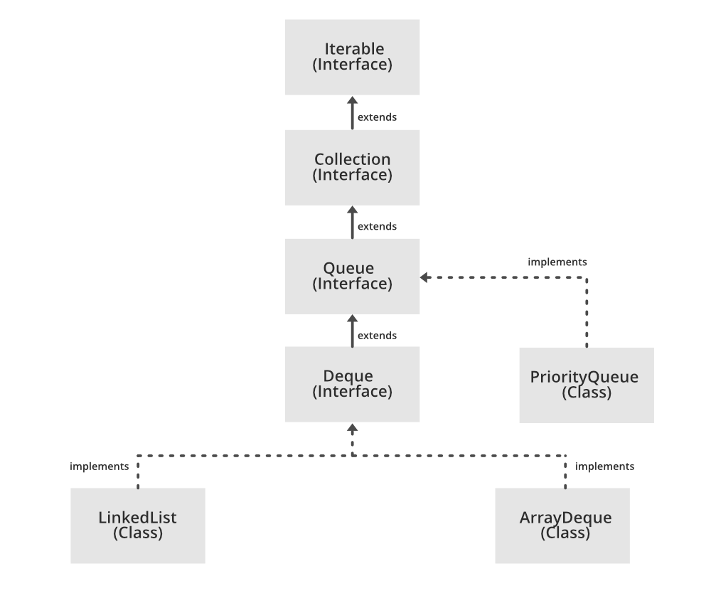

# Queue
- [Queue](#queue)
  - [Reference](#reference)
  - [Methods](#methods)
    - [Interface queue](#interface-queue)
    - [LinkedList](#linkedlist)
  - [PriorityQueue (Min Heap Implementation)](#priorityqueue-min-heap-implementation)
    - [PriorityQueue (Max Heap Implementation)](#priorityqueue-max-heap-implementation)




## Reference
[geeksforgeeks](https://www.geeksforgeeks.org/queue-interface-java/)  
[jenkov](http://tutorials.jenkov.com/java-collections/queue.html#:~:text=The%20Java%20Queue%20interface%2C%20java.&text=Queue%20represents%20a%20data%20structure,of%20the%20Java%20Collection%20interface.)  
[PriorityQueue](https://www.geeksforgeeks.org/priority-queue-class-in-java/)
[priorityQueue TimeComplexity](https://stackoverflow.com/questions/12719066/priority-queue-remove-complexity-time)

`Queue` is an interface, so objects cannot be created of the type queue.
```java
Queue<T> queue = new Queue<T>();
```
Use the following Instead 
```java
Queue<T> queue = new PriorityQueue<T> (); 
```
Being an interface the queue needs a concrete class for the declaration and the most common classes are the `PriorityQueue` and `LinkedList` (**both the implementations are not thread safe.**) in Java.
 
- `PriorityBlockingQueue` is one alternative implementation if thread safe implementation is needed.

## Methods

### Interface queue
|        |Throws exception	|Returns special value|
| ---    |      ---         |      ----           |
|Insert	 |`boolean add(E e)`|`boolean offer(E e)` |
|Remove	 |`E remove()`	        |`E poll()`       |
|Examine |`E element()`	        |`E peek()`       |

### LinkedList

```java
import java.util.LinkedList;
import java.util.Queue;
  
public class QueueExample {
  
    public static void main(String[] args)
    {
        Queue<Integer> q = new LinkedList<>();
  
        // queue :  {0, 1, 2, 3, 4}
        for (int i = 0; i < 5; i++) q.add(i);
  
        // display contents of the queue.
        System.out.println("Elements of queue "
                           + q);
  
        // remove the head of queue
        // 0
        int removedele = q.remove();
  
        // view the head of queue
        // 1
        int head = q.peek();
        
        // Queue Size
        // 4
        int size = q.size();
    }
}
```
## PriorityQueue (Min Heap Implementation)

```java
PriorityQueue()
PriorityQueue(Collection<? extends E> c)
PriorityQueue(int initialCapacity)
PriorityQueue(int initialCapacity, Comparator<? super E> comparator)
PriorityQueue(PriorityQueue<? extends E> c)
PriorityQueue(SortedSet<? extends E> c)

// queue
boolean	offer(E e)
E peek()
E poll()

// collection
boolean	add(E e)
boolean	remove(Object o)
int	size()
void clear()

Comparator<? super E> comparator()

boolean	contains(Object o)
Iterator<E>	iterator()

Object[] toArray()
<T> T[]	toArray(T[] a)
```

Iteration
```java
Iterator<E> iter = myPriorityQueue.iterator();

while (iter.hasNext()) {
    current = iter.next();
    // ...
}
// or
for (E e : myQueue) {
        // ...
}
```


### PriorityQueue (Max Heap Implementation)

```java
PriorityQueue<Integer> queue = new PriorityQueue<>(
                            10, Collections.reverseOrder());
// ...
```