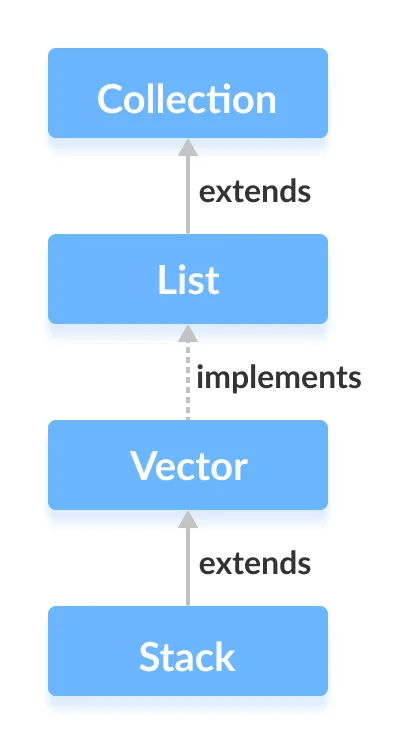
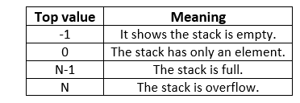
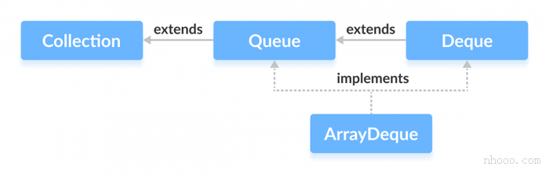

# Stack From Vector

- [Stack From Vector](#stack-from-vector)
  - [Reference](#reference)
  - [Stack](#stack)
  - [ArrayDeque & LinkedList](#arraydeque--linkedlist)
    - [ArrayDeque vs LinkedList](#arraydeque-vs-linkedlist)
  - [Linked List & ArrayDeque](#linked-list--arraydeque)

Stack class in Java is a legacy class and inherits from Vector in Java.   

Stack is a **thread-safe class** and hence involves overhead.     
Use `deque` when we do not need thread safety instead.

  
 

  

## Reference

[geekForGeeks](https://www.geeksforgeeks.org/stack-class-in-java/)
[deque](https://ithelp.ithome.com.tw/articles/10229634)   
[Java ArrayDeque](https://www.cainiaojc.com/java/java-arraydeque.html)

## Stack 

```java
Stack stk = new Stack();  
// Or
Stack<T> stk = new Stack<T>();  
```

```java 
// STACK Methods
E pop()
E push(E item)
E peek()

boolean	empty()

/** 
 * It determines whether an object exists in the stack. 
 * If the element is found, 
 * It returns the position of the element 
 * from the top of the stack. Else, it returns `-1`.
 */
int	search(Object o)
```


Vector
```java
boolean	add(E e)
void add(int index, E element)
boolean	addAll(Collection<? extends E> c)
boolean	addAll(int index, Collection<? extends E> c)

void setSize(int newSize)
int	capacity()

void copyInto(Object[] anArray)

// XXXelement
void addElement(E obj)
void insertElementAt(E obj, int index)
void setElementAt(E obj, int index)
E elementAt(int index)
Enumeration<E> elements()
E firstElement()
E lastElement()
boolean removeElement(Object obj)
void removeElementAt(int index)
void removeAllElements()
```


List

```java
// Transform
List<E>	subList(int fromIndex, int toIndex)

Object[] toArray()
<T> T[]	toArray(T[] a)
String toString()

// List Special Method
void ensureCapacity(int minCapacity)
void trimToSize()

int	size()
boolean	isEmpty()
void clear()
E get(int index)

Object clone()

boolean	equals(Object o)
int	hashCode()


// Basic Operation retain, contains, remove
boolean	retainAll(Collection<?> c)

boolean	contains(Object o)
boolean	containsAll(Collection<?> c)

E remove(int index)
boolean	remove(Object o)
boolean	removeAll(Collection<?> c)
protected void removeRange(int fromIndex, int toIndex)

// search index of Element from right/left
int	indexOf(Object o)
int	indexOf(Object o, int index)

int	lastIndexOf(Object o)
int	lastIndexOf(Object o, int index)

// iterator
Iterator<E>	iterator()
ListIterator<E>	listIterator()
ListIterator<E>	listIterator(int index)
```


## ArrayDeque & LinkedList

LinkedList and LinkedList both implements deque.

**It is recommended to use `ArrayDeque` for stack implementation as it is more efficient in a single-threaded environment.**
```java
Deque<E> dq = new ArrayDeque<E>();
Deque<E> dq = new ArrayDeque<E>(Collection col);
Deque<E> dq = new ArrayDeque<E>(int numOfElements);
```

### ArrayDeque vs LinkedList

- **LinkedList supports `null` value. ArrayDeque Does not.**    
- LinkedList needs more capacity to store the data so ArrayDeque might faster than it.    

## Linked List & ArrayDeque

Collection
```java
boolean	add(E e)
boolean	addAll(Collection<? extends E> c)
boolean remove(Object o)
boolean	removeAll(Collection<?> c)
boolean	containsAll(Collection<?> c)
boolean	equals(Object o)
int	hashCode()

Object[] toArray()
<T> T[] toArray(T[] a)
```

List
```java
void add(int index, E element)
boolean	addAll(int index, Collection<? extends E> c)
E get(int index)

Object clone()
int	size()
boolean	isEmpty()
void clear()

// basic operations
boolean contains(Object o)
E remove(int index)
protected void removeRange(int fromIndex, int toIndex_exclusive)

// index of element
int	indexOf(Object o)
int	lastIndexOf(Object o)

// iterator
Iterator<E>	descendingIterator()
ListIterator<E>	listIterator(int index)

// transform
List<E> subList(int fromIndex_Inclusive, int toIndex_Exclusive)
```

Stack 
```java
E element()
E pop()
void push(E e)
```

Deque
```java
void addFirst(E e)  
void addLast(E e)

boolean	offer(E e)
boolean	offerFirst(E e)
boolean	offerLast(E e)

E peek()
E peekFirst()
E peekLast()

E poll()
E pollFirst()
E pollLast()

// if null NoSuchElementException
E getFirst()
E getLast() 
// if null NoSuchElementException
E remove()      
E removeFirst()
E removeLast()

boolean	removeFirstOccurrence(Object o)
boolean	removeLastOccurrence(Object o)
```


