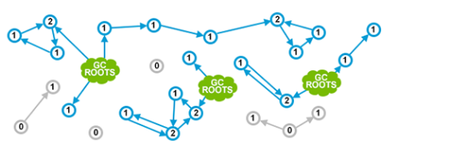

# MyNote

- [MyNote](#mynote)
  - [Data Type](#data-type)
  - [OOP Association & Dependency](#oop-association--dependency)
  - [Abstract Class](#abstract-class)
  - [Override & Overload](#override--overload)
  - [Immutable (FINAL) class/method/variable/Object](#immutable-final-classmethodvariableobject)
  - [反射 & Dynamical Binding](#反射--dynamical-binding)
  - [轉型](#轉型)
    - [`A+=B` vs `A=A+B`](#ab-vs-aab)
  - [Java AutoBoxing](#java-autoboxing)
  - [(`final`)String](#finalstring)
    - [Constant Pool](#constant-pool)
    - [`new` String](#new-string)
    - [intern()](#intern)
  - [Concurrent computing & Parallel computing](#concurrent-computing--parallel-computing)
  - [Java Pass By Value](#java-pass-by-value)
  - [Static](#static)
    - [final static field](#final-static-field)
    - [Call Non-Static Fields/Methods in Static Method](#call-non-static-fieldsmethods-in-static-method)
    - [Order of Initializer](#order-of-initializer)
  - [Error & Exception](#error--exception)
  - [catch try final](#catch-try-final)
  - [`Thread#sleep()` vs `Object#wait()`](#threadsleep-vs-objectwait)
  - [`Thread#sleep` vs `Thread#yield`](#threadsleep-vs-threadyield)
  - [`Thread#join()`](#threadjoin)
  - [Thread , Interface Runnable, Interface callable](#thread--interface-runnable-interface-callable)
  - [`Thread#start()` & `Thread#run()`](#threadstart--threadrun)
  - [Lock vs Synchronized](#lock-vs-synchronized)
  - [Synchronized](#synchronized)
  - [dead lock](#dead-lock)
  - [Avoid Dead Lock](#avoid-dead-lock)
  - [Thread Pool](#thread-pool)
    - [為什麽要使用Thread Pool不直接`new`一個Thread](#為什麽要使用thread-pool不直接new一個thread)
  - [HashMap策略](#hashmap策略)
    - [HashTable vs HashMap](#hashtable-vs-hashmap)
  - [Java Memory Management (Run time data Areas )](#java-memory-management-run-time-data-areas-)
    - [PC Register (Per Thread)](#pc-register-per-thread)
    - [JVM Stack (Per Thread)](#jvm-stack-per-thread)
    - [Native Method Stack (Per Thread)](#native-method-stack-per-thread)
    - [Heap (All Threads)](#heap-all-threads)
    - [Method Area (All Threads)](#method-area-all-threads)
      - [Running Constant Pool](#running-constant-pool)
  - [GC](#gc)
    - [Reference類別](#reference類別)
    - [Strong Reference:](#strong-reference)
    - [Soft Reference:](#soft-reference)
    - [Weak Reference:](#weak-reference)
    - [判斷Garbage方法](#判斷garbage方法)
      - [Reference Counting](#reference-counting)
      - [Root Searching](#root-searching)
    - [GC Root (Reachable Objects)有哪些?](#gc-root-reachable-objects有哪些)
  - [GC的Algo](#gc的algo)
    - [Mark-Sweep](#mark-sweep)
    - [Copying](#copying)
    - [Mark-Compact](#mark-compact)
    - [Generational Collection](#generational-collection)
    - [分區(Young/Old Generation) & Major GC & Minor GC && Full GC](#分區youngold-generation--major-gc--minor-gc--full-gc)
      - [Metaspace](#metaspace)
  - [FULL GC](#full-gc)
    - [如何減少GC次數（GC優化）](#如何減少gc次數gc優化)

## Data Type

byte、short、int、long : Default `0`  
float、double : Default `0.0`  
Boolean : Default `false`  
char : default `""`  

Reference Type : default `null`

## OOP Association & Dependency

[OOP design](DesignPattern/_UMLDiagram.md)

## Abstract Class

Abstract class implements InterfaceX(Without implementing methods of InterfaceX)
```java
abstract class implements InterfaceX{
  //...
}
```

- Class extends Abstract class (that implements InterfaceX) : must implement All InterfaceX methods
  
Abstract Class extends an Concrete Class : superClass must be implemented 
```java
abstract classA extends concreteClass{
  //...
}
```

**A classX must Implemented abstract Methods Must be except the classX is an Abstract Class or Interface**

**A class/an Abstract class can extend one abstract class/class and implements multiple interfaces**


父類別 Constructor 不能被子類重寫。在子類的 Constructor 中，會自動寫入`super()`方法，`super()` 表示父類別的 Default Constructor，**如果自行定義`super()`，必須放在子類構造方法的第一行**
- 子類別一定會呼叫父類別的 Constructor 來完成初始化(一般是呼叫父類別Default Constructor)

一個interface可以繼承多個interfaces，子類的interface可以`@override` 父類的 interface 中的Methods
```java
interface Maininterface extends inter1, inter2, inter3 {  
  // methods
}
```

A Class can implement multiple interfaces
```java
interface A {
    void test();
}

interface B {
    void test();
}

class C implements A, B {

    @Override
    public void test() {

    }     

}
```


抽象类可以继承具体类

## Override & Overload

**Overload & Override都是實現Polymorphism的方式，區別在於前者實現的是編譯時的多型，而後者實現的是運行時的多型**。 

- Overload：一個類中有多個同名的方法，但是具有有不同的參數列表（參數類型不同、參數個數不同或者二者都不同)
- Override：發生在子類與父類之間，子類對父類的方法進行重寫，參數都不能改變，**返回值類型可以不相同，但是必須是父類返回值的派生類。即外殼不變，核心重寫！重寫的好處在於子類可以根據需要，定義特定於自己的行為**

- Constructor can't be overridden but overloaded

為了滿足LSP，Override有三個限制
- `Access-Specifier` : 子類方法訪問權限必須`>=`父類方法 (public > protected > private)
- `return` : 子類方法的返回類型必須是父類方法**相同**或為**其子類型**
- `throws` : 子類方法拋出的異常類型必須是**父類拋出異常類型**或為**其子類型**


## Immutable (FINAL) class/method/variable/Object 

- [create-immutable-class-java](https://www.geeksforgeeks.org/create-immutable-class-java/)

Final Method
- Cant be override

Final Class (Cant be extended)
- All the fields should be `private final`.
- Constructor should initialize all the fields
- Getter Method return deep copy
- No Setter


final Field
```java
final static int a;
static{
  a = 123;
}

final String name;
public void setName(String name){
  this.name = name;
}
```

final Object
```java
// reference can not be changed not object's properties
public static final User user = new User()
user.setName("john") // pass 
```

java 8 static inner class
```java 
class TestFinal{
    public static void main(String[] args) {
        int b = 10;
        testFinals(b);
    }
    public static void testFinals(int b) {
        int a = 0;
        new Person(){
          public void test(){
              System.out.println(a);
              System.out.println(b);
          }
        }.test();
    }
}
```


## 反射 & Dynamical Binding

反射是指在運行狀態中，對於任意一個類都能夠知道這個類所有的屬性和方法；並且對於任意一個對象，都能夠呼叫它的任意一個方法；這種動態獲取信息以及動態呼叫對象方法的功能稱為反射機制。

## 轉型

- [Java學習之路04—類型轉換](https://hackmd.io/@Zacch/r1b88fLuK)
  

概念
```java
int number = 2147483648 // 出錯
```
- **由於整數常數的預設類型為int，因此不進行任何後綴修飾時，通常是表示為int類型**

```java
long l = 2147483648; // 出錯
long l = 2147483648L;
```
- 一個整數常數若是超過int上下限時，編譯器就會報錯，這跟等號左側的變數範圍無關，重點在於我們需要告訴編譯器，現在使用的這個常數為`long`類型，所以不用擔心賦值的範圍超過int上下限

### `A+=B` vs `A=A+B`

若是變數類型都是不大於int的運算元，則編譯器會自動將變數類型提升至int類型進行計算，故要進行強制轉型
```java
short s1 = 1;
s1 = s1 + 1;   //自動轉型   跳Compiler Error

// +=
short s1 = 1;
s1+=1; 
// += 相當於
s1 = (short) (s1 + 1);
```

## Java AutoBoxing 
- [Integer 128 Vs Int 128](https://zhuanlan.zhihu.com/p/72074317)

Primitive Type : `boolean，char，byte，short，int，long，float，double`
Reference Type : `Boolean，Character，Byte，Short，Integer，Long，Float，Double`

Java AutoBoxing (Primitive Type auto-boxes to Reference Type)
```java
Integer a = 1 
// same as 
Integer a = Integer.valueOf(1);
```

**`new` creates an address in stack and a storage in heap.**
```java 
new Integer(1) == new Integer(1); // false , ref to different heap
 
stack(addr)       heap(val)
+---+         +----------------+  
| j | ----->  | new Integer(1) |
+---+         +----------------+ 
| i | ----->  | new Integer(1) |
+---+         +----------------+
```

AutoBoxing does not `new` an integer object each time.    
**If value is between `-128` and `127`, it returns cache-value instead of `new` an space of object**.   
```java
IntStream.rangeClosed(0, 150).forEach(
                    i ->{
                        Integer a = i; // call Integer.valueOf(i)
                        Integer b = i; // call Integer.valueOf(i)
                        System.out.println(i + " " + (a == b));
                    }
                );
// true : 0~127
// false: 128~150

public static Integer valueOf(int i) {
    /**
     * IntegerCache.low  = -128
     * IntegerCache.high = 127
     * return cache value while i is between -128 ~ 127
     */
    if (i >= IntegerCache.low && i <= IntegerCache.high)
        return IntegerCache.cache[i + (-IntegerCache.low)];
    
    // new an Integer => i > 127 or i < -128 false
    return new Integer(i);
}
```
- This method will always cache values in the range `-128` to `127`.
- **Any Number < `-128` && > `127` will `new` an Integer object (different stack references to different heap)**


## (`final`)String 

Q : Allow Class extending/implementing String?
A : **No, String is `final` class, `final` type, and Thread Safe**

### Constant Pool

Constant Pool指的是在編譯期被確定，並被保存在(已編譯)`xxxyyy.class`文件中的Data。  
- 包括了關於Class、Method、Interface等中的Constant，也包括String Pool。  

>>> When the compiler encounters a String literal, it checks to see if an identical String already exists in the pool.


### `new` String

Each String in String Pool is stored in Stack

```java
String s1 = new String("abc"); // allocate space 
String s2 = new String("abc"); // allocate space

String s3 = s1.intern()     ; // constant pool
String s4 = s2.intern()     ; // constant pool
System.out.println(s3 == s4);  // true  
```
- `intern()` : check string-pool (there is only one (no duplicate) `abc` stored in string pool and reference to the heap)

### intern()

當一個`String instance`呼叫`intern()`時，Java會先查找Constant Pool中是否有相同Unicode的String Pool，如果有，則返回其的Reference，如果沒有，則在String Pool增加(Unicode Type)該字符串並返回它的Reference
```java
String s1= new String("123"); 
String s2= s1.intern();  // add "123" in string pool
System.out.println( s1==s1.intern() ); // false 
System.out.println( s2==s1.intern() ); // true

String pool1 = "test"; // constant pool

String reference = new String(literal); // allocate space in heap
String pool2 = "test"; // search constant pool first

System.out.println(pool1 == pool2); //true
System.out.println(reference == pool2);//false
```
- 當`s1.intern()`被呼叫後就在String Pool中新添加了`"123"`，`s1`的`123`並不在String pool，亦即`s1`不是將自己的address加入到String Pool中，而是新增一個`s1.intern()`建立的`"123"`


## Concurrent computing & Parallel computing

- Parallel computing : 是真正意義上，同一時刻做多件事情
- Concurrent computing : 在同一時刻只會做一件事件，只是可以將時間切碎，**交替**做多件事情

## Java Pass By Value

Java是屬於pass by value.


**Reference Type (Object) 是參照(reference)的pass-by-value的傳遞**      
Different Stack stores same address and reference to same heap location  

[Source Code](https://matthung0807.blogspot.com/2019/01/java-pass-by-valuepass-by-reference.html)
```java
public class Main {
    public static void main(String[] args) {
        A a1 = new A(1);

        System.out.println("a1:" + a1.getN()); // a1:1

        // assign a1's address val(stack) to argument
        modify(a1);

        System.out.println("a1:" + a1.getN()); // a1:3
    }

    static void modify(A a) {
        a.setN(3);
        System.out.println("a:" + a.getN()); // a:3
    }
}
class A {

    private int n;

    public A(int n) {
        this.n = n;
    }

    public int getN() {
        return n;
    }

    public void setN(int n) {
        this.n = n;
    }
}
```

## Static

**Non Static Field存在於Stack中。Static Fields存在於Method Area(Share by Thread)中。**

- 只要 new 出一個 Instance， 所有 Class Member( fields 與 methods ) 就會產生一份放在記憶體中，若再 new 同一個 class 一次(產生了新的 Instance)， 則該 class 的所有 field 會再產生一份放在Heap記憶體中，而 class method 就不會再產生一份了(除非前一個 Instance 已經被記憶體回收了， 那麼就會在產生一份 class method )，
**因為 class method 在執行時不會被變更， 因此 JVM 只會產生一份在記憶體中**。
所有 Class Members 皆會跟著 Instance 被釋放。

- 所有宣告成 static 的 object/field 皆會因 class (內含 static 成員或 class 就是 static) 被載入而將所有 static object 產生一份在Heap Memory中， 所有 static object 皆會隨著應用程式Application存亡。


Static Field/Method所屬於Class，所以也稱為Class Instance。 

Fields所屬於每一個獨立的Object，所以也稱為Instance，只能被Object所呼叫

- **Static Fields可以被Object呼叫，也可以被Class呼叫**

### final static field

```java
public class staticA{
  
  final static int a = 1; 
  //...
}
```
- a is global variable, access by the class itself


### Call Non-Static Fields/Methods in Static Method

```java
public class ClassName{
    public static void staticMethod(){
        ClassName className = new ClassName()
        className.instanceMethod
    }
    public void instanceMethod()[
        // implementations
    ]
}
```

### Order of Initializer

```java
public class ex{
    public static void main(){

    }
}
public class A{
    static {
        // block 
    }
    A(){
        //...
    }
}
public class B extends A{
    static{
        //...
    }
    B(){
        //...
    }
}
```
Base Static Block -> Derived Static Block -> Base's Fields -> Base Constructor -> Child's Field -> Child Constructor


## Error & Exception

Error 和 Exception 都是 Throwable 的子類，用於表示`程式/行程(Process)`出現了不正常的情況。區別在於： Error 表示系統級的錯誤和`程式/行程(Process)`不必處理的異常，是恢復不是不可能但很困難的情況下的一種嚴重問題，比如Memory溢出，不可能指望`程式/行程(Process)`能處理這樣的情況。 

Exception 表示需要捕捉或者需要`程式/行程(Process)`進行處理的異常，是一種設計或實現問題，也就是說，它表示如果`程式/行程(Process)`運行正常，從不會發生的情況


## catch try final

```java
public static int test(){
    int i = 0
    try {
  +----> i = 3 ----+
  |      |         |
  |      return i; |
  |  }finally{     |
  <---  i = 2 <---+ 
    }
}
// i : 3
```
- JVM store result in try block via `iload` & `istore` before accessing `finally` block. 
After `finally` is finished, it call `iload` & `ireturn` the result (here `i = 3`)

## `Thread#sleep()` vs `Object#wait()`

對於synchronized lock的影響不同：
- `sleep()`不會釋放synchronized lock
- `wait()`會釋放synchronized lock，讓其他Thread進入`synchronized`代碼塊執行。

使用範圍不同：
- `sleep()` 可以在任何地方使用。 
- `wait()` **只能在Synchronized Method或者Synchronized Block裡面使用**，否則會拋 `IllegalMonitorStateException`。

恢復方式不同：
- 兩者會暫停當前thread，但是在恢復上不太一樣。 
  - sleep(): 在時間到了之後會重新恢復
  - wait() : 則需要其他Thread呼叫同一Object的 `notify()/notifyAll()` 才能重新恢復。

## `Thread#sleep` vs `Thread#yield`

`Thread#sleep()`方法後進入超時等待（TIMED_WAITING）狀態，而`Thread#yield()`方法後進入就緒（READY）狀態。 
- `sleep()`給其他Thread運行機會時**不考慮Thread的優先級**，因此會給低優先級的thread運行的機會
- `yield()`只會給**相同優先級或更高優先級的thread以運行的機**會。

## `Thread#join()`

用於等待某Thread終止後再繼續，如果一個`threadA`執行了`threadB.join()`，則`threadA`等待`threadB`終止之後才從`threadB.join()`返回繼續往下執行自己的程式

## Thread , Interface Runnable, Interface callable

Thread實現了Runnable    

Runnable 和 Callable 的主要區別在於是 Callable 有返回值   

## `Thread#start()` & `Thread#run()`

`run()`：普通的方法呼叫，在main thread中執行，不會新建一個thread來執行。 
`start()`：**新啟動一個Thread**，這時此thread處於就緒（可運行）狀態，並沒有運行，一旦得到 CPU 時間片，就開始執行`run()`方法。

  

- `NEW` ：Created但是尚未啟動的thread處於此狀態，沒有呼叫 `start()` 方法。
- `RUNNABLE`：包含就緒（READY）和運行中（RUNNING）兩種狀態。   
Thread呼叫`start()`方法會會進入就緒（READY）狀態，等待獲取 CPU time slice。如果成功獲取到 CPU 時間片，則會進入運行中（RUNNING）狀態。

Time slice：每個 queue 分配一定的 CPU time

- BLOCKED：Thread在進入同步方法/同步塊（synchronized）時被阻塞，等待同步鎖的thread處於此狀態。
- WAITING：**無限期(indefinitely)**等待特定Thread執行特定操作，**需要被喚醒(`Object.notify()`)，否則會一直等待下去**。  
  1. 對於`Object.wait()`，需要等待另一個thread執行`Object.notify()` 或 `Object.notifyAll()`；
  2. 對於`ThreadB#join()`，則需要等待指定的`ThreadB`終止。 

- TIMED_WAITING：在指定的時間內等待另一個thread執行某項操作的thread處於此狀態。  
跟 WAITING 類似，區別在於該狀態有超時時間參數，在超時時間到了後會自動喚醒，避免了無期限的等待


| State    |   |
| -----    |---|
|New           | When instance of thread is created using `new` operator (before `threadObj.start()`)  
|Runnable      | When `threadObj.start()` method is called 
|WAITING       | The thread is waiting indefinitely for another thread to perform a particular action. (**The Waiting Thread is waken up by Another Thread**)
|TIMED_WAITING | **The waiting thread to be waken after certain time.** e.g. `.sleep()` (The thread is waiting for another thread to perform an action for up to a specified waiting time.)
|TERMINATED    | `.exit()` or exception being thrown   / 執行完畢已經退出的thread處於此狀態

## Lock vs Synchronized

- Lock 是一個Interface；`synchronized` 是 Java 中的keyword，是內置的語言Implementation
- Lock(被動式)在發生異常時，如果沒有主動通過`unLock()`去釋放，很可能會造成Dead Lock現象，**因此使用 Lock 時需要在 `finally` 塊中釋放鎖**；**`synchronized` 不需要手動獲取鎖和釋放鎖，在發生異常時，會自動釋放鎖，因此不會導致Deal Lock現象發生**
- Lock 的使用更加靈活，可以有響應中斷、有超時時間等；而 synchronized 卻不行，**使用 synchronized 時，等待的Thread會一直等待下去，直到獲取到LOCK**；
- 在性能上，隨著 synchronized 的不斷優化，Lock 和 synchronized 在性能上已經沒有很明顯的差距了，所以性能不應該成為我們選擇兩者的主要原因。官方推薦盡量使用 synchronized，除非 synchronized 無法滿足需求時，則可以使用 Lock

## Synchronized 

```java
// non-static
public void synchronized methodMitLock() 

public void synchronized (this) 
```
Each object's `methodMitLock` has the lock


With `static`, it's now a Global interpreter lock
```java
public static void synchronized methodMitLock()
```
   

```java
public static Object monitor = new Object();
synchronized (monitor) {}
```


## dead lock
Dead Lock 須滿足以下四點缺一不可
1. 互斥(Mutual exclusion)： **對不可共用的資源類型而言，互斥一定成立(一個資源一次只能被一個process所使用)**，而可共用的資源類型，因為可以同時讀取相同檔案，所以一定不會產生。  
2. Hold and Wait(BLOCKING)：**某Process已經獲得了至少一個資源，但又對其他資源發出請求，而該資源已被其他Process佔有，此時該Process的請求被阻塞，但又對自己獲得的資源保持不放。**
3. No preemption: 資源只能由Process自己釋放，不能由其他方式釋放
4. Circular waiting ：每個process都握有另一個process請求的資源，導致每一個process都在等待另一個process釋放資源

## Avoid Dead Lock
預防死鎖的方式就是打破四個必要條件中的任意一個即可。

1. 打破互斥條件：在系統裡**取消互斥**  
若資源不被一個Process獨佔使用，那麽死鎖是肯定不會發生的。但一般來說在所列的四個條件中，**互斥條件是無法破壞的。因此，在死鎖預防裡主要是破壞其他幾個必要條件，而不去涉及破壞互斥條件。**
2. 打破Hold and Wait：採用**資源預先分配策略**
   1. **Process 運行前申請全部資源，滿足條件則運行，不然就等待**。
   2. 每個 Process 提出新的資源申請前，必須先釋放它先前所佔有的資源。

3. 打破不可剝奪條件(No preemption)：當Process佔有某些資源後又進一步申請其他資源而無法滿足，則該Process必須釋放它原來佔有的資源再重新申請其他資源。
4. 打破環路等待條件(Circular Wait)：**實現資源有序分配策略**，將系統的所有資源做編號，**每個Process只能採用`按序號遞增`的形式申請資源**。

## Thread Pool

  

- `threadFactory`： 創建Thread的工廠。
- corePoolSize（Thread核心數）：當Thread Pool內運行的Thread少於 corePoolSize 時，將創建(`new`)一個新Thread來處理請求，就算其他Threads處於Idle狀態。
- workQueue（隊列）：用於保留任務並移交給工作Thread的阻塞隊列。
- maximumPoolSize：Thread Pool允許開啟的最大Thread數。
- handler（拒絕策略）：往Thread Pool添加任務時，下面兩種情況觸發handler：  
  1. Thread Pool運行狀態不是RUNNING；
  2. Thread Pool已經達到maximumPoolSize，並且(阻塞)workQueue已滿。
- keepAliveTime：如果Thread Pool內的Threads超過 corePoolSize，則多餘的Thread空閒時間超過設定的 keepAliveTime 會被`terminated`
  ```java
  public void setKeepAliveTime(long time, TimeUnit unit)  
  ```   

### 為什麽要使用Thread Pool不直接`new`一個Thread

用new的方式系統需求量大的時就會創建很多Threads，不僅會消耗系統資源，還會降低系統的穩定性，很容易造成Application崩潰

使用Thread Pool，對有限Threads進行管理可以帶來
1. 重複利用Thread，降低對系統資源消耗。  
通過**重覆利用已創建的Thread**，降低Thread創建和銷毀造成的消耗。
2. 提高反應速度。  
Task可以不需要等到Thread創建就能立即執行(**一有Thread釋出即可執行queue中的task**)。
3. 增加Thread的管理性。  
Thread是稀缺資源，使用Thread池可以進行統一分配，調優和監控。

## HashMap策略

HashMap在Collision嚴重時（鏈表過長）為避免查找性能降低，會從linked list方式轉為黑紅樹
- 對於插入(insertion)，默認情況下是使用鏈表節點。當同一個索引位置的節點在新增後超過8個（threshold 8）：如果此時Array長度大於等於 64，則會觸發鏈表節點轉紅黑樹節點（treeifyBin）；而如果Array長度小於64，則不會觸發鏈表轉紅黑樹，而是會進行擴容，因為此時的數據量還比較小。
- 對於移除(deletion)，當同一個索引位置的節點在移除後達到 6 個，並且該索引位置的節點為紅黑樹節點，會觸發紅黑樹節點轉鏈表節點（untreeify）。

使用鏈表的查找性能是 `O(n)`，而使用紅黑樹是 `O(logn)`。

### HashTable vs HashMap

**HashMap 允許 key 和 value 為 null，HashTable 不允許。**
HashMap 的默認初始容量為 16，HashTable 為 11。
HashMap 的擴容為原來的 2 倍，HashTable 的擴容為原來的 2 倍加 1。
**HashMap 是非Thread Safe，HashTable是Thread Safe。**
HashMap 的 hash 值重新計算過，HashTable 直接使用 hashCode。
HashMap 去掉了HashTable 中的 contains 方法。
HashMap 繼承自 AbstractMap 類，HashTable 繼承自 Dictionary 類。

## Java Memory Management (Run time data Areas )
[每個Coder員都該瞭解的JVM - 運行時數據區](https://www.jyt0532.com/2020/03/11/runtime-data-area/)   
[Java Memory Management](https://www.geeksforgeeks.org/java-memory-management/)   

  
  
  

### PC Register (Per Thread)
- **存放一個Thread執行當下的指令地址，藉由改變PC值來確定下一條要執行的指令位址(PC register is capable of storing the return address or a native pointer on some specific platform.)**，因為一個程式可能會有循環或分支等...所以下一條指令的地址並不一定是依序增加。每一個CPU或CPU core在任一時間只能執行一個Thread中的指令，Thread之間會彼此搶奪CPU資源所以要是CPU從`Thread A`跑去`Thread B`完成某項任務後想要跳回來`Thread A`，必須要知道剛剛`Thread A`跑到哪一行指令，這就是PC的目的。
- **當Thread正在執行方法的時候，PC指到方法區中字結碼指令的地址(+方法區存了所有方法的Byte code)但若執行的是Native Method則PC值是(undefined)null**(The non native method has a PC which stores the address of the available JVM instruction whereas in a native method, the value of program counter is undefined.)
- **Each JVM thread which carries out the task of a specific method has a program counter register associated with it**.    
- PC只是一個pointer所以不會有Memory Overflow的問題。

### JVM Stack (Per Thread)
- **Stack 存取速度快，但`資料長度及生命週期必須是預知`的，用來儲存Local Variable、Function Parameters與Function Return Address等資料**
- JVM Stack描述的是Java方法執行的Memory模型：**每個方法在執行的同時都會創建一個Stack Frame**用於存儲局部變數表、操作數Stack、動態鏈接、方法等資訊並丟進JVM Stack。  
  每一個方法從被呼叫至執行完成的過程，就對應著一個Stack Frame在JVM Stack中從`Push()`到被`Pop()`過程。   
  >>> 例如: 如果Method A被執行了->關於Method A的 Stack Frame 會被push到JVM Stack->執行該方法->如果Method A呼叫Method B->Method B的 Stack Frame 會被push到JVM Stack裡->也就是Method A的 Stack Frame 的上面->依此類推so on->Method B完成後->Method B的 StacMemoryk Frame pop出來->再繼續執行Method A   
- **讓 Stack Frame 被`POP()`出Stack的唯一方式並不是只有當Method跑完(執行完)而已，當Method Throws Error時沒被處理，也同樣會讓 Stack Frame 被`POP()`出Stack**
- **A stack is created at the same time(Stack的生命周期與Thread相同) when a thread is created and is used to store data and partial results** which will be needed while returning value for method and performing dynamic linking.
- **Stacks can either be of fixed or dynamic size**.   
  The size of a stack can be chosen independently when it is created.
- **The  Memory  for stack needs not to be contiguous**. (Thread 之間的 Stack 互相獨立)

### Native Method Stack (Per Thread)
- Thread獨自擁有。Native Method Stack與JVM Stack所發揮的作用是非常相似的，它們之間的區別不過是JVM Stack為JVM執行Java Method方法（也就是字節碼Byte Code）服務，而Native Method Stack則為JVM使用到的Native Method服務。
- Also called as C stacks, native method stacks are not written in Java language. **This memory is allocated for each thread when its created. And it can be of fixed or dynamic nature.**

### Heap (All Threads)
- 所有 Threads 共享的一塊 Memory 區域，在JVM啟動時創建
- 對大多數應用來說，**Heap 是Java JVM 所管理的 Memory 中最大的一塊**。
- 該 Memory 區域的唯一目的就是存放對象實例(`Scanner sc = new Scanner(System.in);`)，幾乎所有的對象實例都在這裡分配(Java runtime to allocate memory to Objects and JRE classes) 。
- JVM provides the user control to initialize or vary the size of heap as per the requirement. **When a `new` keyword is used, object is assigned a space in heap, but the reference of the same exists onto the stack.**
- **Garbage collection in heap area is mandatory.**  
  (Garbage Collection，會自動去清理 Heap 內已經沒有被參照 (Reference)的資料)

### Method Area (All Threads)
- 每個 Thread 共享的 Memory 區域
- **It is a `logical part of the heap area` and is created on virtual machine startup.**
- This memory is allocated for **class structures, method data and constructor field data, and also for interfaces or special method used in class**. 
- Heap can be of fixed or dynamic size depending upon the system’s configuration.
- Can be of a fixed size or expanded as required by the computation. Needs not to be contiguous.

#### Running Constant Pool
  
為Method Area的一部分。`xxxx.class`中除了有 class 的版本、字段、methods、interfaces 等描述Information外，還有**Constant Pool，用於存放編譯時期建立(Generate)的String variable和 symbolic references(these references are names of variables, methods, interfaces, and classes referenced from the code).**，這部分內容將在類別加載(Class Loader)運行後進入Method Area的Running Constant Area存放。


`User user = new User("Mark");` 的行為簡單來說是：
i. 創建並儲存 User 實例 (name = Mark) 於 Heap 中。
ii. 儲存完成後，回傳資料所在的記憶體位址。
iii. 在 Stack 中新增變數 user。

## GC

- [GC garbage collection of JVM common interview questions](https://houbb.github.io/2022/05/10/interview-09-jvm-gc#java%E4%B8%AD%E7%9A%84%E5%BC%95%E7%94%A8)
[](https://www.zhihu.com/question/35164211)
當(Heap中的)Object再沒有被(Stack)參照(Reference)則會觸發Garbage collection的機制，reallocate Object所佔用的記憶體，從而釋放記憶體，避免出現Memory Leak。
- **Garbage collection只發生在Heap記憶體區間**

### Reference類別

### Strong Reference:
- `Object obj = new Object`這類Reference，**只要Strong Reference還在，GC永遠不會回收該類型對象**
- `只有Strong Reference 為null`，GC才會去回收該資源，否則不會去回收，**即使在Memory不足的情況下系統寧願報OutOfMemory錯誤，也不會去回收Strong Reference資源.**

### Soft Reference:
- 有用但並非必須的對象，可用Soft Reference對象，**在系統將要發生Memory溢出異常之前，將會把這些對象列進回收範圍之中進行二次回收**。如果這次回收還沒有足夠的Memory，才會拋出Memory異常異常。


### Weak Reference:
- 被 Weak Reference 參照的對象只能生存到下一次垃圾收集發生之前(WeakHashMap)，JDK提供了WeakReference類來實現。

Phantom Reference:
- **最弱的一種Reference，JDK提供了PhantomReference類來實現。**
### 判斷Garbage方法

  

#### Reference Counting

  

在Object中添加一個參照計數器，**每當被參照時，計數器就加1；當參照失效時，計數器值就減1**；當數器都為0時表示該Object不被再使用。

缺點 : 參照計數法不能很好的解決循環參照的問題 (red section)

#### Root Searching
  

從GC Roots的Object作為起點開始往下搜索，搜索所有的葉子。   
那些沒有根的葉子視為可回收。  

### GC Root (Reachable Objects)有哪些?

可作為GC Roots的對象包括下面幾種：
1. JVM STACK（Stack Frame中的Local variable）中參照的對象。
2. **Method Area中Class靜態屬性參照的對象或者Constant Pool內參照的對象。**
3. Native Method Stack中JNI（即Native方法）參照的對象。
## GC的Algo

### Mark-Sweep

首先標記出所有需要回收的對象，在標記完成後統一回收所有被標記的對象。

缺點 : 
  1. 效率問題，(Iteration)標記和清除兩個過程的效率都不高
  2. **空間問題，標記清除之後會產生大量不連續的Memory碎片，空間碎片太多可能會導致以後在`程式/行程(Process)`運行過程中需要分配較大對象時，無法找到足夠的連續Memory而不得不提前觸發另一次垃圾收集動作。**

- 標記壓縮：和標記清除算法基本相同，不同的就是，在清除完成之後，會把存活的對象向記憶體的一邊進行壓縮，解決記憶體碎片問題。
### Copying

**將可用Memory按容量劃分為大小相等的兩塊**，每次只使用其中的一塊。當這一塊的Memory用完了，就將還存活著的對象複製到另外一塊上面，然後再把已使用過的Memory空間一次清理掉。這樣使得每次都是對整個半區進行Memory回收，Memory分配時也就不用考慮Memory碎片等覆雜情況，只要移動堆頂指針，按順序分配Memory即可，實現簡單，運行高效。

缺點 : 
**這種算法的代價是將Memory縮小為了原來的一半。**

### Mark-Compact

Copying GC在對象存活率較高時就要進行較多的複製操作，效率將會變低。

更關鍵的是，如果不想浪費50%的空間，就需要有額外的空間進行分配擔保，以應對被使用的Memory中所有對象都100%存活的極端情況，所以在Old Generation一般不能直接選用這種算法。

根據Old Generation的特點，利用Mark-Compact GC，
標記過程仍然與Mark-Sweep算法一樣，但後續步驟不是直接對可回收對象進行清理，而是讓所有存活的對象都向一端移動，然後直接清理掉端邊界以外的Memory。


缺點 :
- 掃秒兩次，來移動對象

### Generational Collection

當前商業虛擬機的垃圾收集都采用分代收集（Generational Collection）算法，根據Object存活周期的不同將Memory劃分為幾塊。   
一般是把Java Heap分為Young Generation和Old Generation，這樣就可以根據各個年代的特點采用最適當的收集算法。  

在Young Generation中，每次垃圾收集時都發現有大批對象死去，只有少量存活，那就選用複製算法，只需要付出少量存活對象的複製成本就可以完成收集。   
在Old Generation中因為對象存活率高、沒有額外空間對它進行分配擔保，就必須使用標記—清理或者標記—整理算法來進行回收。

### 分區(Young/Old Generation) & Major GC & Minor GC && Full GC

Java Stack被劃分成兩個不同的區域：Young Generation & Old Generation。其中Young Generation ( Young ) 又被劃分為三個區域：Eden、From Survivor、To Survivor。
- Young Generation：存放剛出生不久的對象 
- Old Generation：存放比較活躍、經常被引用的對象垃圾回收機制在Young Generation比較頻繁  

  
- Young Generation分為den區、s0區、s1區，s0和s1也被稱為from和to區域，他們是兩塊大小相等並且可以互相角色的空間。

絕大多數情況下，對象首先分配在eden區，在Young Generation回收後，如果Object還存活，則進入s0或s1區，之後每經過一次Young Generation回收，如果Object存活則它的年齡就加1，對象達到一定的年齡後（default 15），則進入Old Generation。 

新創建的Object都會被分配到Eden區(如果該對象佔用Memory非常大，則直接分配到Old Generation區)， 當Eden區Memory不夠的時候就會觸發MinorGC（Survivor滿不會引發MinorGC，而是將對象移動到Old Generation中），在Minor GC開始的時候，Object只會存在於Eden區和Survivor from區，Survivor to區是空的。
- Young GenerationMinor GC的算法了為複製算法，把Memory區域分為兩塊，每次使用一塊，GC的時候把一塊中的內容移動到另一塊中，原始Memory中的對象就可以被回收了，優點是避免Memory碎片。

Old Generation隨著Minor GC的持續進行，Old Generation中Object也會持續增長，導致Old Generation的空間也會不夠用，最終會執行Major GC（MajorGC 的速度比 Minor GC 慢非常多）。 

Major GC使用Mark-Sweep方式從GC root進行第一次Iteration，MARK Reachable Object(存過的對象)再從GC root做第二次Iteration，將沒有被MARKED的對象清除掉。
優點：Old GenerationObject一般是比較穩定的，相比Copying Algorithm，不需要複製大量Objects。
之所以將所有對象掃描2次，看似比較消耗時間，其實不然，是節省了時間。
For example, Array `[1,2,3,4,5,6]`。刪除`[2,3,4]`，如果每次刪除一個數字，那麼5,6要移動3次，如果刪除1次，那麼5,6只需移動1次。
缺點：這種方式需要中斷其他Threads（STW），相較於複製算法，可能產生記憶體碎片。

當Old Generation也滿了裝不下的時候，就會拋出OOM（Out of Memory）異常。

#### Metaspace

永久代（元空間） 在Java8中，永久代已經被移除，被一個稱為元數據區（元空間，Metaspace）的區域所取代。值得注意的是：元空間並不在JVM中，而是使用本地記憶體（之前，永久代是在jvm中）。這樣，解決了以前永久代的OOM問題，元數據和class' Object存在永久代中，容易出現性能問題和記憶體溢出，畢竟是和Old Generation共享Heap空間。 **java8後，永久代升級為元空間獨立後，也降低了Old GenerationGC的複雜度。**

## FULL GC

Full GC概念是清理整個Heap(包括Young Generation和Old Generation)。

觸發時機 : 
1. 呼叫`System.gc()`
2. 方法區空間不足
3.  Old Generation空間不足
  - e.g 新創建的Object都會被分配到Eden區，如果該對象佔用容量大，則直接分配到Old Generation區，此時該區空間也不足
4. 做Minor GC前，發現要移動的空間（Eden區、From區向To區複製時，To區的記憶體空間不足）比Old Generation剩餘空間要大

### 如何減少GC次數（GC優化）

1. Object不用時改為`Null`   
一般而言，為 Null 的Object都會被作為垃圾處理，所以將不用的對象顯式地設為 Null，有利於 GC 收集器判定垃圾，從而提高了 GC 的效率。
2. 減少`System.gc()`呼叫的次數
此方法建議JVM 進行 GC，雖然只是建議而非一定，但很多情況下它會觸發 GC，從而增加 GC 的頻率，**也即增加了間歇性停頓的次數**。
3. 少用靜態變數   
   **靜態變數屬於Global Variable，不會被 GC 回收，會一直佔用記憶體**。
4. 使用`StringBuffer/StringBuilder`，而不用`String`來累加(重新`new`)String   
   如 `Str5=Str1+Str2+Str3+Str4`，這條語句執行過程中會產生多個垃圾對象，因為對次作`+`操作時都必須創建新的 String 對象，但這些過渡對象對系統來說是沒有實際意義的
5. 分散(Reduce)對象創建或刪除的時間
   - **減少在短時間內大量創建新對象**，特別是佔容大的對象，會導致突然需要大量記憶體資源，JVM 在面臨這種情況時，只能進行主動 GC，回收記憶體或整合記憶體碎片，而增加 GC 的次數。  
   - **減少集中刪除對象**。如突然出現了大量的垃圾對象，空閒空間減少，大大提升了下一次創建新對象時強制 GC 的次數。  
6. 少用`finalize()`，因為它會加大 GC 的工作量。
7. 如果需要使用經常用到的圖片，可以使用**Soft Reference類型**，它可以盡可能將圖片保存在記憶體中，供`程式/行程(Process)`呼叫，避免OutOfMemory。
8. 能用Primitive Type，就不用Reference Type。Primitive Type變數佔用的記憶體資源比相應Reference Type佔用的少。

