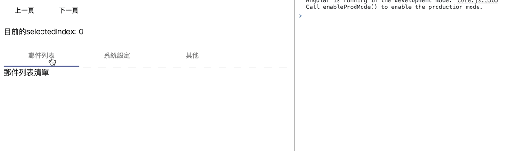

# mat tab group

- [[Angular Material完全攻略] Day 22 - 收件夾頁面(2) - Tabs](https://ithelp.ithome.com.tw/articles/10196575)

```html
<button mat-button (click)="tabIndex = tabIndex - 1">上一頁</button>
<button mat-button (click)="tabIndex = tabIndex + 1">下一頁</button>
<p>目前的selectedIndex: {{ tabIndex }}</p>

<mat-tab-group [(selectedIndex)]="tabIndex">
  <mat-tab label="郵件列表">
    郵件列表清單
  </mat-tab>
  <mat-tab label="系統設定">
    系統設定表單
  </mat-tab>
  <mat-tab label="其他">
    其他畫面
  </mat-tab>
</mat-tab-group>
```

```html
<mat-tab-group [(selectedIndex)]="tabIndex" 
               (focusChange)="tabFocusChange($event)"
               (selectedIndexChange)="tabSelectedIndexChange($event)"
               (selectedTabChange)="tabSelectedTabChange($event)">
  ...
</mat-tab-group>
```

```typescript
@Component({ ... })
export class InboxComponent {
  tabFocusChange($event: MatTabChangeEvent) {
    console.log(`focus變更，indx：${$event.index}`);
  }

  tabSelectedIndexChange($event: number) {
    console.log(`selectedIndex變更，index：${$event}`);
  }

  tabSelectedTabChange($event: MatTabChangeEvent) {
    console.log(`selectedTab變更，index：${$event.index}`);
  }
}
```



## Each Tab with icon

```html
<mat-tab-group>
  <mat-tab>
    <ng-template mat-tab-label>
      <mat-icon>inbox</mat-icon>
      郵件列表
    </ng-template>
    郵件列表清單
  </mat-tab>
  <mat-tab>
    <ng-template mat-tab-label>
      <mat-icon>settings</mat-icon>
      系統設定
    </ng-template>
    系統設定表單
  </mat-tab>
</mat-tab-group>
```