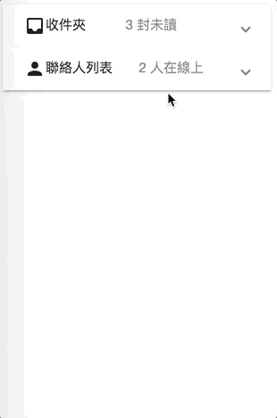
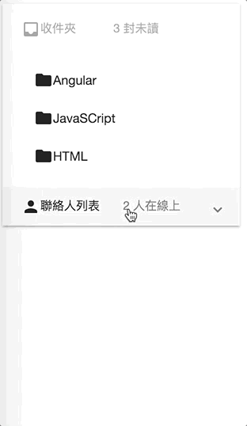
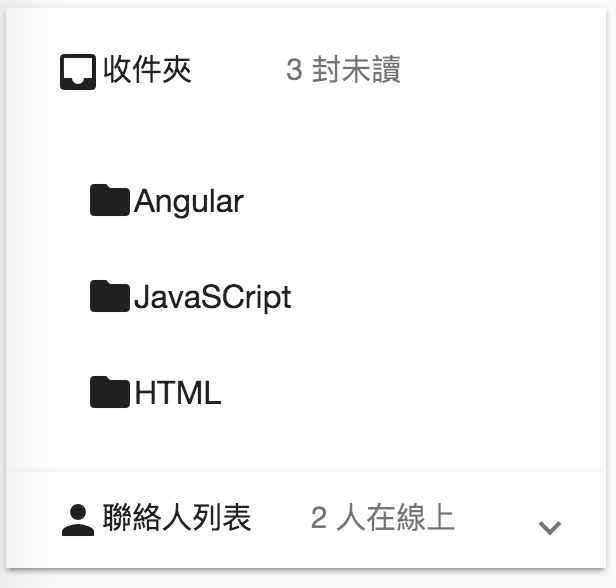

# mat-expansion-panel

```html
<mat-expansion-panel>
    <mat-expansion-panel-header>
        <mat-panel-title> xxx </mat-panel-title>
        <mat-panel-description> yyy </mat-panel-description>
    </mat-expansion-panel-header>

    <!-- content -->
</mat-expansion-panel>

+----------------+
| xxx yyy     ^  |
+----------------+
```


```html
<mat-expansion-panel>
  <mat-expansion-panel-header>
    <mat-panel-title>
      <mat-icon>inbox</mat-icon>
          收件夾
    </mat-panel-title>
    <mat-panel-description>
      3 封未讀
    </mat-panel-description>
  </mat-expansion-panel-header>
  
  <!-- 收件夾內容 -->
</mat-expansion-panel>

<mat-expansion-panel>
  <mat-expansion-panel-header>
    <mat-panel-title>
      <mat-icon>person</mat-icon>
      聯絡人列表
    </mat-panel-title>
    <mat-panel-description>
      2 人在線上
    </mat-panel-description>
  </mat-expansion-panel-header>
  <!-- 聯絡人列表內容 -->


  <mat-action-row>
    <button mat-button color="primary">管理我的聯絡人</button>
  </mat-action-row>      
</mat-expansion-panel>
```



## properties

```html 
<!--                    hide ^           expand panel     disable closing-->
<mat-expansion-panel hideToggle="true" expanded="true" disabled="true">
```


## mat-accordion

```html 
<!--           +only show one panel at a time 
               '              + each panel has no gap
               '              '                       -->
<mat-accordion multi="false" displayMode="flat">
  <mat-expansion-panel>
    Panel1
  </mat-expansion-panel> 
  <mat-expansion-panel>
    Panel2
  </mat-expansion-panel> 
</mat-accordion>
```
  
