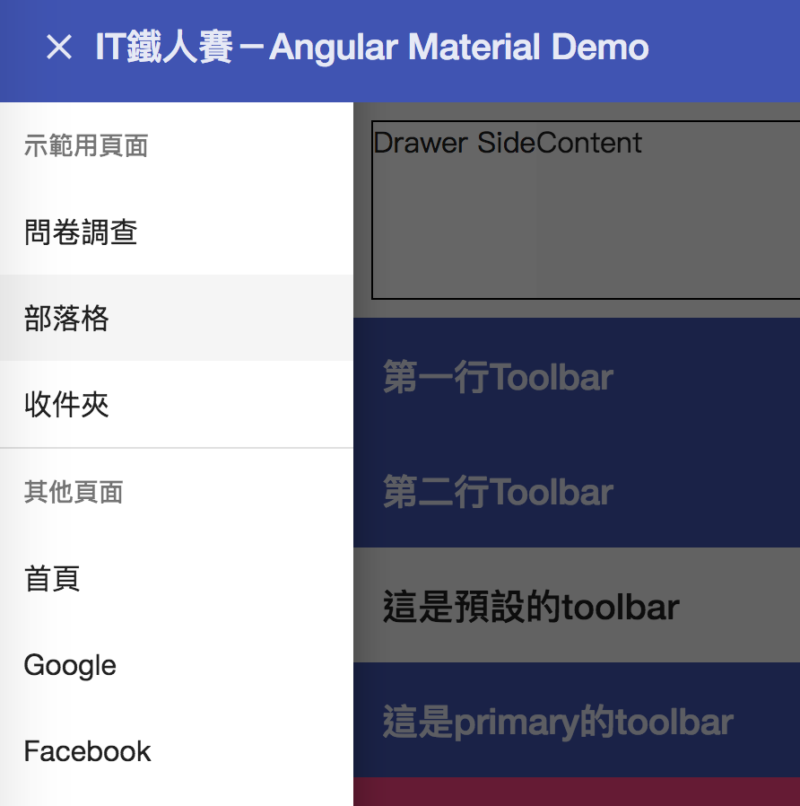
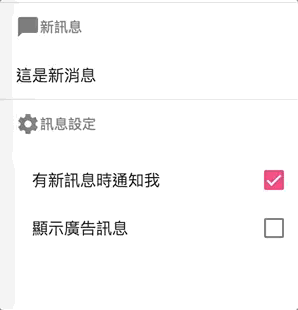

# matlist

- [matlist](#matlist)
  - [mat-list-item](#mat-list-item)
  - [matSubheader && mat-divider](#matsubheader--mat-divider)
  - [matLine](#matline)
  - [mat-selection-list](#mat-selection-list)
## mat-list-item
```html
<mat-list>
  <a [routerLink]="['/', 'dashboard', 'survey']" mat-list-item>問卷調查</a>
  <a [routerLink]="['/', 'dashboard', 'blog']" mat-list-item>部落格</a>
  <a [routerLink]="['/', 'dashboard', 'inbox']" mat-list-item>收件夾</a>
</mat-list>
```

## matSubheader && mat-divider

```html
<mat-nav-list>
  <h3 matSubheader>示範用頁面</h3>
    <a [routerLink]="['/', 'dashboard', 'survey']" mat-list-item>問卷調查</a>
    <a [routerLink]="['/', 'dashboard', 'blog']" mat-list-item>部落格</a>
    <a [routerLink]="['/', 'dashboard', 'inbox']" mat-list-item>收件夾</a>
  <mat-divider></mat-divider> <!-- grey line part-->
  <!-- 另外一組選單 -->
  <h3 matSubheader>其他頁面</h3>
    <a [routerLink]="['/']" mat-list-item>首頁</a>
    <a [routerLink]="['/']" mat-list-item>Google</a>
    <a [routerLink]="['/']" mat-list-item>Facebook</a>
</mat-nav-list>
```



## matLine

```html
<mat-list-item>
  
  <p matLine>志玲</p> <!-- user name -->
  <p matLine>hi，好久不見，最近好嗎？</p> <!-- message -->
  <!-- button會自動被推到最後面 -->
  <button mat-icon-button><mat-icon>chat</mat-icon></button>
</mat-list-item>

<mat-list-item>
  <!-- 即使icon button放在前面，還是會被往後推 -->
  <button mat-icon-button><mat-icon>chat</mat-icon></button>
  
  <p matLine>依晨</p>
  <p matLine>找時間吃個飯吧？</p>
</mat-list-item>
```
  


## mat-selection-list

```html
<mat-nav-list>
  <h3 matSubheader>
    <mat-icon>chat_bubble</mat-icon>
    新訊息
  </h3>
  <mat-list-item *ngIf="optNew.selected">這是新消息</mat-list-item>
  <mat-list-item *ngIf="optAds.selected">這是廣告消息</mat-list-item>
  <mat-divider></mat-divider>
  <h3 matSubheader>
    <mat-icon>settings</mat-icon>
    訊息設定
  </h3>
  <mat-selection-list>
    <mat-list-option [value]="1" selected="true" #optNew>有新訊息時通知我</mat-list-option>
    <mat-list-option [value]="2" #optAds>顯示廣告訊息</mat-list-option>
  </mat-selection-list>
</mat-nav-list>
```


