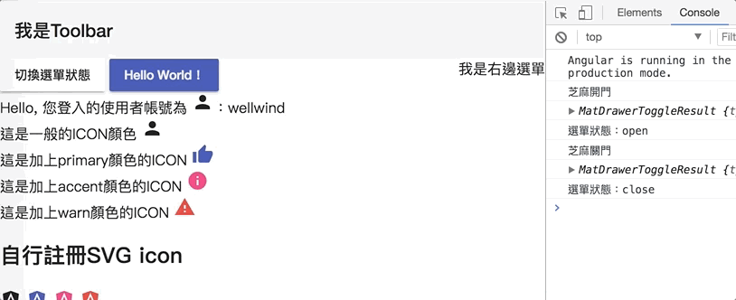

# side nav && mat drawer

`<mat-sidenav-container>`：代表整個包含邊欄導覽的容器
`<mat-sidenav>`：實際上邊欄導覽的內容
`<mat-sidenav-content>`：導覽以外的實際內容


```html
<mat-sidenav-container>
  <mat-sidenav #sideNav>
    我是左邊選單
  </mat-sidenav>

  <mat-sidenav-content>
      <button mat-button (click)="sideNav.toggle()">切換左邊選單狀態</button>
    <router-outlet></router-outlet>
  </mat-sidenav-content>
</mat-sidenav-container>
```

## properties

### mode

```html
<mat-sidenav opened="true" mode="side"></mat-sidenav>
```


### opened


true means always open the side-nav
```html
<mat-sidenav opened="true" mode="side"></mat-sidenav>
```

### position

Place the side-nav position
`position = start` is default set-up (place on the left)
`position = end` is placing on the right

```html
<mat-sidenav opened="true" mode="side">
  <div>我是左邊選單</div>
</mat-sidenav>
<mat-sidenav opened="true" mode="side" position="end">
  <div>我是右邊選單</div>
</mat-sidenav>
```

### disableClose

### fixedInViewport / fixedTopGap / fixedBottomGap

To cover toolbar

```html
<mat-toolbar>
    我是Toolbar
</mat-toolbar>

<mat-sidenav-container>
    <mat-sidenav #sideNav mode="over"  
                 fixedInViewport="true" 
                 fixedTopGap="20"     <!--gap from top-->
                 fixedBottomGap="20"> <!--gap from button-->
        <div>
            我是左邊選單
        </div>

        <div>
            <button mat-raised-button color="warn" (click)="toggleSideNav(sideNav)">
                切換選單狀態
            </button>
        </div>
  </mat-sidenav>
</mat-sidenav-container>
```



## Mat-draw


```html
<mat-drawer-container style="height:100px;border: 1px solid black">
  <mat-drawer mode="side" opened="true">Drawer Side</mat-drawer>
  <mat-drawer-content>Content</mat-drawer-content>
</mat-drawer-container>
```